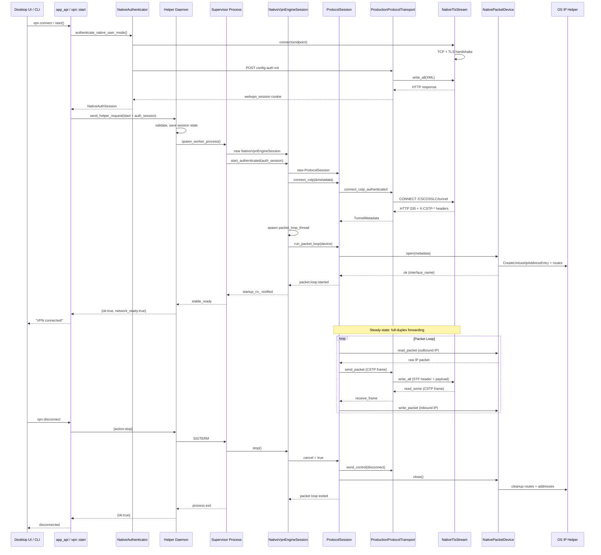
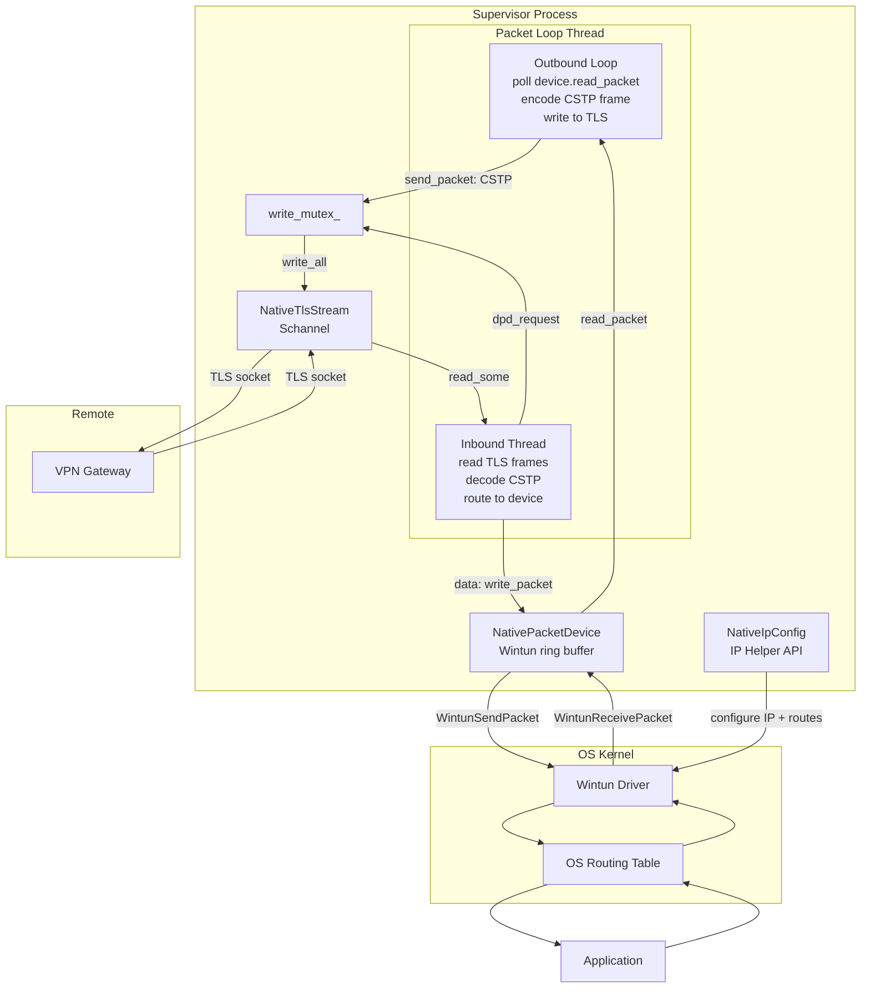

# ECNU-VPN 当前架构审计文档

> **审计日期**: 2026-06-02
> **审计范围**: 仓库全部 321 个 git-tracked 文件
> **审计方法**: 纯只读静态分析，未修改任何源代码
> **项目版本**: 3.3.0 (`CMakeLists.txt:2`)

---

# 1. 执行摘要

## 1.1 项目概述

ECNU-VPN（内部代号 `exv`）是一个跨平台 AnyConnect VPN 客户端，面向华东师范大学校园网。项目最初以 openconnect 为底层引擎，当前正在将 AnyConnect 协议逻辑抽取并重构成自研的 native 内核库（clean-room 实现）。

## 1.2 当前运行时进程

当前系统由以下进程组成：

| 进程 | 权限 | 平台 | 生命周期 |
|------|------|------|----------|
| **exv** (CLI + 内嵌 WebUI) | 用户态 | 全平台 | 临时 / WebUI 常驻 |
| **exv-helper** (特权守护进程) | SYSTEM/root | 全平台 | 随系统启动 |
| **exv-helper __helper-exec** (worker 子进程) | 继承 daemon | 全平台 | 请求级临时 |
| **__vpn-supervisor** (重连 supervisor) | 继承 daemon | 全平台 | VPN 连接级 |
| **Electron desktop** (Vue 3 + Electron 39) | 用户态 | 全平台 | 长期运行 |

## 1.3 当前最重要的架构事实

1. **协议层 100% clean-room 自研**：`src/vpn_engine/protocol/` 中无任何 openconnect 源码引用，CSTP 帧格式、认证 XML、HTTP 解析均为自研实现。
2. **DTLS 已禁用**：所有数据通过 TLS 传输（CSTP-over-TLS），`native_engine.cpp:204` 强制 `disable_dtls = true`。
3. **Helper 不在数据面**：helper daemon 仅处理控制面 IPC（start/stop/status），supervisor 进程直接拥有 packet loop 线程。
4. **跨进程 IPC 在数据面为零**：整个数据路径（TLS 流、CSTP 帧、包设备读写）在 supervisor 单进程内完成。
5. **Windows 使用 Wintun + Schannel**：无 OpenSSL 依赖，通过 BCrypt/NCrypt 实现加密。
6. **macOS 使用 utun + Security.framework**：原生 TLS 和虚拟网卡。
7. **Linux 缺少原生 packet device 实现**：无 `native_packet_device.cpp`、`native_tls_stream.cpp`、`native_route_config.cpp` 的 Linux 版本，回退到 legacy openconnect。
8. **37+ 测试目标已定义但 CI 仅运行冒烟测试**：`ctest` 未在 GitHub Actions 中执行。
9. **路由配置无统一抽象**：Windows (`NativeIpConfig`) 和 macOS (`NativeDarwinRouteConfig`) 接口完全不同。
10. **重连逻辑分散在三层**：supervisor（vpn.cpp）、protocol session、helper daemon 各有独立重连策略。

## 1.4 当前最不清晰或风险最高的问题

1. **Linux 原生引擎路径不完整**：缺少 packet device、TLS stream、route config 的 Linux 实现。
2. **macOS 无 Network Extension 支持**：当前架构无法打包为 App Store 分发的 NE。
3. **重连策略无统一状态机**：native 和 legacy 路径行为可能不一致。
4. **高权限进程解析远端输入**：helper worker（SYSTEM/root）使用手写 HTML/XML 解析器处理 VPN 网关响应。
5. **加密密钥无 OS 凭据存储集成**：AES 密钥以明文十六进制存储在文件系统。
6. **Windows 路由清理是 no-op**：`cleanup_routes()` 在 Windows 上为空实现。
7. **CI 不运行测试套件**：37+ 测试目标在 GitHub Actions 中不执行。
8. **代码同步冲突文件**：工作树中存在 `.sync-conflict-*` 文件。
9. **vpn.cpp 和 helper.cpp 存在大量代码重复**：`NativeStartupFailureState` 和 `StageTimer` 分别在 3 处独立定义。
10. **Linux helper socket 权限过宽**：`chmod 0666` 允许任意本地用户发送命令。

## 1.5 信息确认状态

| 类别 | 确认程度 |
|------|----------|
| 进程架构 | ✅ 已确认（通过入口文件、CMakeLists、IPC 代码确认） |
| 协议层自研 | ✅ 已确认（grep 无 openconnect 引用） |
| DTLS 禁用 | ✅ 已确认（`native_engine.cpp:204`） |
| Helper 不在数据面 | ✅ 已确认（helper.cpp 仅处理 IPC） |
| Linux 原生引擎缺失 | ✅ 已确认（CMakeLists 无 Linux native source） |
| 路由配置无统一抽象 | ✅ 已确认（Win32/Darwin 各自实现） |
| macOS NE 支持 | ❌ 未确认（无相关代码，需开发者确认计划） |
| 实际默认引擎类型 | ⚠️ 部分确认（config 默认 "native" 但无运行时遥测） |
| UAC 提权详细流程 | ⚠️ 需再次确认（win32.ts 未深入阅读） |

---

# 2. 仓库目录结构总览

## 2.1 压缩目录树

```
ECNU-VPN/                              (项目根, 321 git-tracked files)
├── CMakeLists.txt                     C++ 构建主文件 (29KB)
├── CMakePresets.json                  CMake 预设 (linux/windows/macos-release)
├── Dockerfile                         多架构 Linux 构建容器
├── README.md / README_CN.md
│
├── src/                               C++ 源码主目录 (~154 files)
│   ├── main.cpp                       应用入口 (785 lines)
│   ├── app_api.cpp                    App API 层 (1058 lines, 核心 RPC 接口)
│   ├── app_api_native_orchestration.* Native 编排层
│   ├── connection_attempt.*           连接互斥锁
│   ├── config*.cpp/hpp                配置管理
│   ├── crypto.*                       AES-256-CBC 加密
│   ├── vpn.cpp/hpp                    VPN 主逻辑 (2019 lines, 最大单文件)
│   ├── vpn_runtime.*                  运行时状态
│   ├── helper.cpp/hpp                 Helper 进程逻辑 (1611 lines)
│   ├── helper_main.cpp                Helper 入口 (177 lines)
│   ├── helper_daemon_{win,mac,linux}.cpp  平台 IPC 服务端
│   ├── helper_ipc.hpp                 IPC 接口定义
│   ├── helper_service_win.cpp         Windows 服务辅助 (遗留)
│   ├── tunnel.*                       隧道脚本生成
│   ├── virtual_network.*              虚拟网卡探测
│   ├── webui.cpp/hpp                  内嵌 Web 服务器
│   ├── webui_assets.hpp               [生成] 嵌入式 WebUI 资源
│   ├── sse_broadcaster.*              SSE 事件推送
│   ├── logger.*                       文件日志
│   ├── utils.*                        工具函数
│   ├── error_types.hpp                错误类型
│   │
│   ├── vpn_engine/                    Native VPN 引擎
│   │   ├── engine.hpp                 引擎接口
│   │   ├── native_engine.*            Native 引擎实现
│   │   ├── native_session_store.*     会话持久化
│   │   ├── session_state.*            会话状态机
│   │   ├── native_error_contract.hpp  错误契约
│   │   ├── event_sink.*               事件接收器
│   │   ├── packet_device.hpp          包设备抽象接口
│   │   └── protocol/                  AnyConnect 协议层 (clean-room)
│   │       ├── auth.*                 认证解析
│   │       ├── cstp.*                 CSTP 帧编解码
│   │       ├── http.*                 HTTP 解析
│   │       ├── production_transport.* 生产传输层 (39KB)
│   │       ├── session.*              协议会话状态机 (21KB)
│   │       ├── tls_stream.*           TLS 流抽象
│   │       └── url.*                  URL 解析
│   │
│   ├── platform/                      平台适配层
│   │   ├── common/                    跨平台抽象接口 (~30 files)
│   │   ├── win32/                     Windows 适配 (~27 files)
│   │   ├── darwin/                    macOS 适配 (~25 files)
│   │   └── linux/                     Linux 适配 (~14 files)
│   │
│   ├── feedback/                      错误码/反馈
│   └── runtime/                       运行时上下文
│
├── tests/                             测试 (~45 files, 37+ 测试目标)
│   ├── *_test.cpp                     各模块测试
│   ├── support/fake_anyconnect_server.*  模拟 AnyConnect 服务器
│   └── fixtures/native_anyconnect/    HTTP 录制 fixture
│
├── webui/                             Electron 桌面端 UI (~37 files)
│   ├── package.json                   NPM 配置
│   ├── electron-builder.config.cjs    electron-builder 打包配置
│   ├── scripts/                       构建脚本
│   ├── build-resources/               打包资源 (图标、NSIS、entitlements)
│   ├── desktop/                       Electron 主进程
│   │   ├── main/index.ts              Electron 入口 (878 lines)
│   │   ├── main/platform/{base,darwin,linux,win32}.ts
│   │   ├── preload/index.ts
│   │   └── shared/desktop-contract.ts IPC 契约
│   └── src/                           Vue 3 渲染进程
│       ├── App.vue
│       ├── pages/                     页面 (Dashboard, Auth, Logs, Routes, Service, Settings)
│       ├── components/                组件
│       ├── stores/                    Pinia stores
│       └── api/desktop.ts             桌面 API 层
│
├── include/                           第三方 header-only 库
│   ├── httplib.h                      cpp-httplib
│   └── nlohmann/json.hpp              nlohmann/json
│
├── scripts/                           构建/部署脚本
│   ├── build-windows.ps1              Windows 全流程
│   ├── build-macos.sh                 macOS 全流程
│   ├── install-windows.bat            Windows 安装
│   ├── install-linux.sh               Linux 安装 (setuid)
│   ├── stage-openconnect-runtime-*    Legacy OpenConnect 暂存
│   └── embed_assets.py                WebUI 资源嵌入
│
├── runtime/                           运行时二进制资源
│   └── win32-x64/wintun.dll           WinTUN 驱动
│
├── reference/                         参考代码 (gitignored)
│   ├── openconnect/
│   └── openconnect-upstream/
│
└── docs/                              文档
    ├── architecture/                  架构文档
    ├── merge-playbooks/               合并剧本
    ├── security/                      安全审查
    ├── validation/                    验证报告
    └── superpowers/plans/             开发计划
```

## 2.2 目录职责说明

| 目录 | 职责 | 证据 |
|------|------|------|
| `src/` | C++ 应用主源码 | `CMakeLists.txt:83-90` |
| `src/vpn_engine/` | 原生 VPN 引擎：会话管理、状态机、错误契约 | `CMakeLists.txt:37-47` |
| `src/vpn_engine/protocol/` | AnyConnect 协议 clean-room 实现 | `CMakeLists.txt:37-47` EXV_PROTOCOL_SOURCES |
| `src/platform/common/` | 跨平台抽象接口 | `CMakeLists.txt:49-60` |
| `src/platform/win32/` | Windows: SChannel TLS、WinTun、BCrypt、SCM | `CMakeLists.txt:142-169` |
| `src/platform/darwin/` | macOS: Security.framework、utun、CommonCrypto、launchd | `CMakeLists.txt:94-119` |
| `src/platform/linux/` | Linux: OpenSSL、systemd | `CMakeLists.txt:120-141` |
| `tests/` | CTest 单元/集成测试 | `CMakeLists.txt:247-884` |
| `webui/` | Vue 3 + Electron 桌面端 | `webui/package.json` |
| `webui/desktop/` | Electron 主进程 | `webui/desktop/main/index.ts` |
| `include/` | 第三方 header-only 库 | `CMakeLists.txt:34` |
| `scripts/` | 构建、安装脚本 | `scripts/` |
| `runtime/` | 运行时二进制 (wintun.dll, legacy openconnect) | `runtime/` |

## 2.3 职责不清或需注意的条目

| 条目 | 状态 | 说明 |
|------|------|------|
| `bash/` | Legacy | gitignored，旧 shell 脚本，已被原生实现取代 |
| `legacy-build-out/` | 空 | 历史构建产物，无当前用途 |
| `walkthrough.md` | 文档 | gitignored |
| `new_start_point.md` | 设计文档 | 40KB，tracked |
| `libexv-core.a`, `libexv-helper-runtime.a` | 构建残留 | 8 字节空文件 |
| `.sync-conflict-*` 文件 | 冲突残留 | 云同步冲突产物，分布在 src/ 和 tests/ 中 |
| `src/platform/common/config_defaults_linux.cpp` | 位置异常 | Linux 的 config_defaults 放在 common/ 而非 linux/ |

---

# 3. 构建与分发系统

## 3.1 构建目标总表

| 构建目标 | 入口命令或配置 | 产物 | 平台 | 备注 | 证据 |
|----------|--------------|------|------|------|------|
| C++ 静态库 exv-core | `cmake --preset {platform}-release` | `libexv-core.a` / `exv-core.lib` | 全平台 | 核心库 | `CMakeLists.txt:178-189` |
| C++ 静态库 exv-helper-runtime | 同上 | `libexv-helper-runtime.a` | 全平台 | Helper 运行时 | `CMakeLists.txt:191-201` |
| C++ 可执行文件 exv | `cmake --build --preset {platform}-release --target exv` | `exv` / `exv.exe` | 全平台 | 主应用 + 内嵌 WebUI | `CMakeLists.txt:203-204` |
| C++ 可执行文件 exv-helper | `cmake --build --preset {platform}-release --target exv-helper` | `exv-helper` / `exv-helper.exe` | 全平台 | 特权 Helper | `CMakeLists.txt:206-212` |
| WebUI 资源嵌入 | `python3 scripts/embed_assets.py` | `src/webui_assets.hpp` | 全平台 | 嵌入 SPA 到 C++ 头文件 | `CMakeLists.txt:234-243` |
| Vue 渲染进程 | `cd webui && npm run build` | `webui/dist/` | 全平台 | Vite + Vue 3 | `webui/package.json:8` |
| Electron 主进程 | `cd webui && npm run build:electron` | `webui/dist-electron/` | 全平台 | TypeScript 编译 | `webui/scripts/build-electron.cjs` |
| Native 二进制暂存 | `cd webui && npm run prepare:native` | `webui/native/bin/` | 全平台 | 复制 exv/exv-helper + DLL | `webui/scripts/prepare-native.cjs` |
| NSIS installer | `cd webui && npm run desktop:package` | `release/ECNU-VPN-*-Setup.exe` | Windows x64 | 含服务注册提示 | `webui/electron-builder.config.cjs:107-132` |
| Portable EXE | 同上 | `release/ECNU-VPN-*-portable.exe` | Windows x64 | 免安装 | `webui/electron-builder.config.cjs:133-135` |
| DMG | `cd webui && npm run desktop:package` | `release/ECNU-VPN-*-mac-{arch}.dmg` | macOS x64+arm64 | Hardened Runtime | `webui/electron-builder.config.cjs:136-158` |
| Windows 全流程 | `scripts/build-windows.ps1 -Action desktop` | NSIS + portable | Windows | WebUI→C++→测试→Electron→打包 | `scripts/build-windows.ps1:143-149` |
| macOS 全流程 | `scripts/build-macos.sh desktop` | DMG | macOS | 同上 | `scripts/build-macos.sh:131-137` |
| Windows 安装 | `scripts/install-windows.bat` | 服务注册 | Windows | 复制到 Program Files + 注册服务 | `scripts/install-windows.bat:48-55` |
| Linux 安装 | `scripts/install-linux.sh` | `/usr/local/bin/exv` (setuid) | Linux | setuid 4755 + systemd helper | `scripts/install-linux.sh:91-127` |
| Docker 镜像 | `docker buildx build` | `exv:ci` | Linux amd64+arm64 | CI 构建 | `Dockerfile:19` |
| CTest 测试套件 | `ctest --preset {platform}-release` | 测试结果 | 全平台 | ~40 测试目标 | `CMakePresets.json:71-93` |

## 3.2 构建目标链

```
exv-core (static lib) <-- exv-helper-runtime (static lib) <-- exv (executable)
                                                       \--- exv-helper (executable)
```

## 3.3 平台条件编译

- **macOS**: `-framework Security -framework CoreFoundation`, utun, CommonCrypto (`CMakeLists.txt:94-119`)
- **Linux**: OpenSSL 1.1.1+, systemd (`CMakeLists.txt:120-141`)
- **Windows**: bcrypt, advapi32, iphlpapi, ws2_32, secur32, crypt32（无 OpenSSL）(`CMakeLists.txt:142-169`)

## 3.4 WebUI 嵌入流程

1. 前端构建: `webui/dist/` (Vite 输出)
2. 资源嵌入: `scripts/embed_assets.py` → `src/webui_assets.hpp`
3. C++ 编译: `#define EMBEDDED_ASSETS` 启用内嵌资源

## 3.5 分发形态总结

| 分发形态 | 平台 | 安装方式 |
|----------|------|---------|
| NSIS Installer | Windows x64 | 安装向导，可选注册服务 |
| Portable EXE | Windows x64 | 免安装，直接运行 |
| DMG | macOS x64+arm64 | 拖拽到 Applications |
| Linux 二进制 | Linux amd64 | `install-linux.sh` (setuid root) |
| Docker 镜像 | Linux amd64+arm64 | `docker run` |

## 3.6 CI/CD 流水线

`.github/workflows/build.yml` 定义了以下 Job：

| Job | Runner | 产物 | 特殊步骤 |
|-----|--------|------|----------|
| build-macos (intel) | macos-13 | `exv-macos-intel` | Node 20, npm, cmake |
| build-macos (arm64) | macos-latest | `exv-macos-arm64` | 同上 |
| build-linux | ubuntu-latest | `exv-linux-amd64` | `apt-get install libssl-dev` |
| build-windows | windows-latest | `exv-windows-amd64` | 无 OpenSSL (CNG) |
| docker-build | ubuntu-latest | Docker image `exv:ci` | QEMU + Buildx |

**CI 测试**: 每个平台仅运行 `exv version`, `exv help`, `exv service status` 冒烟测试。**CTest 不在 CI 中运行**。

---

# 4. 可执行文件、进程和运行时角色

## 4.1 构建产物总览

CMakeLists.txt 定义了两个可执行目标和两个静态库：

| 产物 | 类型 | 说明 |
|---|---|---|
| `exv` | 可执行文件 | 主 CLI + WebUI + 多角色入口 |
| `exv-helper` | 可执行文件 | 独立 helper 进程 |
| `exv-core` | 静态库 | 公共核心逻辑 |
| `exv-helper-runtime` | 静态库 | helper.cpp 运行时逻辑 |
| Electron desktop app | Node.js/Electron | GUI 前端 |

## 4.2 进程角色详细分析

### 角色 1: `exv` CLI 客户端

| 属性 | 值 |
|---|---|
| 类型 | 用户态 CLI |
| 平台 | Windows / macOS / Linux |
| 入口文件 | `src/main.cpp:349` |
| 当前职责 | 命令行入口 (start/stop/status/config/service/logs)；嵌入式 WebUI 服务器；desktop-rpc 中转 |
| 是否需要特权 | 否 |
| 生命周期 | 临时（WebUI 模式除外） |
| 谁启动它 | 用户手动 / Electron desktop 通过 `execFile` 调用 |
| 与谁通信 | 通过 helper IPC 与 exv-helper 通信；WebUI 通过 HTTP 对外服务 |
| 证据 | `src/main.cpp:349-784` |

`exv` 的隐藏入口点（`src/main.cpp:364-421`）:
- `__helper-daemon` → `helper::daemon_main()` -- 遗留模式
- `__tunnel-script` → `tunnel::run_script_hook()` -- 路由配置脚本钩子
- `__helper-exec` → `helper::worker_main(path)` -- worker 子进程
- `__vpn-supervisor` → `vpn::supervisor_main()` -- Windows 重连 supervisor
- `desktop-rpc` / `desktop-rpc-file` / `desktop-rpc-file-output` → `app_api::handle_action()` -- Electron RPC 中转

### 角色 2: `exv-helper` 独立 Helper 进程

| 属性 | 值 |
|---|---|
| 类型 | 特权守护进程 / Windows 服务 |
| 平台 | Windows / macOS / Linux |
| 入口文件 | `src/helper_main.cpp:104` |
| 当前职责 | 以 root/LocalSystem 权限运行；接受 IPC 请求；管理 VPN 会话状态；生成 worker/supervisor 子进程 |
| 是否需要特权 | **是** -- Windows: LocalSystem; macOS/Linux: root |
| 生命周期 | 长期运行（随系统启动） |
| 谁启动它 | Windows SCM / macOS launchd / Linux systemd |
| 与谁通信 | 通过 IPC 接受来自 exv CLI / Electron 的请求 |
| 证据 | `src/helper_main.cpp:104-176`, `src/helper.cpp:1512-1607` |

运行模式（`src/helper_main.cpp:107-175`）:
- `--service` -- Windows: SCM 服务; macOS/Linux: 直接 daemon_main()
- `--foreground` -- 前台运行（调试用）
- `--oneshot` -- 一次性模式，30 秒无心跳自动退出
- `__helper-exec` -- worker 子进程模式
- `__vpn-supervisor` -- Windows supervisor 子进程模式
- 无参数 -- 默认 daemon_main()

### 角色 3: Worker 子进程 (`__helper-exec`)

| 属性 | 值 |
|---|---|
| 类型 | 临时子进程 |
| 入口 | `src/helper_main.cpp:153` → `helper::worker_main()` |
| 职责 | 处理单次 helper 请求，执行 VPN start/stop |
| 特权 | 是（继承自 daemon） |
| 生命周期 | 请求级临时 |
| 启动者 | exv-helper daemon 通过 `platform::spawn_worker_process()` |
| 证据 | `src/helper_main.cpp:153-155` |

### 角色 4: VPN Supervisor 重连进程

| 属性 | 值 |
|---|---|
| 类型 | 后台重连守护进程 |
| 入口 | macOS/Linux: `vpn_supervisor_process.cpp` 通过 `fork()+setsid()`; Windows: `CreateProcessA` + `__vpn-supervisor` |
| 职责 | 维持 VPN 连接，断线后自动重连 |
| 特权 | 是（继承自 helper daemon） |
| 生命周期 | VPN 连接级 |
| 启动者 | exv-helper worker |
| 证据 | `src/platform/win32/vpn_supervisor_process.cpp:98-177` |

### 角色 5: Tunnel Script 钩子

| 属性 | 值 |
|---|---|
| 类型 | 临时脚本执行进程 |
| 入口 | `src/main.cpp:368` → `tunnel::run_script_hook()` |
| 职责 | 配置 VPN 路由（添加/删除路由、设置 MTU） |
| 特权 | 是（由 openconnect/helper 以 root 身份调用） |
| 生命周期 | 路由配置完毕即退出 |
| 证据 | `src/main.cpp:368-369` |

### 角色 6: 嵌入式 WebUI 服务器

| 属性 | 值 |
|---|---|
| 类型 | HTTP 服务器（嵌入在 exv 进程内） |
| 入口 | `src/webui.cpp`, `src/main.cpp:477-751` |
| 职责 | Web 管理界面（Vue SPA + SSE 实时推送） |
| 特权 | 否 |
| 生命周期 | 跟随 exv 进程 |
| 证据 | `src/webui.hpp:23-56` |

### 角色 7: Electron Desktop 应用

| 属性 | 值 |
|---|---|
| 类型 | GUI 桌面应用 |
| 入口 | `webui/desktop/main/index.ts:1` |
| 职责 | 原生桌面 GUI；通过 `execFile exv desktop-rpc` 与 C++ 后端通信；服务管理；系统托盘 |
| 特权 | 否（提权通过 UAC/osascript 委托） |
| 生命周期 | 长期运行（最小化到托盘） |
| 证据 | `webui/desktop/main/index.ts:268-304` |

### 角色 8: Windows Service 模式（遗留）

| 属性 | 值 |
|---|---|
| 类型 | Windows 服务（遗留入口） |
| 入口 | `src/helper_service_win.cpp:78` |
| 职责 | 作为 `exv.exe __helper-daemon` 的替代入口，直接注册为 SCM 服务 |
| 备注 | 当前优先使用 `exv-helper.exe --service`，仅在 exv-helper 不存在时回退 |
| 证据 | `src/helper_service_win.cpp:48-65` |

## 4.3 特权模型总结

| 操作 | 所需特权 | 机制 |
|---|---|---|
| VPN 连接/断开 | root / LocalSystem | 通过 helper daemon |
| 路由配置 | root / Administrator | tunnel script |
| Helper 服务安装 | root / Administrator | `exv service install` |
| 驱动安装 (Wintun) | Administrator | Electron 通过 UAC 提权 |
| WebUI 访问 | 无 | 用户态 HTTP |
| 配置管理 | 无 | 用户态文件 |

---

# 5. 当前组件边界图

```mermaid
flowchart TB
    subgraph UI_Layer["UI Layer"]
        Electron["Electron Shell<br/>(webui/desktop/main/index.ts)"]
        VueApp["Vue 3 SPA<br/>(webui/src/App.vue)"]
        WebUI["C++ WebUI Server<br/>(src/webui.cpp)"]
    end

    subgraph CLI_Core["CLI / Desktop-RPC Process (exv)"]
        MainCLI["main.cpp<br/>CLI entry + arg dispatch"]
        AppAPI["app_api.cpp<br/>desktop-rpc action handler"]
        ConfigMod["config.cpp / config_manager.cpp<br/>config load/save/encrypt"]
        SSEBroadcaster["sse_broadcaster.cpp<br/>SSE log/status push"]
    end

    subgraph Helper_Daemon["Helper Daemon (exv-helper, elevated)"]
        HelperMain["helper_main.cpp<br/>daemon entry point"]
        HelperDaemon["helper.cpp<br/>IPC server + session lifecycle"]
        HelperIPC["helper_ipc.hpp<br/>IPC interface"]
        SessionStateFile["session-state.json"]
    end

    subgraph VPN_Engine["VPN Engine (native)"]
        NativeEngine["native_engine.cpp<br/>NativeVpnEngineSession"]
        ProtocolSession["protocol/session.cpp<br/>ProtocolSession state machine"]
        ProtoTransport["protocol/production_transport.cpp<br/>TLS + CSTP framing"]
        TlsStream["protocol/tls_stream.cpp<br/>Platform TLS wrapper"]
        PacketDevice["packet_device.hpp<br/>PacketDevice interface"]
    end

    subgraph Platform_Ops["Platform Operations"]
        WinTun["win32/native_wintun.cpp<br/>WinTun driver"]
        Utun["darwin/native_utun.cpp<br/>utun interface"]
        NativeIP["win32/native_ip_config.cpp<br/>IP/route config"]
        RouteConfig["darwin/native_route_config.cpp<br/>macOS route config"]
        TunnelScript["tunnel.cpp<br/>route script generation"]
        OpenConnectProc["openconnect_process.cpp<br/>legacy openconnect spawn"]
    end

    subgraph OS_Infra["OS Infrastructure"]
        WintunDriver["Wintun.sys kernel driver"]
        UtunKernel["macOS utun kernel interface"]
        OpenConnectBin["openconnect binary<br/>(legacy path)"]
        AnyConnectServer["AnyConnect VPN Gateway"]
        SysRoutes["OS routing table"]
        SysDNS["DNS resolver"]
    end

    Electron -->|"execFile exv desktop-rpc<br/>(JSON stdout IPC)"| MainCLI
    Electron -->|"IPC (ipcMain.handle)"| VueApp
    VueApp -->|"HTTP fetch / SSE"| WebUI
    WebUI -->|"helper IPC (status)"| HelperIPC
    WebUI -->|"SSE push"| VueApp

    MainCLI -->|"desktop-rpc action"| AppAPI
    MainCLI -->|"CLI start/stop/status"| HelperDaemon
    AppAPI -->|"config read/write"| ConfigMod
    AppAPI -->|"helper request"| HelperIPC

    HelperMain -->|"daemon_main()"| HelperDaemon
    HelperDaemon -->|"IPC accept/dispatch"| HelperIPC
    HelperDaemon -->|"session state"| SessionStateFile
    HelperDaemon -->|"spawn worker"| HelperMain

    HelperDaemon -->|"vpn::start_with_password()<br/>via worker"| NativeEngine
    NativeEngine -->|"authenticate + connect_cstp"| ProtocolSession
    ProtocolSession -->|"TLS + HTTP + CSTP"| ProtoTransport
    ProtoTransport -->|"SChannel / SecureTransport"| TlsStream
    NativeEngine -->|"open/read/write packets"| PacketDevice
    ProtocolSession -->|"send_packet / receive_frame"| ProtoTransport

    PacketDevice -.->|"Win32"| WinTun
    PacketDevice -.->|"macOS"| Utun
    WinTun -->|"WinTun API"| WintunDriver
    Utun -->|"ioctl"| UtunKernel
    NativeIP -->|"IPHlpApi"| SysRoutes
    RouteConfig -->|"route add/del"| SysRoutes

    HelperDaemon -.->|"legacy engine"| OpenConnectProc
    OpenConnectProc -->|"subprocess"| OpenConnectBin

    TlsStream -->|"TLS 1.2/1.3"| AnyConnectServer
    TunnelScript -->|"route add"| SysRoutes
    TunnelScript -->|"resolvectl / scutil"| SysDNS
```



## 边说明

| 边 | 含义 | 证据 |
|---|---|---|
| Electron → MainCLI | Electron 通过 `execFile` 调用 `exv desktop-rpc <action> <json>` | `webui/desktop/main/index.ts:268-304` |
| Electron → VueApp | Electron 通过 `ipcMain.handle` 与渲染进程通信 | `webui/desktop/main/index.ts:759-858` |
| VueApp → WebUI | Vue 前端通过 HTTP/SSE 与内嵌 WebUI 服务器通信 | `webui/src/api/desktop.ts` |
| WebUI → HelperIPC | C++ WebUI 通过 Unix socket / Named Pipe 查询 helper 状态 | `src/main.cpp:496-562` |
| AppAPI → HelperIPC | `app_api::handle_action("vpn.connect")` 发送 JSON 请求到 helper | `src/app_api.cpp:766-788` |
| HelperDaemon → NativeEngine | helper 生成 worker 进程，worker 调用 `vpn::start_with_password()` | `src/helper.cpp:1459-1510`, `src/vpn.cpp:561-755` |
| NativeEngine → ProtocolSession | `NativeVpnEngineSession` 创建 `ProtocolSession` 驱动认证和 CSTP 连接 | `src/vpn_engine/native_engine.cpp:100+` |
| ProtocolSession → ProtoTransport | 协议会话调用传输层方法 | `src/vpn_engine/protocol/session.hpp:107-148` |
| PacketDevice → WinTun/utun | `PacketDevice` 接口的平台实现 | `src/platform/win32/native_packet_device.cpp`, `src/platform/darwin/native_packet_device.cpp` |
| HelperDaemon → OpenConnectProc | legacy 模式下 helper 委托给 openconnect 子进程 | `src/vpn.cpp:819-822` |
| TlsStream → AnyConnectServer | TLS 流连接到 VPN 网关 | `src/vpn_engine/protocol/production_transport.cpp:130-139` |

---

# 6. 当前连接生命周期

## 6.1 双路径架构

项目支持**两条并行连接路径**：legacy OpenConnect 路径和 native 引擎路径。选择由 `cfg.vpn_engine == "native"` 控制（`src/vpn.hpp:17`, `src/vpn.cpp:771`, `src/app_api.cpp:692`）。

## 6.2 Native 引擎连接流程

### 阶段 1: 认证（用户态，helper 之前）

桌面流程 (`app_api.cpp:647-716`):
1. UI 发送 `vpn.connect` + 密码
2. `connect_native_auth_first()` 被调用 (`app_api.cpp:454`)
3. `orchestrate_native_auth_first()` 调用 `authenticate_native_user_mode()` (`app_api_native_orchestration.cpp:152`)
4. 创建临时 `ProductionProtocolTransport` + `NativeTlsStream`
5. 执行 AnyConnect aggregate-auth XML 握手 (`production_transport.cpp:638-810`)
6. 提取 `webvpn_session` cookie
7. Cookie 封装为 `NativeAuthSession` 发送给 helper daemon

CLI 流程 (`vpn.cpp:1264-1462`):
1. 密码解密或提示输入
2. `start_native_supervisor_payload()` 创建 `SupervisorStartPayload`（`native_start_mode = password`）
3. 发送给 helper

### 阶段 2: Supervisor 进程启动

Helper daemon 生成 supervisor 进程 (`helper.cpp:833-1007`):
1. `handle_start()` 验证请求，检查所有权，创建 `SessionState`
2. 写入 worker 请求文件到磁盘
3. `platform::spawn_worker_process()` 执行子进程
4. `worker_main()` (`helper.cpp:1459`) 引导运行时
5. 调用 `platform::run_vpn_supervisor_payload()` 分发到 `vpn::start_with_password()` 或 `vpn::start_authenticated()`

### 阶段 3: Native 引擎会话启动

`NativeVpnEngineSession::start()` (`native_engine.cpp:275`):
1. 验证引擎配置（server, username, password 非空）
2. 解析 VPN URL (`protocol::parse_vpn_url()`)
3. 创建 `ProtocolTransport`（Win32/macOS: `NativeTlsStream` + `ProductionProtocolTransport`）
4. 创建 `ProtocolSession`
5. **认证**: 调用 `protocol_session->authenticate()` 驱动 AnyConnect XML aggregate-auth 握手 (`session.cpp:96-118`)
6. **CSTP 连接**: 调用 `protocol_session->connect_cstp(&metadata)` 发送 `CONNECT /CSCOSSLC/tunnel` 并解析 X-CSTP-* 头获取隧道元数据
7. **包设备创建**: 调用 `packet_device_factory` 创建平台包设备（Wintun / utun）
8. 生成 **packet loop 线程** (`packet_loop_thread_`)
9. 等待 `startup_cv_` 通知

### 阶段 4: 包设备打开和网络配置

`ProtocolSession::run_packet_loop()` (`session.cpp:184`):
1. 打开包设备: `device->open(metadata_)`
   - Windows: 加载 `wintun.dll`，创建 Wintun 适配器，启动会话，配置 IP/路由（IP Helper API）
   - macOS: 创建 utun 接口，配置 IP/路由
2. 合并接口元数据到 `metadata_`
3. 发出 `packet.device.opened` 事件
4. 设置 `state_.packet_loop_started()`

### 阶段 5: 连接成功声明

`NativeVpnEngineSession::on_loop_event()` (`native_engine.cpp:517`):
- `packet.loop.started` 事件: 设置 `status_.running = true`, `status_.network_ready = true`
- Supervisor 轮询检测 `stable_ready`（需要 `network_ready` + 1500ms 驻留时间，`session_state.hpp:28`）
- 父进程轮询 `native-session-state.json` 检测 `stable_ready`

### 阶段 6: 稳态包转发

`ProtocolSession::run_forwarding()` (`session.cpp:275-480`) 全双工架构：
- **入站线程**: 从 TLS 流读取 CSTP 帧，分类（data/dpd_request/dpd_response/keepalive/disconnect），写入包设备，自动响应 DPD 请求
- **出站循环**（主线程）: 从包设备读取 IP 包（非阻塞轮询，无数据时 1ms sleep），编码为 CSTP 数据帧写入 TLS 流

### 阶段 7: 断开连接

**用户主动断开** (`vpn.cpp:1858-1961`):
1. `helper::stop_via_helper()` 发送 `{"action":"stop"}` 到 helper daemon
2. Helper 调用 `stop_managed_session()` 终止 supervisor 和 worker PID
3. Supervisor 信号处理器设置 `supervisor_stop_requested = 1`
4. `NativeVpnEngineSession::stop()` 设置 `cancel_requested_` 并 join packet loop 线程
5. Packet loop 观察取消，发送 CSTP disconnect 帧，关闭 TLS 流，关闭包设备
6. Windows: `NativePacketDevice::close()` 清理 IP/路由（`NativeIpConfig::cleanup()`）然后停止 Wintun 会话

**传输层断开**: TLS 流关闭时，入站线程检测到，设置 `stop=true`，转发循环以 `transport_closed` 退出。如果 auto-reconnect 启用且会话曾达到 stable-ready，supervisor 重新创建会话。

### 错误传递

错误通过 `EventSink` 链传递：
1. `ProtocolSession` 发出 `packet.loop.failed`, `transport.closed` 等事件
2. `NativeSessionEventRecorder` (`native_session_store.cpp:307-369`) 持久化到 `native-session-state.json`
3. 父进程/helper 读取此文件，通过 `feedback::lookup_error()` 映射为用户可见 JSON（含 `code`, `recoverable`, `recommended_action`）

## 6.3 会话状态机

```
idle → authenticating → authenticated → configuring_network → packet_loop → stopped/failed
                                                                      → reconnecting → packet_loop (循环)
```

定义在 `src/vpn_engine/session_state.hpp:16-26`，转换在 `session_state.cpp:31-70`。

## 6.4 Mermaid 序列图



---

# 7. 当前断线重连 / watchdog / daemon 机制

## 7.1 Auto-Reconnect 开关

| 属性 | 值 | 证据 |
|---|---|---|
| 存储位置 | `config.json` → `auto_reconnect` | `config.hpp:33` |
| 默认值 | `true`（开启） | `config.hpp:33` |
| 读取模块 | `app_api.cpp:63` | 翻译为 `retry_limit`: `-1` = 无限重试, `0` = 不重连 |
| 传递路径 | app_api → helper IPC → handle_start → worker_main → vpn::start_with_password | `app_api.cpp:63` → `helper.cpp:1020` → `vpn.cpp:1264` |

## 7.2 Supervisor 重连机制

### Legacy OpenConnect Supervisor (`vpn.cpp:769-999`)

- 通过 `platform::spawn_openconnect_process()` 生成 openconnect 子进程
- 每 250ms 轮询 route-ready 标记文件
- 子进程退出后：如果 `reconnect_attempts_used < effective_limit` 且 `!supervisor_stop_requested`，sleep 2 秒后重新生成
- **退避策略**: 固定 2 秒延迟，无指数退避
- **区分用户/异常断开**: `supervisor_stop_requested`（SIGTERM/SIGINT 信号处理器）vs 子进程退出
- **认证失败检测**: `AuthFailureWatch` 类 tail 日志文件查找认证失败文本（`vpn.cpp:169-193`）

### Native Engine Supervisor (`vpn.cpp:561-755`)

- 创建 `NativeVpnEngineSession` 并在进程内持有
- 同样 2 秒固定延迟
- **启动试用期**: 会话必须达到 `stable_ready`（隧道 + packet loop 就绪 1500ms）才 "armed"（`vpn.cpp:679-681`）
- **armed 之前**: 超时（250ms × 40 = 10s）视为终端启动失败，不重连（`vpn.cpp:640-656`）
- **armed 之后**: 使用 `native_supervisor_should_retry_failure()` 判断，致命失败（auth, TLS, wintun）不重试，瞬态失败（transport_closed）重试

## 7.3 会话状态机

`SessionPhase` 枚举（`session_state.hpp:16-26`）:
```
idle → authenticating → authenticated → configuring_network → packet_loop → reconnecting → stopping → stopped / failed
```

注意：`reconnecting` 阶段在枚举中存在但**从未被设置**——supervisor 每次重连创建新的 `NativeVpnEngineSession`。

## 7.4 Helper 心跳

| 属性 | 值 | 证据 |
|---|---|---|
| 超时时间 | 30 秒 | `helper.cpp:55` `kHeartbeatTimeout = 30s` |
| 仅 oneshot 模式 | 是 | `helper.cpp:1538-1547` |
| 重置条件 | 显式 `heartbeat` action 或 `status` 轮询 | `helper.cpp:1032-1035` |
| 客户端轮询 | Electron main 每 3 秒发送 status 轮询 | `webui/desktop/main/index.ts:720-731` |

## 7.5 进程检测

- `platform::is_process_alive(pid)`: POSIX `kill(pid, 0)`, Windows `OpenProcess`
- `platform::find_openconnect_pid()`: macOS/Linux `pgrep -x openconnect`, Windows 进程枚举
- Windows supervisor 身份检查: `pid_matches_supervisor_identity()` 验证可执行路径和 `__vpn-supervisor` 命令行参数

## 7.6 回答清单

| 问题 | 答案 |
|---|---|
| 是否有 auto reconnect 开关？ | 是，`config.json` 中 `auto_reconnect` 字段 |
| 开关在哪里保存？ | `config.json`，通过 `config_manager` 原子写入 |
| 哪个模块读取它？ | `app_api.cpp:63` 翻译为 `retry_limit` |
| 哪个模块实际执行重连？ | supervisor 进程（`vpn.cpp`） |
| 重连是状态机式还是进程 watchdog 式？ | **进程 watchdog 式**：supervisor 进程监控子进程/会话，失败后 sleep 再重新创建 |
| 是否存在 daemon 检测子进程存活？ | 是，supervisor 通过 `is_process_alive()` 检测 |
| daemon 职责是否和 core/helper 重叠？ | 部分重叠：supervisor 和 helper 都管理会话状态 |
| 是否有 backoff 策略？ | **无**，固定 2 秒延迟 |
| 是否区分用户主动断开和异常断开？ | 是，`supervisor_stop_requested` (sig_atomic_t) |

---

# 8. 当前 helper / 特权操作模型

## 8.1 架构概述

Helper 是**常驻特权守护进程**：

| 平台 | 管理方式 | 证据 |
|---|---|---|
| Windows | Windows Service (`SERVICE_WIN32_OWN_PROCESS`, `SERVICE_AUTO_START`) | `helper_service_win.cpp`, `helper_service_manager.cpp` (win32) |
| macOS | LaunchDaemon (`/Library/LaunchDaemons/com.ecnu.exv.helper.plist`, `KeepAlive`) | `helper_service_manager.cpp` (darwin) |
| Linux | systemd service (`/etc/systemd/system/exv-helper.service`, `Restart=on-failure`) | `helper_service_manager.cpp` (linux) |

也支持 **oneshot 模式**（每次连接时生成，心跳超时或显式停止后自毁）。

## 8.2 操作表

| 操作名 | 调用方 | 实现文件 | 是否特权 | 是否白名单声明式 | 是否可能危险 | 错误返回方式 | 证据 |
|---|---|---|---|---|---|---|---|
| `start` (VPN connect) | Desktop/CLI via IPC | `helper.cpp:833-1007` | 是 | 是 | 中 -- 生成带用户凭据的 VPN 进程 | JSON error | `helper.cpp:1020-1049` |
| `stop` (VPN disconnect) | Desktop/CLI via IPC | `helper.cpp:800-831` | 是 | 是 | 低 -- 终止进程 | JSON error | `helper.cpp:800-831` |
| `status` | Desktop/CLI via IPC | `helper.cpp:654-678` | 是 | 是 | 低 -- 只读 | JSON status | `helper.cpp:654-678` |
| `heartbeat` | Desktop core via IPC | `helper.cpp:1009-1018` | 是 | 是 | 低 -- 更新时间戳 | JSON ack | `helper.cpp:1009-1018` |
| `hello` | Any client via IPC | `helper.cpp:1038-1039` | 是 | 是 | 低 -- 返回描述符 | JSON descriptor | `helper.cpp:1038-1039` |
| `install_service` | CLI (root/Admin) | `helper_service_manager.cpp` (各平台) | 是 | 手动 CLI | 中 -- 注册系统服务 | int return | `helper_service_manager.cpp` |
| `uninstall_service` | CLI (root/Admin) | `helper_service_manager.cpp` (各平台) | 是 | 手动 CLI | 中 -- 移除系统服务 | int return | `helper_service_manager.cpp` |
| Worker 进程生成 | Helper daemon 内部 | `helper_lifecycle.cpp` (各平台) | 是 | 内部 | 高 -- fork/exec 提权 | Exit code | `helper_lifecycle.cpp` |
| 路由清理 | Helper daemon 内部 | `helper_lifecycle.cpp` | 是 | 内部 | 中 -- 修改路由表 | void | `helper_lifecycle.cpp` |
| 进程终止 | Helper daemon 内部 | `helper_lifecycle.cpp` | 是 | 内部 | 高 -- 按 PID kill | void | `helper_lifecycle.cpp` |

## 8.3 IPC 机制

| 平台 | 传输 | 端点 | 证据 |
|---|---|---|---|
| Windows | Named Pipe | `\\.\pipe\exv-helper` | `helper_platform.cpp` (win32):13 |
| macOS | Unix Domain Socket | `/var/run/exv-helper.sock` | `helper_platform.cpp` (darwin):13 |
| Linux | Unix Domain Socket | `/var/run/exv-helper.sock` | `helper_platform.cpp` (linux):13 |

**消息格式**: 换行分隔 JSON（`json_request\n` → `json_response\n`）

## 8.4 调用方身份验证

| 平台 | 方法 | 证据 |
|---|---|---|
| Windows | `ImpersonateNamedPipeClient()` + `GetTokenInformation(TokenUser)` 获取调用方 SID | `helper_daemon_win.cpp:51-93` |
| macOS | `getpeereid(client_fd_, &uid, &gid)` | `helper_daemon_mac.cpp:64-75` |
| Linux | `getsockopt(SO_PEERCRED)` 获取 `ucred` | `helper_daemon_linux.cpp:63-74` |

**所有者验证**: `internal::validate_same_owner()` 检查会话所有者与验证的对等身份匹配（`helper.cpp:1199-1220`）。

## 8.5 白名单模型

Helper daemon 在 `handle_request()` (`helper.cpp:1020-1049`) 中有**硬编码操作白名单**：
- `hello`, `heartbeat`, `start`, `stop`, `status`
- 其他任何操作返回 `make_error("Unknown helper action.")`

**Helper 不执行任意 shell 命令**。它仅：
1. 生成 worker 进程（`__helper-exec`）执行 `vpn::start_with_password()`
2. 按 PID 终止进程
3. 清理路由

## 8.6 会话 / 心跳 / 清理

- **会话状态文件**: `C:\ProgramData\exv-helper-session.json` (Win) / `/var/run/exv-helper-session.json` (POSIX)
- **心跳**: 仅 oneshot 模式 -- 30 秒超时
- **daemon 退出清理**: `daemon_main()` 调用 `stop_managed_session()` 和 `clear_session_state()`
- **core 崩溃清理**: oneshot helper 心跳超时导致自毁
- **自动重启**: 仅服务模式 -- Windows: `SERVICE_AUTO_START`, macOS: `KeepAlive`, Linux: `Restart=on-failure`

## 8.7 Helper 是否直接参与协议/数据面？

**否。** Helper daemon 不接触 VPN 协议或包设备。它生成 worker 进程，worker 调用 `vpn::start_with_password()` → `run_supervisor()` → 实际 VPN 引擎。

## 8.8 版本协商

**无。** Helper 在 hello 描述符中返回 `ECNUVPN_VERSION`（`helper.cpp:579`），但客户端不验证。

---

# 9. 当前协议层 / AnyConnect 层

## 9.1 文件清单

| 文件 | 用途 |
|---|---|
| `protocol/url.hpp/cpp` | VPN URL 解析 |
| `protocol/http.hpp/cpp` | HTTP 响应解析 |
| `protocol/tls_stream.hpp` | 抽象 `TlsStream` 接口 |
| `protocol/auth.hpp/cpp` | AnyConnect aggregate-auth XML 解析、HTML 表单解析、cookie jar |
| `protocol/cstp.hpp/cpp` | CSTP "STF" 帧编解码、X-CSTP-* 头解析 |
| `protocol/session.hpp/cpp` | `ProtocolSession` 状态机: authenticate → connect_cstp → run_packet_loop |
| `protocol/production_transport.hpp/cpp` | `ProductionProtocolTransport`: 真实 TLS 流上的协议传输实现 |
| `protocol/native_authenticator.hpp/cpp` | `NativeAuthenticator`: 认证驱动器 |

## 9.2 来源: 自研 vs. OpenConnect 抽取

**整个 native 协议层是自研（clean-room）的。** 证据：

1. **`src/vpn_engine/protocol/` 中无 OpenConnect 头文件引用或库链接**。grep 仅返回 `production_transport.cpp` 中 `anyconnect_version()` 提取版本字符串伪装 AnyConnect 客户端（`production_transport.cpp:268`），纯粹是协议兼容性。

2. **CSTP 帧格式从线协议规范重实现**。STF magic 字节 `0x53 0x54 0x46`（`cstp.cpp:22-24`），8 字节头结构（`cstp.cpp:497-524`），包类型标签（`cstp.cpp:32-36`）都是文档化的 AnyConnect 规范常量。

3. **Aggregate-auth XML 协议重实现**。`parse_config_auth()`（`auth.cpp:635-737`）解析 `config-auth` 文档。`ProductionProtocolTransport::authenticate()`（`production_transport.cpp:638-810`）驱动 init → auth-reply → complete 循环。

4. **HTTP 解析器自写**，不使用 libcurl。

5. **TLS 层使用平台原生 API**（Schannel / Secure Transport），不使用 OpenSSL 或 GnuTLS。

6. **Legacy 路径明确生成外部 `openconnect` 二进制**（`platform::spawn_openconnect_process()`），与 native 引擎完全分离。

## 9.3 协议流程详情

### 认证 (`production_transport.cpp:638-810`)

1. TLS 连接到网关（握手失败时重试一次）
2. POST `config-auth type="init"` XML（含 version, device-id, group-access URL）
3. 网关响应 `config-auth` XML（含 `auth id="..."` 和 `form` 输入）
4. 客户端 POST `config-auth type="auth-reply"`（含 username, password, opaque 块）
5. 循环最多 4 轮（`kMaxAuthRounds=4`）用于 group selection 或多步认证
6. 终端成功: `config-auth type="complete"` 或 `auth id="success"` + `webvpn_session` cookie
7. SAML/SSO/MFA 流被检测并拒绝为 `unsupported_auth_flow`

### CSTP 隧道连接 (`production_transport.cpp:812-856`)

1. 发送 `CONNECT /CSCOSSLC/tunnel HTTP/1.1` + `Cookie: webvpn=...` + AnyConnect 兼容头
2. 解析 HTTP 200 响应头获取隧道元数据:
   - `X-CSTP-Address` / `X-CSTP-Netmask` (IPv4)
   - `X-CSTP-Address-IP6` (IPv6, 可选)
   - `X-CSTP-MTU` (验证 576-1500)
   - `X-CSTP-Split-Include` / `X-CSTP-Split-Exclude` / `X-CSTP-Bypass-Route` (路由)
   - `X-CSTP-DNS` / `X-CSTP-NBNS` / `X-CSTP-Split-DNS` / `X-CSTP-Default-Domain` (DNS)
   - `X-CSTP-Keepalive` / `X-CSTP-DPD` / `X-CSTP-Rekey-Time` / `X-CSTP-Idle-Timeout` (定时器)
   - `X-CSTP-Banner` (登录横幅)

### 数据通道帧格式 (`cstp.cpp`)

CSTP "STF" 记录格式:
```
[0..2] = 'S','T','F' (0x53, 0x54, 0x46)
[3]    = 0x01 (version)
[4..5] = payload length (big-endian uint16)
[6]    = packet type tag
[7]    = 0x00 (reserved)
[8..]  = payload
```

包类型: `0x00`=data, `0x03`=DPD request, `0x04`=DPD response, `0x05`=disconnect, `0x07`=keepalive。

### DTLS 状态

**DTLS 已禁用。** `engine.hpp:22` 设置 `disable_dtls = true`，`native_engine.cpp:204` 强制为 `true`。无 DTLS 实现。无 ESP/IPsec 支持。

### 存活检测 (DPD/Keepalive)

框架已实现（`session.cpp:375-413`），但默认值均为 0（禁用）（`native_engine.cpp:305-307`）。响应入站 DPD 请求是无条件的（`session.cpp:334-345`）。

## 9.4 协议层依赖

协议层（`src/vpn_engine/protocol/`）**零依赖** UI、helper 或平台 API。通过两个抽象接口实现平台隔离：
- `TlsStream`（`tls_stream.hpp`）-- 由 `NativeTlsStream` 实现
- `ProtocolTransport`（`session.hpp:68-105`）-- 由 `ProductionProtocolTransport` 实现

---

# 10. 当前数据面 packet flow

## 10.1 架构概述

数据面是**全双工、进程内转发循环**，运行在 supervisor 进程的专用线程中。**无跨进程 IPC 在数据路径中**。Helper daemon 不在数据面。

## 10.2 组件

| 组件 | 位置 | 角色 |
|---|---|---|
| `PacketDevice` | `packet_device.hpp` | 抽象接口: open, read_packet, write_packet, close |
| `NativePacketDevice` (Win32) | `native_packet_device.cpp/hpp` | WinTun 包设备 |
| `NativePacketDevice` (macOS) | `darwin/native_packet_device.cpp/hpp` | utun 包设备 |
| `ProtocolSession::run_forwarding()` | `session.cpp:275-480` | 全双工转发循环 |
| `ProductionProtocolTransport` | `production_transport.cpp` | CSTP 帧编解码 over TLS |
| `NativeTlsStream` (Win32) | `native_tls_stream.cpp/hpp` | Schannel TLS |
| `NativeIpConfig` (Win32) | `native_ip_config.cpp/hpp` | IP Helper API 配置 |

## 10.3 出站包路径 (应用 → VPN 服务器)

```
应用进程发送 IP 包
  → OS 路由表 (split-include 路由指向 Wintun 适配器)
  → Wintun 内核驱动
  → WintunReceivePacket() [用户态环形缓冲区]
  → PacketDevice::read_packet() [native_packet_device.cpp:248-268]
  → ProtocolSession 出站循环 [session.cpp:415-465]
    → device->read_packet(&packet)
    → transport_->send_packet(packet) [production_transport.cpp:912-924]
      → encode_cstp_frame() [cstp.cpp:466-494] 包装 STF 头
      → write_frame_locked() [production_transport.cpp:898-910]
        → mutex lock (write_mutex_)
        → stream_->write_all(wire) [NativeTlsStream::write_all]
          → Schannel EncryptMessage + send()
  → TLS socket → VPN 网关
```

## 10.4 入站包路径 (VPN 服务器 → 应用)

```
VPN 网关通过 TLS 发送 CSTP 帧
  → TLS socket recv
  → NativeTlsStream::read_some() [Schannel DecryptMessage]
  → ProductionProtocolTransport::receive_frame() [production_transport.cpp:957-1006]
    → decode_cstp_frame() [cstp.cpp:496-575] 提取 STF 头 + payload
  → ProtocolSession 入站线程 [session.cpp:306-359]
    → data frame: device->write_packet(payload) [NativePacketDevice::write_packet]
      → WintunAllocateSendPacket() + memcpy + WintunSendPacket()
      → Wintun 内核驱动 → OS 路由表 → 应用
    → dpd_request: 立即通过 transport_->send_control() 响应
    → disconnect: 设置 fatal reason, 退出
```

## 10.5 线程模型

```
Supervisor Process
  ├── 主线程 (supervisor polling loop)
  │     - 每 250ms 监控会话状态
  │     - 检查 stable-ready, 处理重连
  │
  └── Packet Loop Thread (NativeVpnEngineSession::run_packet_loop)
        ├── 出站循环 (此线程) [session.cpp:415-465]
        │     - 轮询 device->read_packet() (非阻塞)
        │     - 无数据: yield + sleep 1ms, 服务存活定时器
        │     - 有数据: 编码 CSTP 帧, 写入 TLS 流
        │     - write_mutex_ 与 disconnect 序列化
        │
        └── 入站线程 [session.cpp:306-359]
              - 阻塞在 transport_->receive_frame()
              - 路由 data frame 到 device->write_packet()
              - 响应 DPD 请求
              - 致命错误: 设置 stop=true, 出站循环退出
```

`write_mutex_` 在 `ProductionProtocolTransport` 中序列化出站写入。`NativeTlsStream` 使用 `io_mutex_` 保护 Schannel decrypt/teardown。

## 10.6 反压和轮询

出站循环使用**非阻塞轮询**模式（`session.cpp:422-448`）：
- `device->read_packet()` 无数据时返回 `no_data`/`try_again`/`would_block`
- 空闲时循环递增 `retryable_read_count`, yield, sleep 1ms, 服务存活定时器
- 无显式队列深度限制。Wintun 环形缓冲区提供隐式反压。

## 10.7 MTU / 分片

- 网关 MTU 从 `X-CSTP-MMU` 头解析，验证 [576, 1500]（`cstp.cpp:368-374`）
- 会话层防御性归一化: 超出范围回退到 `mtu_fallback`（默认 1290）（`session.cpp:170-175`）
- MTU 通过 `SetIpInterfaceEntry()` 设置到 Wintun 适配器
- CSTP 帧支持 payload 最大 65535 字节，但隧道 MTU 限制实际 IP 包大小
- 无显式 IP 分片处理 -- OS 处理

## 10.8 TLS/DTLS 回退

**无 DTLS 数据通道。** 所有数据通过 TLS 连接（CSTP-over-TLS）。DTLS 显式禁用。

## 10.9 Helper 是否在数据路径中？

**否。** Helper daemon 仅处理控制面 IPC。Supervisor 进程直接拥有 `NativeVpnEngineSession` 和 packet loop 线程。

## 10.10 性能考虑

1. **单 TLS 流瓶颈**: 所有流量通过一个 TLS 连接
2. **空闲轮询 1ms sleep**: 出站循环空闲时每 1ms 唤醒一次
3. **每次出站写入加 mutex**: `write_mutex_` 序列化所有写入（低竞争）
4. **Wintun 环形缓冲区**: 共享内存内核-用户态包传输
5. **无零拷贝**: 包至少拷贝两次

## 10.11 Mermaid 数据流图



---

# 11. 当前 IPC / RPC / API 边界

## 11.1 通信通道表

| 通道 | 两端 | 技术 | 消息格式 | 谁发起连接 | 是否认证 | 是否加密 | 用途 | 证据 |
|---|---|---|---|---|---|---|---|---|
| Helper IPC (Windows) | Desktop/CLI ↔ Helper Daemon | Named Pipe `\\.\pipe\exv-helper` | 换行分隔 JSON | Client | SID 验证 (`ImpersonateNamedPipeClient`) | 否 (本地) | VPN start/stop/status/heartbeat | `helper_daemon_win.cpp:116-154` |
| Helper IPC (macOS) | Desktop/CLI ↔ Helper Daemon | Unix Socket `/var/run/exv-helper.sock` | 换行分隔 JSON | Client | `getpeereid()` uid/gid; socket chmod 0660 | 否 (本地) | 同上 | `helper_daemon_mac.cpp:24-50` |
| Helper IPC (Linux) | Desktop/CLI ↔ Helper Daemon | Unix Socket `/var/run/exv-helper.sock` | 换行分隔 JSON | Client | `SO_PEERCRED` uid/gid; socket chmod 0666 | 否 (本地) | 同上 | `helper_daemon_linux.cpp:24-49` |
| Electron IPC | Electron Main ↔ Renderer | Electron `ipcMain`/`ipcRenderer` | Serialized JSON via `invoke`/`handle` | Renderer (request) / Main (events) | contextIsolation 启用 | N/A (进程内) | 所有桌面 RPC 操作 | `preload/index.ts`, `main/index.ts:759-858` |
| Desktop RPC | Electron Main ↔ exv CLI | `execFile` (子进程 stdio) | JSON on stdout | Electron Main | 无显式认证 (本地进程) | N/A (本地) | 所有 VPN 操作 | `main/index.ts:268-304` |
| WebUI HTTP API | Browser ↔ WebUI Server | HTTP (cpp-httplib) | JSON | Browser | 无认证 (localhost) | 否 (HTTP) | REST API | `webui.cpp:168-896` |
| WebUI SSE | WebUI Server → Browser | HTTP SSE | SSE event format | Browser 订阅 | 无认证 | 否 | 实时日志/状态推送 | `webui.cpp:766-881` |
| Native Session State | Supervisor ↔ Parent/Daemon | JSON 文件 (`native-session-state.json`) | JSON | Writer (supervisor) | 文件权限 | 否 | 会话生命周期状态 | `native_session_store.cpp` |
| PID 文件 | Supervisor ↔ Parent/Daemon | 纯文本文件 | Integer / text | Writer | 文件权限 | 否 | 进程跟踪、route-ready 信号 | `vpn.cpp:248-329` |
| Supervisor Payload | Parent ↔ Supervisor Child | stdin pipe (Windows) / JSON argument (POSIX) | JSON | Parent 生成 child | 继承父特权 | N/A | 传递配置+凭据 | `vpn_supervisor_process.cpp` |

## 11.2 Electron IPC 通道目录

定义在 `webui/desktop/shared/desktop-contract.ts:1-15`:

| 通道 | 方向 | 用途 |
|---|---|---|
| `ecnu-vpn:rpc` | Renderer → Main → CLI | 标准 RPC |
| `ecnu-vpn:rpc-elevated` | Renderer → Main → CLI (提权) | 提权操作 |
| `ecnu-vpn:service-command` | Renderer → Main → CLI (提权) | 服务安装/卸载 |
| `ecnu-vpn:driver-install` | Renderer → Main → CLI (提权) | 驱动安装 |
| `ecnu-vpn:window-mode` | Renderer → Main | 切换窗口模式 |
| `ecnu-vpn:event` | Main → Renderer | 推送事件 (status, log, heartbeat) |

## 11.3 RPC 操作目录

定义在 `desktop-contract.ts:41-61`，由 `app_api.cpp:620-1054` 分发：

`status.get`, `vpn.connect`, `vpn.disconnect`, `config.getAuth`, `config.saveAuth`, `config.getSettings`, `config.saveSettings`, `config.getKey`, `routes.list`, `routes.add`, `routes.remove`, `routes.reset`, `service.status`, `helper.status`, `runtime.status`, `drivers.status`, `drivers.install`, `logs.list`, `logs.clear`

## 11.4 安全观察

1. **Windows Named Pipe ACL**: `D:P(A;;GA;;;SY)(A;;GA;;;BA)(A;;GRGW;;;IU)` -- SYSTEM/Administrators 完全访问，Interactive Users 读写（`helper_daemon_win.cpp:127-128`）
2. **macOS socket 权限**: chmod 0660, chown root:staff（`helper_daemon_mac.cpp:40-41`）
3. **Linux socket 权限**: chmod 0666 -- **世界可读写**（`helper_daemon_linux.cpp:40`）-- 安全隐患
4. **IPC 通道无加密** -- 全部本地

---

# 12. 当前线程、异步和并发模型

## 12.1 线程/任务表

| 线程/任务 | 创建位置 | 生命周期 | 负责内容 | 停止条件 | 共享资源 | 证据 |
|---|---|---|---|---|---|---|
| Packet Loop Thread | `native_engine.cpp:451` | 会话生命周期 | 全双工 CSTP 转发 | `cancel_requested_` atomic | `mu_` mutex, `startup_cv_` cv | `native_engine.cpp:451` |
| Packet Inbound Thread | `session.cpp:306` | 转发会话生命周期 | 读 CSTP 帧, 写 IP 包, 处理 DPD | 传输读取失败, 取消 | `stop` atomic, `reason_mu` | `session.cpp:306-360` |
| SSE Log Watcher | `sse_broadcaster.cpp:72` | SseBroadcaster start/stop | 监控日志文件变化 (kqueue/inotify/ReadDirectoryChangesW) | `running_` atomic | `clients_mutex_` | `sse_broadcaster.cpp:72` |
| SSE Status Poller | `sse_broadcaster.cpp:73` | 同上 | 每 3 秒轮询状态, 广播给 SSE 客户端 | `running_` atomic | 同上 | `sse_broadcaster.cpp:73` |
| SSE Heartbeat | `sse_broadcaster.cpp:74` | 同上 | 每 15 秒发送 SSE 心跳 | `running_` atomic | 同上 | `sse_broadcaster.cpp:74` |
| WebUI Server | `webui.cpp:909` | WebUIServer start/stop | httplib HTTP 服务器 | `running_` atomic | `tasks_mutex_` | `webui.cpp:909` |
| WebUI Connect/Disconnect | `webui.cpp:242,265` | Fire-and-forget detached | 异步执行 helper 操作 | 完成 | `vpn_connecting_`/`vpn_disconnecting_` atomics | `webui.cpp:235-268` |
| Native Supervisor | `vpn.cpp:561` | 进程生命周期 | 持有 NativeVpnEngineSession, 监控 stable-ready, 处理重连 | `supervisor_stop_requested`, 重试限制 | Native session state 文件 | `vpn.cpp:561-755` |
| Helper Daemon Main | `helper.cpp:1512` | Daemon 生命周期 | 接受 IPC 连接, 分发请求 | `daemon_stop_requested`, 心跳超时 | SessionState 文件 | `helper.cpp:1512-1600` |
| Helper Request Handler (POSIX) | `helper_lifecycle.cpp` via `fork()` | 每请求 | fork 子处理 IPC 请求 | 响应发送, `_exit(0)` | 继承 IPC fd | `helper_lifecycle.cpp` (darwin):464-503 |
| Helper Request Handler (Windows) | `helper_lifecycle.cpp` inline | 同步阻塞 | 处理 IPC 请求 | 响应发送 | 无共享状态 | `helper_lifecycle.cpp` (win32):731-746` |
| Config Manager | `config_manager.hpp:24` | 应用生命周期 | 线程安全配置读写 | N/A | `mutex_` | `config_manager.hpp:24` |
| Production Transport Write | `production_transport.cpp` | 传输生命周期 | 发送 CSTP 包/控制帧 | 传输断开 | `write_mutex_` | `production_transport.hpp:63` |
| Native TLS Stream (Windows) | `native_tls_stream.cpp` | TLS 会话生命周期 | Schannel TLS I/O | `closed_` atomic | `io_mutex_` | `native_tls_stream.hpp:108,117` |

## 12.2 同步原语摘要

| 原语 | 位置 | 用途 |
|---|---|---|
| `std::mutex mu_` | `native_engine.hpp:81` | 保护引擎状态 |
| `std::condition_variable startup_cv_` | `native_engine.hpp:82` | 通知 packet loop 启动/失败 |
| `std::atomic<bool> cancel_requested_` | `native_engine.hpp:84` | 信号 packet loop 停止 |
| `std::atomic<bool> running_` | `sse_broadcaster.hpp:75`, `webui.hpp:52` | 信号后台线程停止 |
| `std::mutex clients_mutex_` | `sse_broadcaster.hpp:81` | 保护 SSE 客户端列表 |
| `volatile sig_atomic_t daemon_stop_requested` | `helper.cpp:50` | 信号处理器 → 主循环 |
| `volatile sig_atomic_t supervisor_stop_requested` | `vpn.cpp:48` | 信号处理器 → supervisor 循环 |
| `std::mutex write_mutex_` | `production_transport.hpp:63` | 序列化 CSTP 流写入 |
| `std::mutex io_mutex_` | `native_tls_stream.hpp:117` | 序列化 TLS I/O |
| `std::atomic<bool> stop` | `session.cpp:278` | 信号转发线程停止 |

## 12.3 关键并发风险

1. **WebUI 中的 detached threads**: `webui.cpp:242,265` 创建 detached `std::thread`，如果 WebUIServer 销毁时仍在运行可能 UB
2. **Linux 世界可写 socket**: `helper_daemon_linux.cpp:40` 的 `chmod 0666` 允许任意本地用户发送命令
3. **PID 文件竞态**: 多进程可能同时读写 PID 文件，无 `O_EXCL` 或文件锁
4. **SIGCHLD 处理**: `reap_children()` 在 daemon 的 accept 循环中调用，但 SIGCHLD 未显式处理

---

# 13. 当前平台隔离情况

## 13.1 目录结构

```
src/platform/
  common/     -- 统一接口（抽象头文件）+ 部分跨平台实现
  win32/      -- Windows 特定实现
  darwin/     -- macOS 特定实现
  linux/      -- Linux 特定实现
```

## 13.2 平台能力对照表

| 平台能力 | Windows 实现 | macOS 实现 | Linux 实现 | 是否有统一抽象 | 当前问题 | 证据 |
|---|---|---|---|---|---|---|
| **虚拟网卡** | `native_wintun.cpp` + `native_packet_device.cpp` | `native_utun.cpp` + `native_packet_device.cpp` | 无独立实现 | 部分 -- `PacketDevice` 接口 | Linux 缺少原生实现 | `packet_device.hpp:19-30` |
| **TLS 流** | `native_tls_stream.cpp` (Schannel) | `native_tls_stream.cpp` (SecureTransport) | 无独立实现 | 是 -- `TlsStream` 接口 | Linux 无原生 TLS | `tls_stream.hpp:19-27` |
| **路由配置** | `native_ip_config.cpp` (IP Helper API) | `native_route_config.cpp` (route socket + ioctl) | 无（依赖 tunnel script） | **否** -- Win32/Darwin 接口完全不同 | 缺少统一抽象 | `native_ip_config.hpp:84-108`, `native_route_config.hpp:76-102` |
| **IP 地址配置** | `native_ip_config.cpp` (CreateUnicastIpAddressEntry) | 集成在 `native_route_config.cpp` 中 | 无 | 否 | macOS IP 和路由配置耦合 | `native_ip_config.hpp:63-72` |
| **DNS** | 无独立实现 | 无独立实现 | 无独立实现 | N/A | 未确认 DNS 配置逻辑 | 未找到 |
| **防火墙** | 无 | 无 | 无 | N/A | 无防火墙集成 | 未找到 |
| **特权提升** | SCM (LocalSystem) | launchd (root) | systemd (root) | 是 -- `HelperPlatformConfig` | 无明显问题 | `helper_platform.hpp:6-16` |
| **Helper 安装/卸载** | SCM API | launchctl | systemctl | 是 -- `HelperServiceManagerContext` | macOS 安装需复制二进制到稳定路径 | `helper_service_manager.hpp:10-16` |
| **IPC 服务端** | Named Pipe | Unix socket | Unix socket | 是 -- `IpcServer` 接口 | 无明显问题 | `helper_ipc.hpp:9-54` |
| **IPC 客户端** | Named Pipe | Unix socket | Unix socket | 是 -- `send_helper_request()` | 无明显问题 | `helper_client.hpp:17-19` |
| **凭据存储** | CNG/BCrypt | CommonCrypto | OpenSSL | 是 -- `crypto_backend.hpp` | 无明显问题 | `crypto_backend.hpp:9-27` |
| **网络变化监控** | 无 | 无 | 无 | N/A | 未发现实现 | 未找到 |
| **UI 宿主** | Electron (win32.ts) | Electron (darwin.ts) | Electron (linux.ts) | 是 -- `DesktopPlatformRunner` | 无明显问题 | `base.ts:47-67` |
| **进程管理** | Win32 API | POSIX | POSIX | 是 -- `process_control.hpp` | macOS/Linux 实现几乎完全相同 | `process_control.hpp:4-9` |
| **VPN Supervisor 生成** | CreateProcessA + stdin pipe | fork+setsid | fork+setsid | 是 -- `SupervisorStartPayload` | macOS/Linux 实现完全相同 | `vpn_supervisor_process.hpp:19-27` |
| **驱动状态** | WinTun + TAP 检测 | no-op stub | no-op stub | 是 -- `driver_status.hpp` | stub 放在 common/ 而非各平台目录 | `driver_status.hpp:9-15` |
| **App API 运行时策略** | 驱动检查 + 直连断开 | 直连回退 + VPN start/stop | 类似 macOS | 是 -- `app_api_runtime_policy.hpp` | **Windows 不支持直连回退** | `app_api_runtime_policy.hpp:9-40` |
| **配置默认值** | `config_defaults.cpp` | `config_defaults.cpp` | `config_defaults_linux.cpp` (在 common/) | 是 -- `ConfigDefaults` | Linux 的放在 common/ 而非 linux/ | `config_defaults.hpp:8-13` |

## 13.3 `#ifdef` 分布

核心文件中的平台条件编译（`src/main.cpp`, `src/helper.cpp`, `src/vpn.cpp`）:

| 文件 | ifdef 数量 | 用途 | 证据 |
|---|---|---|---|
| `main.cpp` | 9 | 头文件差异、WebUI 文案、supervisor 入口、IPC 客户端、后台模式 | `main.cpp` |
| `vpn.cpp` | 13 | supervisor 入口声明、进程检测 | `vpn.cpp` |
| `helper.cpp` | ~8 | supervisor PID 注册、平台描述符 | `helper.cpp` |
| `utils.cpp` | 12 | 路径解析、进程检测 | `utils.cpp` |
| **总计** | **139 个 ifdef，30 个文件** | | grep 统计 |

## 13.4 当前问题总结

1. **Linux 缺少原生 VPN 引擎组件**: 无 native_packet_device, native_tls_stream, native_route_config
2. **路由配置无统一抽象**: Win32 和 Darwin 接口完全不同
3. **macOS/Linux helper_lifecycle 大量重复**: POSIX 实现几乎完全相同
4. **vpn_supervisor_process macOS/Linux 完全重复**: 都是 `fork()+setsid()`
5. **main.cpp WebUI SSE broadcaster 包含内联平台代码**: 应使用 `platform::send_helper_request()` 抽象
6. **Windows driver_status 无对应抽象**: stub 放在 common/ 而非各平台目录

---

# 14. 当前配置、Profile、凭据和状态持久化

## 14.1 Config 结构

`Config` 结构定义在 `src/config.hpp:11-51`，使用 `nlohmann::json` 序列化。存储路径: `utils::get_config_path()`（POSIX: `~/.ecnuvpn/config.json`, Windows: `%APPDATA%\ecnuvpn\config.json`）。

保存机制（`src/config_manager.cpp:39-82`）: 原子写入 -- 写入 `.tmp` 文件然后 rename（Windows 回退到 `copy_file` + `remove`）。线程安全 via `std::mutex`。

## 14.2 数据清单表

| 数据 | 存储位置 | 格式 | 是否敏感 | 是否加密 | 读写模块 | 证据 |
|---|---|---|---|---|---|---|
| server URL | `config.json` → `server` | JSON string | 否 | 否 | `config.cpp`, `config_api.cpp` | `config.hpp:12` |
| username | `config.json` → `username` | JSON string | 低 | 否 | `config.cpp`, `config_api.cpp` | `config.hpp:13` |
| password | `config.json` → `password` | JSON string (base64 IV+ciphertext) | **是** | **AES-256-CBC** | `config.cpp:596-598` | `config.hpp:14-15` |
| AES key | `~/.ecnuvpn/.key` | 64 hex chars (32 bytes) | **是** | 文件权限 (0600 POSIX) | `crypto.cpp:100-128` | `crypto.cpp:100` |
| routes | `config.json` → `routes` | JSON array of CIDR | 否 | 否 | `config.cpp:20-23` | `config.hpp:20-23` |
| MTU | `config.json` → `mtu` | JSON int | 否 | 否 | `config_api.cpp:71-79` | `config.hpp:16` |
| auto_reconnect | `config.json` | JSON bool | 否 | 否 | `config_api.cpp:106-113` | `config.hpp:33` |
| remember_password | `config.json` | JSON bool | 否 | 否 | `config_api.cpp:80-89` | `config.hpp:19` |
| vpn_engine | `config.json` → `vpn_engine` | JSON string enum | 否 | 否 | `config_api.cpp:138-143` | `config.hpp:29` |
| session state (native) | `native-session-state.json` | JSON | 低 (含 pids, server) | 否 | `native_session_store.cpp` | `native_session_store.cpp:18` |
| session state (helper) | `{ProgramData}/exv-helper-session.json` | JSON | 低 | 否; 权限控制 | `helper.cpp:238-264` | `helper.cpp:240-246` |
| PID 文件 | `config_dir/ecnuvpn.pid`, `ecnuvpn-supervisor.pid` | 纯文本 integer | 否 | 否 | `helper.cpp:128-136` | `helper.cpp:128-136` |
| route-ready 标记 | `config_dir/route-ready` | 纯文本 | 低 | 否 | `native_session_store.cpp:293-303` | `native_session_store.cpp:19` |
| webvpn_session cookie | 仅内存中 | String | **是** (session token) | 内存中 | `protocol/auth.cpp:203-211` | `auth.cpp:203` |
| auth_token (oneshot) | 命令行参数 / env | String | **是** | 否 | `helper_main.cpp:139` | `helper_main.cpp:139` |

## 14.3 加密架构

**算法**: AES-256-CBC + 随机 16 字节 IV, PKCS7 padding。加密为 `base64(IV + ciphertext)`。

**密钥管理** (`src/crypto.cpp`):
- 密钥通过 `platform::fill_random_bytes()` (CSPRNG) 生成
- 存储为 64 hex chars in `~/.ecnuvpn/.key`
- POSIX: 文件权限 0600
- **Windows: `normalize_secret_file_permissions` 是 no-op** (`crypto_backend.cpp:285`) -- 依赖用户配置文件目录 ACL

**平台后端**:
- Windows: `bcrypt.lib` (BCryptGenRandom) + CryptoAPI (`crypto_backend.cpp`)
- macOS: CommonCrypto (CCCrypt) (`crypto_backend.cpp`)
- Linux: OpenSSL EVP (`crypto_backend.cpp`)

## 14.4 注意事项

1. **Windows 密钥文件权限是 no-op**: 安全性完全依赖用户配置文件目录 ACL
2. **无 DPAPI/Keychain 集成**: 加密密钥存储为明文文件，未使用 OS 凭据存储
3. **连接流程中明文密码在内存**: `app_api_native_orchestration.cpp` 调用 `std::fill` 清零密码内存，但 `helper.cpp` 的 JSON 对象内存中密码未显式清零
4. **日志消息从不泄露密码/密钥值**: grep 确认所有密码/密钥日志消息仅记录状态字符串

---

# 15. 当前错误模型和日志模型

## 15.1 日志架构

**日志器**: 自定义文件日志器（`src/logger.cpp`）。无第三方日志框架。

**格式**: `[YYYY-MM-DD HH:MM:SS] [LEVEL] message`

**日志级别**: `INFO`, `ERROR`, `WARN`（3 级）。无 DEBUG/TRACE。

**结构化事件**: `logger::event()` 提供 `[component] code=<code> <message> key=value` 格式。

**日志权限**: `utils::sync_owner()` 在每次写入后调用。

## 15.2 错误码分类

统一错误分类在 `src/feedback/feedback.hpp:15-37`:

| 规范码 | 可恢复 | 推荐操作 | 证据 |
|---|---|---|---|
| `tls_verify_failed` | 是 | 验证服务器证书或系统时钟 | `feedback.cpp:42` |
| `wintun_missing` | 是 | 安装 Wintun 驱动 | `feedback.cpp:44` |
| `utun_permission_denied` | 是 | 授予 helper sudo 权限 | `feedback.cpp:47` |
| `auth_failed` | 是 | 检查用户名和密码 | `feedback.cpp:50` |
| `auth_protocol_mismatch` | 否 | 打开日志报告网关响应 | `feedback.cpp:52` |
| `auth_challenge_required` | 否 | 使用支持的交互式认证流 | `feedback.cpp:54` |
| `reauth_required` | 是 | 重新登录 | `feedback.cpp:57` |
| `unsupported_dtls` | 否 | 禁用 DTLS | `feedback.cpp:71` |
| `native_initial_ready_timeout` | 是 | 检查 Wintun/接口设置 | `feedback.cpp:61` |
| `packet_loop_failed` | 是 | 查看 packet-loop 日志 | `feedback.cpp:66` |
| `permission_denied` | 是 | 批准 UAC 提示 | `feedback.cpp:73` |
| `helper_unavailable` | 是 | 启动或重装 helper 服务 | `feedback.cpp:76` |
| `network_unreachable` | 是 | 检查网络连接 | `feedback.cpp:79` |
| `user_cancelled` | 是 | (空) | `feedback.cpp:82` |
| `connection_failed` | 是 | 查看日志 | `feedback.cpp:86` |

## 15.3 错误流

```
Native engine / protocol layer
  → raw failure code + message
  → vpn_engine::map_native_error_to_contract_code()  [native_error_contract.hpp:76-120]
  → canonical contract code
  → feedback::resolve_error_code()  [feedback.cpp:92-138]
  → feedback::ErrorInfo { code, recoverable, recommended_action }
  → feedback::make_error() → JSON envelope { ok:false, code, message, recoverable, recommended_action }
  → helper IPC response / desktop RPC / WebUI HTTP response
```

## 15.4 错误传递表

| 错误来源 | 当前表示 | 传递路径 | UI 可识别 | native code | 证据 |
|---|---|---|---|---|---|
| TLS 验证 | String code | engine → session store → helper → feedback | 是 | `tls_verify_failed` | `native_error_contract.hpp:12` |
| 认证失败 | HTTP 401 + JSON | auth.cpp → session → helper → feedback | 是 | `auth_failed` | `auth.cpp:415-437` |
| Wintun 缺失 | String code | engine → session → helper → feedback | 是 | `wintun_missing` | `native_error_contract.hpp:13` |
| utun 权限拒绝 | String code | engine → session → helper → feedback | 是 | `utun_permission_denied` | `native_error_contract.hpp:14-15` |
| 传输关闭 | String code | transport → session → helper → feedback | 是 (fallback) | `connection_failed` | `native_error_contract.hpp:184-188` |
| Helper 不可用 | Platform IPC failure | client → feedback | 是 | `helper_unavailable` | `feedback.cpp:104-105` |
| 配置解析错误 | `std::exception` | config.cpp → logger | **否** (仅日志) | 否 | `config.cpp:699-704` |
| Worker 崩溃 | Exception | helper.cpp → `connection_failed` | 是 | `connection_failed` | `helper.cpp:1490-1509` |
| Packet loop 失败 | Event type | recorder → session store → helper → feedback | 是 | `packet_loop_failed` | `native_session_store.cpp:348-350` |

## 15.5 致命 vs 可重试分类

`native_error_contract.hpp:162-178` 提供 `is_fatal_native_failure()` 分类不可重试的错误（auth 拒绝、驱动缺失、证书失败），允许瞬态失败重试（transport_closed 在 stable tunnel 之后）。

`is_terminal_native_startup_failure()`（`native_error_contract.hpp:183-189`）更严格：stable-ready 驻留之前的失败是终端的。

## 15.6 注意事项

1. **无 DEBUG/TRACE 日志级别**: 仅 INFO/WARN/ERROR
2. **配置解析错误被静默吞掉**: 默认配置被使用，错误仅日志记录，不传递给 UI
3. **多处 catch-all**: `helper.cpp` 和其他文件使用 `catch (...)` 可能掩盖根因

---

# 16. 当前测试覆盖

## 16.1 测试文件清单

| 测试 | 覆盖内容 | 运行方式 | 平台 | 证据 |
|---|---|---|---|---|
| `crypto_roundtrip_test.cpp` | AES-256-CBC 加解密、密钥生成 | CTest | 全平台 | `CMakeLists.txt:547-567` |
| `backend_resolver_test.cpp` | 后端解析逻辑 | CTest | 全平台 | `CMakeLists.txt:315-327` |
| `platform_status_models_test.cpp` | 状态模型 | CTest | 全平台 | `CMakeLists.txt:270-280` |
| `proxy_tun_detector_test.cpp` | 代理/TUN 检测 | CTest | 全平台 | `CMakeLists.txt:486-496` |
| `openconnect_log_test.cpp` | OpenConnect 日志解析 | CTest | 全平台 | `CMakeLists.txt:329-339` |
| `runtime_status_native_test.cpp` | 原生运行时状态 | CTest | 全平台 | `CMakeLists.txt:294-313` |
| `native_event_sink_test.cpp` | EventSink 事件流 | CTest | 全平台 | `CMakeLists.txt:419-462` |
| `native_url_test.cpp` | URL 解析 | CTest | 全平台 | `CMakeLists.txt:569-580` |
| `native_fake_anyconnect_server_test.cpp` | 端到端 (auth + CSTP + 数据面) | CTest | 全平台 | `CMakeLists.txt:737-752` |
| `native_auth_parser_test.cpp` | HTML 表单、XML config-auth 解析 | CTest | 全平台 | `CMakeLists.txt:611-622` |
| `native_cstp_frame_test.cpp` | CSTP 帧编解码 | CTest | 全平台 | `CMakeLists.txt:582-593` |
| `native_production_transport_test.cpp` | 传输层 (HTTP, CSTP connect, send/receive) | CTest | 全平台 | `CMakeLists.txt:721-735` |
| `native_tls_stream_contract_test.cpp` | TLS 流契约 | CTest | 全平台 | `CMakeLists.txt:595-609` |
| `native_protocol_session_test.cpp` | 协议会话生命周期 + fake server | CTest | 全平台 | `CMakeLists.txt:703-719` |
| `native_session_state_test.cpp` | SessionState 转换, JSON roundtrip | CTest | 全平台 | `CMakeLists.txt:341-351` |
| `native_helper_session_test.cpp` | 原生会话存储 | CTest | 全平台 | `CMakeLists.txt:353-373` |
| `native_engine_contract_test.cpp` | 原生引擎契约 | CTest | 全平台 | `CMakeLists.txt:375-417` |
| `tunnel_script_contract_test.cpp` | 隧道脚本钩子 | CTest | 全平台 | `CMakeLists.txt:464-484` |
| `feedback_test.cpp` | 错误分类、码解析 | CTest | 全平台 | `CMakeLists.txt:282-292` |
| `native_packaging_policy_test.cpp` | 打包策略 | CTest | 全平台 | `CMakeLists.txt:537-545` |
| `app_api_runtime_policy_test.cpp` | App API 运行时策略 | CTest | 全平台 | `CMakeLists.txt:498-519` |
| `vpn_runtime_test.cpp` | VPN 运行时 | CTest | 全平台 | `CMakeLists.txt:247-268` |
| `connection_attempt_test.cpp` | 连接尝试生命周期 | CTest | 全平台 | `CMakeLists.txt:682-701` |
| `win32_helper_oneshot_test.cpp` | Windows oneshot helper 流程 | CTest | **Windows** | `CMakeLists.txt:755-766` |
| `win32_native_wintun_test.cpp` | WinTun 驱动检测/加载 | CTest | **Windows** | `CMakeLists.txt:768-780` |
| `win32_native_ip_config_test.cpp` | Windows IP 配置 | CTest | **Windows** | `CMakeLists.txt:782-794` |
| `win32_native_packet_device_test.cpp` | Windows 包设备 | CTest | **Windows** | `CMakeLists.txt:796-810` |
| `win32_native_tls_stream_test.cpp` | Windows TLS 流 | CTest | **Windows** | `CMakeLists.txt:812-824` |
| `darwin_native_utun_test.cpp` | macOS utun | CTest | **macOS** | `CMakeLists.txt:828-838` |
| `darwin_native_route_config_test.cpp` | macOS 路由配置 | CTest | **macOS** | `CMakeLists.txt:841-852` |
| `darwin_native_packet_device_test.cpp` | macOS 包设备 | CTest | **macOS** | `CMakeLists.txt:854-866` |
| `darwin_native_tls_stream_test.cpp` | macOS TLS 流 | CTest | **macOS** | `CMakeLists.txt:868-883` |

## 16.2 测试基础设施

**Mock 服务器**: `tests/support/fake_anyconnect_server.hpp/.cpp` 提供:
- `FakeAnyConnectServer` -- 模拟密码认证、CSTP 连接、全双工数据面（echo）
- `RecordingEventSink` -- 捕获所有引擎事件
- `ScriptedPacketDevice` -- 可编程包设备

**测试 fixtures**: `tests/fixtures/native_anyconnect/` 包含 4 个 HTTP fixture 文件。

## 16.3 CI 配置

`build.yml` 在 macOS (Intel + ARM64)、Linux、Windows 上运行。**CI 仅运行冒烟测试**（`exv version`, `exv help`, `exv service status`），**不运行 CTest 套件**。

## 16.4 当前缺口

| 缺口 | 描述 | 证据 |
|---|---|---|
| **CTest 不在 CI 中运行** | `ctest` 未在 GitHub Actions 中调用 | `build.yml:33-36` |
| **无 IPC 集成测试** | 无测试覆盖完整 IPC 路径 | 缺失 |
| **无 config_manager 测试** | ConfigManager 无专用测试 | 缺失 |
| **无 Linux 特定测试** | 无 `linux_native_*` 测试文件 | 缺失 |
| **无日志泄露测试** | 无测试验证敏感数据不在日志中 | 缺失 |
| **无 helper 服务管理器测试** | install/uninstall 未测试 | 缺失 |
| **无路由清理测试** | 无测试验证断开后路由清理 | 缺失 |
| **同步冲突文件** | 多个 `.sync-conflict-*` 文件在工作树中 | `tests/`, `src/` |

---

# 17. 当前安全边界和风险点

## 17.1 架构安全边界

```
[Desktop UI / WebUI / CLI]  (非特权用户)
        |
        | (IPC: Named Pipe / Unix socket)
        v
[exv-helper daemon]  (SYSTEM/root)
        |
        | (spawn worker via fork/CreateProcess)
        v
[exv-helper __helper-exec worker]  (继承提权)
        |
        | (spawn supervisor via fork/CreateProcess)
        v
[__vpn-supervisor]  (提权; 管理路由、接口)
```

## 17.2 风险表

| 风险 | 严重性 | 影响范围 | 证据 | 需要人工确认 | 备注 |
|---|---|---|---|---|---|
| **密钥文件无 DPAPI/Keychain 保护** | 中 | 凭据窃取 | `crypto.cpp:119-128`, `win32/crypto_backend.cpp:285` | 否 | AES 密钥存储为明文 hex 文件 |
| **高权限 helper 解析远端输入** | 高 | RCE 或提权 | `helper.cpp:1462-1464`, `protocol/auth.cpp` | 否 | SYSTEM/root 进程使用手写 HTML/XML 解析器 |
| **手写 HTML/XML 解析器** | 中 | 解析漏洞 | `auth.cpp:316-403`, `auth.cpp:635-737` | 否 | 无正式语法，无模糊测试证据 |
| **shell 命令注入风险 (shell_quote)** | 低-中 | 命令注入 | `utils.cpp:553`, `linux/openconnect_process.cpp:22-40` | 是 | 需验证 shell_quote 处理所有边界情况 |
| **run_command 使用 shell 插值** | 中 | 命令注入 | `win32/tunnel_script.cpp:128`, `linux/tunnel_script.cpp:172-176` | 是 | 用户控制的值通过 shell 拼接 |
| **Worker 继承提权** | 中 | SYSTEM 级漏洞利用 | `win32/helper_lifecycle.cpp:690-709` | 否 | Worker 运行在 daemon 相同特权级别 |
| **IPC 认证依赖 OS 对等凭据** | 低 | 未认证 IPC | `helper_ipc.hpp:19-53` | 否 | POSIX: SO_PEERCRED; Windows: DACL |
| **Oneshot auth_token 通过 CLI 传递** | 低 | ps 可见 | `helper_main.cpp:125-151` | 否 | 命令行参数在进程列表中可见 |
| **明文密码通过 IPC JSON 传递** | 中 | IPC 流量中可见 | `helper.cpp:1323-1328` | 否 | Named Pipe/Unix socket 有权限保护 |
| **请求文件写入磁盘含明文密码** | 中 | 磁盘残留 | `win32/helper_lifecycle.cpp:643-688` | 否 | 临时文件有 DACL 保护，使用后删除 |
| **服务器推送路由直接进入系统路由表** | 中 | 流量劫持 | `session_state.hpp:42-47` | 是 | 无用户确认网关推送的路由 |
| **Windows 路由清理是 no-op** | 高 | 残留路由 | `win32/helper_lifecycle.cpp:592` | 是 | 依赖 supervisor 正常关闭路径 |
| **服务安装写入 LaunchDaemon plist** | 中 | 代码执行 | `darwin/helper_service_manager.cpp:99-128` | 否 | 内容来自编译时常量 |
| **Windows 服务使用 SERVICE_ALL_ACCESS** | 中 | 过宽权限 | `win32/helper_service_manager.cpp:98-101` | 是 | 管理员安装的预期行为但可收紧 |
| **日志文件世界可读** | 低 | 会话元数据泄露 | `logger.cpp:28-34` | 是 | 日志含服务器 URL、接口名、内部 IP |
| **macOS 服务使用 /bin/sh -c** | 低 | shell 解释 | `darwin/helper_service_manager.cpp:99-118` | 否 | 标准 launchd 模式但多一层 shell |

## 17.3 最高优先级风险摘要

1. **无 OS 凭据存储**: AES 密钥保护 VPN 密码，但密钥本身是明文文件
2. **高权限进程解析不可信网关输入**: helper worker (SYSTEM/root) 使用手写解析器
3. **Windows 路由清理缺失**: `cleanup_routes()` 是 no-op
4. **CI 不运行测试套件**: 37+ 测试目标在 GitHub Actions 中不执行

---

# 18. 当前架构债务和职责混杂点

| 问题 | 涉及文件 | 当前表现 | 可能后果 | 证据 |
|---|---|---|---|---|
| **startup failure analysis 代码重复** | `vpn.cpp:358-424`, `helper.cpp:289-368` | `describe_native_startup_failure()`, `native_startup_detail_message()`, `ensure_native_startup_failure_persisted()` 在 vpn.cpp 和 helper.cpp 间复制粘贴。两文件各自定义 `NativeStartupFailureState` 结构体 | 修复一处可能遗漏另一处 | helper.cpp:289, vpn.cpp:337 定义相同结构体 |
| **StageTimer / ConnectTiming 三重重复** | `vpn.cpp:56-99`, `helper.cpp:57-100`, `app_api.cpp:65-108` | 三个独立实现，相同的 `mark()`/`finish()` 语义 | 维护负担；计时格式可能分化 | vpn.cpp:56, helper.cpp:57, app_api.cpp:65 |
| **vpn.cpp 混合 legacy 和 native supervisor** | `src/vpn.cpp` (2019 lines) | `run_supervisor()` 含 legacy OpenConnect supervisor, `run_native_supervisor_impl()` 含 native 引擎 supervisor, `start()`/`start_with_password()` 含直连逻辑 | 文件极长难推理；重连策略需在多分支中应用 | vpn.cpp:561-755 (native), 769-999 (legacy), 1264-1463 (start) |
| **helper.cpp 混合 daemon 生命周期、IPC、会话状态、VPN 编排** | `src/helper.cpp` (1611 lines) | 含 IPC 请求处理、会话状态序列化、运行时检查、进程清理、worker 入口 | 任何改动可能影响其他功能 | helper.cpp:102-265 (SessionState), 833-1007 (handle_start), 1459-1510 (worker_main) |
| **app_api.cpp 混合 RPC 分发、配置操作、后端解析** | `src/app_api.cpp` (1058 lines) | `handle_action()` 是单一巨型函数分发 ~20 个操作，每个含内联配置操作 | 添加新操作需理解整个函数 | app_api.cpp:620-1054 |
| **NativeStartupFailureState 定义在 3 处** | `vpn.cpp:337`, `helper.cpp:289`, (概念上也在 native_session_store) | 三处独立结构体定义，相同字段 | 添加字段可能遗漏 | vpn.cpp:337-341, helper.cpp:289-293 |
| **平台 ifdef 扩散** | 30 个源文件, 139 个 `#ifdef` | `main.cpp` 9 个, `vpn.cpp` 13 个, `helper_daemon_win.cpp` 10 个, `utils.cpp` 12 个 | 平台特定行为分散难审计 | grep 统计 |
| **main.cpp WebUI status broadcaster 重复** | `main.cpp:496-562`, `main.cpp:650-700` | 状态查询 lambda 在前台和后台 WebUI 模式间复制粘贴 | Bug 修复需应用两次 | main.cpp:496-562 (前台), 650-700 (后台) |
| **重连策略分散在 3 层** | `vpn.cpp` (supervisor), `helper.cpp` (daemon session), `protocol/session.cpp` (protocol) | supervisor 有自己的重试计数器；protocol session 有 `reconnect_attempts_`；helper daemon 无重连感知 | 重连行为依赖活跃的代码路径 | vpn.cpp:586-603, session.hpp:119 |
| **配置 profile 读写分散** | `config.cpp`, `config_api.cpp`, `config_manager.cpp`, `app_api.cpp:839-982` | 配置在 main.cpp 加载，app_api.cpp 中重新加载，操作内联在 action 中 | CLI 和 desktop-rpc 修改同一配置文件的竞态条件 | app_api.cpp:839-884 |
| **错误信息主要靠字符串** | `helper.cpp:547-555`, `app_api.cpp:42-53`, `feedback/feedback.hpp` | 虽然 `feedback::ErrorInfo` 提供结构化模型，但 `make_error()` 仍通过原始字符串码传递 | 前端无法可靠映射错误到 UI 操作 | feedback.hpp:40-44 |
| **Linux 无原生 packet device** | `native_engine.cpp:7-13` | `#include` 块仅覆盖 Win32 和 Darwin | "Native" 引擎模式在 Linux 上回退到 legacy openconnect | native_engine.cpp:7-13 |
| **同步冲突文件** | `src/vpn.sync-conflict-*`, `src/helper.sync-conflict-*` | 工作树中多个 `.sync-conflict-*` 文件 | 可能意外提交冲突版本 | git status |

---

# 19. 当前代码文件索引

## 19.1 核心应用源码

| 文件 | 语言 | 所属模块 | 主要职责 | 关键类/函数 | 依赖对象 | 平台 | 备注 |
|---|---|---|---|---|---|---|---|
| `src/main.cpp` | C++ | app entry | CLI 参数解析, desktop-rpc 分发, WebUI 启动 | `main()`, `parse_args()`, `handle_service()` | app_api, config, helper, webui | All | 785 lines, 9 个 ifdef |
| `src/app_api.cpp/.hpp` | C++ | app API | Desktop-rpc action handler; ~20 个操作 | `handle_action()`, `connect_native_auth_first()` | helper, config, crypto, vpn_engine | All | 1058 lines |
| `src/vpn.cpp/.hpp` | C++ | VPN core | VPN start/stop/status; legacy+native supervisor | `start()`, `stop()`, `run_supervisor()`, `run_native_supervisor_impl()` | helper, config, tunnel, vpn_engine | All | 2019 lines, 最大文件 |
| `src/helper.cpp/.hpp` | C++ | helper | Helper daemon IPC; 会话状态; VPN 编排 | `daemon_main()`, `worker_main()`, `handle_start()` | helper_ipc, vpn, vpn_engine | All | 1611 lines |
| `src/helper_main.cpp` | C++ | helper entry | `exv-helper` 入口; 分发 --service/--foreground/--oneshot | `main()` | helper | All | 177 lines |
| `src/helper_ipc.hpp` | C++ | helper IPC | 抽象 IPC 服务端接口 | `IpcServer` class | None | All | 纯接口 |
| `src/helper_daemon_win.cpp` | C++ | IPC (Win32) | Windows Named Pipe IPC 实现 | Windows `IpcServer` | windows.h | Win32 | |
| `src/helper_daemon_mac.cpp` | C++ | IPC (macOS) | macOS Unix socket IPC 实现 | Darwin `IpcServer` | sys/socket.h | macOS | |
| `src/helper_daemon_linux.cpp` | C++ | IPC (Linux) | Linux Unix socket IPC 实现 | Linux `IpcServer` | sys/socket.h | Linux | |
| `src/config.cpp/.hpp` | C++ | config | Config 结构体, 加密, 路由管理 | `Config`, `config::load()`, `config::save()` | crypto, config_defaults | All | NLOHMANN_DEFINE_TYPE_INTRUSIVE |
| `src/config_api.cpp/.hpp` | C++ | config | Config API for desktop-rpc | `config_set()`, `route_add()` | config_manager, crypto | All | |
| `src/config_manager.cpp/.hpp` | C++ | config | 原子写入配置管理器 | `ConfigManager::load()`, `save()` | config | All | |
| `src/crypto.cpp/.hpp` | C++ | crypto | AES-256-CBC 加解密; 密钥管理 | `crypto::encrypt()`, `decrypt()` | crypto_backend | All | |
| `src/tunnel.cpp/.hpp` | C++ | tunnel | 平台隧道脚本生成和路由清理 | `tunnel::generate()`, `cleanup_routes()` | config | All | |
| `src/virtual_network.cpp/.hpp` | C++ | virtual_network | 上游虚拟网卡探测 | `detect_upstream_virtual_network()` | virtual_network_probe | All | |
| `src/webui.cpp/.hpp` | C++ | webui | 内嵌 HTTP 服务器 | `WebUIServer`, `setup_routes()` | httplib, config_manager | All | |
| `src/sse_broadcaster.cpp/.hpp` | C++ | SSE | SSE 事件推送 | `SseBroadcaster` | None | All | |
| `src/logger.cpp/.hpp` | C++ | logger | 文件日志 | `logger::init()`, `info()`, `error()` | runtime_context | All | |
| `src/utils.cpp/.hpp` | C++ | utils | 文件 I/O, 路径, 进程检测 | `get_config_dir()`, `check_root()` | None | All | 12 个 ifdef |
| `src/error_types.hpp` | C++ | error | 错误类型定义 | | None | All | |
| `src/feedback/feedback.cpp/.hpp` | C++ | feedback | 错误码分类和元数据查找 | `resolve_error_code()`, `make_error()` | None | All | |
| `src/runtime/runtime_context.cpp/.hpp` | C++ | runtime | 运行时路径固定 | `runtime::bootstrap()` | utils | All | |
| `src/vpn_runtime.cpp` | C++ | runtime | VPN 运行时状态快照 | `vpn_runtime_status()` | native_session_store | All | |
| `src/connection_attempt.cpp` | C++ | connection | 连接互斥锁 (file-lock) | `try_acquire()` | filesystem | All | |

## 19.2 VPN 引擎 (Native Clean-Room)

| 文件 | 语言 | 主要职责 | 关键类/函数 | 平台 |
|---|---|---|---|---|
| `vpn_engine/engine.hpp` | C++ | 引擎接口 | `VpnEngineSession`, `ValidationResult` | All |
| `vpn_engine/native_engine.cpp/.hpp` | C++ | Native 引擎实现 | `NativeVpnEngineSession` | Win32, macOS |
| `vpn_engine/session_state.cpp/.hpp` | C++ | 会话状态机 | `SessionState`, `SessionPhase`, `TunnelMetadata` | All |
| `vpn_engine/native_session_store.cpp/.hpp` | C++ | 会话持久化 | `NativeSessionRecord`, `NativeSessionSnapshot` | All |
| `vpn_engine/native_error_contract.hpp` | C++ | 错误码映射 | `map_native_error_to_contract_code()` | All |
| `vpn_engine/event_sink.cpp/.hpp` | C++ | 事件发射 | `EventSink`, `JsonLinesEventSink` | All |
| `vpn_engine/packet_device.hpp` | C++ | 包设备接口 | `PacketDevice` | All |

## 19.3 协议引擎

| 文件 | 语言 | 主要职责 | 关键类/函数 | 平台 |
|---|---|---|---|---|
| `protocol/session.cpp/.hpp` | C++ | 协议会话状态机 | `ProtocolSession`, `authenticate()`, `connect_cstp()` | All |
| `protocol/production_transport.cpp/.hpp` | C++ | TLS+CSTP 传输实现 | `ProductionProtocolTransport` | All |
| `protocol/auth.cpp/.hpp` | C++ | AnyConnect 认证解析 | `AuthResult`, form parsing | All |
| `protocol/cstp.cpp/.hpp` | C++ | CSTP 帧编解码 | CSTP framing functions | All |
| `protocol/http.cpp/.hpp` | C++ | HTTP 解析 | HTTP helpers | All |
| `protocol/tls_stream.cpp/.hpp` | C++ | TLS 流接口 | `TlsStream` | All |
| `protocol/url.cpp/.hpp` | C++ | URL 解析 | `ParsedVpnUrl` | All |

## 19.4 平台操作 (Win32)

| 文件 | 主要职责 | 关键类/函数 |
|---|---|---|
| `native_packet_device.cpp/.hpp` | WinTun 包设备 | `WinTunPacketDevice` |
| `native_wintun.cpp/.hpp` | WinTun 驱动加载 | WinTun dynamic load |
| `native_tls_stream.cpp/.hpp` | Schannel TLS 流 | `SChannelTlsStream` |
| `native_ip_config.cpp/.hpp` | IP/路由配置 (IPHlpApi) | IP config functions |
| `vpn_supervisor_process.cpp` | Supervisor 生成 (CreateProcessA) | `spawn_vpn_supervisor_process()` |
| `helper_lifecycle.cpp` | Helper 生命周期 (SID, ACL, pipe) | Windows IpcServer security |
| `helper_service_manager.cpp` | 服务安装/卸载 (SCM API) | `install_helper_service()` |
| `helper_platform.cpp` | 平台配置常量 | `helper_platform_config()` |
| `openconnect_process.cpp` | Legacy openconnect 生成 | `spawn_openconnect_process()` |

## 19.5 平台操作 (Darwin)

| 文件 | 主要职责 | 关键类/函数 |
|---|---|---|
| `native_packet_device.cpp/.hpp` | utun 包设备 | `UtunPacketDevice` |
| `native_utun.cpp/.hpp` | utun 接口创建 (ioctl) | utun functions |
| `native_tls_stream.cpp/.hpp` | SecureTransport TLS 流 | `SecureTransportTlsStream` |
| `native_route_config.cpp/.hpp` | macOS 路由配置 (route command) | route config functions |
| `vpn_supervisor_process.cpp` | Supervisor 生成 (fork+setsid) | `spawn_vpn_supervisor_process()` |
| `helper_lifecycle.cpp` | Helper 生命周期 (Unix socket, launchd) | Darwin IpcServer |
| `helper_service_manager.cpp` | launchd plist 安装/卸载 | `install_helper_service()` |

## 19.6 平台操作 (Linux)

| 文件 | 主要职责 | 关键类/函数 |
|---|---|---|
| `vpn_supervisor_process.cpp` | Supervisor 生成 (fork+setsid) | 与 darwin 版本完全相同 |
| `helper_lifecycle.cpp` | Helper 生命周期 (Unix socket, systemd) | Linux IpcServer |
| `helper_service_manager.cpp` | systemd unit 安装/卸载 | `install_helper_service()` |

## 19.7 共享平台抽象

| 文件 | 主要职责 | 关键类/函数 |
|---|---|---|
| `vpn_supervisor_process.hpp/.cpp` | Supervisor payload 编解码 | `SupervisorStartPayload` |
| `backend_resolver.cpp/.hpp` | 后端解析 (service/oneshot/direct) | `resolve_backend()` |
| `helper_lifecycle.hpp` | 平台操作接口 | `is_process_alive()`, `terminate_process()` |
| `helper_platform.hpp` | Helper 平台配置 | `HelperPlatformConfig` |
| `runtime_status.cpp/.hpp` | 运行时状态 JSON | `runtime_status_json()` |
| `oneshot_bootstrap.cpp/.hpp` | One-shot helper 启动 | `start_oneshot_helper()` |
| `config_defaults.hpp` | 配置默认值接口 | `ConfigDefaults` |
| `crypto_backend.hpp` | 加密后端接口 | `crypto_backend.hpp:9-27` |

## 19.8 Electron Desktop Shell

| 文件 | 主要职责 | 关键类/函数 |
|---|---|---|
| `webui/desktop/main/index.ts` | Electron 主进程; 窗口管理, RPC 代理, 托盘 | `runDesktopRpc()`, `createWindow()` |
| `webui/desktop/main/platform/base.ts` | 基础平台运行器接口 | `PlatformRunner` |
| `webui/desktop/main/platform/win32.ts` | Windows: UAC 提权 | Windows platform runner |
| `webui/desktop/main/platform/darwin.ts` | macOS: AppleScript 提权 | macOS platform runner |
| `webui/desktop/main/platform/linux.ts` | Linux: pkexec 提权 | Linux platform runner |
| `webui/desktop/shared/desktop-contract.ts` | IPC 通道名, RPC 操作, 错误码 | `desktopIpcChannels`, `desktopRpcActions` |
| `webui/desktop/preload/index.ts` | Context bridge | preload bridge |

## 19.9 Vue 3 前端

| 文件 | 主要职责 |
|---|---|
| `webui/src/App.vue` | App shell; 服务安装提示; SSE 连接 |
| `webui/src/stores/vpn.ts` | VPN 状态, connect/disconnect, 路由, 日志 |
| `webui/src/stores/config.ts` | 认证配置, 设置管理 |
| `webui/src/api/desktop.ts` | Desktop API 客户端 |
| `webui/src/composables/useSSE.ts` | SSE 连接 |
| `webui/src/pages/DashboardPage.vue` | 主仪表盘 |
| `webui/src/pages/AuthPage.vue` | 认证配置 |
| `webui/src/pages/SettingsPage.vue` | 设置 |
| `webui/src/pages/RoutesPage.vue` | 路由管理 |
| `webui/src/pages/ServicePage.vue` | 服务管理 |
| `webui/src/pages/LogsPage.vue` | 日志查看 |

## 19.10 统计摘要

- **C++ 源文件**: ~154 个 (`src/`)
- **TypeScript/Vue 文件**: ~37 个 (`webui/`)
- **测试文件**: ~32 个 (`tests/`)
- **总计**: 321 个 git-tracked 文件

---

# 20. 当前架构与目标架构的差距预览

| 目标原则 | 当前是否满足 | 相关文件 | 差距描述 | 风险 | 备注 |
|---|---|---|---|---|---|
| UI 仅负责交互，不负责隧道生命周期 | **部分满足** | `app_api.cpp:63` | UI 决定 `retry_limit`（基于 `auto_reconnect` 配置），耦合 UI 配置到重连策略 | 低-中 | retry_limit 决策应在 core 中 |
| core 负责连接生命周期、协议、重连、packet pump | **部分满足** | `vpn.cpp`, `vpn_engine/` | Native 引擎处理协议和 packet pump，但 supervisor 重连循环在 vpn.cpp 中（不在引擎内），无统一状态机协调重连 | 中 | native vs legacy 路径行为不同 |
| helper 仅负责特权系统操作 | **部分满足** | `helper.cpp` | Helper 不直接执行特权网络操作，但会话状态管理（文件 I/O）可从 IPC 处理中分离 | 低 | |
| helper 支持 transient 和 resident 生命周期 | **基本满足** | `helper.cpp:1512-1600` | 支持 --service, --foreground, --oneshot 模式，共享 IPC 循环 | 低 | |
| transient helper 在 core 心跳消失后退出 | **满足** | `helper.cpp:1539-1548` | oneshot helper 30 秒超时自毁 | 无 | |
| resident helper 由 OS 服务管理器管理 | **满足** | `helper_service_manager.cpp` (各平台) | Windows SCM / macOS launchd / Linux systemd | 无 | |
| 重连由状态机控制 | **不满足** | `vpn.cpp:586-603`, `session.cpp:130-131` | 重连逻辑分散在 supervisor、protocol session、helper 三层，无单一状态机 | 高 | native 和 legacy 路径行为不同 |
| 进程级守护交给 OS 服务管理器 | **部分满足** | `helper_service_manager.cpp` | resident helper 由 OS 管理，但 VPN supervisor 不是 OS 服务 | 中 | supervisor 崩溃后 session state 文件过时 |
| 跨平台统一 corelib/protocol/model/error/reconnect | **部分满足** | `vpn_engine/`, `feedback/` | 协议层和错误分类统一，但 PacketDevice 无 Linux 实现，重连策略不统一 | 中-高 | Linux native 引擎路径不完整 |
| Windows: WebView/Electron + core + helper | **满足** | `webui/desktop/main/platform/win32.ts` | Electron shell + desktop-rpc + Windows 服务 | 无 | |
| macOS: Network Extension / PacketTunnelProvider | **不满足** | `src/platform/darwin/` | macOS 使用与 Windows 相同架构：Electron + 独立 helper + supervisor。无 NE | 高 (App Store) | 当前架构无法打包为 NE |

---

# 21. 未确认问题清单

| 优先级 | 问题 | 为什么重要 | 已检查证据 |
|---|---|---|---|
| **P0** | Native 引擎是否是当前默认且活跃使用的，还是 legacy OpenConnect 仍是主要生产路径？ | 决定 native 引擎债务项的紧迫性 | `config.hpp:29` 默认 "native"，`vpn.cpp:771` 检查选择路径，但无运行时遥测确认 |
| **P0** | AnyConnect 网关的实际认证流程是什么？使用 SAML、表单还是证书认证？ | 决定 auth 模块复杂度 | `auth.hpp` 有 `AuthResult`，`native_authenticator.cpp` 存在但未深入阅读 |
| **P1** | Electron desktop 在 Windows 上如何处理 UAC 提权？是否生成独立提权进程？ | 安全关键路径 | `webui/desktop/main/platform/win32.ts` 存在但未深入阅读 |
| **P1** | 同步冲突文件 (`.sync-conflict-*`) 是否是活跃问题？是否已解决？ | 如果是陈旧工件应清理 | git status 显示为 modified |
| **P1** | WebUI 和 Electron desktop 同时运行时的预期行为？ | 可能存在会话状态竞态 | `main.cpp:457-469` 有警告但无显式互斥 |
| **P2** | Linux 是否有计划的原生 packet device 实现？ | 决定 native 引擎是否真正跨平台 | CMakeLists 无 Linux native source |
| **P2** | macOS Network Extension 支持是否计划中？时间线？ | NE 是 App Store 分发必需 | 无 NE 相关代码 |
| **P2** | VPN 密码从 Electron UI 到 native binary 的传输方式？是否加密？ | 安全关注 | `main/index.ts:275-278` 通过 JSON 参数传递，密码出现在进程命令行 |
| **P3** | `helper_service_win.cpp` 的用途是否与 `helper_service_manager.cpp` 不同？ | 理解 Windows helper 架构 | 文件存在但未深入阅读 |
| **P3** | `app_api_native_orchestration.cpp/hpp` 是否是 native auth-first 流程的一部分？ | 这些文件未阅读 | `app_api.cpp:3` include 了它 |

---

# 22. 给外部架构顾问的阅读指南

## 22.1 推荐阅读顺序

1. **先看本文档**（第 1、5、18 章）获取全景
2. **看组件边界图**（第 5 章）理解进程架构
3. **读 config 结构**（`src/config.hpp`）理解领域模型
4. **读引擎接口**（`src/vpn_engine/engine.hpp`, `packet_device.hpp`, `protocol/session.hpp`）-- 最干净的抽象
5. **读 IPC 契约**（`src/helper_ipc.hpp`, `webui/desktop/shared/desktop-contract.ts`）理解进程间边界
6. **然后读"三大"文件**承载最多架构债务的：`vpn.cpp`, `helper.cpp`, `app_api.cpp`

## 22.2 最关键的入口文件

| 文件 | 为什么关键 |
|---|---|
| `src/main.cpp` | 应用入口，CLI 分发，WebUI 启动 |
| `src/helper_main.cpp` | Helper 入口，多模式分发 |
| `webui/desktop/main/index.ts` | Electron 入口，桌面 GUI 核心 |

## 22.3 最关键的 10 个代码文件

| 优先级 | 文件 | 为什么 |
|---|---|---|
| 1 | `src/vpn.cpp` | 最大文件 (2019 lines); legacy+native supervisor; VPN 生命周期核心 |
| 2 | `src/helper.cpp` | 第二大 (1611 lines); daemon 生命周期 + IPC + 会话状态 + VPN 编排 |
| 3 | `src/app_api.cpp` | Desktop-rpc 入口 (1058 lines); UI 和后端的接口 |
| 4 | `src/vpn_engine/protocol/session.hpp` | 协议状态机接口; clean-room AnyConnect 协议边界 |
| 5 | `src/vpn_engine/native_engine.hpp` | Native 引擎会话接口; 拥有 packet loop |
| 6 | `src/helper_ipc.hpp` | IPC 服务端接口; 非特权 UI 和特权 helper 的安全边界 |
| 7 | `webui/desktop/main/index.ts` | Electron 主进程 (878 lines); 窗口、RPC、托盘 |
| 8 | `webui/desktop/shared/desktop-contract.ts` | IPC 通道名、RPC 操作、错误码的唯一真相源 |
| 9 | `src/platform/common/vpn_supervisor_process.hpp` | Supervisor payload 编码; VPN 请求如何跨进程边界 |
| 10 | `src/feedback/feedback.hpp` | 规范错误分类; 所有用户可见错误流经此 |

## 22.4 最可能需要重构的 10 个边界

1. **提取 `NativeStartupFailureState` 和失败分析到共享模块** -- 当前在 vpn.cpp 和 helper.cpp 间重复
2. **提取 `StageTimer`/`ConnectTiming` 到共享工具** -- 当前三重重复
3. **拆分 `vpn.cpp`**: legacy supervisor, native supervisor, 直连 start, stop 逻辑, 状态报告
4. **拆分 `helper.cpp`**: daemon 生命周期, IPC 请求处理, 会话状态管理, worker 入口
5. **提取重连策略到专用状态机** -- 当前分散在 supervisor、protocol session、helper
6. **提取 `PacketDevice` 工厂**从 `native_engine.cpp` 到正式工厂函数，启用 Linux 实现
7. **提取 WebUI status-broadcaster lambda**从 `main.cpp` 到共享函数（当前前台/后台模式重复）
8. **在 `vpn_engine/native_session_store.hpp` 创建统一 `NativeStartupFailureState` 类型**
9. **从 `app_api.cpp` 提取配置字段操作**到专用配置 API
10. **创建 Linux `PacketDevice` 实现**（使用 `/dev/net/tun`）使 native 引擎真正跨平台

## 22.5 证据充分度

**证据充分（高置信度）:**
- 进程架构：通过 main.cpp, helper_main.cpp, Electron main, CMakeLists.txt 确认
- Native 引擎协议层：通过 session.hpp, production_transport.hpp, packet_device.hpp 确认
- IPC 边界：通过 helper_ipc.hpp, desktop-contract.ts 确认
- 错误分类：通过 feedback.hpp 确认
- 配置模型：通过 config.hpp 确认
- 平台 ifdef 数量：grep 确认 (139 occurrences, 30 files)

**证据中等（需再次确认）:**
- Windows UAC 提权流程：`win32.ts` 未深入阅读
- Native authenticator 实现：`native_authenticator.cpp` 未深入
- 重连在 native vs legacy 路径的实际运行时行为
- `app_api_native_orchestration.cpp` 是否含重要逻辑

**证据较弱（需再次确认）:**
- Native 引擎是否实际在生产中默认使用（config 默认 "native" 但无遥测）
- 同步冲突文件是否活跃
- `helper_service_win.cpp` 与 `helper_service_manager.cpp` 的区别
- Windows UAC 提权的精确机制

---

> **审计完成。本文档生成于 `docs/PROJECT_CURRENT_ARCHITECTURE.md`，审计了 `src/`, `webui/`, `tests/`, `scripts/`, `include/`, `runtime/` 主要目录。最不确定的部分是 Windows UAC 提权流程、native authenticator 细节、以及 native 引擎在生产环境的实际使用状态。所有结论均附有文件路径证据。**
