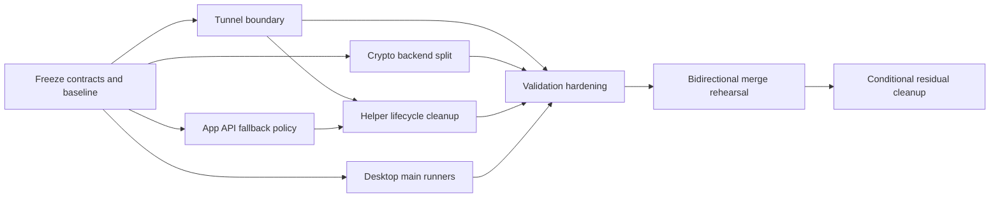

# Windows/macOS Merge Finalization Implementation Plan

> Status: CLOSED / SUPERSEDED.
> Closed on: 2026-05-21; successor updated on 2026-05-22.
> Superseded by: `docs/superpowers/plans/2026-05-22-develop-merge-and-release-readiness.md`.
> Closure summary: the platform-boundary extraction and merge-finalization wave has landed in `integration/platform-convergence-next`. The remaining open items from M6, M7, and M8 are transferred to the successor plan as Windows validation, macOS functional validation, targeted regression repair, and the final `develop` merge gate.
> Historical note: keep this file as the implementation history for the extraction wave; do not use its unchecked boxes as the active task list.

> **For agentic workers:** REQUIRED SUB-SKILL: Use superpowers:subagent-driven-development (recommended) or superpowers:executing-plans to implement this plan task-by-task. Steps use checkbox (`- [ ]`) syntax for tracking.

**Goal:** Finish merge preparation between the `windows` and `macos` branches so both branches remain independently buildable while the final merge can be rehearsed and executed with bounded, documented conflicts.

**Architecture:** Keep one frontend, one desktop IPC contract, and one shared native orchestration layer. Remaining platform-owned behavior must move behind existing native adapters under `src/platform/{win32,darwin,linux}` and new Electron main-process platform runners, so shared files stop carrying OS-specific service, process, route, crypto, and elevation logic.

**Tech Stack:** C++17, CMake presets, Electron 39, Vite/Vue 3, TypeScript, PowerShell, Bash, Git worktrees, remote macOS validation on `macmini`

---

## Current Baseline

- One shared desktop contract is already in place under `webui/desktop/shared/desktop-contract.ts`.
- Frontend convergence is already complete; the Windows desktop UI remains the canonical UI and both platforms now speak the same desktop/native RPC surface.
- Build outputs are already split into `build/windows/*` and `build/macos/*`, and both platforms have one-click wrapper scripts for `cpp`, `debug`, `debug-run`, `desktop`, and `all`.
- Completed native extractions already exist for config defaults, path utilities, helper transport, helper service manager, process control, openconnect child launch, supervisor launch, runtime/service/driver status shaping, and virtual-network probing.
- The remaining shared merge hotspots are now concentrated in a small set of files rather than spread across the repo:
  - `src/tunnel.cpp`
  - `src/app_api.cpp`
  - `src/helper.cpp`
  - `src/crypto.cpp`
  - `webui/desktop/main/index.ts`
- Focused validation already exists and must stay stable while the remaining extractions land:
  - Windows native: `powershell -ExecutionPolicy Bypass -File .\scripts\build-windows.ps1 -Action cpp`
  - Windows native tests: `ctest --preset windows-release -R 'platform_status_models_test|vpn_runtime_test' --output-on-failure`
  - macOS native: `cmake --preset macos-release`
  - macOS native build: `cmake --build --preset macos-release --target exv platform_status_models_test vpn_runtime_test`
  - macOS native tests: `ctest --preset macos-release -R 'platform_status_models_test|vpn_runtime_test' --output-on-failure`
  - Desktop smoke: `scripts/build-windows.ps1 -Action debug-run` and `./scripts/build-macos.sh debug-run`

## Execution Status Snapshot (2026-05-20)

- `M0` is complete and remains the frozen baseline.
- `M1` through `M5` are implemented in the current workspace: the shared native hotspots now route through platform adapters, the focused test targets are wired in CMake, and the Electron main process delegates privileged behavior through platform runners.
- `M6` is partially closed: both platform validation wrappers exist in the current workspace and the build-guide handoff docs are updated. The Windows wrapper is now green both on the current working state and in a fresh current-state snapshot rehearsal. The remaining gap is macOS wrapper evidence plus landing the staged merge-prep inventory into branch history so branch-head rehearsals match the active working state.
- `M7` is partially closed: fresh branch-head bidirectional rehearsals were recorded, the remaining Windows-side deltas were integrated into the current workspace, and a real current-state fresh-worktree rehearsal has now been run from snapshot commits. The Windows side now passes the actual wrapper gate in that rehearsal. The remaining gap is landing the merge-prep inventory into branch history, resolving the remaining cross-branch conflict set, and rerunning the wrapper gate on macOS.
- `M8` is not yet closed. Residual hotspots are documented in the merge playbook, but the trigger decision stays open until the current-state rehearsal gate is finished.

## Non-Goals

- Do not redesign the frontend or change the Windows-led visual baseline.
- Do not change `webui/desktop/shared/desktop-contract.ts` unless a new merge blocker proves the contract itself is wrong.
- Do not broad-refactor `src/config.cpp`, `src/main.cpp`, or `src/sse_broadcaster.cpp` preemptively. Touch them only if merge rehearsal later proves they still create repeated conflicts.
- Do not collapse the current platform-specific build trees back into a shared output layout.
- Do not rewrite helper/service behavior that is already isolated behind existing platform adapters unless that isolation still leaks into shared files.

## Level 1 Overview

| Workstream | Purpose | Primary Outputs | Tasks |
|-----------|---------|-----------------|-------|
| W0. Contract Freeze | Freeze shared contracts and define agent ownership before more code motion lands | Frozen contract list, integration-only file list, merge playbook skeleton | M0 |
| W1. Native Hotspot Closure | Remove the last meaningful platform branches from shared native files | Shared `tunnel.cpp`, `app_api.cpp`, `helper.cpp`, and `crypto.cpp` reduced to orchestration only | M1, M2, M3, M4 |
| W2. Desktop Privilege Closure | Move Electron main-process elevation logic behind per-platform runners | Shared `index.ts` reduced to window/IPC/event-pump orchestration | M5 |
| W3. Validation Hardening | Give every agent the same validation entrypoints and focused tests | Focused native tests, platform validation wrappers, aligned docs | M6 |
| W4. Merge Rehearsal | Verify the branches can actually merge with bounded manual resolution | Merge rehearsal record, conflict-resolution playbook, residual-risk list | M7, M8 |

## Level 2 Overview: Dependency And Order

Hard sequencing rules:

1. `M0` is serial and must finish before any parallel implementation lane starts.
2. `M4` starts only after `M1` and `M2` are stable, because helper lifecycle cleanup depends on the final tunnel cleanup hook and the final helper-remediation policy.
3. `M6` is the integration checkpoint. Do not begin merge rehearsal before its validation scripts and tests are green.
4. `M7` is the final pre-merge gate and is owned by the integration lead, not by lane owners.

Parallelism rules:

- `M1`, `M2`, `M3`, and `M5` can run in parallel once `M0` freezes shared contracts and file ownership.
- `M6` can prepare scaffolding early, but its final form should be merged only after `M1`, `M3`, `M4`, and `M5` stop changing validation targets.
- Only the integration lead edits `CMakeLists.txt`, `docs/build_guide.md`, `README.md`, `README_CN.md`, `scripts/build-windows.ps1`, and `scripts/build-macos.sh` during the implementation phase.

## Agent Ownership Model

### Lane Ownership

| Lane | Owner Focus | Allowed Primary Files | Blocked Files |
|------|-------------|-----------------------|---------------|
| Lead | Contract freeze, merge playbook, integration, rehearsal | `docs/merge-prep-platform-architecture.md`, `docs/merge-playbooks/*`, `docs/build_guide.md`, `CMakeLists.txt`, wrapper scripts | Should not do bulk edits inside lane-owned implementation files except for integration glue |
| Lane A | Tunnel boundary | `src/tunnel.cpp`, `src/platform/common/tunnel_script.hpp`, `src/platform/{darwin,linux,win32}/tunnel_script.cpp`, `tests/tunnel_script_contract_test.cpp` | `src/helper.cpp`, `src/crypto.cpp`, `webui/desktop/main/*` |
| Lane B | App API fallback policy | `src/app_api.cpp`, `src/platform/common/app_api_runtime_policy.hpp`, `src/platform/{darwin,linux,win32}/app_api_runtime_policy.cpp`, `tests/app_api_runtime_policy_test.cpp` | `src/helper.cpp`, `src/tunnel.cpp`, `webui/desktop/main/*` |
| Lane C | Crypto backend split | `src/crypto.cpp`, `src/platform/common/crypto_backend.hpp`, `src/platform/{darwin,linux,win32}/crypto_backend.cpp`, `tests/crypto_roundtrip_test.cpp` | `src/helper.cpp`, `src/tunnel.cpp`, `webui/desktop/main/*` |
| Lane D | Desktop privilege adapters | `webui/desktop/main/index.ts`, `webui/desktop/main/platform/*` | Native C++ files, wrapper scripts |
| Lane E | Helper lifecycle cleanup | `src/helper.cpp`, `src/platform/common/helper_lifecycle.hpp`, `src/platform/{darwin,linux,win32}/helper_lifecycle.cpp`, `src/platform/common/helper_service_manager.hpp`, `src/platform/{darwin,linux,win32}/helper_service_manager.cpp` | `src/crypto.cpp`, `src/app_api.cpp`, `webui/desktop/main/*` |

### Frozen Shared Contracts

These files are frozen after `M0` unless the integration lead explicitly opens a contract change:

- `webui/desktop/shared/desktop-contract.ts`
- `src/platform/common/status_models.hpp`
- `src/platform/common/runtime_status.hpp`
- `src/platform/common/driver_status.hpp`
- `src/platform/common/helper_client.hpp`

### Integration-Only Files

These files collect touches from multiple lanes and therefore must be changed only by the integration lead or in a dedicated integration commit:

- `CMakeLists.txt`
- `docs/build_guide.md`
- `README.md`
- `README_CN.md`
- `scripts/build-windows.ps1`
- `scripts/build-macos.sh`
- `webui/package.json`

## Detailed Task Plan

### Task M0: Freeze Shared Contracts And Create The Merge Baseline

**Meaning:** Turn the current state into an explicit working agreement so multiple agents stop colliding on the same shared files while the last extractions land.

**Files:**
- Modify: `docs/merge-prep-platform-architecture.md`
- Create: `docs/merge-playbooks/windows-macos-merge.md`
- Verify only: `webui/desktop/shared/desktop-contract.ts`
- Verify only: `src/platform/common/status_models.hpp`
- Verify only: `src/platform/common/runtime_status.hpp`
- Verify only: `src/platform/common/driver_status.hpp`
- Verify only: `src/platform/common/helper_client.hpp`

**Scope Boundary:**
- This task may change documentation and ownership rules only.
- This task must not change runtime behavior.
- If the diff inventory shows a frozen contract really must change, stop and create a new explicit task rather than sneaking the change into another lane.

**Dependencies:** None

**Parallelism:** None. This is the serial starting gate.

- [x] **Step 1: Record the frozen-contract list and lane ownership rules** in `docs/merge-prep-platform-architecture.md` and the merge playbook.
- [x] **Step 2: Generate the current conflict inventory** with `git diff --name-only windows...macos -- src webui scripts docs` and classify the results into native shared, desktop shared, and integration-only buckets.
- [x] **Step 3: Add the integration-only file list** so no lane edits `CMakeLists.txt`, wrapper scripts, or shared docs in parallel.
- [x] **Step 4: Create the merge playbook skeleton** with sections for bidirectional rehearsal, conflict notes, final validation, and residual-risk capture.
- [x] **Step 5: Announce the working agreement** to every implementation lane before more code motion begins.

**Acceptance Criteria:**
- Frozen shared contracts are named in-repo.
- Lane ownership and integration-only files are named in-repo.
- A merge playbook exists before any new extraction slice starts.
- Runtime behavior files remain untouched.

**Validation:**
- `git diff --name-only -- docs`
- `git diff --exit-code -- webui/desktop/shared/desktop-contract.ts src/platform/common/status_models.hpp src/platform/common/runtime_status.hpp src/platform/common/driver_status.hpp src/platform/common/helper_client.hpp`

### Task M1: Finish Tunnel Emission And Route Cleanup Boundaries

**Meaning:** Remove the remaining platform-specific route cleanup logic from `src/tunnel.cpp` so the shared tunnel layer owns only route intent and context assembly.

**Files:**
- Modify: `src/tunnel.cpp`
- Modify: `src/platform/common/tunnel_script.hpp`
- Modify: `src/platform/darwin/tunnel_script.cpp`
- Modify: `src/platform/linux/tunnel_script.cpp`
- Modify: `src/platform/win32/tunnel_script.cpp`
- Create: `tests/tunnel_script_contract_test.cpp`
- Modify: `CMakeLists.txt` (integration lead only)

**Scope Boundary:**
- Shared `src/tunnel.cpp` may keep host extraction, server-IP exception derivation, and platform-context assembly.
- Platform tunnel files must own command text, artifact emission details, permission normalization, and route cleanup behavior.
- Do not change route-policy semantics, server-route-exception behavior, or frontend status fields.

**Dependencies:** `M0`

**Parallelism:** Can run in parallel with `M2`, `M3`, and `M5`.

- [x] **Step 1: Extend the tunnel platform interface** so cleanup behavior is invoked through `src/platform/common/tunnel_script.hpp` rather than embedded shell commands in `src/tunnel.cpp`.
- [x] **Step 2: Move macOS/Linux route-delete command generation** out of `src/tunnel.cpp` and into the platform tunnel adapters.
- [x] **Step 3: Keep `find_server_route_exceptions()` deterministic** and cover it with `tests/tunnel_script_contract_test.cpp`.
- [x] **Step 4: Wire the new test target into CMake** in a single integration commit.
- [ ] **Step 5: Re-run focused native validation on Windows and macOS** before merging the lane.

Status note (2026-05-20): implementation, test coverage, and CMake wiring are landed. Windows-side focused validation is covered by the current merge-prep wrapper evidence; current-state macOS rerun is still open.

**Acceptance Criteria:**
- `src/tunnel.cpp` no longer contains platform-specific route-delete command strings.
- `cleanup_routes()` delegates entirely through a platform interface.
- `tests/tunnel_script_contract_test.cpp` passes on Windows and macOS.
- No desktop/API-visible behavior changes are introduced.

**Validation:**
- Windows: `cmake --build --preset windows-release --target exv exv-helper platform_status_models_test vpn_runtime_test tunnel_script_contract_test`
- Windows: `ctest --preset windows-release -R 'platform_status_models_test|vpn_runtime_test|tunnel_script_contract_test' --output-on-failure`
- macOS: `cmake --build --preset macos-release --target exv platform_status_models_test vpn_runtime_test tunnel_script_contract_test`
- macOS: `ctest --preset macos-release -R 'platform_status_models_test|vpn_runtime_test|tunnel_script_contract_test' --output-on-failure`

### Task M2: Extract App API Fallback Policy And Helper Remediation Text

**Meaning:** Make `src/app_api.cpp` a pure shared RPC/orchestration layer by moving direct-fallback preparation and platform-specific helper-remediation policy into platform modules.

**Files:**
- Modify: `src/app_api.cpp`
- Create: `src/platform/common/app_api_runtime_policy.hpp`
- Create: `src/platform/darwin/app_api_runtime_policy.cpp`
- Create: `src/platform/linux/app_api_runtime_policy.cpp`
- Create: `src/platform/win32/app_api_runtime_policy.cpp`
- Create: `tests/app_api_runtime_policy_test.cpp`
- Modify: `CMakeLists.txt` (integration lead only)

**Scope Boundary:**
- Shared `src/app_api.cpp` keeps action routing, config shaping, frontend status shaping, and JSON envelope rules.
- Platform policy files own direct-fallback preparation, helper-unavailable remediation copy, and any platform-specific preflight nuance.
- `platform::kHelperUnavailableCode` remains unchanged.

**Dependencies:** `M0`

**Parallelism:** Can run in parallel with `M1`, `M3`, and `M5`.

- [x] **Step 1: Introduce one app-api runtime policy interface** that exposes direct-fallback preparation and helper-remediation text.
- [x] **Step 2: Move the current `prepare_direct_fallback_runtime()` behavior** into the new per-platform implementation files.
- [x] **Step 3: Move the helper-unavailable message branching** out of `src/app_api.cpp` and into the policy adapter.
- [x] **Step 4: Add `tests/app_api_runtime_policy_test.cpp`** to lock down message/code behavior and platform policy selection.
- [ ] **Step 5: Re-run the native validation chain plus one helper-less desktop RPC smoke path** on both platforms.

Status note (2026-05-20): the policy abstraction and focused test target are landed and integrated. Windows validation now includes `app_api_runtime_policy_test`; the cross-platform helper-less smoke closeout still needs refreshed evidence, especially on macOS.

**Acceptance Criteria:**
- `src/app_api.cpp` has no platform-specific helper-remediation message branches.
- `src/app_api.cpp` has no direct runtime-owner preparation logic.
- Desktop RPC action names and JSON envelope structure remain unchanged.
- Helper-unavailable behavior remains stable on Windows and macOS.

**Validation:**
- Windows: `cmake --build --preset windows-release --target exv exv-helper app_api_runtime_policy_test`
- Windows: `ctest --preset windows-release -R 'app_api_runtime_policy_test' --output-on-failure`
- Windows smoke: `build\windows\cpp\exv.exe desktop-rpc status.get '{}'`
- macOS: `cmake --build --preset macos-release --target exv app_api_runtime_policy_test`
- macOS: `ctest --preset macos-release -R 'app_api_runtime_policy_test' --output-on-failure`

### Task M3: Extract The Crypto Backend Adapter

**Meaning:** Reduce `src/crypto.cpp` to shared key lifecycle, config mutation, and serialization while platform modules own random source, AES backend, secure input, and permission normalization details.

**Files:**
- Modify: `src/crypto.cpp`
- Create: `src/platform/common/crypto_backend.hpp`
- Create: `src/platform/darwin/crypto_backend.cpp`
- Create: `src/platform/linux/crypto_backend.cpp`
- Create: `src/platform/win32/crypto_backend.cpp`
- Create: `tests/crypto_roundtrip_test.cpp`
- Modify: `CMakeLists.txt` (integration lead only)

**Scope Boundary:**
- Shared code keeps base64 helpers, key file lifecycle, config reset behavior, and public crypto API shape.
- Platform backends own RNG, AES implementation details, hidden-input collection, and platform-specific file-permission normalization.
- Do not change ciphertext format or config schema.

**Dependencies:** `M0`

**Parallelism:** Can run in parallel with `M1`, `M2`, and `M5`.

- [x] **Step 1: Define the crypto backend contract** in `src/platform/common/crypto_backend.hpp`.
- [x] **Step 2: Move CommonCrypto/OpenSSL/Bcrypt calls** into per-platform backend files.
- [x] **Step 3: Move hidden-input and permission-normalization branches** out of `src/crypto.cpp`.
- [x] **Step 4: Add `tests/crypto_roundtrip_test.cpp`** covering encrypt/decrypt roundtrip and key initialization behavior.
- [ ] **Step 5: Re-run native validation on both platforms** before integrating the slice.

Status note (2026-05-20): the backend split and focused roundtrip test are landed and wired. Windows-side validation is covered by the merge-prep wrapper; current-state macOS rerun is still pending.

**Acceptance Criteria:**
- `src/crypto.cpp` no longer includes CommonCrypto, Bcrypt, or OpenSSL headers directly.
- `src/crypto.cpp` no longer contains platform-specific hidden-input branches.
- Encryption/decryption and key reset behavior remain unchanged.
- `tests/crypto_roundtrip_test.cpp` passes on both platforms.

**Validation:**
- Windows: `cmake --build --preset windows-release --target exv exv-helper crypto_roundtrip_test`
- Windows: `ctest --preset windows-release -R 'crypto_roundtrip_test' --output-on-failure`
- macOS: `cmake --build --preset macos-release --target exv crypto_roundtrip_test`
- macOS: `ctest --preset macos-release -R 'crypto_roundtrip_test' --output-on-failure`

### Task M4: Finish Helper Lifecycle Cleanup Behind One Platform Adapter

**Meaning:** Shrink `src/helper.cpp` down to request parsing and lifecycle orchestration by moving stable-install replacement, helper wake-up behavior, ownership repair, and service-adjacent platform decisions behind a dedicated helper lifecycle adapter.

**Files:**
- Modify: `src/helper.cpp`
- Create: `src/platform/common/helper_lifecycle.hpp`
- Create: `src/platform/darwin/helper_lifecycle.cpp`
- Create: `src/platform/linux/helper_lifecycle.cpp`
- Create: `src/platform/win32/helper_lifecycle.cpp`
- Modify: `src/platform/common/helper_service_manager.hpp`
- Modify: `src/platform/darwin/helper_service_manager.cpp`
- Modify: `src/platform/linux/helper_service_manager.cpp`
- Modify: `src/platform/win32/helper_service_manager.cpp`
- Modify: `CMakeLists.txt` (integration lead only)

**Scope Boundary:**
- Shared `src/helper.cpp` keeps command routing, session-state transitions, and shared JSON/status shaping.
- The new helper lifecycle adapter owns stable install path replacement, wake-up or stop signaling details, ownership repair, and other platform-specific lifecycle mechanics.
- Do not change helper command names or service command semantics.

**Dependencies:** `M1`, `M2`

**Parallelism:** Starts after `M1` and `M2` stabilize. Can overlap with late `M3` cleanup.

- [x] **Step 1: Introduce `src/platform/common/helper_lifecycle.hpp`** for stable-path replacement, shutdown wake-up, and ownership-repair hooks.
- [x] **Step 2: Move helper lifecycle platform branches** out of `src/helper.cpp` into the new per-platform implementation files.
- [x] **Step 3: Keep `HelperServiceManagerContext` narrow** and remove duplicated platform decisions that now belong in the lifecycle adapter.
- [ ] **Step 4: Re-validate helper-related commands** with service status/install/uninstall smoke paths on both platforms.
- [ ] **Step 5: Merge the lane only after a focused macro-count review** confirms `src/helper.cpp` no longer carries broad OS-specific lifecycle code.

Status note (2026-05-20): helper lifecycle extraction is landed and Windows compile plus `service status` smoke have been rerun. Current-state macOS helper smoke and final macro-count closeout remain open.

**Acceptance Criteria:**
- `src/helper.cpp` no longer owns stable-install replacement logic.
- `src/helper.cpp` no longer owns platform-specific wake-up or stop signaling details.
- Remaining platform macros in `src/helper.cpp` are limited to daemon-loop glue or unavoidable low-level portability boundaries.
- Service install/status/uninstall flows still behave correctly on Windows and macOS.

**Validation:**
- Windows: `powershell -ExecutionPolicy Bypass -File .\scripts\build-windows.ps1 -Action cpp`
- Windows smoke: `build\windows\cpp\exv.exe service status`
- macOS: `cmake --build --preset macos-release --target exv platform_status_models_test vpn_runtime_test`
- macOS smoke: `build/macos/cpp/exv service status`

### Task M5: Extract Electron Main-Process Privileged Runners

**Meaning:** Reduce `webui/desktop/main/index.ts` to window management, IPC registration, and event pumping by moving PowerShell and `osascript` elevation logic into per-platform adapters.

**Files:**
- Modify: `webui/desktop/main/index.ts`
- Create: `webui/desktop/main/platform/base.ts`
- Create: `webui/desktop/main/platform/win32.ts`
- Create: `webui/desktop/main/platform/darwin.ts`
- Create: `webui/desktop/main/platform/linux.ts`
- Create: `webui/desktop/main/platform/index.ts`

**Scope Boundary:**
- Shared `index.ts` keeps BrowserWindow creation, IPC registration, log/status pumping, and high-level orchestration.
- Platform runner files own elevation commands, quoting helpers, progress-log collection, runtime-env injection, and command execution details.
- Do not change desktop IPC channel names, RPC action names, or event names.

**Dependencies:** `M0`

**Parallelism:** Can run in parallel with `M1`, `M2`, and `M3`.

- [x] **Step 1: Define one desktop main-process runner interface** under `webui/desktop/main/platform/`.
- [x] **Step 2: Move Windows PowerShell elevation and progress-log polling** into `webui/desktop/main/platform/win32.ts`.
- [x] **Step 3: Move macOS `osascript` elevation behavior** into `webui/desktop/main/platform/darwin.ts`.
- [x] **Step 4: Leave Linux on the non-elevated shared path** via `webui/desktop/main/platform/linux.ts`, keeping behavior explicit instead of implicit.
- [ ] **Step 5: Rebuild Electron and run `debug-run` smoke paths** on Windows and macOS.

Status note (2026-05-20): `webui/desktop/main/index.ts` now delegates privileged execution through `platformRunner`. Current-state `debug-run` smoke evidence still needs a fresh rerun, especially on macOS.

**Acceptance Criteria:**
- `webui/desktop/main/index.ts` no longer contains inline PowerShell or `osascript` command construction.
- `debug-run` still launches the unpacked desktop UI on Windows and macOS.
- Desktop RPC and service-command behavior remain unchanged for the renderer.

**Validation:**
- `cd webui && npm run build:electron`
- Windows: `powershell -ExecutionPolicy Bypass -File scripts\build-windows.ps1 -Action debug-run`
- macOS: `./scripts/build-macos.sh debug-run`

### Task M6: Consolidate Validation Entry Points And Focused Regression Coverage

**Meaning:** Give every lane and every reviewer the same small set of validation commands, then codify the expanded hotspot coverage created by `M1` through `M5`.

**Files:**
- Create: `scripts/validate-merge-prep-windows.ps1`
- Create: `scripts/validate-merge-prep-macos.sh`
- Modify: `docs/build_guide.md`
- Modify: `README.md` (integration lead only, only if user-facing commands change)
- Modify: `README_CN.md` (integration lead only, only if user-facing commands change)
- Modify: `CMakeLists.txt` (integration lead only, only for final test target wiring)

**Scope Boundary:**
- This task standardizes validation only; it is not allowed to introduce new product behavior.
- Reuse existing wrapper/build commands; do not create a second build system.
- Keep the validation chain focused and fast enough for per-slice use.

**Dependencies:** `M1`, `M3`, `M4`, `M5`

**Parallelism:** Integration-only task.

- [x] **Step 1: Create one Windows validation wrapper** that runs native build, focused tests, Electron compile, and optionally debug smoke.
- [x] **Step 2: Create one macOS validation wrapper** with the same validation stages and remote-host notes where needed.
- [x] **Step 3: Update `docs/build_guide.md`** so every lane uses the same commands during review and handoff.
- [x] **Step 4: Fold the new tests from `M1` through `M4`** into the platform validation wrappers.
- [ ] **Step 5: Run both validation wrappers end-to-end** before merge rehearsal begins.

Status note (2026-05-20): both validation wrappers are present in the current workspace and documented, and the Windows wrapper is green both on the current working state and in a fresh current-state snapshot rehearsal. The wrappers also now build `webui/dist` before native embedding. The remaining gaps are macOS wrapper rerun and landing the staged merge-prep inventory into branch history.

**Acceptance Criteria:**
- One command per platform validates the merge-prep slice end-to-end.
- The validation wrappers include all focused merge-prep tests.
- Reviewers can reproduce the same checks without reading lane-specific notes.

**Validation:**
- Windows: `powershell -ExecutionPolicy Bypass -File .\scripts\validate-merge-prep-windows.ps1`
- macOS: `./scripts/validate-merge-prep-macos.sh`

### Task M7: Run Bidirectional Merge Rehearsals And Record Manual Resolution Steps

**Meaning:** Convert the plan from theory into proof by rehearsing the final merge in fresh worktrees from both directions and recording any remaining manual resolutions.

**Files:**
- Modify: `docs/merge-playbooks/windows-macos-merge.md`
- Modify: `docs/merge-prep-platform-architecture.md`

**Scope Boundary:**
- This task is a rehearsal and documentation task first.
- If rehearsal reveals a trivial integration drift in an integration-only file, fix it in a dedicated integration commit.
- If rehearsal reveals a new shared implementation hotspot, stop and trigger `M8` rather than broadening scope silently.

**Dependencies:** `M6`

**Parallelism:** Serial final gate owned by the integration lead.

- [x] **Step 1: Create fresh worktrees** for rehearsal so no lane-local dirt contaminates the result.
- [x] **Step 2: Rehearse `windows -> macos` merge** and record every conflict file and chosen resolution.
- [ ] **Step 3: Run the full validation wrappers** after the rehearsal merge result is produced.
- [x] **Step 4: Rehearse `macos -> windows` merge** and record any directional differences.
- [x] **Step 5: Update the merge playbook** with exact manual steps for any remaining integration-only conflicts.

Status note (2026-05-20): fresh branch-head rehearsals, a current-state synthetic merge preview, an explicit manual resolution procedure, and a real current-state fresh-worktree rehearsal are recorded in the merge playbook. The Windows side now also passes the actual `validate-merge-prep-windows.ps1` wrapper in a fresh snapshot-based rehearsal after applying the documented keep-current resolution policy. The final gap is carrying the staged merge-prep inventory into branch history, resolving the remaining conflict set in both directions, and rerunning the platform validation wrappers on macOS.

**Acceptance Criteria:**
- Both merge directions have been rehearsed in fresh worktrees.
- Any remaining conflicts are limited to the documented integration-only set, or are explicitly promoted into `M8`.
- Post-rehearsal validation passes in both directions.

**Validation:**
- `git worktree add <path> macos`
- `git worktree add <path> windows`
- `git merge windows` from the macOS rehearsal worktree
- `git merge macos` from the Windows rehearsal worktree
- Run `scripts/validate-merge-prep-windows.ps1` or `scripts/validate-merge-prep-macos.sh` in the appropriate rehearsal result

### Task M8: Residual Conflict Cleanup Trigger

**Meaning:** Prevent late-stage panic refactors by naming the exact trigger for a follow-up cleanup wave.

**Files:**
- Create if needed: `docs/superpowers/plans/2026-05-xx-residual-merge-hotspots.md`
- Possible follow-up targets only if triggered: `src/config.cpp`, `src/main.cpp`, `src/sse_broadcaster.cpp`, or any other newly proven hotspot from `M7`

**Scope Boundary:**
- This task is conditional. It starts only if `M7` proves that non-target shared files still create repeated merge pain.
- Do not preemptively start it “just in case”.
- If triggered, create a new focused plan rather than extending this one indefinitely.

**Dependencies:** `M7`

**Parallelism:** None until the integration lead confirms the trigger.

- [x] **Step 1: Review the rehearsal conflict inventory** for repeated shared-file collisions outside the expected hotspot list.
- [ ] **Step 2: If such files exist, write a new focused plan** for only those files.
- [ ] **Step 3: If they do not exist, formally close this task as not needed.**

Status note (2026-05-20): residual conflict buckets are documented in the merge playbook, but the trigger decision stays open until `M7` finishes on the current working state.

**Acceptance Criteria:**
- Either residual cleanup is explicitly ruled out, or it has its own focused plan.
- No silent scope creep leaks into the final merge wave.

## Recommended Execution Order

### Phase A: Freeze And Launch Lanes

1. Complete `M0`.
2. Assign lane owners and freeze the shared contract files.

### Phase B: Parallel Hotspot Closure

1. Lane A runs `M1`.
2. Lane B runs `M2`.
3. Lane C runs `M3`.
4. Lane D runs `M5`.

### Phase C: Shared Native Cleanup

1. Lane E runs `M4` after `M1` and `M2` are both merged or at least interface-stable.

### Phase D: Integration And Rehearsal

1. Integration lead runs `M6`.
2. Integration lead runs `M7`.
3. Trigger `M8` only if the rehearsal proves it is necessary.

## Multi-Agent Collaboration Rules

- Every lane works in its own worktree.
- Every lane lands code plus its own focused validation evidence before requesting integration.
- No lane edits another lane's primary files except through review comments.
- The integration lead batches all `CMakeLists.txt`, wrapper-script, and doc changes after reviewing the lane diffs.
- If two lanes need a new shared header name, reserve that name in `M0` before either lane starts coding.
- After the first substantive edit in a lane, the next action must be that lane's focused validation, not another refactor.

## Final Merge Readiness Checklist

- [x] Shared contracts remain unchanged or changed only through an explicit contract task.
- [x] `src/tunnel.cpp`, `src/app_api.cpp`, `src/helper.cpp`, and `src/crypto.cpp` no longer carry broad platform policy branches.
- [x] `webui/desktop/main/index.ts` no longer carries inline PowerShell or `osascript` execution logic.
- [ ] Windows and macOS each still build independently through their wrapper scripts.
- [x] Focused native tests cover the new hotspot boundaries.
- [ ] Merge rehearsal succeeds from both directions with only documented manual resolutions remaining.

## Plan Maintenance Rule

If the implementation sequence reveals a new hotspot or makes a task materially larger than described here, update this plan before continuing. The plan is an execution contract for the team, not a historical note.
