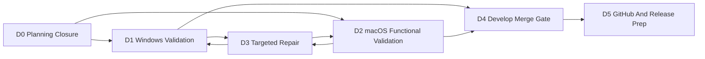

# Develop Merge Validation And Release Hardening Plan

> Status: CLOSED / SUPERSEDED.
> Closed on: 2026-05-22.
> Superseded by: `docs/superpowers/plans/2026-05-22-develop-merge-and-release-readiness.md`.
> Closure summary: this plan established the first develop merge validation gate, but its baseline predates the 2026-05-22 completion review. Remaining Windows validation, macOS functional validation, remote team status cleanup, final `develop` merge, and release hardening are transferred to the successor plan.
> Historical note: keep this file for context only; do not use it as the active checklist.

> Original status: active execution plan for the next large stage.
> Date: 2026-05-21
> Supersedes:
> - `docs/superpowers/plans/2026-05-19-windows-macos-merge-finalization.md`
> - `docs/superpowers/plans/2026-05-21-platform-convergence-next-stage.md`
> Branch baseline: `integration/platform-convergence-next` at `cc11a5b`.

## 1. Overall Goal And Current Review

### Overall Goal

Move the validated Windows/macOS convergence result from `integration/platform-convergence-next` into `develop` without losing the platform-specific behavior that now works on each side.

This stage is a validation, repair, and merge-gate stage. It is not a broad refactor stage and not a new feature stage. New code is allowed only when a validation failure or explicit release-hardening gap proves that a repair is needed.

### Current Completion Review

The previous convergence stage is mostly complete:

| Area | Current status | Evidence or note |
|---|---|---|
| G0 baseline lock | Complete | `windows` and `macos` are both ancestors of `integration/platform-convergence-next`. |
| G1.1 platform adapter audit | Complete | Audit recorded in `docs/merge-playbooks/g1.1-native-platform-audit.md`; only minor `runtime_status.cpp` `#ifdef` concern remains. |
| G1.2 native lifecycle audit | Complete | Audit recorded in `docs/merge-playbooks/g1.2-native-lifecycle-audit.md`; Windows service/named-pipe and macOS launchd/elevated paths are structurally separated. |
| G1.3 desktop contract audit | Complete | Audit recorded in `docs/merge-playbooks/g1.3-desktop-contract-audit.md`; one shared contract and no duplicate `mode`/`session_mode`. |
| G1.4 build/package audit | Complete | Audit recorded in `docs/merge-playbooks/g1.4-build-package-audit.md`; scripts and staging paths are platform-separated. |
| G2 sync-conflict cleanup | Complete by tracked-file check | `git ls-files | rg "sync-conflict|rehearsal"` returns no tracked conflict artifacts. |
| G3 macOS automated validation | Complete | `docs/merge-playbooks/g3-macos-validation.md`: native build, 5 tests, webui build, Electron build pass. |
| G3 macOS manual validation | Pending | Requires credentials and actual connect/disconnect/service-page checks. |
| G3 Windows validation | Pending | Must be run on Windows from the integration branch. |
| G4 develop merge rehearsal | Ready | `git merge-tree --write-tree --messages --name-only develop integration/platform-convergence-next` reports no conflict paths. |

### Current Risks

- Windows has not yet been validated from the integration branch after the macOS convergence commits.
- macOS automated validation is green, but functional VPN scenarios still need credentials and manual verification.
- The previous G3 macOS validation note recommends proceeding to G4 before Windows validation; that recommendation is too loose for `develop`. In this plan, `develop` merge is blocked until Windows validation passes or the risk is explicitly accepted in the playbook.
- Audit documents contain some historical encoding artifacts. They do not block code validation, but the final playbook must remain readable before GitHub publication.
- Two low-priority design debts remain: `runtime_status.cpp` has small platform `#ifdef` branches, and renderer error normalization still has a fallback string check for `elevation_denied`.

## 2. Level 1 Workstream Overview

| Workstream | Purpose | Primary output | Parallelizable |
|---|---|---|---|
| D0. Planning Closure And Evidence Ledger | Close superseded plans and establish one active checklist | Active plan, closed old plans, clean evidence index | No |
| D1. Windows Integration Validation | Prove integration branch still works on Windows | Automated and manual Windows validation record | Yes, with D2 |
| D2. macOS Functional Validation | Prove integration branch works with real VPN scenarios on macOS | Manual macOS validation record | Yes, with D1 |
| D3. Targeted Regression Repair | Fix only failures found by D1/D2 | Small repair commits and retest notes | Conditional |
| D4. Develop Merge Gate | Merge integration into `develop` only after gates pass | Local merge result, post-merge smoke, playbook update | No |
| D5. GitHub And Release Prep | Prepare clean remote history and release-readiness follow-up | Push/PR checklist, release hardening backlog | Partly |

Dependency graph:



## 3. Detailed Task Plan

### D0. Planning Closure And Evidence Ledger

Objective: prevent agents from following stale plans and make the next stage auditable from one document.

#### D0.1 Close Superseded Plans

Owner: integration lead

Actions:

- Mark `2026-05-19-windows-macos-merge-finalization.md` as closed and superseded by this plan.
- Mark `2026-05-21-platform-convergence-next-stage.md` as closed and superseded by this plan.
- Do not delete old plans; keep them as historical records.

Scope boundary:

- Documentation only.
- Do not edit runtime code or branch history in this task.

Acceptance criteria:

- Both superseded plan files have a clear status banner at the top.
- The banner names this plan as the active successor.

#### D0.2 Build The Evidence Ledger

Owner: integration lead

Actions:

- Update `docs/merge-playbooks/windows-macos-merge.md` with a "Develop Merge Gate Handoff" section.
- Record current branch heads:
  - `develop`: `7d39136`
  - `windows`: `66dbfa8`
  - `macos`: `6fb5ebb`
  - `integration/platform-convergence-next`: `cc11a5b`
- Record ancestor checks for `windows` and `macos` into integration.
- Record the 0-conflict `develop` merge-tree rehearsal.
- Link audit records and G3 validation records.

Acceptance criteria:

- A reviewer can find all proof points from the merge playbook without reading old plan files.
- The playbook explicitly states which validations are still pending.

#### D0.3 Decide Gate Severity

Owner: integration lead

Actions:

- Classify each remaining check as one of:
  - `develop-blocker`
  - `release-blocker`
  - `post-merge hardening`
- Default classification:
  - Windows automated validation: `develop-blocker`
  - Windows manual helper service connect/disconnect: `develop-blocker`
  - macOS helper-installed manual connect/disconnect: `develop-blocker`
  - macOS helper-missing one-time connect/disconnect: `develop-blocker`
  - Windows no-service elevated fallback: `release-blocker`
  - runtime_status.cpp `#ifdef` cleanup: `post-merge hardening`
  - renderer `elevation_denied` fallback cleanup: `post-merge hardening`
  - audit document encoding cleanup: `post-merge hardening`

Acceptance criteria:

- No agent needs to decide whether a failed scenario blocks `develop`.
- Any deviation from the default classification is recorded in the playbook.

### D1. Windows Integration Validation

Objective: prove that the integration branch did not regress the Windows service, helper, packaging, or desktop UI behavior that was previously working.

#### D1.1 Windows Automated Build And Test Gate

Owner: Windows validation lane

Commands:

```powershell
cd "D:\Development\Projects\cpp\ECNU-VPN"
git switch integration/platform-convergence-next
git status --short --branch

powershell -ExecutionPolicy Bypass -File ".\scripts\validate-merge-prep-windows.ps1"

cd "D:\Development\Projects\cpp\ECNU-VPN\webui"
npm run build
npm run build:electron
npm run desktop:build
```

Scope boundary:

- Validation only unless a command fails.
- Do not patch during the same log capture; record the failure first.

Acceptance criteria:

- Native build passes.
- Focused C++ tests pass.
- Electron TypeScript build passes.
- Desktop package build passes.
- `webui\release\win-unpacked\resources\bin` contains `exv.exe`, `exv-helper.exe`, MinGW runtime DLLs, OpenConnect runtime, and `wintun.dll`.

#### D1.2 Windows Helper Service Manual Gate

Owner: Windows validation lane

Prerequisite:

- Run from an Administrator PowerShell.
- Use the integration branch build/package output, not an old release directory.

Scenarios:

- Launch desktop UI from the integration build.
- Install helper service from the UI.
- Confirm UI shows `installed=true`, `running=true`, `available=true`.
- Confirm CLI and desktop RPC agree:

```powershell
cd "D:\Development\Projects\cpp\ECNU-VPN"
.\build\windows\cpp\exv.exe service status
.\build\windows\cpp\exv.exe desktop-rpc service.status "{}"
```

- Save auth settings.
- Connect through helper.
- Disconnect through helper.
- Uninstall helper service from the UI.
- Confirm UI refreshes to uninstalled/not running/not available.

Acceptance criteria:

- No `Helper daemon is not available` error when service status says available.
- No false `uninstall incomplete` state after SCM settles.
- No `An object could not be cloned` error when saving auth/settings/routes.
- Connect/disconnect button state returns to the correct final state.
- Service page and CLI/RPC status agree.

#### D1.3 Windows Runtime And Packaging Inspection

Owner: build/package lane plus Windows validation lane

Actions:

- Inspect packaged `resources/bin`.
- Confirm `prepare-native.cjs` staged the current native binaries and runtime assets.
- Confirm no old release binary is being used by Electron.
- Confirm `EXV_PATH` and `ECNUVPN_RUNTIME_DIR` are not required for packaged UI.

Acceptance criteria:

- Packaged UI can locate the native binary and runtime without manual environment variables.
- Packaged `exv.exe desktop-rpc runtime.status "{}"` reports bundled OpenConnect and driver assets.

#### D1.4 Windows No-Service Elevated Fallback Gate

Owner: Windows validation lane

Classification:

- `release-blocker`, not `develop-blocker`, unless helper service scenarios fail.

Scenarios:

- Uninstall helper service.
- Launch UI as normal user.
- Attempt one-time elevated connect.
- Accept UAC and verify direct/elevated connection behavior.
- Disconnect the one-time elevated session.
- Repeat and cancel UAC; verify UI shows clean cancellation.

Acceptance criteria:

- If supported, one-time elevated connect/disconnect works.
- If not supported, UI clearly directs the user to install service or run as administrator.
- UAC cancellation does not leave the UI stuck in connecting/disconnecting state.

### D2. macOS Functional Validation

Objective: close the gap between macOS automated validation and real VPN behavior.

#### D2.1 macOS Helper-Installed Manual Gate

Owner: macOS validation lane

Commands:

```bash
cd /Users/tomli/Development/Projects/cpp/ECNU-VPN
git switch integration/platform-convergence-next
git status --short --branch
./scripts/validate-merge-prep-macos.sh
```

Scenarios:

- Launch desktop UI from the integration branch.
- Install helper service from the UI.
- Confirm service page shows installed/running/available.
- Connect through helper using real credentials.
- Confirm tunnel state and route readiness.
- Disconnect through helper.
- Confirm no stale OpenConnect process remains.

Acceptance criteria:

- Helper-installed connect succeeds.
- Helper-installed disconnect succeeds.
- Service page state matches CLI/RPC status.
- No root-owned config file regression appears.

#### D2.2 macOS Helper-Missing One-Time Gate

Owner: macOS validation lane

Scenarios:

- Uninstall helper service.
- Launch UI as normal user.
- Start one-time elevated connection.
- Accept the privilege prompt.
- Confirm connection succeeds.
- Disconnect the one-time elevated session.
- Repeat and cancel the privilege prompt.

Acceptance criteria:

- One-time elevated connect succeeds.
- One-time elevated disconnect succeeds.
- Cancelled privilege prompt returns a structured cancellation/error state.
- OpenConnect is not killed by signing/quarantine checks.
- UI does not require manual terminal commands for normal use.

#### D2.3 macOS Runtime Signing Check

Owner: macOS validation lane

Actions:

- Verify bundled OpenConnect and copied dylibs after `desktop:build`.
- Confirm no `Killed: 9` from unsigned or quarantined runtime binary.

Acceptance criteria:

- Runtime assets pass the signing/quarantine checks used by the macOS staging script.
- The packaged app uses the staged runtime, not a Homebrew path dependency.

### D3. Targeted Regression Repair

Objective: repair only issues proven by D1 or D2, and keep each repair small enough to review and retest.

#### D3.1 Failure Triage

Owner: integration lead

Actions:

- Record the failing command or manual scenario in the merge playbook.
- Classify the failure owner:
  - native platform
  - native lifecycle
  - desktop contract
  - build/package
  - documentation only
- Decide whether the failure is a `develop-blocker`, `release-blocker`, or `post-merge hardening`.

Acceptance criteria:

- No repair starts without a reproduced failure or explicit debt classification.
- Every repair has a retest command before implementation begins.

#### D3.2 Repair Commit Rules

Owner: assigned repair lane

Actions:

- Patch the smallest owner module.
- Avoid broad cleanup around the failing area.
- Retest the exact failed scenario first.
- Then rerun any dependent validation gate.

Acceptance criteria:

- Repair commit message starts with `repair:`.
- The merge playbook records before/after evidence.
- If a shared contract changes, both Windows and macOS validation lanes rerun affected checks.

#### D3.3 Known Low-Priority Repair Backlog

Owner: post-merge hardening lane

Items:

- Move the small `runtime_status.cpp` platform `#ifdef` branches behind platform-specific status helpers if they become a recurring conflict source.
- Replace renderer fallback string matching for `elevation_denied` with a structured code path for unknown elevated-command errors.
- Clean encoding artifacts in audit documents before publishing long-form docs to GitHub.

Acceptance criteria:

- These items do not block `develop` unless they cause a validation failure.
- If implemented, each item has its own small commit and focused validation.

### D4. Develop Merge Gate

Objective: merge to `develop` only after validation evidence is complete.

#### D4.1 Pre-Merge Checklist

Owner: integration lead

Required before local merge:

- D1.1 Windows automated gate passed.
- D1.2 Windows helper service manual gate passed.
- D2.1 macOS helper-installed manual gate passed.
- D2.2 macOS helper-missing one-time gate passed.
- Any D3 `develop-blocker` repairs are complete and retested.
- `git merge-tree --write-tree --messages --name-only develop integration/platform-convergence-next` still reports no conflict paths.

Acceptance criteria:

- The checklist is recorded in `docs/merge-playbooks/windows-macos-merge.md`.
- No unresolved `develop-blocker` remains.

#### D4.2 Local Merge Into Develop

Owner: integration lead

Commands:

```powershell
cd "D:\Development\Projects\cpp\ECNU-VPN"
git switch develop
git merge --no-ff integration/platform-convergence-next
```

Post-merge smoke:

```powershell
powershell -ExecutionPolicy Bypass -File ".\scripts\validate-merge-prep-windows.ps1"
```

Scope boundary:

- Do not patch directly on `develop`.
- If the post-merge smoke fails, revert locally before pushing and repair on integration.

Acceptance criteria:

- `develop` contains the integration merge.
- `develop` is clean.
- The merge commit and post-merge validation are recorded.

#### D4.3 Develop Protection Rule

Owner: integration lead

Rule:

- Do not push `develop` until the local merge and post-merge smoke are recorded.
- Do not push `develop` if Windows or macOS manual validation is missing, unless the playbook explicitly documents an accepted risk.

Acceptance criteria:

- GitHub receives a validated branch state, not a speculative local merge.

### D5. GitHub And Release Prep

Objective: make the repository publishable and set the next release-hardening queue.

#### D5.1 Push And PR Sequence

Owner: integration lead

Preferred sequence:

1. Push `windows`.
2. Push `macos`.
3. Push `integration/platform-convergence-next`.
4. Open or update a PR from integration to `develop`, or merge locally and push `develop` if project workflow permits.
5. Push `develop` only after D4 passes.

Acceptance criteria:

- Remote branch history matches local branch history.
- PR or merge description links to this plan and the merge playbook.

#### D5.2 Release-Hardening Backlog

Owner: release lead

Carry forward after `develop` merge:

- Windows no-service elevated fallback, if not completed before merge.
- Windows portable vs installer parity.
- Windows Wintun/TAP readiness workflow.
- macOS package launch from `.app` and DMG, not only dev mode.
- GitHub Actions or reproducible CI for native and Electron builds.
- README/user-guide update for the final desktop-first workflow.
- Audit document encoding cleanup.

Acceptance criteria:

- Release-hardening items are tracked in a new plan or issue list after `develop` merge.
- No release-hardening item is silently treated as complete because the merge passed.

## 4. Multi-Agent Collaboration Model

### Agent Lanes

| Lane | Primary responsibility | Write scope | Can run in parallel with |
|---|---|---|---|
| Integration Lead | D0, D3 triage, D4, final playbook | docs, merge commits, minimal integration glue | Validation lanes until D4 |
| Windows Validation | D1 automated/manual checks | validation notes; repairs only after D3 assignment | macOS Validation |
| macOS Validation | D2 automated/manual checks | validation notes; repairs only after D3 assignment | Windows Validation |
| Native Repair | helper/VPN/runtime fixes from D3 | `src/**`, focused native tests | Desktop Repair if files disjoint |
| Desktop Repair | Electron/renderer fixes from D3 | `webui/desktop/**`, `webui/src/**` | Native Repair if contract unchanged |
| Build Package Repair | CMake/scripts/staging fixes from D3 | `CMakeLists.txt`, scripts, packaging files | Native/Desktop Repair if build files are not shared |
| Release Lead | D5 follow-up queue | docs, release checklist | After D4 |

### Parallelism Rules

- D0 is serial and must complete before new validation evidence is accepted.
- D1 and D2 should run in parallel on their respective machines.
- D3 repair lanes can run in parallel only when they touch disjoint files.
- Any repair touching `webui/desktop/shared/desktop-contract.ts`, `src/platform/common/status_models.hpp`, or `src/vpn_runtime.cpp` blocks both platform validations until retested.
- D4 is serial and starts only after D1, D2, and any D3 `develop-blocker` repairs are complete.
- D5 starts after D4, except that release backlog drafting can happen in parallel with validation.

### Handoff Format

Every lane handoff must include:

- Branch and commit hash.
- Exact command or manual scenario executed.
- Result: pass/fail.
- Logs or concise error summary for failures.
- Files changed, if any.
- Retest command after repair.
- Remaining risk and whether it blocks `develop`.

## 5. Migrated Tasks From Closed Plans

| Old item | Previous status | New owner task | New gate |
|---|---|---|---|
| 2026-05-19 M6 Step 5: run both validation wrappers | Partially complete | D1.1 and D2.1 | Windows is pending; macOS automated is done but rerun allowed. |
| 2026-05-19 M7 Step 3: run full wrappers after rehearsal | Partially complete | D4.1 and D4.2 | Must be recorded before `develop` push. |
| 2026-05-19 M8 residual cleanup decision | Open | D3.1 and D3.3 | Trigger only on validation failure or named hardening item. |
| 2026-05-21 G3.1/G3.2 Windows validation | Pending | D1.1, D1.2, D1.3 | `develop-blocker` for helper service path. |
| 2026-05-21 G3.4 macOS manual validation | Pending | D2.1 and D2.2 | `develop-blocker`. |
| 2026-05-21 G3.5 final merge rehearsal | Ready | D4.1 | Must be rerun after any repair commit. |
| 2026-05-21 G4 develop merge | Ready but not approved | D4.2 and D4.3 | Blocked until D1/D2 evidence is recorded. |
| G1 audit sync-conflict cleanup | Complete | Closed in D0 evidence ledger | No tracked artifacts remain. |
| G1 runtime_status.cpp minor `#ifdef` concern | Open low-priority debt | D3.3 | `post-merge hardening`. |
| G1 renderer `elevation_denied` fallback concern | Open low-priority debt | D3.3 | `post-merge hardening`. |
| Older Windows full-UI no-service fallback checks | Not fully closed | D1.4 | `release-blocker` unless service path regresses. |

## 6. Final Done Definition

The next stage is done when:

- Superseded plans are closed and this plan is the active execution contract.
- Windows integration validation passes and is recorded.
- macOS functional validation passes and is recorded.
- All `develop-blocker` repairs are complete and retested.
- `integration/platform-convergence-next` merges into `develop` locally with no conflicts.
- Post-merge smoke passes or the merge is reverted locally and repaired on integration.
- GitHub push/PR path is documented.
- Release-hardening backlog is explicit and no longer mixed with the `develop` merge gate.
