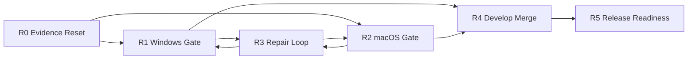

# Develop Merge And Release Readiness Plan

> Status: CLOSED FOR NATIVE REPLACEMENT LANE / HISTORICAL DEVELOP-MERGE PLAN.
> Closure date: 2026-05-31.
> Date: 2026-05-22.
> Branch baseline: `integration/platform-convergence-next` at `96d781c`.
> Native successor: `docs/superpowers/plans/2026-05-31-native-openconnect-replacement-phase3-production-readiness.md`.
> Closure summary: Native production transport, packaging, documentation, manual acceptance, and clean-room/security release readiness moved to the Phase 3 production readiness plan.
> Supersedes:
> - `docs/superpowers/plans/2026-05-21-develop-merge-validation-and-release-hardening.md`
> - `docs/superpowers/plans/2026-05-21-platform-convergence-next-stage.md`
> - `docs/superpowers/plans/2026-05-19-windows-macos-merge-finalization.md`
> - `docs/superpowers/plans/2026-05-17-windows-desktop-full-ui-closure.md`
> - `docs/superpowers/plans/2026-05-17-macos-desktop-full-ui-closure.md`
> - `docs/superpowers/plans/2026-05-08-cross-platform-convergence.md`

## 1. Completion Review And Stage Goal

### Current Verified State

The integration branch is structurally ready for the final `develop` gate, but it is not yet functionally cleared for merge.

Repository facts verified on 2026-05-22:

- Local branch: `integration/platform-convergence-next`.
- Local worktree: clean.
- Local worktree count: one tracked worktree.
- `windows` is an ancestor of `integration/platform-convergence-next`.
- `macos` is an ancestor of `integration/platform-convergence-next`.
- `git merge-tree --write-tree --messages --name-only develop integration/platform-convergence-next` returns a tree id and no conflict paths.
- `git ls-files | rg "sync-conflict|rehearsal"` returns no tracked artifact paths.
- Integration diff against `develop` currently touches 136 files.

Completed and accepted:

- Platform convergence architecture landed on `integration/platform-convergence-next`.
- G0/G1 audit records exist under `docs/merge-playbooks/`.
- macOS automated validation record exists and reports native build, 5 focused tests, webui build, and Electron build passing.
- Previous planning cleanup commit `96d781c` added the first develop merge validation gate.

Not accepted as complete:

- Windows automated validation from current integration head is still missing.
- Windows administrator GUI service install/connect/disconnect/uninstall validation is still missing.
- macOS real VPN helper-installed connect/disconnect validation is still missing.
- macOS helper-missing one-time elevated connect/disconnect validation is still missing.
- Remote OMC team `ecnu-vpn-develop-merge-validat` is still in planning/pending state and has produced no validation evidence.
- The macOS G3 validation note says G4 can proceed based on automated macOS validation; that recommendation is superseded by this plan and is not sufficient for `develop`.

### Overall Goal

Merge `integration/platform-convergence-next` into `develop` only after the cross-platform functional gate is proven, then transition immediately into release-readiness hardening without mixing release-only work into the merge gate.

The next stage has two explicit gates:

1. `develop` merge gate: prove the integration branch is safe to merge.
2. release readiness gate: prove packaged desktop apps are ready for real user distribution.

### Stage Exit Criteria

This stage is complete when:

- `develop` contains the validated integration branch.
- Windows and macOS develop-blocker validations are recorded in the merge playbook.
- Any develop-blocker repair is committed on integration first, then retested.
- No direct runtime repair is made on `develop`.
- Release-only items are moved into a separate release hardening queue after the merge.
- Old planning documents clearly point to this plan as the active successor.

## 2. Level 1 Overview

| Workstream | Purpose | Output | Parallelizable |
|---|---|---|---|
| R0. Evidence Reset | Replace stale plan state with one active checklist | Updated playbook and closed old plans | No |
| R1. Windows Develop Gate | Prove Windows integration branch behavior | Windows automated and manual evidence | Yes, with R2 |
| R2. macOS Develop Gate | Prove macOS integration branch behavior | macOS automated and manual evidence | Yes, with R1 |
| R3. Targeted Repair Loop | Fix only reproduced develop-blockers | Small repair commits plus retest evidence | Conditional |
| R4. Develop Merge | Merge integration into `develop` safely | Local merge commit and smoke evidence | No |
| R5. Release Readiness Backlog | Separate post-merge release work from merge gate | Release hardening plan or issue list | Partly |

Dependency graph:



## 3. Detailed Task Plan

### R0. Evidence Reset

Objective: remove ambiguity from stale plans and remote team state before any merge decision.

#### R0.1 Close Old Planning Documents

Owner: integration lead

Actions:

- Mark all superseded plans listed in this document header as closed or historical.
- Keep the old plans for traceability; do not delete them.
- Ensure each closed plan says active execution moved here.

Acceptance criteria:

- No old plan presents itself as active.
- Any unchecked old task appears either in this plan or in the future release hardening queue.

#### R0.2 Refresh Merge Playbook Handoff

Owner: integration lead

Actions:

- Update `docs/merge-playbooks/windows-macos-merge.md`.
- Record current branch heads and the `develop` merge-tree result.
- Record that the remote OMC team has no completed validation evidence.
- Replace the old "proceed based on macOS automated validation" language with the stricter dual-platform gate.

Acceptance criteria:

- A reviewer can determine the current merge decision from the playbook alone.
- The playbook distinguishes evidence from claims.

#### R0.3 Remote Coordination Reset

Owner: integration lead

Actions:

- Inspect `omc team status ecnu-vpn-develop-merge-validat` on macmini.
- If tasks are still pending and no work has started, either shut the team down or relaunch it with a clean task slate.
- Do not use the remote dirty worktree as validation evidence unless its exact diff and branch state are recorded.

Acceptance criteria:

- Remote team status is one of: `completed with evidence`, `shut down as unused`, or `pending and not counted`.
- No validation gate depends on unverified remote team output.

### R1. Windows Develop Gate

Objective: prove that the current integration head still preserves the working Windows helper, service, package, and UI behavior.

#### R1.1 Windows Automated Validation

Owner: Windows validation lane

Commands:

```powershell
cd "D:\Development\Projects\cpp\ECNU-VPN"
git switch integration/platform-convergence-next
git status --short --branch

powershell -ExecutionPolicy Bypass -File ".\scripts\validate-merge-prep-windows.ps1"

cd "D:\Development\Projects\cpp\ECNU-VPN\webui"
npm run build
npm run build:electron
npm run desktop:build
```

Acceptance criteria:

- Native build passes.
- Focused C++ tests pass.
- Web build passes.
- Electron TypeScript build passes.
- Desktop package build passes.
- The package includes `exv.exe`, `exv-helper.exe`, MinGW runtime DLLs, OpenConnect runtime assets, and `wintun.dll`.

#### R1.2 Windows Administrator GUI Service Path

Owner: Windows validation lane

Scenarios:

- Start the desktop app from an Administrator PowerShell using integration branch output.
- Install helper service through the UI.
- Confirm UI reports installed/running/available.
- Confirm CLI and desktop RPC agree:

```powershell
cd "D:\Development\Projects\cpp\ECNU-VPN"
.\build\windows\cpp\exv.exe service status
.\build\windows\cpp\exv.exe desktop-rpc service.status "{}"
```

- Save auth settings.
- Connect through helper.
- Disconnect through helper.
- Uninstall service through the UI.
- Confirm UI refreshes to uninstalled/not running/not available.

Acceptance criteria:

- No helper-unavailable error when service is available.
- No false uninstall-incomplete state after SCM settles.
- No IPC clone error when saving settings.
- Button state and status state settle correctly after connect/disconnect.

#### R1.3 Windows Package Runtime Inspection

Owner: build/package lane

Actions:

- Run packaged `exv.exe desktop-rpc runtime.status "{}"`.
- Confirm the packaged UI uses bundled runtime paths without `EXV_PATH` or `ECNUVPN_RUNTIME_DIR`.
- Confirm `resources/bin` is not an old release copy.

Acceptance criteria:

- Packaged runtime status shows bundled OpenConnect and driver assets.
- No manual DLL copy is required.

#### R1.4 Windows Release-Only Fallback Matrix

Owner: Windows release validation lane

Classification: release-blocker, unless the service path fails.

Scenarios:

- Normal-user no-service one-time elevated connect.
- UAC denial.
- Runtime missing.
- Driver missing.
- Portable vs installer first launch.

Acceptance criteria:

- Each scenario has a pass/fail record before public release.
- Failure here does not block `develop` unless it affects the service-first path.

### R2. macOS Develop Gate

Objective: prove that macOS real VPN workflows still work after integration.

Execution note (2026-05-26): the current cleanup is running from a Windows workspace. R2.2 and R2.3 cannot be truthfully completed here; they must be recorded from a macOS machine with branch/commit, commands, and manual scenario results.

#### R2.1 macOS Automated Recheck

Owner: macOS validation lane

Commands:

```bash
cd /Users/tomli/Development/Projects/CPP/ECNU-VPN
git switch integration/platform-convergence-next
git status --short --branch
./scripts/validate-merge-prep-macos.sh

cd webui
npm run build
npm run build:electron
npm run desktop:build
```

Acceptance criteria:

- Native build passes.
- 5 focused tests pass.
- Web build passes.
- Electron build passes.
- Desktop package build passes.

#### R2.2 macOS Helper-Installed Functional Path

Owner: macOS validation lane

Scenarios:

- Install launchd helper from UI.
- Confirm service page installed/running/available state.
- Connect using real credentials.
- Confirm tunnel/network route readiness.
- Disconnect.
- Confirm no stale OpenConnect process and no stale campus route.

Acceptance criteria:

- Helper-installed connect and disconnect both pass.
- UI service status agrees with CLI/RPC status.
- Config file ownership remains correct for the logged-in user.

#### R2.3 macOS Helper-Missing One-Time Path

Owner: macOS validation lane

Scenarios:

- Uninstall helper.
- Launch UI as normal user.
- Choose one-time elevated connect.
- Accept the `osascript` administrator prompt.
- Confirm connection succeeds.
- Disconnect the elevated session.
- Repeat and cancel the prompt.

Acceptance criteria:

- One-time elevated connect passes.
- One-time elevated disconnect passes.
- Cancel path reports a structured cancellation/error state.
- No `Killed: 9` runtime signing/quarantine failure appears.

#### R2.4 macOS Package Runtime Check

Owner: build/package lane

Actions:

- Verify staged OpenConnect and dylib signing after `desktop:build`.
- Launch the `.app` from the packaged output, not only dev mode.
- Confirm the packaged app uses bundled runtime assets.

Acceptance criteria:

- Packaged `.app` can run the desktop native path.
- Runtime is not dependent on Homebrew paths.

### R3. Targeted Repair Loop

Objective: repair only failures that block R1 or R2.

#### R3.1 Failure Intake

Owner: integration lead

Actions:

- Record failure command, environment, and observed output.
- Classify owner:
  - native lifecycle;
  - platform adapter;
  - desktop contract;
  - build/package;
  - docs only.
- Classify severity:
  - develop-blocker;
  - release-blocker;
  - post-merge hardening.

Acceptance criteria:

- No repair starts without a reproduced failure.
- Severity is explicit before code changes.

#### R3.2 Repair Commit Discipline

Owner: assigned lane

Actions:

- Patch the smallest owner module.
- Avoid opportunistic refactors.
- Retest the exact failing scenario.
- Rerun the affected platform gate.

Acceptance criteria:

- Commit message starts with `repair:`.
- Merge playbook includes before/after evidence.
- Any shared contract change triggers both Windows and macOS revalidation.

#### R3.3 Known Hardening Debt

Owner: post-merge hardening lane

Items migrated from old plans:

- Move small `runtime_status.cpp` platform `#ifdef` branches behind platform-specific helpers if they become a conflict source.
- Replace renderer fallback string matching for `elevation_denied` with a structured fallback path.
- Clean mojibake/encoding artifacts in historical audit and closure documents.
- Finish Windows no-service elevated fallback release matrix.
- Finish Windows Wintun/TAP readiness and portable-vs-installer parity.
- Finish macOS `.app`/DMG runtime verification.
- Revisit Linux-specific items from the 2026-05-08 convergence plan after Windows/macOS merge is stable.

Acceptance criteria:

- None of these are treated as develop-blockers unless they fail R1/R2.
- Each item is either closed in release readiness or moved to a dedicated issue/plan.

### R4. Develop Merge Gate

Objective: merge the integration branch into `develop` safely and reversibly.

#### R4.1 Pre-Merge Checklist

Owner: integration lead

Required evidence:

- R1.1 passed.
- R1.2 passed.
- R2.1 passed.
- R2.2 passed.
- R2.3 passed.
- All develop-blocker repairs are retested.
- `git merge-tree --write-tree --messages --name-only develop integration/platform-convergence-next` still reports no conflict paths.

Acceptance criteria:

- Checklist is recorded in `docs/merge-playbooks/windows-macos-merge.md`.
- Any missing evidence is explicitly accepted by the user before merge.

#### R4.2 Local Merge

Owner: integration lead

Commands:

```powershell
cd "D:\Development\Projects\cpp\ECNU-VPN"
git switch develop
git merge --no-ff integration/platform-convergence-next
```

Acceptance criteria:

- Merge completes locally.
- Working tree is clean after merge.
- No runtime repair is made directly on `develop`.

#### R4.3 Post-Merge Smoke

Owner: integration lead plus Windows validation lane

Commands:

```powershell
cd "D:\Development\Projects\cpp\ECNU-VPN"
powershell -ExecutionPolicy Bypass -File ".\scripts\validate-merge-prep-windows.ps1"
```

Acceptance criteria:

- Post-merge smoke passes.
- If it fails, the local merge is reverted before pushing and repair returns to integration.

### R5. Release Readiness Backlog

Objective: separate public release work from the develop merge gate.

#### R5.1 Create Release Hardening Queue

Owner: release lead

Actions:

- Create a follow-up release hardening plan after develop merge.
- Migrate release-only tasks from old Windows/macOS closure plans.
- Add CI and packaging work that should not block the integration merge.

Acceptance criteria:

- Release-only tasks are not lost.
- The merge gate stays focused on regressions and functional blockers.

#### R5.2 Minimum Release Hardening Scope

Owner: release lead

Items:

- Windows portable and installer parity.
- Windows driver/runtime readiness workflow.
- Windows no-service elevated fallback.
- macOS packaged `.app` and DMG launch.
- macOS helper-installed and helper-missing packaged scenarios.
- GitHub Actions or equivalent reproducible CI.
- README/user guide cleanup for desktop-first workflow.
- Historical document encoding cleanup.

Acceptance criteria:

- Each item has an owner, validation command, and pass/fail criterion.

## 4. Multi-Agent Collaboration Model

### Lanes

| Lane | Responsibility | Write scope | Parallelism |
|---|---|---|---|
| Integration Lead | R0, R3 intake, R4 merge, playbook updates | docs and merge commits | Serial gates |
| Windows Validation | R1.1-R1.3 | evidence only unless assigned repair | Parallel with macOS |
| macOS Validation | R2.1-R2.4 | evidence only unless assigned repair | Parallel with Windows |
| Native Repair | R3 native/platform fixes | `src/**`, focused tests | Parallel if files disjoint |
| Desktop Repair | R3 desktop contract/UI fixes | `webui/desktop/**`, `webui/src/**` | Parallel if contract unchanged |
| Build Package Repair | R3 build/package fixes | CMake, scripts, package config | Parallel with native/UI if disjoint |
| Release Lead | R5 release queue | docs and release checklist | Can draft during validation |

### Sequencing

1. R0 must complete first.
2. R1 and R2 run in parallel.
3. R3 runs only if R1/R2 produce a failure.
4. Any R3 repair sends control back to the affected R1/R2 gate.
5. R4 starts only after develop-blocker evidence is complete.
6. R5 begins after R4, except release backlog drafting may happen in parallel.

### Cross-Lane Blocking Rules

- Any change to `webui/desktop/shared/desktop-contract.ts` blocks both platform validation lanes until revalidated.
- Any change to `src/vpn_runtime.cpp`, process-control adapters, or helper lifecycle blocks connect/disconnect manual gates on both platforms.
- Any packaging script change blocks package runtime checks on both platforms.
- A dirty remote worktree cannot serve as validation evidence unless its diff is recorded.
- A pending OMC team task is not evidence.

### Handoff Requirements

Every lane must report:

- branch and commit hash;
- exact commands run;
- manual scenarios run;
- pass/fail result;
- changed files, if any;
- retest command;
- remaining risk;
- whether the risk blocks `develop` or only release.

## 5. Migrated Work From Closed Plans

| Source plan | Item | New location | Gate |
|---|---|---|---|
| 2026-05-21 develop merge validation | Windows automated/manual validation | R1.1-R1.3 | develop-blocker |
| 2026-05-21 develop merge validation | macOS manual functional validation | R2.2-R2.3 | develop-blocker |
| 2026-05-21 develop merge validation | final merge gate | R4 | develop-blocker |
| 2026-05-21 platform convergence | audit and conflict cleanup | R0 evidence reset | closed unless new failure appears |
| 2026-05-19 merge finalization | residual cleanup trigger | R3.1-R3.3 | conditional |
| 2026-05-17 Windows UI closure | service-first path and GUI-only validation | R1.2, R1.4, R5.2 | service path develop-blocker; fallback release-blocker |
| 2026-05-17 Windows UI closure | runtime/driver readiness and portable/installer parity | R5.2 | release-blocker |
| 2026-05-17 macOS UI closure | helper-installed and helper-missing GUI paths | R2.2-R2.3 | develop-blocker |
| 2026-05-17 macOS UI closure | route cleanup and package/DMG verification | R2.2, R2.4, R5.2 | route cleanup develop-blocker; package release-blocker |
| 2026-05-08 cross-platform convergence | Linux completion and CI | R5.2 follow-up | post-merge hardening |

## 6. Done Definition

This stage is done when:

- old plans are closed and point here;
- playbook has the 2026-05-22 handoff;
- Windows develop-blocker validation passes;
- macOS develop-blocker validation passes;
- all develop-blocker repairs are retested;
- integration is merged locally into `develop`;
- post-merge smoke passes;
- release readiness backlog is created for work that should not block `develop`.
