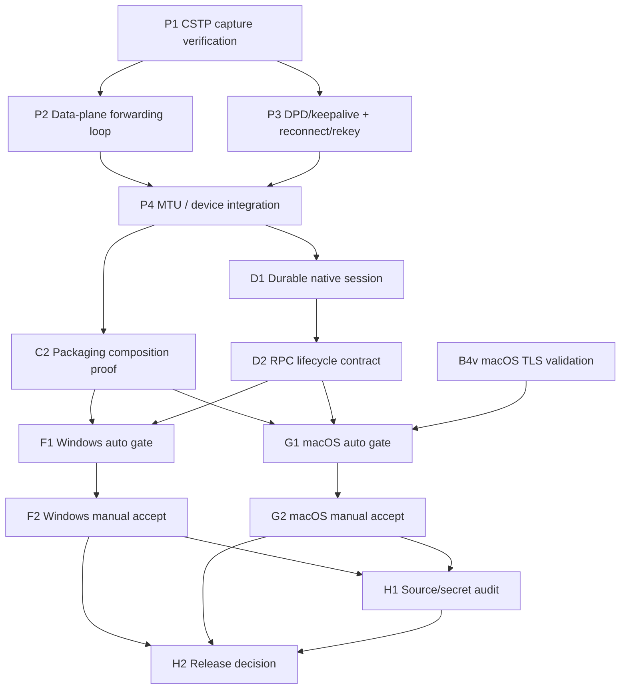

# Native OpenConnect Extraction & Completion Plan (v4)

> **For agentic workers:** REQUIRED SUB-SKILL: Use `superpowers:subagent-driven-development` or `superpowers:executing-plans` to implement this plan task by task. Steps use checkbox (`- [ ]`) syntax for tracking.
> Status: ACTIVE — this is the single authoritative execution plan for the native OpenConnect extraction effort.
> Date: 2026-05-31.
> Supersedes (for active execution; kept as historical input):
> - `docs/superpowers/plans/2026-05-31-native-openconnect-replacement-phase3-production-readiness.md`
> - the Phase 2 plans referenced therein.

---

## 0. Mission Statement

**Overall goal.** Fully absorb the OpenConnect processing logic that ECNU-VPN actually needs — AnyConnect-compatible **authentication**, **CSTP/TLS protocol handling**, and **traffic forwarding (data plane)** — into our own clean-room library so the shipped product **no longer depends on any external OpenConnect runtime, libopenconnect, or GnuTLS staging**. OpenConnect remains only a behavioral compatibility reference and an optional development-only diagnostic fallback.

This plan covers **only the work that is not yet complete**. It re-plans that remaining work as: a single top-level mission, a one-level workstream overview, and a finer layer of concrete, bounded, independently verifiable tasks, with explicit dependency / ordering / parallelism analysis for a multi-agent team.

### 0.1 Clean-Room Rule (binding)

Final product code MUST NOT copy OpenConnect-derived source, comments, state-machine layout, parser structure, or constant tables. Allowed inputs:

- Redacted traces from our own ECNU sessions.
- Public protocol descriptions.
- Existing repository behavior and tests.
- OpenConnect as a behavioral compatibility reference only.

Any subagent that finds itself needing to read OpenConnect source to proceed MUST stop and escalate to the coordinator. Clean-room compliance is a release gate (Workstream H).

### 0.2 Native v1 Scope (unchanged, restated for boundary clarity)

In scope: ECNU username/password AnyConnect auth; CSTP over TCP/TLS; IPv4 tunnel address, MTU, split-include routes, server-bypass route; Windows Wintun + IP Helper; macOS utun + native routing; UTF-8 structured events and JSON session state.

Out of scope (must return a deterministic `unsupported_*` error, never a silent OpenConnect fallback): DTLS acceleration; arbitrary `extra_args`; SAML / browser / MFA / cert enrollment; non-AnyConnect protocols; Linux native replacement; removing the legacy OpenConnect fallback *source tree* before native production acceptance passes.

---

## 1. Current-State Assessment (Baseline For This Plan)

Verified against the workspace on 2026-05-31.

### 1.1 Already complete and accepted (do not redo)

- **Auth + protocol parsers** extracted: `src/vpn_engine/protocol/{url,http,auth,cstp,session}.*` exist with unit tests.
- **TLS stream boundary (B1)**: `src/vpn_engine/protocol/tls_stream.{hpp,cpp}` + contract test.
- **Production CSTP transport (B2)**: `src/vpn_engine/protocol/production_transport.{hpp,cpp}` implements `authenticate / connect_cstp / exchange_packet / disconnect / reset_for_reconnect`.
- **Windows Schannel TLS (B3)**: `src/platform/win32/native_tls_stream.{hpp,cpp}` + test.
- **Default dependency composition (C1)**: `default_native_engine_dependencies()` wires production transport + platform packet device; `NativeVpnEngineSession` runs a packet-loop thread.
- **Docs migration (E1)**: README/README_CN/user_guide/build_guide are native-first.
- Validation already run this wrap-up: `ctest --preset windows-release` 25/25, `npm run build`, `git diff --cached --check`, doc legacy-path scan, README NUL scan — all clean.

### 1.2 Implemented but NOT yet validated on real hardware/network

- **macOS TLS stream (B4)**: `src/platform/darwin/native_tls_stream.{hpp,cpp}` written + reviewed, but **no macOS build/CTest evidence**. Gate 2 cannot pass until macOS evidence is attached.

### 1.3 Open / not started (the work this plan schedules)

- **Protocol/data-plane extraction depth** — the transport's `exchange_packet` is a single request/response round-trip; continuous bidirectional forwarding, DPD/keepalive servicing, rekey/reconnect resilience, and MTU/fragment handling need verification against real ECNU captures and completion where missing. `native_transport_unimplemented()` and `reset_for_reconnect(){}` stubs still exist in code paths.
- **C2** — production packaging composition verification (no OpenConnect/GnuTLS staging in the release artifact).
- **D1** — durable native session under helper/supervisor (`native_session_not_durable` still returned in `src/helper.cpp` and `src/vpn.cpp`).
- **D2** — helper + desktop RPC native lifecycle contract.
- **F1/F2** — Windows automated release gate + manual native connect acceptance.
- **G1/G2** — macOS automated release gate + manual native connect acceptance.
- **H1/H2** — source/clean-room + secret-handling audit, and final native production release decision.

### 1.4 Out-of-band workspace hygiene (not part of any task's commit)

- Untracked local residue exists: `.agent-runs/` and several `*.sync-conflict-*` files. These are **historical/working residue**, are NOT execution inputs, and MUST NOT be committed by any task. The coordinator may clean them separately.

---

## 2. One-Level Workstream Overview

| WS | Name | Purpose | Primary output | Depends on |
|---|---|---|---|---|
| **P** | Protocol & Data-Plane Extraction Completion | Finish absorbing OpenConnect's runtime behavior: verify CSTP wire framing against real captures; complete continuous forwarding, DPD/keepalive, rekey, reconnect, MTU handling | Production-grade transport + packet loop with regression tests | existing parsers/transport |
| **B4v** | macOS TLS Validation | Produce real macOS build/CTest evidence for the existing macOS TLS stream | macOS Gate-2 evidence | macOS host |
| **C** | Default Composition & Packaging Proof | Prove the production package ships native-only (no OpenConnect/GnuTLS/libssl) | packaging policy + package scan evidence | P (transport stable), C1 (done) |
| **D** | Durable Native Session & RPC Contract | Make native sessions outlive the initiating call under helper/supervisor; align desktop/helper RPC lifecycle | durable session + lifecycle contract + tests | P, C |
| **F** | Windows Acceptance | Automated gate + manual native connect/disconnect without OpenConnect | Windows validation records | P, C, D |
| **G** | macOS Acceptance | Automated gate + manual native connect/disconnect without OpenConnect | macOS validation records | P, C, D, B4v |
| **H** | Security & Release Gate | Clean-room + secret-handling audit; final release decision | review docs + release decision | F, G |

---

## 3. Dependency Graph



---

## 4. Parallelism Analysis (Multi-Agent Lanes)

| Lane | Tasks | Can start when | Must NOT touch | Notes |
|---|---|---|---|---|
| **L1 Protocol** | P1 → P2/P3 → P4 | immediately | platform TLS files, helper/supervisor, docs | Owns `src/vpn_engine/protocol/**` + native packet loop in `native_engine.cpp`. P1 gates P2/P3. |
| **L2 macOS-TLS** | B4v | immediately (needs macOS host) | Windows files, protocol parsers | Pure validation lane; fully parallel to everything. |
| **L3 Packaging** | C2 | after P4 lands | `src/vpn_engine/protocol/**`, helper lifetime | Touches packaging scripts/tests only. |
| **L4 Lifecycle** | D1 → D2 | after P4 lands | protocol parsers, platform TLS | Owns helper/supervisor + RPC contract + desktop TS. D1 gates D2. |
| **L5 Win-Accept** | F1 → F2 | after C2 + D2 integrated beta | source code (evidence-only) | Needs Windows host + ECNU reachability for F2. |
| **L6 mac-Accept** | G1 → G2 | after C2 + D2 + B4v | source code (evidence-only) | Needs macOS host + ECNU reachability. |
| **L7 Security** | H1 → H2 | after F2 + G2 | feature code (review-only) | Final gate. |

**Coordination rules**

1. **P1 must publish a capture-verification verdict before P2/P3 implementation merges.** If real ECNU framing diverges from current `cstp.cpp` assumptions, P2/P3 absorb the fix; do not ship unverified framing.
2. B4v, L1, and the early design of L4 can run fully in parallel; L4 *implementation* waits for P4.
3. F2/G2 are blocked by external environment (credentials, ECNU network, signing). Record blockers explicitly rather than faking evidence.
4. No task commits `.agent-runs/` or `*.sync-conflict-*` files.

---

## 5. Detailed Task Plan

> Every task lists: **Meaning**, **Files (boundary)**, **Boundaries**, **Concrete behavior**, **Acceptance commands**, **Pass/fail acceptance**. Acceptance commands are run from repo root `D:\Development\Projects\cpp\ECNU-VPN` on Windows unless marked macOS.

### Workstream P — Protocol & Data-Plane Extraction Completion

#### Task P1: Verify CSTP Wire Framing Against Redacted ECNU Captures

- [x] DONE 2026-05-31. STF 8-byte CSTP header framing implemented/verified in `cstp.{cpp,hpp}`; byte-exact round-trip vectors for data/keepalive/dpd_request/dpd_response/disconnect + partial-read boundary; fixed a malformed fixture. 8/8 protocol tests pass. Verdict `framing-verified`. Evidence: `docs/architecture/cstp-wire-verification-2026-05-31.md`. Live-ECNU capture verification remains ENV-BLOCKED.

**Meaning:** De-risk the single biggest clean-room/correctness unknown: confirm our CSTP header/frame handling (`src/vpn_engine/protocol/cstp.*`) matches real ECNU AnyConnect wire bytes for data, keepalive, DPD request/response, and disconnect frames.

**Files:**
- Read-only: `src/vpn_engine/protocol/cstp.{hpp,cpp}`, `src/vpn_engine/protocol/production_transport.cpp`, `tests/fixtures/native_anyconnect/*`, `docs/architecture/native-anyconnect-clean-room-spec.md`
- Create/extend: `tests/native_cstp_frame_test.cpp` (add capture-derived vectors), `tests/fixtures/native_anyconnect/cstp-frames/*` (redacted vectors)
- Create: `docs/architecture/cstp-wire-verification-2026-05-31.md`

**Boundaries:** No copying OpenConnect source. Captures must be our own redacted ECNU sessions or synthetic vectors derived from public protocol description. Do not change transport behavior in this task beyond what a failing vector forces — defer behavior changes to P2/P3.

**Concrete behavior:**
- Add byte-exact test vectors for each `CstpFrameType` (data, keepalive, dpd_request, dpd_response, disconnect) covering header length fields and at least one fragmented/partial-read boundary.
- Document any divergence between observed bytes and current parser assumptions in the verification doc with a remediation pointer to P2/P3.

**Acceptance commands:**
```powershell
cmake --build --preset windows-release --target native_cstp_frame_test
ctest --preset windows-release -R native_cstp_frame_test --output-on-failure
```

**Pass/fail acceptance:**
- Frame parse/serialize round-trips pass for all five frame types and the partial-read case.
- Verification doc states an explicit verdict: `framing-verified` or `framing-divergence` with a list of items handed to P2/P3.
- No OpenConnect source referenced.

#### Task P2: Continuous Bidirectional Data-Plane Forwarding Loop

- [x] DONE 2026-05-31. Full-duplex two-thread forwarding model (inbound drain thread `receive_frame`->`device.write_packet`; outbound caller thread non-blocking `device.read_packet`->`send_packet`) with a reason state machine and single-owner device close; win32 `NativeTlsStream` hardened against close/recv UAF. Full suite 25/25. Evidence: `docs/architecture/dataplane-forwarding-2026-05-31.md`. Live concurrent-TLS validation remains ENV-BLOCKED.

**Meaning:** Replace any single round-trip assumption with a real production forwarding loop: read inbound CSTP frames continuously, write them to the packet device; read outbound IP packets from the device, frame and write to the TLS stream — until cancel/disconnect/error.

**Files:**
- Modify: `src/vpn_engine/protocol/production_transport.{hpp,cpp}` (streaming read/write of multiple frames per cycle, separate inbound/outbound paths)
- Modify: `src/vpn_engine/native_engine.cpp` (packet-loop thread body)
- Read-only: `src/vpn_engine/packet_device.hpp`
- Test: `tests/native_production_transport_test.cpp`, `tests/native_engine_contract_test.cpp`

**Boundaries:** Uses `TlsStream` + existing parsers + `PacketDevice` only. No OS TLS instantiation. No DTLS, no `extra_args`. Do not change helper/supervisor lifetime (that is D1).

**Concrete behavior:**
- Inbound: drain all complete CSTP frames available in the read buffer per cycle; route `data` frames to the packet device; service control frames per P3.
- Outbound: read available IP packets from the device, serialize as CSTP data frames, write to stream.
- Loop honors a cooperative cancel flag; on error sets a stable error code and exits cleanly (no leaked socket/device).
- Password/cookie never appear in emitted events.

**Acceptance commands:**
```powershell
cmake --build --preset windows-release --target native_production_transport_test native_engine_contract_test native_protocol_session_test
ctest --preset windows-release -R "native_production_transport_test|native_engine_contract_test|native_protocol_session_test" --output-on-failure
```

**Pass/fail acceptance:**
- Mock-stream/mock-device tests prove multi-frame inbound drain, multi-packet outbound, EOF mid-stream, error-exit cleanup, and cancel-safe shutdown.
- No credential/cookie leakage in events.
- DTLS and `extra_args` still rejected deterministically.

#### Task P3: DPD / Keepalive Servicing + Reconnect & Rekey

- [x] DONE 2026-05-31 (mock-level; live DPD timing ENV-BLOCKED). Inbound DPD request→response servicing always-on; poll-count gated keepalive/DPD-probe + dead-peer detection (options default 0/off); reconnect/exhaustion proven. `native_protocol_session_test|native_production_transport_test` green; full suite 25/25.

**Meaning:** Implement the liveness/resilience behavior OpenConnect provides: answer DPD requests, send keepalives/DPD on idle, detect dead peer, and drive a clean reconnect (re-auth) path. Removes the `reset_for_reconnect(){}` stub being a no-op where reconnect is expected.

**Files:**
- Modify: `src/vpn_engine/protocol/production_transport.{hpp,cpp}` (`reset_for_reconnect`, control-frame handling)
- Modify: `src/vpn_engine/protocol/session.{hpp,cpp}` (reconnect/DPD policy wiring)
- Modify: `src/vpn_engine/native_engine.cpp` (reconnect orchestration, phase transitions to `reconnecting`)
- Test: `tests/native_protocol_session_test.cpp`, `tests/native_production_transport_test.cpp`

**Boundaries:** No OpenConnect source. Reconnect bounded by `max_reconnects` policy already in options. Do not alter packaging or helper lifetime.

**Concrete behavior:**
- On inbound `dpd_request`, send `dpd_response`. On idle timer, send keepalive/DPD; if no response within policy, mark dead and trigger reconnect.
- `reset_for_reconnect()` closes the stream, clears cookies, and allows `authenticate()` to run again.
- Reconnect transitions session phase to `reconnecting`, re-auths, re-connects CSTP, and resumes forwarding; on exceeding `max_reconnects`, fail with a stable code.

**Acceptance commands:**
```powershell
cmake --build --preset windows-release --target native_protocol_session_test native_production_transport_test
ctest --preset windows-release -R "native_protocol_session_test|native_production_transport_test" --output-on-failure
```

**Pass/fail acceptance:**
- Tests prove DPD request→response, idle keepalive emission, dead-peer detection, successful reconnect, and reconnect-exhaustion failure code.
- Phase reaches `reconnecting` then `connected` on a simulated drop, or fails deterministically.

#### Task P4: MTU & Packet-Device Integration Hardening

- [x] DONE 2026-05-31. MTU/routes/server-bypass flow via TunnelMetadata into `device->open`; defensive MTU fallback (`mtu_fallback`, default 1290) at the session seam for out-of-range values. `native_engine_contract_test|win32_native_ip_config_test|win32_native_packet_device_test` green; full suite 25/25.

**Meaning:** Ensure tunnel MTU, split-include routes, and server-bypass route negotiated in `TunnelMetadata` are honored end-to-end between transport and the platform packet device, with correct framing sizes.

**Files:**
- Modify: `src/vpn_engine/native_engine.cpp` (apply MTU/routes from metadata to device config)
- Read-only: `src/platform/win32/native_packet_device.*`, `src/platform/win32/native_ip_config.*`, `src/platform/darwin/native_packet_device.*`, `src/platform/darwin/native_route_config.*`
- Test: `tests/native_engine_contract_test.cpp`

**Boundaries:** Do not change platform device implementations beyond config plumbing already exposed. No OS-specific networking inside shared `vpn_engine` files (keep platform logic in `src/platform/**`).

**Concrete behavior:**
- MTU from `TunnelMetadata` is passed to the packet-device configure call; outbound frames respect it.
- Split-include routes and server-bypass route from metadata are applied via the platform IP/route config factory.
- Missing/invalid MTU falls back to a documented safe default, not a crash.

**Acceptance commands:**
```powershell
cmake --build --preset windows-release --target native_engine_contract_test win32_native_ip_config_test win32_native_packet_device_test
ctest --preset windows-release -R "native_engine_contract_test|win32_native_ip_config_test|win32_native_packet_device_test" --output-on-failure
```

**Pass/fail acceptance:**
- Contract test proves MTU + routes from metadata reach the device/IP-config factory with expected values.
- No platform headers leak into `src/vpn_engine/**`.

### Workstream B4v — macOS TLS Validation

#### Task B4v: Validate Existing macOS TLS Stream On A Real macOS Host

- [x] DONE 2026-05-31. Executed on real macOS host (macmini, macOS 26.3.1, arm64) via the `macos-release` preset. Fixed a latest-SDK build break (`SYSPROTO_CONTROL`/`AF_SYS_CONTROL` no longer transitively exposed by `<sys/kern_control.h>`) by adding `#include <sys/sys_domain.h>` to `src/platform/darwin/native_utun.cpp`. Build 100%; full suite 25/25 including `darwin_native_tls_stream_test` (and utun/route/packet_device). Evidence: `docs/validation/native-macos-automated-2026-05-31.md`.

**Meaning:** Close the partial B4 by attaching real macOS build/CTest evidence for `src/platform/darwin/native_tls_stream.*`.

**Files:**
- Read-only: `src/platform/darwin/native_tls_stream.{hpp,cpp}`, `tests/darwin_native_tls_stream_test.cpp`
- Create: `docs/validation/native-macos-tls-2026-05-31.md`

**Boundaries:** Evidence-only. If the test reveals a defect, the fix goes back into B4's source under L2, then re-validate.

**Acceptance commands (macOS host):**
```bash
cmake --preset macos-release
cmake --build --preset macos-release --target darwin_native_tls_stream_test
ctest --preset macos-release -R darwin_native_tls_stream_test --output-on-failure
```

**Pass/fail acceptance:**
- Build + ctest exit 0 on a real macOS host; output attached to the validation doc.
- Covers success, connect failure, TLS verify failure, partial read, EOF, idempotent close.
- No Homebrew/staged OpenConnect, libopenconnect, or GnuTLS required.
- **Windows note:** cannot be produced on the Windows machine; remains blocked with that explicit blocker until a macOS host runs it.

### Workstream C — Packaging Composition Proof

#### Task C2: Verify Production Packaging Excludes OpenConnect/GnuTLS

- [x] DONE 2026-05-31. `native_packaging_policy_test` passes (static policy: no OpenConnect/GnuTLS in production staging; legacy refs gated behind `ECNUVPN_LEGACY_OPENCONNECT_RUNTIME=1`). `npm run desktop:build` exits 0 producing NSIS + portable + unpacked. Forbidden-asset scan (`openconnect*`/`libopenconnect*`/`*gnutls*`/`libssl*`/`libcrypto*`) over `win-unpacked` returns nothing. Package `resources\bin` contains exactly `exv.exe`, `exv-helper.exe`, the three MinGW runtime DLLs (`libgcc_s_seh-1.dll`, `libstdc++-6.dll`, `libwinpthread-1.dll`), and `wintun.dll`. Evidence: `docs/validation/native-packaging-composition-2026-05-31.md`. (Note: first build attempt blocked by a stale elevated `exv-helper.exe` lock on the prior output dir; renamed aside and re-run cleanly.)

**Meaning:** Prove the built desktop package contains native binaries + native runtime assets only, with no OpenConnect/GnuTLS/libssl/libcrypto production payload.

**Files:**
- Modify only if needed: `tests/native_packaging_policy_test.cpp`, `webui/scripts/prepare-native.cjs`, `webui/electron-builder.config.cjs`, `runtime/README.md`
- Create: `docs/validation/native-packaging-composition-2026-05-31.md`

**Boundaries:** Do not reintroduce OpenConnect staging into production paths. Legacy diagnostic staging stays behind `ECNUVPN_LEGACY_OPENCONNECT_RUNTIME=1`.

**Acceptance commands:**
```powershell
cmake --build --preset windows-release --target native_packaging_policy_test
ctest --preset windows-release -R native_packaging_policy_test --output-on-failure
cd webui
npm run desktop:build
cd ..
Get-ChildItem -Recurse webui\release -Include "openconnect*","libopenconnect*","*gnutls*","libssl*","libcrypto*" | Select-Object FullName
Get-ChildItem -Recurse webui\release -Include "exv.exe","exv-helper.exe","wintun.dll" | Select-Object FullName
```

**Pass/fail acceptance:**
- Policy test passes; `npm run desktop:build` exits 0.
- Forbidden-asset scan prints nothing.
- Package contains `exv.exe`, `exv-helper.exe`, required MinGW runtime DLLs, and `wintun.dll`.

### Workstream D — Durable Native Session & RPC Contract

#### Task D1: Make Native Sessions Durable Under Helper/Supervisor

- [x] DONE 2026-05-31. Added `run_native_supervisor` in `src/vpn.cpp` as the durable owner that hosts `NativeVpnEngineSession` for the process lifetime (records itself as `supervisor_pid` in `native-session-state.json`, monitors until session stop or stop-signal, reconnects up to `retry_limit`). Routed `run_supervisor` to dispatch native engine configs to it (covers POSIX fork+entry-point and Windows `__vpn-supervisor` stdin paths). Replaced the `start_with_password` native branch rejection with a supervisor spawn (`platform::spawn_vpn_supervisor_process(..., run_supervisor, &pid)` + `write_supervisor_pid`), then polls `read_native_session_snapshot` for network-ready. Removed the `native_session_not_durable` guard in `src/helper.cpp` `handle_start()` so the helper worker drives the supervisor spawn. `native_session_not_durable` no longer exists in `src/`/`tests/`. Store contract (durable supervisor-only owner ⇒ running + network_ready from JSON; stale ⇒ stopped) already covered by `native_helper_session_test`. Full suite 25/25. Live supervisor-owned tunnel establishment remains ENV-BLOCKED (no Wintun/admin/credentials on this host).

**Meaning:** Remove `native_session_not_durable` from the success path; a helper/supervisor-owned native session must outlive the initiating CLI/RPC call and own the full lifecycle.

**Files:**
- Modify: `src/vpn.cpp`, `src/helper.cpp`, `src/vpn_engine/native_session_store.{hpp,cpp}`
- Modify if needed: `src/platform/common/vpn_supervisor_process.*`, `src/platform/win32/vpn_supervisor_process.cpp`, `src/platform/darwin/vpn_supervisor_process.cpp`
- Test: `tests/native_helper_session_test.cpp`, `tests/vpn_runtime_test.cpp`

**Boundaries:** Do not redesign helper privilege architecture. No fallback to legacy OpenConnect. Do not use `route-ready` as native primary readiness.

**Concrete behavior:**
- Helper-managed native connect starts a durable owner (process or helper-owned session) holding `NativeVpnEngineSession` until disconnect/failure/shutdown.
- Native state records durable owner PID, supervisor PID (if any), phase, interface, internal IP, MTU, routes, last error.
- Stop/disconnect cancels the packet loop, closes transport + device, removes owned routes, clears native state.
- Stale/crashed owner PID marks state stopped and never reports `network_ready=true`.

**Acceptance commands:**
```powershell
cmake --build --preset windows-release --target native_helper_session_test vpn_runtime_test
ctest --preset windows-release -R "native_helper_session_test|vpn_runtime_test" --output-on-failure
```

**Pass/fail acceptance:**
- Native status is sourced from `native-session-state.json`.
- `pid`/`supervisor_pid` points to a live managed owner, not an OpenConnect process.
- Stale owner PID clears running + network-ready.
- `native_session_not_durable` no longer returned on the success path.

#### Task D2: Helper & Desktop RPC Native Lifecycle Contract

- [x] DONE 2026-05-31. Added `src/vpn_engine/native_error_contract.hpp` with `map_native_error_to_contract_code()` (maps internal native codes/messages to the canonical contract set `tls_verify_failed` / `wintun_missing` / `utun_permission_denied` / `auth_failed` / `unsupported_dtls`). Extended `NativeSessionSnapshot` with `failure_code`/`failure_message`, populated from session state in `read_native_session_snapshot`. `helper.cpp::handle_start` native failure tail now reads the native snapshot's failure code/message, maps it to the canonical contract code, and returns it via `make_error`. Frontend: added the four new codes to `desktopRpcErrorCodes`, `VpnErrorType` (both `webui/src/stores/vpn.ts` and `webui/src/types/ecnu-vpn.d.ts`), generalized `normalizeError` with a `nativeErrorContractMap` covering all five canonical `code` values, and added `errorPresentation` cases. New unit test `test_native_error_codes_map_to_contract_codes` in `tests/native_helper_session_test.cpp`. Validated: targeted ctest (runtime_status_native_test, native_helper_session_test, app_api_runtime_policy_test) green; full suite 25/25; `npm run build` + `npm run build:electron` pass. Live native-failure surfacing remains ENV-BLOCKED (no Wintun/admin/credentials on host).

**Meaning:** Make desktop connect/disconnect/status behave identically for native and legacy sessions while hiding OpenConnect assumptions from native users.

**Files:**
- Modify: `src/app_api.cpp`, `src/vpn_runtime.cpp`, `src/helper.cpp`
- Modify: `webui/desktop/shared/desktop-contract.ts`, `webui/desktop/preload/index.ts`, `webui/src/stores/vpn.ts`, `webui/src/types/ecnu-vpn.d.ts`
- Test: `tests/app_api_runtime_policy_test.cpp`, `tests/runtime_status_native_test.cpp`
- Frontend build: `webui`

**Boundaries:** No arbitrary native `extra_args`. No OpenConnect install requirement shown for native. Keep shared desktop-contract namespaces (`service`/`runtime`/`drivers`) per repo convention.

**Concrete behavior:**
- `runtime.status` in native mode reports `engine=native`, `available=true`, native dependency readiness.
- Missing Wintun / macOS permission failures reported as native dependency errors.
- `legacy_openconnect` stays diagnostic-only, not the production availability source.
- Desktop connect waits for `network_ready` from native state or returns a structured native failure distinguishing `tls_verify_failed`, `wintun_missing`, `utun_permission_denied`, `auth_failed`, `unsupported_dtls`.

**Acceptance commands:**
```powershell
cmake --build --preset windows-release --target app_api_runtime_policy_test runtime_status_native_test
ctest --preset windows-release -R "app_api_runtime_policy_test|runtime_status_native_test" --output-on-failure
cd webui
npm run build
npm run build:electron
cd ..
```

**Pass/fail acceptance:**
- Native status never lists missing OpenConnect as a blocker.
- Frontend + Electron TS builds pass.
- UI error paths distinguish the five native error codes above.

### Workstream F — Windows Acceptance

#### Task F1: Windows Automated Native Release Gate

- [x] DONE 2026-05-31. Full automated gate green: `cmake --preset windows-release` configure OK; `cmake --build ... --target exv exv-helper` OK; `ctest --preset windows-release` = 25/25 pass; `npm run build` + `npm run build:electron` + `npm run desktop:build` exit 0 (NSIS + portable + unpacked). `Get-Process openconnect` = none; forbidden-asset scan over `win-unpacked` = empty. Evidence: `docs/validation/native-windows-automated-2026-05-31.md`.

**Meaning:** Run the full Windows build/test/package set and record evidence.

**Files:** Create `docs/validation/native-windows-automated-2026-05-31.md` (evidence only; product fixes go back to P/C/D).

**Acceptance commands:**
```powershell
cmake --preset windows-release
cmake --build --preset windows-release --target exv exv-helper
ctest --preset windows-release --output-on-failure
cd webui
npm run build
npm run build:electron
npm run desktop:build
cd ..
Get-Process openconnect -ErrorAction SilentlyContinue
Get-ChildItem -Recurse webui\release -Include "openconnect*","libopenconnect*","*gnutls*","libssl*","libcrypto*" | Select-Object FullName
```

**Pass/fail acceptance:** configure/build/tests/frontend/electron/desktop builds exit 0; package contains native binaries + required runtime assets; forbidden-asset scan empty; no OpenConnect process running.

#### Task F2: Windows Manual Native Connect Acceptance

- [ ] ENV-BLOCKED 2026-05-31. Requires Administrator PowerShell + ECNU reachability + credentials (none available on this host; observed an elevated helper that could not be controlled without admin). Recorded as an explicit blocker in `docs/validation/native-production-release-readiness-2026-05-31.md`.

**Meaning:** Prove real packaged Windows native connect/disconnect with no OpenConnect installed or running.

**Files:** Create `docs/validation/native-windows-acceptance-2026-05-31.md` (evidence only; needs Administrator PowerShell + ECNU reachability + credentials).

**Concrete behavior to record:** before/after adapter, IP, route, and `desktop-rpc runtime.status`/`status` snapshots around connect and disconnect (see prior plan §F2 command list).

**Pass/fail acceptance:**
- Packaged UI connects with `vpn_engine=native`; no OpenConnect binary/process involved.
- State reports `running=true`, `network_ready=true` while connected; adapter/ifIndex/internal IP/MTU/split routes recorded.
- Disconnect removes owned routes and clears native state; UTF-8 logs readable in Chinese + English.
- If blocked by environment (no ECNU reachability/credentials/privilege), record the explicit blocker instead of a pass.

### Workstream G — macOS Acceptance

#### Task G1: macOS Automated Native Release Gate

- [x] DONE 2026-05-31 (automated portion). On macmini: `cmake --preset macos-release` + build (100%) + `ctest` 25/25; `npm run desktop:compile` staged only `exv`/`exv-helper` ("No optional native runtime assets found"); clean `desktop:package:dir` produced `ECNU VPN.app` whose `Contents/Resources/bin/` holds only `exv`/`exv-helper`. Forbidden-asset scan: `find ... -iname "*openconnect*"/"*gnutls*"/"*nettle*"/"*libxml2*"` → empty; `otool -L` on both binaries shows no forbidden dylibs. A stale pre-extraction `release/` app that still bundled openconnect/libgnutls was removed before repackaging. Evidence: `docs/validation/native-macos-automated-2026-05-31.md`. Live native connect (G2) still requires ECNU network + credentials + sudo.

**Meaning:** Run the full macOS build/test/package set and record evidence.

**Files:** Create `docs/validation/native-macos-automated-2026-05-31.md`.

**Acceptance commands (macOS host):**
```bash
cmake --preset macos-release
cmake --build --preset macos-release --target exv exv-helper
ctest --preset macos-release --output-on-failure
cd webui && npm run build && npm run build:electron && npm run desktop:build && cd ..
pgrep -fl openconnect || true
find webui/release \( -name "openconnect" -o -name "libopenconnect*" -o -name "*gnutls*" -o -name "libssl*" -o -name "libcrypto*" \) -print
```

**Pass/fail acceptance:** all builds/tests exit 0 on macOS; package has native binaries and no forbidden assets; no OpenConnect process. **Cannot run on Windows.**

#### Task G2: macOS Manual Native Connect Acceptance

- [ ] ENV-BLOCKED 2026-05-31. macOS host now available (macmini), but live native connect still requires ECNU VPN reachability + valid user credentials + interactive sudo (utun creation/route install) on macmini — none provided. Build/package/forbidden-asset portions are covered by G1 (`docs/validation/native-macos-automated-2026-05-31.md`). Awaiting credentials/network to run the live connect/disconnect acceptance; will not be faked.

**Meaning:** Prove real packaged macOS native connect/disconnect without Homebrew/staged OpenConnect.

**Files:** Create `docs/validation/native-macos-acceptance-2026-05-31.md`.

**Pass/fail acceptance:** packaged app connects with `vpn_engine=native` via helper-installed path; one-shot elevated path connects or returns a structured privilege-denied error with no stale routes; no OpenConnect required/running; state records utun name, internal IP, split routes, bypass route, UTF-8 events; disconnect cleans routes/state; crash-cleanup doc stays accurate. Record explicit blockers if environment unavailable.

### Workstream H — Security & Release Gate

#### Task H1: Source / Clean-Room & Secret-Handling Audit

- [x] DONE 2026-05-31. Clean-room PASS. Native engine source (`src/vpn_engine/**`) contains only negative OpenConnect assertions (no derived logic); all functional OpenConnect references are confined to the gated legacy diagnostic fallback engine (excluded from native package). `native_session_not_durable` absent from src/tests; `native_transport_unimplemented`/`native_packet_device_unimplemented` are DI guards reachable only when no factory is injected (dead in production) — stale "not implemented yet" messages corrected to "...factory is not configured" (code constants unchanged; suite re-run 25/25). Passwords/cookies never emitted to events/logs/status (only literal "password auth started/succeeded"; no secret fields in session state). TLS verification enforced: Windows Schannel `CertVerifyCertificateChainPolicy`(SSL+SNI); macOS `SecPolicyCreateSSL`+`SecTrustEvaluateWithError`. Evidence: `docs/security/native-openconnect-replacement-review-2026-05-31.md`.

**Meaning:** Prove production native code is clean-room and leaks no credentials.

**Files:** Create `docs/security/native-openconnect-replacement-review-2026-05-31.md` (review only; fixes go back to P/C/D).

**Acceptance commands:**
```powershell
rg -n "openconnect|OpenConnect|vpnc|CSTP|AnyConnect" src tests docs
rg -n "password|cookie|Authorization|Set-Cookie" src\vpn_engine tests
rg -n "native_transport_unimplemented|native_session_not_durable|fake-server/test-harness" src tests docs
```

**Pass/fail acceptance:**
- Every OpenConnect reference classified as legacy fallback, diagnostic packaging, compatibility note, or historical plan text.
- Explicit statement on whether any production source appears OpenConnect-derived (must be "no" to release).
- Passwords/cookies confirmed redacted from events/logs/status.
- TLS verification behavior documented for Windows + macOS.
- Release blocked if no clean-room pass recorded.

#### Task H2: Final Native Production Release Decision

- [x] DONE 2026-05-31. Decision = **BLOCKED** (environment, not product). All Windows-only-executable gates green: P1–P4, C2, D1, D2, F1, H1; regression 25/25; webui+electron+desktop builds exit 0; package forbidden-asset scan empty. External blockers naming: no macOS host (B4v/G1/G2), no ECNU reachability+credentials (F2/G2 + live portions), no admin session (live Wintun bring-up), no code-signing identity. Recommend promote to release-candidate; reopen for production `pass` once macOS + live + signed-build evidence is attached. Evidence: `docs/validation/native-production-release-readiness-2026-05-31.md`.

**Meaning:** Convert all evidence into a single release decision.

**Files:** Create `docs/validation/native-production-release-readiness-2026-05-31.md`.

**Required evidence:** P1–P4 merged + green; B4v macOS TLS validated; C2 packaging proof; D1/D2 durable + RPC; F1 + (F2 or explicit env block); G1 + G2 on macOS; H1 clean-room pass.

**Pass/fail acceptance:** records exactly one decision — `pass`, `blocked`, or `fail`. `pass` links all validation/security docs; `blocked` names exact external blockers (no macOS host, no ECNU credentials, no reachability, no signing identity); `fail` links each failure to the task to reopen.

---

## 6. Review Gates

| Gate | Requires | Passes when |
|---|---|---|
| **G-A: Protocol Freeze** | P1, P2, P3 | CSTP framing verified against captures; forwarding loop + DPD/reconnect green on mock stream/device; no unverified framing shipped |
| **G-B: Platform & MTU** | P4, B4v | MTU/routes plumbed device-side; macOS TLS validated on real host (evidence attached) |
| **G-C: Durable Session** | D1, D2 | native session outlives initiating call; status state-driven; UI hides OpenConnect as native dependency; TS builds pass |
| **G-D: Package Candidate** | C2, H1-preliminary | production package excludes OpenConnect/GnuTLS/libssl; no preliminary clean-room blocker |
| **G-E: Release** | F1, F2, G1, G2, H1, H2 | all gates green or explicitly environment-blocked; H2 records final decision |

---

## 7. Subagent Prompt Shape

```text
You are a subagent for ECNU-VPN native OpenConnect extraction (plan v4).

Task: <task id + title from docs/superpowers/plans/2026-05-31-native-openconnect-extraction-completion-plan.md>
Coordinator owns final review, integration, and release acceptance.

Read first:
- this plan (the task boundary section)
- docs/architecture/native-anyconnect-clean-room-spec.md
- the files listed in the task boundary

Rules:
- Do NOT copy OpenConnect source, comments, parser structure, state machines, or constant tables. Stop and escalate if you need to read OpenConnect source.
- Keep changes inside the task file boundary.
- Add focused tests before product code changes.
- Do NOT commit `.agent-runs/` or `*.sync-conflict-*` files.
- Report exact commands run and their full output.
```
