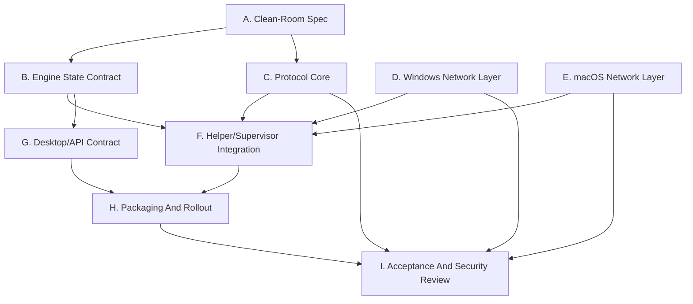

# Native OpenConnect Replacement Phase 2 Implementation Plan

> Status: CLOSED / SUPERSEDED.
> Closure date: 2026-05-31.
> Successor: `docs/superpowers/plans/2026-05-31-native-openconnect-replacement-phase3-production-readiness.md`.
> Closure summary: A-H1 are largely completed in the current workspace. H2 docs migration, I1/I2 manual native acceptance, I3 clean-room/security review, production TLS/CSTP transport, default native dependency composition, and durable native supervisor ownership moved to Phase 3.

> **For agentic workers:** REQUIRED SUB-SKILL: Use superpowers:subagent-driven-development (recommended) or superpowers:executing-plans to implement this plan task-by-task. Steps use checkbox (`- [ ]`) syntax for tracking.

**Goal:** Build the next major native VPN engine phase so Windows and macOS can run the ECNU AnyConnect username/password CSTP tunnel without requiring OpenConnect in production packages.

**Architecture:** Keep the existing helper/supervisor privilege architecture, but replace the OpenConnect child-process contract with a native engine contract. The phase is split into clean-room protocol, packet/session state, Windows network adapter, macOS network adapter, UI/API contract, packaging, and acceptance gates so Copilot-generated subagents can work independently while Codex coordinates and verifies outputs.

**Tech Stack:** C++17, CMake, nlohmann/json, Windows Wintun DLL API, Windows IP Helper API, macOS utun sockets, macOS route/ioctl APIs, OS TLS where socket ownership allows it, focused CTest targets, Vue/TypeScript desktop UI.

---

## 0. Operating Model For This Phase

### Coordinator And Subagent Policy

- The human/operator uses Copilot to generate one subagent per task or per workstream.
- The coordinator is Codex in this repository session.
- Codex owns task decomposition, cross-task contract control, code review, final acceptance, and conflict resolution.
- Subagents must report exact files changed, commands run, test output, and any deviations from this plan.
- Subagents should use the strongest available GPT-5.5 model with the highest thinking/reasoning level for protocol, security, platform networking, and review tasks.
- No subagent may copy OpenConnect-derived source into product code. OpenConnect references may be used only to produce behavior maps, compatibility tests, or notes.

### Current Baseline

Already landed:

- `src/vpn_engine/engine.hpp` defines `VpnEngineConfig`, `VpnEngineEvent`, `VpnEngineStatus`, `ValidationResult`, and `VpnEngineSession`.
- `src/vpn_engine/native_engine.*` validates native config and currently returns `native_protocol_unimplemented`.
- `Config.vpn_engine` defaults to `native`, with `legacy_openconnect` as a hidden fallback.
- Native runtime status reports available without OpenConnect and includes legacy diagnostics.
- Focused tests exist:
  - `tests/native_engine_contract_test.cpp`
  - `tests/runtime_status_native_test.cpp`

Still OpenConnect-shaped:

- `src/vpn.cpp` still owns most process-oriented lifecycle logic.
- `src/helper.cpp` still relies on `find_openconnect_pid()` and `route-ready`.
- `src/tunnel.cpp` and platform `tunnel_script.cpp` still parse OpenConnect logs or vpnc-script metadata.
- `src/platform/*/openconnect_process.cpp` remains the legacy implementation.
- Packaging and manual docs still mention staged OpenConnect assets.
- UI text still exposes OpenConnect runtime in settings and missing-runtime states.

### Phase 2 Definition Of Done

Phase 2 is complete only when all of these are true:

- Native engine connects to the clean-room fake AnyConnect server through password auth and CSTP/TLS.
- Native engine emits structured UTF-8 events and JSON session state.
- Native engine owns packet loop lifecycle and reports `network_ready` without scraping OpenConnect logs.
- Windows native adapter and route logic pass mock tests and at least one real-machine manual connect/disconnect test without OpenConnect installed.
- macOS native adapter and route logic pass mock tests and at least one real-machine manual connect/disconnect test without Homebrew/staged OpenConnect.
- Production package validation no longer requires `openconnect.exe`, `openconnect`, `libopenconnect-5.dll`, GnuTLS DLLs, or staged macOS OpenConnect dylibs.
- Legacy OpenConnect fallback is hidden behind a development/diagnostic config flag and excluded from production release validation.

## 1. Level 1 Workstreams

| Workstream | Purpose | Primary Output | Lead Model Recommendation | Can Run In Parallel |
|---|---|---|---|---|
| A. Clean-Room Spec | Freeze ECNU AnyConnect behavior and legal boundary | protocol spec and fixtures | GPT-5.5 highest thinking | Starts first; unblocks B/C |
| B. Engine State Contract | Make native lifecycle observable without process/log scraping | session state store and event sink | GPT-5.5 highest thinking | After A starts; before G |
| C. Protocol Core | Implement auth and CSTP/TLS over a fake server | protocol library and fake server tests | GPT-5.5 highest thinking | Parallel with D/E after interfaces freeze |
| D. Windows Network Layer | Wintun and IP Helper implementation | mock-tested Windows adapter/session network config | GPT-5.5 highest thinking | Parallel with E/C |
| E. macOS Network Layer | utun and route implementation | mock-tested macOS adapter/session network config | GPT-5.5 highest thinking | Parallel with D/C |
| F. Helper/Supervisor Integration | Replace OpenConnect PID/log readiness as primary source | helper JSON session lifecycle | GPT-5.5 highest thinking | After B; integrates C/D/E |
| G. Desktop/API Contract | Remove user-facing OpenConnect assumptions in native mode | UI/API status and settings migration | GPT-5.5 high thinking | After B/F contract freeze |
| H. Packaging And Rollout | Stop shipping OpenConnect for production | package scripts and docs | GPT-5.5 high thinking | After F/G, before manual gates |
| I. Acceptance And Security Review | Prove behavior, cleanup, and clean-room compliance | signed-off test evidence | GPT-5.5 highest thinking | Runs continuously; final gate last |

## 2. Dependency And Parallelism Map



Parallel rules:

- A1 and B1 may begin together if B1 only defines generic state fields.
- C2/C3 fake server and D1/E1 adapter interfaces may run in parallel after A1 publishes the minimum protocol fields.
- D Windows and E macOS tasks should be assigned to separate Copilot subagents and reviewed independently.
- F integration must wait until B state schema, C session API, and at least one platform adapter mock are stable.
- H packaging must wait until F and G have a native-ready path; otherwise package checks will encode temporary behavior.

## 3. File Boundary Plan

Create protocol files:

- `docs/architecture/native-anyconnect-clean-room-spec.md`: clean-room ECNU AnyConnect behavior spec.
- `src/vpn_engine/protocol/url.hpp`
- `src/vpn_engine/protocol/url.cpp`
- `src/vpn_engine/protocol/http.hpp`
- `src/vpn_engine/protocol/http.cpp`
- `src/vpn_engine/protocol/auth.hpp`
- `src/vpn_engine/protocol/auth.cpp`
- `src/vpn_engine/protocol/cstp.hpp`
- `src/vpn_engine/protocol/cstp.cpp`
- `src/vpn_engine/protocol/session.hpp`
- `src/vpn_engine/protocol/session.cpp`

Create platform-neutral engine files:

- `src/vpn_engine/event_sink.hpp`
- `src/vpn_engine/event_sink.cpp`
- `src/vpn_engine/session_state.hpp`
- `src/vpn_engine/session_state.cpp`
- `src/vpn_engine/packet_device.hpp`
- `src/vpn_engine/route_plan.hpp`
- `src/vpn_engine/route_plan.cpp`

Create Windows native network files:

- `src/platform/win32/native_wintun.hpp`
- `src/platform/win32/native_wintun.cpp`
- `src/platform/win32/native_ip_config.hpp`
- `src/platform/win32/native_ip_config.cpp`
- `src/platform/win32/native_packet_device.cpp`

Create macOS native network files:

- `src/platform/darwin/native_utun.hpp`
- `src/platform/darwin/native_utun.cpp`
- `src/platform/darwin/native_route_config.hpp`
- `src/platform/darwin/native_route_config.cpp`
- `src/platform/darwin/native_packet_device.cpp`

Modify integration files:

- `src/vpn_engine/native_engine.hpp`
- `src/vpn_engine/native_engine.cpp`
- `src/vpn.cpp`
- `src/helper.cpp`
- `src/vpn_runtime.cpp`
- `src/platform/common/runtime_status.cpp`
- `src/platform/common/process_control.hpp`
- `src/platform/*/process_control.cpp`
- `src/platform/common/openconnect_process.hpp`
- `src/platform/*/openconnect_process.cpp`
- `src/tunnel.cpp`
- `src/platform/common/tunnel_script.hpp`
- `src/platform/*/tunnel_script.cpp`
- `src/app_api.cpp`
- `webui/src/stores/config.ts`
- `webui/src/stores/vpn.ts`
- `webui/src/pages/SettingsPage.vue`
- packaging scripts under `scripts/` and `webui/desktop/**` as discovered by `rg "openconnect|OpenConnect|openconnect_runtime"`.

Create tests:

- `tests/native_url_test.cpp`
- `tests/native_auth_parser_test.cpp`
- `tests/native_cstp_frame_test.cpp`
- `tests/native_session_state_test.cpp`
- `tests/native_route_plan_test.cpp`
- `tests/native_fake_anyconnect_server_test.cpp`
- `tests/win32_native_ip_config_test.cpp`
- `tests/win32_native_wintun_test.cpp`
- `tests/darwin_native_route_config_test.cpp`
- `tests/darwin_native_utun_test.cpp`
- `tests/native_helper_session_test.cpp`
- `tests/native_packaging_policy_test.cpp`

## 4. Task Plan

### Task A1: Clean-Room Protocol Spec

**Files:**
- Create: `docs/architecture/native-anyconnect-clean-room-spec.md`
- Modify: `docs/superpowers/plans/2026-05-31-native-openconnect-replacement-phase2.md` only for progress notes if needed.

- [ ] **Step 1: Write the spec skeleton**

Add sections:

```markdown
# Native AnyConnect Clean-Room Spec

## Scope

Supported in v1:
- ECNU AnyConnect-compatible username/password authentication.
- CSTP over TCP/TLS.
- IPv4 tunnel address, MTU, split routes, server bypass route.
- UTF-8 structured events.

Unsupported in v1:
- DTLS acceleration.
- SAML/browser auth.
- certificate enrollment.
- arbitrary OpenConnect `extra_args`.
- GlobalProtect, Pulse, Juniper, Fortinet protocols.

## Clean-Room Sources

Allowed:
- live traces captured from our own ECNU sessions with credentials redacted.
- public protocol descriptions.
- current app behavior and tests.
- OpenConnect only as behavioral reference, never as copied source.

Forbidden:
- copying OpenConnect source, constants blocks, parser code, state machines, or comments.
```

- [ ] **Step 2: Document request/response flow**

The spec must define exact field names for:

- server URL normalization
- TLS SNI host
- login path
- username field
- password field
- auth failure detection
- cookie/session extraction
- CSTP connect request
- CSTP response headers
- keepalive/DPD messages
- disconnect and reconnect triggers

- [ ] **Step 3: Document unknowns as measurable probes**

Each unknown must include a capture method and expected artifact. Example:

```markdown
| Unknown | Probe | Artifact | Blocks |
|---|---|---|---|
| ECNU login form field names | capture sanitized HTTPS form with a test account | `docs/architecture/fixtures/ecnu-auth-form-redacted.http` | Auth parser |
```

- [ ] **Step 4: Review acceptance**

Run:

```powershell
rg -n "PLACEHOLDER|UNRESOLVED|copy OpenConnect|extra_args supported" docs\architecture\native-anyconnect-clean-room-spec.md
```

Expected: no output.

Acceptance:

- Spec states what v1 supports and rejects.
- Spec has no implementation placeholders.
- Spec includes legal clean-room rules.
- Spec includes enough protocol detail for C tasks to write tests.

### Task A2: Compatibility Fixtures And Redaction Rules

**Files:**
- Create: `docs/architecture/fixtures/README.md`
- Create: `tests/fixtures/native_anyconnect/auth_success.http`
- Create: `tests/fixtures/native_anyconnect/auth_failure.http`
- Create: `tests/fixtures/native_anyconnect/cstp_connect_success.http`
- Create: `tests/fixtures/native_anyconnect/cstp_connect_failure.http`

- [ ] **Step 1: Add fixture redaction policy**

`docs/architecture/fixtures/README.md` must state:

```markdown
# Fixture Policy

Fixtures must never contain real usernames, passwords, cookies, VPN host private addresses, device IDs, or certificate material.

Use these replacements:
- username: `student@example.invalid`
- password: `REDACTED_PASSWORD`
- cookie: `REDACTED_COOKIE`
- internal IPv4: `10.255.0.10`
- VPN server: `vpn.example.invalid`
```

- [ ] **Step 2: Add minimal auth success fixture**

`tests/fixtures/native_anyconnect/auth_success.http` must contain a sanitized HTTP response with a clearly named cookie field from the spec. If the live ECNU response differs, update this fixture and the spec in the same task.

- [ ] **Step 3: Add minimal CSTP success fixture**

`tests/fixtures/native_anyconnect/cstp_connect_success.http` must include sanitized headers for address, netmask, MTU, and split include routes.

- [ ] **Step 4: Validation**

Run:

```powershell
rg -n "REDACTED_PASSWORD|real credential|PLACEHOLDER|UNRESOLVED" docs\architecture\fixtures tests\fixtures\native_anyconnect
```

Expected: only the allowed redaction names appear; no real credentials or unresolved markers.

### Task B1: Session State Schema

**Files:**
- Create: `src/vpn_engine/session_state.hpp`
- Create: `src/vpn_engine/session_state.cpp`
- Test: `tests/native_session_state_test.cpp`
- Modify: `CMakeLists.txt`

- [ ] **Step 1: Write failing tests**

`tests/native_session_state_test.cpp` must verify:

- initial state is `idle`
- `auth_started`, `auth_succeeded`, `tunnel_configured`, `packet_loop_started`, `stopped`, `failed`
- `network_ready` becomes true only after tunnel metadata and packet loop are both ready
- JSON contains UTF-8 event messages unchanged
- no field requires an OpenConnect PID

- [ ] **Step 2: Implement schema**

Define:

```cpp
enum class SessionPhase {
  idle,
  authenticating,
  authenticated,
  configuring_network,
  packet_loop,
  reconnecting,
  stopping,
  stopped,
  failed
};

struct TunnelMetadata {
  std::string interface_name;
  int interface_index = -1;
  std::string internal_ip4_address;
  std::string internal_ip4_netmask;
  int mtu = 1290;
  std::vector<std::string> routes;
  std::vector<std::string> server_bypass_ips;
};
```

- [ ] **Step 3: Add JSON functions**

Expose:

```cpp
nlohmann::json session_phase_to_json(SessionPhase phase);
nlohmann::json tunnel_metadata_to_json(const TunnelMetadata &metadata);
nlohmann::json session_state_to_json(const SessionState &state);
```

- [ ] **Step 4: Build and test**

Run:

```powershell
cmake --build --preset windows-release --target native_session_state_test
ctest --preset windows-release -R native_session_state_test --output-on-failure
```

Acceptance:

- Test passes.
- JSON schema is stable and documented in comments.
- No test uses `openconnect`, `route-ready`, or `find_openconnect_pid`.

### Task B2: UTF-8 Event Sink

**Files:**
- Create: `src/vpn_engine/event_sink.hpp`
- Create: `src/vpn_engine/event_sink.cpp`
- Test: extend `tests/native_engine_contract_test.cpp` or create `tests/native_event_sink_test.cpp`
- Modify: `CMakeLists.txt`

- [ ] **Step 1: Write failing tests**

Tests must assert:

- events serialize as UTF-8 JSON
- Chinese messages round-trip, for example `连接成功`
- event fields are structured key/value pairs
- error events include `code`

- [ ] **Step 2: Implement sink interface**

Define:

```cpp
class EventSink {
public:
  virtual ~EventSink() = default;
  virtual void emit(const VpnEngineEvent &event) = 0;
};

class JsonLinesEventSink final : public EventSink {
public:
  explicit JsonLinesEventSink(std::filesystem::path path);
  void emit(const VpnEngineEvent &event) override;
};
```

- [ ] **Step 3: Acceptance**

Run:

```powershell
cmake --build --preset windows-release --target native_engine_contract_test
ctest --preset windows-release -R native_engine_contract_test --output-on-failure
```

Acceptance:

- Event file is valid UTF-8 JSONL.
- No Windows console codepage dependency exists.

### Task C1: URL And HTTP Parsing

**Files:**
- Create: `src/vpn_engine/protocol/url.hpp`
- Create: `src/vpn_engine/protocol/url.cpp`
- Create: `src/vpn_engine/protocol/http.hpp`
- Create: `src/vpn_engine/protocol/http.cpp`
- Test: `tests/native_url_test.cpp`
- Modify: `CMakeLists.txt`

- [ ] **Step 1: Write failing URL tests**

Cover:

- `vpn.ecnu.edu.cn`
- `https://vpn.ecnu.edu.cn`
- `https://vpn.ecnu.edu.cn/`
- reject `http://`
- reject empty host
- preserve explicit port

- [ ] **Step 2: Implement `ParsedVpnUrl`**

Public API:

```cpp
struct ParsedVpnUrl {
  std::string scheme;
  std::string host;
  int port = 443;
  std::string base_path = "/";
};

ValidationResult parse_vpn_url(const std::string &input, ParsedVpnUrl *out);
```

- [ ] **Step 3: Add minimal HTTP response parser**

Public API:

```cpp
struct HttpResponse {
  int status = 0;
  std::map<std::string, std::string> headers;
  std::string body;
};

ValidationResult parse_http_response(const std::string &raw, HttpResponse *out);
```

- [ ] **Step 4: Acceptance**

Run:

```powershell
cmake --build --preset windows-release --target native_url_test
ctest --preset windows-release -R native_url_test --output-on-failure
```

Acceptance:

- Parser accepts only HTTPS.
- Header lookup is case-insensitive.
- No ad hoc regex-only parsing for full HTTP response bodies.

### Task C2: AnyConnect Auth Parser

**Files:**
- Create: `src/vpn_engine/protocol/auth.hpp`
- Create: `src/vpn_engine/protocol/auth.cpp`
- Test: `tests/native_auth_parser_test.cpp`
- Use fixtures: `tests/fixtures/native_anyconnect/*.http`
- Modify: `CMakeLists.txt`

- [ ] **Step 1: Write failing tests**

Tests must verify:

- login form parser finds username/password field names from fixture
- auth failure fixture returns `auth_failed`
- auth success extracts cookie/session token
- unsupported MFA/SAML response returns `unsupported_auth_flow`
- missing cookie returns `protocol_error`

- [ ] **Step 2: Implement auth result types**

Public API:

```cpp
struct AuthForm {
  std::string action_path;
  std::string username_field;
  std::string password_field;
  std::map<std::string, std::string> hidden_fields;
};

struct AuthResult {
  bool ok = false;
  std::string cookie;
  std::string error_code;
  std::string error_message;
};
```

- [ ] **Step 3: Acceptance**

Run:

```powershell
cmake --build --preset windows-release --target native_auth_parser_test
ctest --preset windows-release -R native_auth_parser_test --output-on-failure
```

Acceptance:

- Auth parser is fixture-driven.
- Unsupported auth flows fail deterministically.
- Password is never emitted in event fields or logs.

### Task C3: CSTP Header And Frame Parser

**Files:**
- Create: `src/vpn_engine/protocol/cstp.hpp`
- Create: `src/vpn_engine/protocol/cstp.cpp`
- Test: `tests/native_cstp_frame_test.cpp`
- Modify: `CMakeLists.txt`

- [ ] **Step 1: Write failing frame tests**

Tests must cover:

- parse CSTP connect response headers into `TunnelMetadata`
- parse IPv4 address, netmask, MTU, and split routes
- encode keepalive frame
- decode data frame
- reject malformed frame length

- [ ] **Step 2: Implement CSTP public API**

Define clean-room types:

```cpp
enum class CstpFrameType {
  data,
  keepalive,
  dpd_request,
  dpd_response,
  disconnect
};

struct CstpFrame {
  CstpFrameType type;
  std::vector<std::uint8_t> payload;
};

ValidationResult parse_cstp_headers(const HttpResponse &response,
                                    TunnelMetadata *metadata);
ValidationResult encode_cstp_frame(const CstpFrame &frame,
                                   std::vector<std::uint8_t> *out);
ValidationResult decode_cstp_frame(ByteReader *reader, CstpFrame *out);
```

- [ ] **Step 3: Acceptance**

Run:

```powershell
cmake --build --preset windows-release --target native_cstp_frame_test
ctest --preset windows-release -R native_cstp_frame_test --output-on-failure
```

Acceptance:

- All frame tests pass.
- Parser has length limits and rejects oversized frames.
- No OpenConnect constants are copied unless independently documented in the spec.

### Task C4: Fake AnyConnect Server Integration Harness

**Files:**
- Create: `tests/support/fake_anyconnect_server.hpp`
- Create: `tests/support/fake_anyconnect_server.cpp`
- Test: `tests/native_fake_anyconnect_server_test.cpp`
- Modify: `CMakeLists.txt`

- [ ] **Step 1: Build fake server scenarios**

Scenarios:

- password auth success
- password auth failure
- CSTP connect success
- packet echo
- server close during packet loop
- reconnect after close

- [ ] **Step 2: Acceptance command**

Run:

```powershell
cmake --build --preset windows-release --target native_fake_anyconnect_server_test
ctest --preset windows-release -R native_fake_anyconnect_server_test --output-on-failure
```

Acceptance:

- Test does not require ECNU network.
- Test does not require administrator privileges.
- Test proves protocol behavior before real platform network integration.

### Task C5: Protocol Session Loop

**Files:**
- Create: `src/vpn_engine/protocol/session.hpp`
- Create: `src/vpn_engine/protocol/session.cpp`
- Modify: `src/vpn_engine/native_engine.cpp`
- Test: extend `tests/native_fake_anyconnect_server_test.cpp`

- [ ] **Step 1: Define session loop API**

```cpp
struct ProtocolSessionOptions {
  ParsedVpnUrl server;
  std::string username;
  std::string password;
  std::string useragent;
  bool disable_dtls = true;
};

class ProtocolSession {
public:
  ValidationResult authenticate();
  ValidationResult connect_cstp(TunnelMetadata *metadata);
  ValidationResult run_packet_loop(PacketDevice *device,
                                   EventSink *events,
                                   CancellationToken *cancel);
  void disconnect();
};
```

- [ ] **Step 2: Implement cancellation and reconnect policy**

Rules:

- cancellation exits within 2 seconds
- auth failure never reconnects
- transient network close reconnects if `auto_reconnect = true`
- reconnect emits `reconnect_started` and `reconnect_succeeded` or `reconnect_failed`

- [ ] **Step 3: Acceptance**

Run:

```powershell
cmake --build --preset windows-release --target native_fake_anyconnect_server_test native_engine_contract_test
ctest --preset windows-release -R "native_fake_anyconnect_server_test|native_engine_contract_test" --output-on-failure
```

Acceptance:

- Fake server packet echo passes.
- Stop cancels packet loop deterministically.
- Event stream contains no password.

### Task D1: Packet Device Interface

**Files:**
- Create: `src/vpn_engine/packet_device.hpp`
- Test: extend `tests/native_engine_contract_test.cpp`

- [ ] **Step 1: Define platform-neutral packet interface**

```cpp
class PacketDevice {
public:
  virtual ~PacketDevice() = default;
  virtual ValidationResult open(const TunnelMetadata &metadata) = 0;
  virtual ValidationResult read_packet(std::vector<std::uint8_t> *packet) = 0;
  virtual ValidationResult write_packet(const std::vector<std::uint8_t> &packet) = 0;
  virtual void close() = 0;
};
```

- [ ] **Step 2: Add mock packet device for tests**

Use it in protocol fake-server tests to avoid Wintun/utun dependency.

Acceptance:

- Protocol tests compile without platform-specific includes.
- Platform adapter tasks can implement the same interface independently.

### Task D2: Windows Wintun Loader And Adapter Lifecycle

**Files:**
- Create: `src/platform/win32/native_wintun.hpp`
- Create: `src/platform/win32/native_wintun.cpp`
- Test: `tests/win32_native_wintun_test.cpp`
- Modify: `CMakeLists.txt`

- [ ] **Step 1: Write failing mock tests**

Tests must verify:

- locates bundled `wintun.dll`
- fails with `wintun_missing` if absent
- creates or opens adapter with deterministic name prefix
- reports adapter LUID and ifIndex
- closes session on stop

- [ ] **Step 2: Implement dynamic DLL boundary**

Do not statically link Wintun. Load functions with `LoadLibraryW` and `GetProcAddress`.

- [ ] **Step 3: Acceptance**

Run on Windows:

```powershell
cmake --build --preset windows-release --target win32_native_wintun_test
ctest --preset windows-release -R win32_native_wintun_test --output-on-failure
```

Acceptance:

- Unit tests pass without creating a real adapter.
- Real adapter creation is behind a small injectable API boundary.
- No shell commands are used.

### Task D3: Windows IP Helper Address, MTU, Routes

**Files:**
- Create: `src/platform/win32/native_ip_config.hpp`
- Create: `src/platform/win32/native_ip_config.cpp`
- Test: `tests/win32_native_ip_config_test.cpp`
- Modify: `CMakeLists.txt`

- [ ] **Step 1: Write route planning tests**

Tests must verify:

- server bypass route is installed before campus split routes
- duplicate routes are collapsed
- route cleanup removes only routes owned by this session
- MTU uses tunnel metadata or config fallback

- [ ] **Step 2: Implement IP Helper wrapper**

Use Windows APIs behind injectable function table:

- `CreateUnicastIpAddressEntry`
- `InitializeUnicastIpAddressEntry`
- `CreateIpForwardEntry2`
- `DeleteIpForwardEntry2`
- `GetBestRoute2`

- [ ] **Step 3: Acceptance**

Run:

```powershell
cmake --build --preset windows-release --target win32_native_ip_config_test
ctest --preset windows-release -R win32_native_ip_config_test --output-on-failure
```

Acceptance:

- No `netsh.exe`, `route.exe`, PowerShell script, or fixed sleep is used.
- Cleanup is idempotent.
- API errors map to stable error codes.

### Task D4: Windows Native Packet Device

**Files:**
- Create: `src/platform/win32/native_packet_device.cpp`
- Modify: `src/vpn_engine/native_engine.cpp`
- Test: extend `tests/win32_native_wintun_test.cpp`

- [ ] **Step 1: Implement `PacketDevice` with Wintun session**

Behavior:

- `open()` creates adapter/session and configures IP/MTU/routes.
- `read_packet()` reads from Wintun receive path.
- `write_packet()` sends to Wintun transmit path.
- `close()` tears down session and routes.

- [ ] **Step 2: Acceptance**

Run:

```powershell
cmake --build --preset windows-release --target exv exv-helper win32_native_wintun_test win32_native_ip_config_test
ctest --preset windows-release -R "win32_native_wintun_test|win32_native_ip_config_test" --output-on-failure
```

Acceptance:

- Builds on Windows.
- Mock tests pass.
- Manual test records adapter creation and cleanup without OpenConnect installed.

### Task E1: macOS utun Adapter Lifecycle

**Files:**
- Create: `src/platform/darwin/native_utun.hpp`
- Create: `src/platform/darwin/native_utun.cpp`
- Test: `tests/darwin_native_utun_test.cpp`
- Modify: `CMakeLists.txt`

- [ ] **Step 1: Write mockable lifecycle tests**

Tests must verify:

- opens a utun control socket
- reports `utunN` interface name
- applies MTU through native API boundary
- closes fd on stop
- maps permission errors to `utun_permission_denied`

- [ ] **Step 2: Implement native boundary**

Use:

- `PF_SYSTEM`
- `SYSPROTO_CONTROL`
- `UTUN_CONTROL_NAME`
- `connect`
- `getsockopt(... UTUN_OPT_IFNAME ...)`

- [ ] **Step 3: Acceptance**

Run on macOS:

```bash
cmake --build --preset macos-release --target darwin_native_utun_test
ctest --preset macos-release -R darwin_native_utun_test --output-on-failure
```

Acceptance:

- Unit tests pass with mocked syscalls.
- Real utun open is isolated to elevated helper or one-shot privileged path.
- No shell tunnel script is required for normal native mode.

### Task E2: macOS Route And MTU Configuration

**Files:**
- Create: `src/platform/darwin/native_route_config.hpp`
- Create: `src/platform/darwin/native_route_config.cpp`
- Test: `tests/darwin_native_route_config_test.cpp`
- Modify: `CMakeLists.txt`

- [ ] **Step 1: Write route tests**

Tests must verify:

- upstream route to VPN server is preserved before split routes
- split routes use utun interface
- cleanup is idempotent
- route failures include the target CIDR and stable error code

- [ ] **Step 2: Implement route API wrapper**

Prefer native routing socket or tightly wrapped `route` message APIs. If a shell fallback is used during development, it must be explicitly dev-only and rejected by production packaging policy.

- [ ] **Step 3: Acceptance**

Run on macOS:

```bash
cmake --build --preset macos-release --target darwin_native_route_config_test
ctest --preset macos-release -R darwin_native_route_config_test --output-on-failure
```

Acceptance:

- No normal native mode shell script.
- Cleanup removes owned routes only.
- [Manual crash cleanup procedure](../../validation/macos-native-route-crash-cleanup.md)
  is documented.

### Task E3: macOS Native Packet Device

**Files:**
- Create: `src/platform/darwin/native_packet_device.cpp`
- Modify: `src/vpn_engine/native_engine.cpp`
- Test: extend `tests/darwin_native_utun_test.cpp`

- [ ] **Step 1: Implement `PacketDevice` with utun fd**

Behavior:

- `open()` creates utun and configures routes.
- `read_packet()` strips/adds utun address family header as required.
- `write_packet()` writes packet with correct family header.
- `close()` closes fd and route state.

- [ ] **Step 2: Acceptance**

Run:

```bash
cmake --build --preset macos-release --target exv exv-helper darwin_native_utun_test darwin_native_route_config_test
ctest --preset macos-release -R "darwin_native_utun_test|darwin_native_route_config_test" --output-on-failure
```

Acceptance:

- Builds on macOS.
- Mock tests pass.
- Manual test records utun creation and cleanup without OpenConnect installed.

### Task F1: Native Engine Composition

**Files:**
- Modify: `src/vpn_engine/native_engine.hpp`
- Modify: `src/vpn_engine/native_engine.cpp`
- Test: `tests/native_fake_anyconnect_server_test.cpp`
- Test: `tests/native_engine_contract_test.cpp`

- [ ] **Step 1: Replace unimplemented start path**

`NativeVpnEngineSession::start()` must:

1. validate config
2. parse URL
3. authenticate
4. connect CSTP
5. open platform packet device
6. start packet loop
7. update session state and emit events

- [ ] **Step 2: Keep explicit unsupported DTLS**

If config requests DTLS, return:

```text
code=unsupported_dtls
message=Native engine v1 supports CSTP/TLS only.
```

- [ ] **Step 3: Acceptance**

Run:

```powershell
cmake --build --preset windows-release --target native_fake_anyconnect_server_test native_engine_contract_test
ctest --preset windows-release -R "native_fake_anyconnect_server_test|native_engine_contract_test" --output-on-failure
```

Acceptance:

- Native engine no longer returns `native_protocol_unimplemented` in fake-server happy path.
- Unsupported features fail deterministically.
- Stop cancels packet loop.

### Task F2: Helper/Supervisor Session State

**Files:**
- Modify: `src/helper.cpp`
- Modify: `src/vpn.cpp`
- Modify: `src/vpn_runtime.cpp`
- Create/Test: `tests/native_helper_session_test.cpp`
- Modify: `CMakeLists.txt`

- [ ] **Step 1: Write helper status tests**

Tests must verify:

- native running state comes from `SessionState`
- `network_ready` comes from metadata plus packet loop
- `pid` is supervisor/helper PID, not OpenConnect PID
- `route-ready` is emitted only as compatibility marker
- forced stop clears native session state

- [ ] **Step 2: Implement native session store**

Add a JSON state file under config dir:

```text
native-session-state.json
```

Minimum fields:

```json
{
  "engine": "native",
  "phase": "packet_loop",
  "running": true,
  "network_ready": true,
  "pid": 1234,
  "interface": "utun7",
  "interface_index": 12,
  "internal_ip": "10.255.0.10",
  "mtu": 1290,
  "routes": ["10.0.0.0/8"],
  "last_error": null
}
```

- [ ] **Step 3: Acceptance**

Run:

```powershell
cmake --build --preset windows-release --target native_helper_session_test vpn_runtime_test
ctest --preset windows-release -R "native_helper_session_test|vpn_runtime_test" --output-on-failure
```

Acceptance:

- Native status no longer depends on `find_openconnect_pid()`.
- Legacy mode still uses OpenConnect PID path.
- Existing UI connected/network_ready behavior remains compatible.

### Task F3: Decommission Log Scraping For Native Mode

**Files:**
- Modify: `src/tunnel.cpp`
- Modify: `src/platform/common/tunnel_script.hpp`
- Modify: `src/platform/win32/tunnel_script.cpp`
- Modify: `src/platform/darwin/tunnel_script.cpp`
- Test: `tests/tunnel_script_contract_test.cpp`
- Test: `tests/openconnect_log_test.cpp`

- [ ] **Step 1: Preserve legacy log parser tests**

`openconnect_log_test` must remain passing for `legacy_openconnect`.

- [ ] **Step 2: Add native-mode rejection tests**

Native path must not call `configure_from_openconnect_log()`. If called with native mode, return:

```text
code=native_log_scraping_disabled
```

- [ ] **Step 3: Acceptance**

Run:

```powershell
cmake --build --preset windows-release --target tunnel_script_contract_test openconnect_log_test
ctest --preset windows-release -R "tunnel_script_contract_test|openconnect_log_test" --output-on-failure
```

Acceptance:

- Legacy tests pass.
- Native mode is fully structured-event driven.
- No native readiness depends on text `Configured as ...` or `Using Wintun device ...`.

### Task G1: Desktop/API Native Runtime Contract

**Files:**
- Modify: `src/app_api.cpp`
- Modify: `webui/src/stores/config.ts`
- Modify: `webui/src/stores/vpn.ts`
- Modify: `webui/src/pages/SettingsPage.vue`
- Test: existing frontend type build

- [ ] **Step 1: Update status contract**

Runtime status in native mode must show:

```json
{
  "engine": "native",
  "available": true,
  "source": "native",
  "legacy_openconnect": {
    "engine": "legacy_openconnect"
  }
}
```

UI must not show "OpenConnect runtime missing" when `engine=native`.

- [ ] **Step 2: Hide legacy runtime control**

In normal UI:

- no visible OpenConnect runtime selector when native mode is selected
- `extra_args` disabled with explanatory native-mode message
- legacy selector only visible under dev/diagnostic mode

- [ ] **Step 3: Acceptance**

Run:

```powershell
cmake --build --preset windows-release --target app_api_runtime_policy_test runtime_status_native_test
ctest --preset windows-release -R "app_api_runtime_policy_test|runtime_status_native_test" --output-on-failure
cd webui
npm run build
```

Acceptance:

- Frontend typecheck passes.
- Native mode UI never instructs users to install OpenConnect.
- Legacy diagnostics remain available for development.

### Task H1: Production Packaging Policy

**Files:**
- Create: `tests/native_packaging_policy_test.cpp`
- Modify: `CMakeLists.txt`
- Modify: packaging scripts found by:
  - `rg -n "openconnect|OpenConnect|libopenconnect|gnutls|stage-openconnect" scripts webui runtime CMakeLists.txt`

- [ ] **Step 1: Add packaging policy test**

The test must fail if production package manifests or staging scripts require:

- `openconnect.exe`
- `openconnect`
- `libopenconnect-5.dll`
- GnuTLS DLLs for OpenConnect
- macOS staged OpenConnect dylibs

The test must allow these only under an explicit dev/diagnostic legacy path.

- [ ] **Step 2: Update package scripts**

Rules:

- Windows production package includes `exv.exe`, `exv-helper.exe`, required runtime DLLs, and `wintun.dll`.
- macOS production package includes `exv`, helper, app assets, and codesigned native binaries.
- Legacy OpenConnect staging script is no longer called by production package target.

- [ ] **Step 3: Acceptance**

Run:

```powershell
cmake --build --preset windows-release --target native_packaging_policy_test
ctest --preset windows-release -R native_packaging_policy_test --output-on-failure
cd webui
npm run desktop:build
```

Acceptance:

- Production package builds without OpenConnect staged.
- Runtime status remains native-available.
- Legacy package mode is documented separately if retained.

### Task H2: Documentation Migration

**Files:**
- Modify: `README.md`
- Modify: `README_CN.md`
- Modify: `docs/user_guide.md`
- Modify: `docs/superpowers/plans/2026-05-22-manual-test-guide.md`
- Modify: `docs/superpowers/plans/2026-05-22-release-hardening-queue.md`

- [ ] **Step 1: Remove production OpenConnect requirement**

Docs must state:

- native is the default VPN engine
- OpenConnect is development/diagnostic fallback only
- `extra_args` applies only to legacy fallback

- [ ] **Step 2: Update manual acceptance**

Windows acceptance must include:

```powershell
Get-Command openconnect -ErrorAction SilentlyContinue
Get-ChildItem -Recurse webui\release -Include "openconnect*","libopenconnect*","*gnutls*"
```

Expected:

- first command may be missing
- second command finds no production OpenConnect assets

macOS acceptance must include:

```bash
command -v openconnect || true
find webui/release -name "openconnect" -o -name "libopenconnect*" -o -name "*gnutls*"
```

Expected: no production dependency.

- [ ] **Step 3: Acceptance**

Run:

```powershell
rg -n "must install OpenConnect|OpenConnect runtime assets present|Homebrew OpenConnect required" README.md README_CN.md docs
```

Expected: no production requirement remains.

### Task I1: Windows Manual Native Acceptance

**Files:**
- Create: `docs/validation/native-windows-acceptance-YYYY-MM-DD.md`

- [ ] **Step 1: Prepare machine**

Record:

```powershell
Get-Command openconnect -ErrorAction SilentlyContinue
Get-Process openconnect -ErrorAction SilentlyContinue
```

Expected: missing/no process.

- [ ] **Step 2: Connect using packaged UI**

Record:

- helper mode
- driver mode
- adapter name and ifIndex
- internal IP
- route table before/after
- UTF-8 logs screenshot or copied JSONL excerpt

- [ ] **Step 3: Disconnect and cleanup**

Record:

```powershell
Get-NetRoute | Where-Object { $_.InterfaceAlias -like "*ECNU*" -or $_.InterfaceAlias -like "*Wintun*" }
Get-Process openconnect -ErrorAction SilentlyContinue
```

Acceptance:

- connect succeeds without OpenConnect installed
- disconnect removes owned routes
- logs are readable Chinese/English UTF-8
- no stale OpenConnect process exists

### Task I2: macOS Manual Native Acceptance

**Files:**
- Create: `docs/validation/native-macos-acceptance-YYYY-MM-DD.md`

- [ ] **Step 1: Prepare machine**

Record:

```bash
command -v openconnect || true
pgrep -fl openconnect || true
ifconfig | grep utun || true
netstat -rn
```

- [ ] **Step 2: Connect using packaged app**

Record:

- helper-installed path
- one-shot elevated path
- utun name
- internal IP
- split routes
- server bypass route
- UTF-8 logs

- [ ] **Step 3: Disconnect and cleanup**

Record:

```bash
pgrep -fl openconnect || true
ifconfig | grep utun || true
netstat -rn
```

Acceptance:

- connect succeeds without Homebrew/staged OpenConnect
- launchd helper path works
- one-shot elevated path works
- routes clean on stop and crash recovery procedure is documented

### Task I3: Clean-Room And Security Review

**Files:**
- Create: `docs/security/native-openconnect-replacement-review-YYYY-MM-DD.md`

- [ ] **Step 1: Run source audit**

Commands:

```powershell
rg -n "openconnect|OpenConnect|vpnc|CSTP|AnyConnect" src tests docs
rg -n "password|cookie|Authorization|Set-Cookie" src\vpn_engine tests
```

- [ ] **Step 2: Review findings**

Document:

- every reference to OpenConnect is legacy fallback, compatibility test, or behavior note
- no copied OpenConnect implementation exists
- passwords are not logged
- cookies are redacted in events
- TLS verification behavior is documented

- [ ] **Step 3: Acceptance**

Acceptance:

- review doc has explicit pass/fail decision
- unresolved risks are linked to blocking tasks
- production packaging is blocked if clean-room pass is not granted

## 5. Old Task Migration Matrix

| Old Item | Old Status | New Owner Task | Decision |
|---|---:|---|---|
| Clean-room AnyConnect behavior spec | Not done | A1, A2 | transferred |
| Native engine abstraction | Partially done | B1, B2, F1 | revise and extend |
| Protocol core | Not done | C1-C5 | transferred |
| Windows Wintun direct layer | Not done | D1-D4 | transferred |
| Windows IP Helper route config | Not done | D3 | transferred |
| macOS utun direct layer | Not done | E1-E3 | transferred |
| macOS native route config | Not done | E2 | transferred |
| Replace `find_openconnect_pid()` status | Not done | F2 | transferred |
| Replace log scraping | Not done | F3 | transferred |
| Keep `route-ready` compatibility marker | Partially done | F2 | revise: compatibility only |
| Remove production OpenConnect staging | Not done | H1, H2 | transferred |
| UTF-8 logs/events | Partially done | B2, G1, I1, I2 | transferred |
| Fake AnyConnect server | Not done | C4 | transferred |
| Manual Windows/macOS acceptance | Not done | I1, I2 | transferred |
| Linux OpenConnect install hardening | Historical | none in phase 2 | out of scope because phase 2 targets Windows/macOS native replacement |

## 6. Review Gates

### Gate 1: Contract Freeze

Required tasks:

- A1
- B1
- B2
- D1

Commands:

```powershell
cmake --build --preset windows-release --target native_engine_contract_test native_session_state_test
ctest --preset windows-release -R "native_engine_contract_test|native_session_state_test" --output-on-failure
```

Gate passes when:

- state JSON is stable
- event JSON is stable
- no subagent is blocked on unknown engine interfaces

### Gate 2: Protocol Fake Server

Required tasks:

- C1
- C2
- C3
- C4
- C5

Commands:

```powershell
cmake --build --preset windows-release --target native_fake_anyconnect_server_test native_auth_parser_test native_cstp_frame_test native_url_test
ctest --preset windows-release -R "native_fake_anyconnect_server_test|native_auth_parser_test|native_cstp_frame_test|native_url_test" --output-on-failure
```

Gate passes when:

- fake server password auth passes
- CSTP packet echo passes
- reconnect test passes
- auth failure is deterministic

### Gate 3: Platform Mock Readiness

Required tasks:

- D2
- D3
- E1
- E2

Commands:

```powershell
cmake --build --preset windows-release --target win32_native_wintun_test win32_native_ip_config_test
ctest --preset windows-release -R "win32_native_wintun_test|win32_native_ip_config_test" --output-on-failure
```

macOS:

```bash
cmake --build --preset macos-release --target darwin_native_utun_test darwin_native_route_config_test
ctest --preset macos-release -R "darwin_native_utun_test|darwin_native_route_config_test" --output-on-failure
```

Gate passes when:

- mock platform tests pass on each platform
- no shell network configuration is used for normal native mode

### Gate 4: Integrated Native Beta

Required tasks:

- F1
- F2
- F3
- G1

Commands:

```powershell
cmake --build --preset windows-release --target exv exv-helper native_helper_session_test app_api_runtime_policy_test runtime_status_native_test
ctest --preset windows-release -R "native_helper_session_test|app_api_runtime_policy_test|runtime_status_native_test|vpn_runtime_test" --output-on-failure
cd webui
npm run build
```

Gate passes when:

- native mode no longer reports `native_protocol_unimplemented` against the fake server
- helper status is session-state driven
- UI does not ask native users to install OpenConnect

### Gate 5: Production Package Candidate

Required tasks:

- H1
- H2
- I3 preliminary pass

Commands:

```powershell
cmake --build --preset windows-release --target native_packaging_policy_test
ctest --preset windows-release -R native_packaging_policy_test --output-on-failure
cd webui
npm run desktop:build
```

Gate passes when:

- production package excludes OpenConnect assets
- docs no longer describe OpenConnect as required
- clean-room preliminary review has no blocker

### Gate 6: Manual Acceptance

Required tasks:

- I1
- I2
- I3 final pass

Gate passes when:

- Windows acceptance document exists and passes
- macOS acceptance document exists and passes
- security/clean-room review document exists and passes

## 7. Subagent Assignment Template

When using Copilot to generate a subagent, use this prompt shape:

```text
You are a subagent for ECNU-VPN native OpenConnect replacement phase 2.

Task: <Task ID and title>
Required model: GPT-5.5, highest thinking/reasoning level.
Coordinator: Codex owns final review and integration.

Read first:
- docs/superpowers/plans/2026-05-31-native-openconnect-replacement-phase2.md
- docs/architecture/native-anyconnect-clean-room-spec.md if it exists
- files listed in the task

Rules:
- Do not copy OpenConnect source or comments.
- Use TDD: write failing test first, then implementation.
- Keep changes inside the task file boundary.
- Do not modify packaging or UI unless the task says so.
- Report exact commands and outputs.
- Stop if a required interface is ambiguous; ask Codex coordinator for contract resolution.
```

## 8. Known Risks

| Risk | Impact | Mitigation |
|---|---|---|
| OS TLS may not expose enough socket control for CSTP packet loop | Protocol implementation delay | Define transport interface first; allow a small audited TLS dependency only after spike and review |
| ECNU auth form differs across accounts or network conditions | Auth parser instability | Fixture-driven parser with live redacted trace updates |
| Wintun driver install/permission edge cases | Windows manual acceptance delay | Keep Wintun status checks and explicit `wintun_missing`/permission codes |
| macOS utun route cleanup after crash | Stale routes | Session-owned route tracking and crash cleanup command documented in acceptance |
| Existing UI still contains OpenConnect text | User confusion | G1 and H2 grep-based acceptance |
| Legacy fallback accidentally ships as production requirement | Reintroduces install/runtime burden | H1 packaging policy test |
| Clean-room boundary violation | Release blocker | I3 mandatory security review before packaging gate |

## 9. Non-Goals For Phase 2

- DTLS acceleration.
- Linux native replacement.
- SAML/browser/MFA auth.
- Supporting arbitrary OpenConnect `extra_args` in native mode.
- Supporting non-AnyConnect protocols.
- Rewriting the helper privilege architecture.
- Removing legacy OpenConnect source files before native production acceptance passes.
