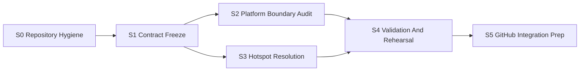

# Windows/macOS Platform Convergence Next Stage Plan

> Status: planning baseline for the next large implementation stage.
> Date: 2026-05-21
> Primary goal: turn the current Windows/macOS merge-prep work into clean, reviewable branch history and a reproducible path to `develop`.

## 1. Stage Goal And Success Criteria

### Overall Goal

Prepare `windows` and `macos` for a controlled merge into `develop` by converting the current merge-prep experiments into clean branch commits, freezing the shared desktop/native contract, and resolving the remaining high-risk conflict files with explicit ownership.

This stage is not a feature-expansion stage. It is a stabilization and integration stage.

### Current Baseline

Current branch and worktree state must be treated as unsafe until cleaned:

- `macos` currently has a large staged/unstaged merge-prep inventory.
- `windows` has already advanced with Windows helper/service fixes and desktop contract work.
- Direct `windows` + `macos` merge rehearsal currently reports conflicts in 15 files.
- Several rehearsal worktrees exist, including detached and nested wrapper worktrees. They are rehearsal artifacts, not implementation baselines.
- Existing abstraction work under `src/platform/{common,darwin,linux,win32}` appears directionally correct, but must be audited before landing as branch history.

### Stage Exit Criteria

The stage is complete only when all of the following are true:

- Git branch surface is reduced to `main`, `develop`, `windows`, `macos`, and at most one active `integration/*` branch.
- Git worktree surface is reduced to the main Windows worktree plus the macOS machine/worktree actually used for mac validation.
- `windows` and `macos` are both clean working trees with their useful merge-prep changes committed in reviewable slices.
- `git merge-tree --write-tree --messages --name-only windows macos` reports no behavioral conflict in shared contract files.
- A fresh `integration/platform-convergence-next` branch can merge `windows` then `macos` with a documented conflict list and no surprise generated files.
- Windows validation passes from a fresh checkout/worktree.
- macOS validation passes from the mac mini checkout/worktree.
- The integration branch can be pushed to GitHub and reviewed without relying on untracked local files.

## 2. Stage Overview

| Workstream | Purpose | Primary Output | Parallelizable |
|---|---|---|---|
| S0. Repository Hygiene | Remove rehearsal noise and preserve useful WIP safely | Clean branch/worktree inventory | No |
| S1. Contract Freeze | Decide the single shared desktop/native status contract | Frozen DTOs and no ad hoc status fields | Partly |
| S2. Platform Boundary Audit | Verify platform abstractions are real and minimal | Accepted/removed adapter files | Yes after S1 |
| S3. Hotspot Resolution | Resolve the remaining 15 merge conflict files by ownership | Conflict-free shared files | Yes by lane |
| S4. Validation And Rehearsal | Prove merge readiness on both platforms | Green validation matrix and merge playbook | No final gate |
| S5. GitHub Integration Prep | Produce clean push/PR sequence | Pushable branches and PR checklist | No |

High-level dependency:



## 3. Detailed Task Plan

### S0. Repository Hygiene

Objective: stop accidental work on stale rehearsal state and preserve all useful changes before implementation continues.

#### S0.1 Capture Current State

Owner: integration lead

Actions:

- Record `git status --short --branch`, `git branch --list --verbose --no-abbrev`, and `git worktree list --porcelain` into `docs/merge-playbooks/windows-macos-merge.md`.
- Record the current 15-file conflict list from `git merge-tree --write-tree --messages --name-only windows macos`.
- Record which worktrees are real implementation locations and which are rehearsal artifacts.

Acceptance:

- The merge playbook contains a dated 2026-05-21 inventory section.
- Every worktree listed by Git is categorized as `keep`, `remove`, or `archive-before-remove`.

#### S0.2 Quarantine Rehearsal Worktrees

Owner: integration lead

Actions:

- Do not continue implementation in any `rehearsal-*` detached worktree.
- For each rehearsal worktree, inspect `git status --short --branch`.
- If a detached worktree contains unique useful work, create a named branch `archive/<short-purpose>` before removal.
- Remove rehearsal worktrees only after any useful work is either committed to `windows`/`macos` or archived.

Acceptance:

- `git worktree list --porcelain` shows only approved active worktrees.
- No active implementation branch points at a detached rehearsal snapshot.

#### S0.3 Split Current macOS Merge-Prep WIP

Owner: integration lead

Actions:

- Do not commit the current `macos` staged inventory as one bulk commit.
- Split the inventory into reviewable commits by topic:
  - build wrappers and CMake presets,
  - desktop contract/build scripts,
  - native platform adapters,
  - validation tests,
  - documentation/playbook updates.
- Drop or archive files that only document obsolete rehearsal attempts.

Acceptance:

- `macos` is clean.
- Each macOS commit has one coherent purpose and can be reverted independently.
- No generated build output, cache, or rehearsal-only snapshot is committed.

#### S0.4 Normalize Branch Baseline

Owner: integration lead

Actions:

- Keep `main`, `develop`, `windows`, and `macos`.
- Keep one new temporary branch only when needed: `integration/platform-convergence-next`.
- Delete stale local `rehearsal/*` branches after their useful content is either committed or archived.

Acceptance:

- `git branch --list` has only the four long-lived branches plus at most one active `integration/*` branch.

### S1. Contract Freeze

Objective: make the shared API contract decision complete before resolving UI/native conflicts.

#### S1.1 Freeze Desktop Contract

Owner: contract lead

Canonical files:

- `webui/desktop/shared/desktop-contract.ts`
- `webui/src/types/ecnu-vpn.d.ts`
- native status model headers under `src/platform/common/*status*.hpp`

Actions:

- Define the final field set for:
  - VPN status,
  - service status,
  - runtime status,
  - driver status,
  - structured error payloads.
- Use Windows UI behavior as the canonical desktop UX.
- Preserve macOS direct/elevated session semantics using the same fields, not platform-specific UI branches.

Acceptance:

- `mode` or equivalent session field has one name and one enum across native, preload, API client, store, and UI.
- Service status distinguishes `installed`, `running`, and `available`.
- Direct/elevated fallback uses structured errors, not string matching in Vue components.
- No UI component reads platform-specific native fields unless the field is explicitly part of the shared contract.

#### S1.2 Freeze Native RPC Actions

Owner: contract lead

Actions:

- Lock the desktop RPC action set used by Electron:
  - status,
  - connect/disconnect,
  - direct/elevated connect/disconnect,
  - config/auth/settings,
  - routes,
  - service,
  - runtime,
  - drivers,
  - logs.
- Decide which actions are shared and which are internal Electron elevated helpers.

Acceptance:

- `webui/desktop/preload/index.ts`, `webui/src/api/desktop.ts`, and `src/app_api.cpp` agree on action names.
- There are no duplicate connect/disconnect cases with divergent payload shapes.

#### S1.3 Contract Change Gate

Owner: integration lead

Actions:

- Add a short "contract frozen" note to the merge playbook.
- Require all later changes to contract files to name the task that needed the change.

Acceptance:

- No worker lane changes frozen contract files without an explicit task reference.

### S2. Platform Boundary Audit

Objective: keep only abstractions that reduce real merge conflicts or clarify platform ownership.

#### S2.1 Audit New Platform Adapter Files

Owner: platform audit lead

Actions:

- Review every new file under:
  - `src/platform/common`,
  - `src/platform/darwin`,
  - `src/platform/linux`,
  - `src/platform/win32`.
- Mark each as `accept`, `merge with another adapter`, or `remove`.
- Keep Linux adapters only when they preserve current CLI behavior or avoid `#ifdef` returning to shared code.

Acceptance:

- Every accepted adapter has at least one shared caller.
- No adapter exists only as a naming wrapper around one line of unchanged code unless it removes repeated platform branching.

#### S2.2 Validate CMake Integration

Owner: build lead

Actions:

- Ensure platform adapter sources are included exactly once per target.
- Ensure Windows builds both `exv.exe` and `exv-helper.exe`.
- Ensure macOS builds the CLI/native binary and includes required platform sources.
- Avoid source lists that include Windows-only service files on macOS or Unix-only files on Windows.

Acceptance:

- Windows CMake configure/build succeeds from a clean build directory.
- macOS CMake configure/build succeeds from a clean build directory.
- No platform-specific source file is compiled on the wrong platform.

#### S2.3 Validate Packaging Integration

Owner: desktop build lead

Actions:

- Keep Windows packaging behavior from the Windows branch, including `exv-helper.exe` and runtime DLL staging.
- Keep macOS runtime signing behavior from the macOS branch.
- Ensure build scripts do not depend on untracked local paths or stale worktree directories.

Acceptance:

- Windows `resources/bin` contains `exv.exe`, `exv-helper.exe`, MinGW runtime DLLs, OpenConnect runtime, and `wintun.dll`.
- macOS packaged runtime contains a codesigned staged `openconnect` and required dylibs.

### S3. Hotspot Resolution

Objective: reduce the 15 direct merge conflicts to zero or to documented integration-only conflicts.

#### S3.1 Build System Hotspot

Owner: build lead

Files:

- `CMakeLists.txt`
- `webui/package.json`
- `webui/scripts/prepare-native.cjs`

Actions:

- Resolve toward one build matrix with platform-specific source inclusion.
- Keep Windows helper executable support.
- Keep macOS runtime staging/signing support.
- Avoid deleting existing Windows package validation.

Acceptance:

- `git merge-tree` no longer reports conflicts in these files.
- Both platform build wrappers call the same underlying package scripts where possible.

#### S3.2 Native RPC Hotspot

Owner: native API lead

Files:

- `src/app_api.cpp`
- related platform policy adapters.

Actions:

- Keep `src/app_api.cpp` focused on shared RPC routing and response shaping.
- Move platform decisions for helper missing, direct fallback, and runtime policy behind platform adapters.
- Preserve Windows helper-first behavior and macOS one-time elevated direct fallback.

Acceptance:

- `src/app_api.cpp` has no large OS-specific service/process blocks.
- Windows helper unavailable behavior is unchanged from tested Windows branch.
- macOS direct fallback connect/disconnect works through the shared contract.

#### S3.3 Helper And Pipe Hotspot

Owner: helper lifecycle lead

Files:

- `src/helper.cpp`
- `src/helper_daemon_win.cpp`
- helper lifecycle/platform adapters.

Actions:

- Preserve Windows named pipe newline-delimited JSON behavior.
- Preserve `DisconnectNamedPipe` cleanup and Windows service lifecycle behavior.
- Move platform install/uninstall/status details into service manager adapters.
- Keep helper request protocol identical across clients.

Acceptance:

- Repeated `service.status` calls do not hang.
- Windows helper service remains available after install.
- macOS launchd helper remains available after install.

#### S3.4 VPN Runtime Hotspot

Owner: VPN runtime lead

Files:

- `src/vpn_runtime.cpp`
- `tests/vpn_runtime_test.cpp`

Actions:

- Merge Windows direct-session stop semantics with macOS elevated direct-session semantics.
- Keep root-owned macOS direct session stoppable through elevated disconnect.
- Keep Windows process tree cleanup and runtime status behavior.
- Keep tests platform-aware without weakening assertions.

Acceptance:

- Tests cover direct stop when process exists, process missing, and stale pid state.
- Windows test build passes.
- macOS test build passes.

#### S3.5 Desktop IPC And UI Hotspot

Owner: desktop UI lead

Files:

- `webui/desktop/preload/index.ts`
- `webui/src/api/desktop.ts`
- `webui/src/stores/vpn.ts`
- `webui/src/types/ecnu-vpn.d.ts`
- `webui/src/components/NavBar.vue`
- `webui/src/composables/useSSE.ts`

Actions:

- Keep Windows UI layout and service UX as canonical.
- Use platform runner modules in Electron main only; do not fork Vue pages by platform.
- Remove string-matching fallbacks when structured error fields exist.
- Keep service progress logs visible for install/uninstall.

Acceptance:

- UI can install/uninstall service on Windows without false failure from SCM status lag.
- UI can connect/disconnect via helper on Windows.
- UI can one-time connect/disconnect on macOS when helper is missing.
- No renderer payload sends reactive/proxy objects directly to IPC.

### S4. Validation And Rehearsal

Objective: prove the branches can merge and run on both platforms from clean state.

#### S4.1 Windows Validation Gate

Owner: Windows validation agent

Commands:

```powershell
cd "D:\Development\Projects\cpp\ECNU-VPN"
cmake --build "D:\Development\Projects\cpp\ECNU-VPN\build" --config Release
ctest --test-dir "D:\Development\Projects\cpp\ECNU-VPN\build" --output-on-failure

cd "D:\Development\Projects\cpp\ECNU-VPN\webui"
npm run build
npm run build:electron
npm run desktop:build
```

Manual scenarios:

- Install helper service from UI.
- Confirm service status shows installed/running/available.
- Connect through helper.
- Disconnect through helper.
- Uninstall helper service and confirm UI does not show false "uninstall incomplete" after SCM settles.

Acceptance:

- All commands pass.
- Manual service lifecycle passes on administrator-launched UI.

#### S4.2 macOS Validation Gate

Owner: macOS validation agent

Commands:

```bash
cd /Users/tomli/Development/Projects/cpp/ECNU-VPN
cmake --preset macos-release
cmake --build --preset macos-release
ctest --preset macos-release --output-on-failure

cd webui
npm run build
npm run build:electron
npm run desktop:build
```

Manual scenarios:

- Install helper service through UI.
- Connect and disconnect through helper.
- Uninstall helper service.
- Use one-time elevated connect when helper is missing.
- Disconnect one-time elevated session successfully.

Acceptance:

- Bundled `openconnect` passes `codesign --verify --strict`.
- One-time elevated disconnect no longer reports `Failed to stop VPN`.

#### S4.3 Fresh Merge Rehearsal

Owner: integration lead

Actions:

- Create a fresh worktree from `develop`.
- Create `integration/platform-convergence-next`.
- Merge `windows`.
- Merge `macos`.
- Resolve remaining conflicts using this plan's ownership.
- Record every conflict and resolution in `docs/merge-playbooks/windows-macos-merge.md`.

Acceptance:

- Rehearsal result builds on Windows.
- Rehearsal result builds on macOS.
- Conflict list is stable and explained.

### S5. GitHub Integration Prep

Objective: make the final push/PR sequence simple and auditable.

#### S5.1 Branch Push Order

Owner: integration lead

Actions:

- Push `windows`.
- Push `macos`.
- Push `integration/platform-convergence-next`.
- Do not push rehearsal branches.

Acceptance:

- GitHub shows only meaningful branches for review.
- Integration branch contains no detached snapshot commits or local path artifacts.

#### S5.2 PR Structure

Owner: integration lead

Recommended PRs:

1. `windows` -> `develop`: Windows helper/service and desktop contract baseline.
2. `macos` -> `develop` or `macos` -> `integration/platform-convergence-next`: macOS helper/direct fallback/runtime signing.
3. `integration/platform-convergence-next` -> `develop`: final resolved convergence if direct platform PRs remain too noisy.

Acceptance:

- Each PR description lists validation commands and manual scenarios.
- No PR depends on untracked local worktree files.

## 4. Dependency And Parallelism Plan

### Serial Work

These tasks must happen in order:

1. `S0.1` capture state.
2. `S0.2` clean/quarantine rehearsal worktrees.
3. `S0.3` split current macOS WIP into coherent commits.
4. `S1.1` and `S1.2` freeze contract.
5. `S4.3` fresh merge rehearsal.
6. `S5` GitHub integration prep.

### Parallel Work After Contract Freeze

The following can run in parallel after `S1`:

- Build lead: `S2.2`, `S3.1`.
- Native API lead: `S3.2`.
- Helper lifecycle lead: `S3.3`.
- VPN runtime lead: `S3.4`.
- Desktop UI lead: `S3.5`.
- Platform audit lead: `S2.1`, `S2.3`.

### Cross-Lane Blocking Rules

- `S3.5` cannot finalize renderer/store behavior until `S1.1` freezes status/error fields.
- `S3.2` cannot finalize direct fallback behavior until `S3.4` exposes final direct runtime stop semantics.
- `S3.1` must be complete before final platform validation wrappers are considered authoritative.
- `S4.3` cannot start until every lane has a clean branch handoff and validation evidence.

## 5. Completed Work Review: Keep, Repair, Or Discard

### Keep

- Windows helper service split and `exv-helper.exe` packaging path.
- Windows service uninstall status-settle polling.
- macOS elevated direct connect/disconnect fixes.
- macOS staged OpenConnect ad-hoc signing and signature validation.
- Shared desktop contract direction.
- Platform status adapter direction.

### Repair

- Current `macos` staged/unstaged merge-prep inventory must be split into reviewed commits.
- Rehearsal worktrees must be cleaned or archived; they are not implementation baselines.
- `webui` IPC/store contract must be audited for duplicate `mode`/`session_mode` semantics.
- `src/vpn_runtime.cpp` and `tests/vpn_runtime_test.cpp` add/add conflict must be resolved as one shared runtime contract, not by choosing one side.
- Build scripts must be verified from clean worktrees, not from local dirty state.

### Discard Or Archive

- Detached rehearsal snapshot commits that only record failed merge attempts.
- Nested `rehearsal-windows-wrapper*` worktrees.
- Obsolete docs that describe branch states no longer true after 2026-05-21, unless preserved in the playbook as historical notes.
- Any platform abstraction that has no shared caller and does not reduce an actual conflict hotspot.

## 6. Final Integration Checklist

Before merging to `develop`, verify:

- `git status --short --branch` is clean on `windows`, `macos`, and `integration/platform-convergence-next`.
- `git worktree list --porcelain` contains only intentional active worktrees.
- `git merge-tree --write-tree --messages --name-only windows macos` has no unresolved contract conflicts.
- Windows native, tests, Electron build, desktop package, and manual service lifecycle pass.
- macOS native, tests, Electron build, desktop package, helper lifecycle, and one-time elevated fallback pass.
- `docs/merge-playbooks/windows-macos-merge.md` records final conflict resolutions and validation evidence.
- GitHub PR descriptions include exact commands and platform/manual test results.
