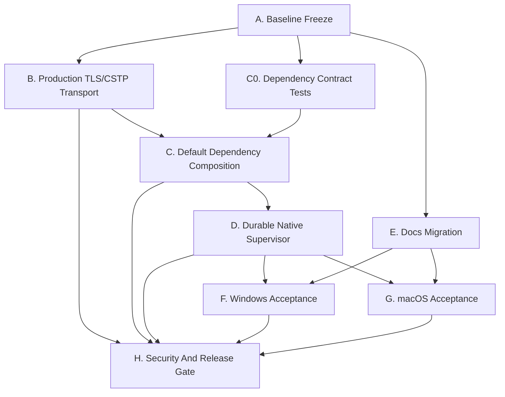

# Native OpenConnect Replacement Phase 3 - Production Transport And Native Release Readiness Plan

> **For agentic workers:** REQUIRED SUB-SKILL: Use `superpowers:subagent-driven-development` or `superpowers:executing-plans` to implement this plan task by task. Steps use checkbox (`- [ ]`) syntax for tracking.
> Status: ACTIVE.
> Date: 2026-05-31.
> Successor to:
> - `docs/superpowers/plans/2026-05-31-native-openconnect-replacement-phase2.md`
> - `docs/superpowers/plans/2026-05-31-native-openconnect-replacement-phase2.sync-conflict-20260531-012206-HTK7AHO.md`
> - native replacement items in the 2026-05-22 manual/release-readiness plans.

## Current wrap-up status

- COMPLETE/accepted in this wrap-up: Task A1, Task B1, Task B2, Task B3, Task C1, and Task E1.
- Task C1 was completed by subagent and passed Windows build/test coverage; macOS 实机验证仍待后续任务覆盖.
- Task B4 is partial: implementation/review complete; macOS validation pending. Do not treat Gate 2 as fully passed until the macOS build/CTest evidence is attached.
- Not completed by this wrap-up: remaining B4 macOS validation, C2, D*, F*, G*, H*, and later review gates remain open unless separately marked elsewhere.

**Goal:** Finish the native OpenConnect replacement release path by adding production CSTP/TLS transport, wiring native default dependencies, making native sessions durable under the helper/supervisor architecture, migrating docs, and producing Windows/macOS/manual/security acceptance evidence.

**Architecture:** Keep the Phase 2 clean-room protocol/session/platform boundaries. Phase 3 turns the existing injected-test engine into the production default: real TLS/CSTP transport feeds `ProtocolSession`, platform packet devices are created by default dependencies, and helper/supervisor-owned native sessions persist after the initiating command returns.

**Tech Stack:** C++17, CMake presets, nlohmann/json, Windows Winsock + Schannel, Windows Wintun + IP Helper, macOS SecureTransport with BSD socket callbacks, macOS utun + routing APIs, Vue/TypeScript desktop UI, CTest, Electron Builder.

---

## 0. Scope, Baseline, And Release Rules

### 0.1 Native v1 Scope

Native v1 includes only:

- ECNU username/password AnyConnect-compatible authentication.
- CSTP over TCP/TLS.
- IPv4 tunnel address, MTU, split include routes, and VPN server bypass route.
- Windows Wintun packet device and IP Helper network configuration.
- macOS utun packet device and native route/MTU configuration.
- UTF-8 structured events and JSON session state.

Native v1 excludes:

- DTLS acceleration.
- Arbitrary OpenConnect `extra_args`.
- SAML, browser login, MFA, certificate enrollment, and non-AnyConnect protocols.
- Linux native replacement.
- Removing legacy OpenConnect fallback source before native production acceptance passes.

Pass/fail rule:

- A native configuration that requests DTLS returns `unsupported_dtls`.
- A native configuration that includes legacy `extra_args` returns `unsupported_extra_args`.
- Production packages must not require OpenConnect assets.

### 0.2 Clean-Room Rule

Final product code must not copy OpenConnect-derived source, comments, state machines, parser structure, or constant tables.

Allowed inputs:

- Redacted traces from our own ECNU sessions.
- Public protocol descriptions.
- Existing repository behavior and tests.
- OpenConnect as a behavioral compatibility reference only, never as source for copied implementation.

Acceptance:

- Security review task H1 records an explicit clean-room pass before production packaging is accepted.
- Any source audit finding that looks OpenConnect-derived blocks release until replaced with independently written code and documented in the review.

### 0.3 Current Baseline In This Workspace

The current dirty workspace appears to have completed most Phase 2 A-H1 implementation slices:

- Clean-room spec exists at `docs/architecture/native-anyconnect-clean-room-spec.md`.
- Fixture policy and native AnyConnect fixtures exist under `docs/architecture/fixtures/` and `tests/fixtures/native_anyconnect/`.
- Engine/session/event abstractions exist under `src/vpn_engine/`.
- URL, HTTP, auth, CSTP header/frame, and protocol session units exist under `src/vpn_engine/protocol/`.
- Fake AnyConnect support exists under `tests/support/fake_anyconnect_server.*`.
- Native session store exists under `src/vpn_engine/native_session_store.*`.
- Windows Wintun, IP config, and packet device files exist under `src/platform/win32/`.
- macOS utun, route config, and packet device files exist under `src/platform/darwin/`.
- Native packaging policy test exists at `tests/native_packaging_policy_test.cpp`.
- Electron packaging denies OpenConnect payloads in `webui/electron-builder.config.cjs`.
- Runtime staging is native-first in `webui/scripts/prepare-native.cjs`.

Remaining Phase 2 work that moves into Phase 3:

- H2 documentation migration.
- I1 Windows manual native acceptance.
- I2 macOS manual native acceptance.
- I3 clean-room and security review.

Next major production gaps:

- Production TLS/CSTP transport is not implemented; the current default path can still return `native_transport_unimplemented`.
- Default dependency composition is not wired; `default_native_engine_dependencies()` currently does not create a production transport or platform packet device.
- Durable native supervisor ownership is not complete; the native start path can reject with `native_session_not_durable`.
- The existing CSTP frame helpers are test-harness framing unless proven against production traces; production CSTP wire handling must be verified independently.
- Manual Windows/macOS connect/disconnect evidence without OpenConnect installed does not exist in this workspace.

### 0.4 Copilot-Generated Subagents And Codex Coordination

The user uses Copilot to generate subagents. Codex is responsible for product acceptance and coordination.

Subagent policy:

- Use GPT-5.5 with the highest thinking/reasoning level for protocol, TLS, supervisor, platform networking, packaging, and security review tasks.
- Each subagent owns one workstream task or one narrowly bounded subtask.
- Each subagent must report changed files, commands run, exact outputs, and deviations from this plan.
- Codex reviews each subagent result against file boundaries, dependency contracts, clean-room rules, and acceptance commands before the task is marked complete.
- Subagents must stop if they need to read OpenConnect source or copy implementation details.

Recommended Copilot subagent prompt shape:

```text
You are a Copilot-generated subagent for ECNU-VPN native OpenConnect replacement Phase 3.

Task: <task id and title from docs/superpowers/plans/2026-05-31-native-openconnect-replacement-phase3-production-readiness.md>
Preferred model: GPT-5.5, highest thinking/reasoning level.
Coordinator: Codex owns final review, product acceptance, and integration.

Read first:
- docs/superpowers/plans/2026-05-31-native-openconnect-replacement-phase3-production-readiness.md
- docs/architecture/native-anyconnect-clean-room-spec.md
- files listed in the task boundary

Rules:
- Do not copy OpenConnect source, comments, parser structure, state machines, or constant tables.
- Keep changes inside the task file boundary.
- Add focused tests before product code changes.
- Report exact commands and outputs.
- Stop and ask Codex for contract resolution if file ownership or protocol behavior is ambiguous.
```

## 1. One-Level Workstream Overview

| Workstream | Purpose | Primary output | Depends on | Parallelism |
|---|---|---|---|---|
| A. Baseline Freeze And Conflict Cleanup | Stabilize Phase 2 artifacts and remove sync-conflict ambiguity from active execution | clean current task map and build target list | none | one coordinator |
| B. Production TLS/CSTP Transport | Replace fake/injected transport with real ECNU CSTP/TLS transport | production `ProtocolTransport` implementation and tests | A | parallel with C and D interface planning |
| C. Default Native Dependency Composition | Make native engine production path instantiate real transport and packet device factories | non-empty `default_native_engine_dependencies()` | B interface, platform packet devices | parallel after B1 |
| D. Durable Native Supervisor | Keep native session alive under helper/supervisor and expose stable status | managed native session lifetime and state cleanup | C factory contract | parallel design with B, implementation after C |
| E. Documentation Migration | Move H2 docs to native-first production language | updated user/build/manual docs | C package policy, D lifecycle wording | parallel after A |
| F. Windows Native Acceptance | Prove packaged Windows native connect/disconnect without OpenConnect | validation record and package evidence | B, C, D, E | parallel with G after integrated beta |
| G. macOS Native Acceptance | Prove packaged macOS native connect/disconnect without OpenConnect | validation record and package evidence | B, C, D, E | parallel with F after integrated beta |
| H. Security And Release Gate | Prove clean-room, credential redaction, and production package safety | security review and release decision | B-G | final gate |

## 2. Dependency Graph



## 3. Parallelism Recommendations

Use a multi-agent team only where file boundaries are independent:

| Lane | Good subagent assignment | Can start | Must not modify |
|---|---|---|---|
| A coordinator | Close old docs, freeze target list, review sync-conflict files | immediately | code |
| B1/B2 transport contract | `TlsStream` interface, mock stream tests, production transport parser tests | after A read-only scan | platform packet device files |
| B3 Windows TLS | Schannel stream implementation | after B1 interface is frozen | macOS files, supervisor |
| B4 macOS TLS | macOS TLS stream implementation | after B1 interface is frozen | Windows files, supervisor |
| C dependency composition | default factories and CMake wiring | after B1 and platform factory signatures are known | docs/manual validation |
| D supervisor | helper/supervisor native session lifetime | after C default factories compile | protocol parsers |
| E docs | README/build/user/manual migration | after A baseline is accepted | code |
| F Windows acceptance | Windows packaged test evidence | after B-D integrated beta | source code except validation docs |
| G macOS acceptance | macOS packaged test evidence | after B-D integrated beta | source code except validation docs |
| H security | clean-room and secret handling audit | after B-D code stabilizes | feature code |

Coordination rule:

- B1 publishes the transport interface before B3 and B4 begin.
- C starts with tests that prove defaults are wired but does not assume a particular TLS implementation beyond the B1 interface.
- D can design the session manager in parallel, but its product code waits until C can create production dependencies.
- F and G are evidence-only lanes once integrated beta builds.

## 4. Detailed Task Plan

### Task A1: Freeze Active Baseline And Remove Sync-Conflict Ambiguity

**Status:** COMPLETE - coordinator accepted for Phase 3 wrap-up.

**Meaning:** Establish which Phase 2 artifacts are active, which sync-conflict files are historical, and which exact build targets Phase 3 accepts.

**Files:**

- Modify only if needed: `docs/superpowers/plans/2026-05-31-native-openconnect-replacement-phase3-production-readiness.md`
- Read-only: `CMakeLists.txt`, `src/vpn_engine/**`, `src/platform/win32/**`, `src/platform/darwin/**`, `tests/**`

**Boundaries:**

- Do not touch product code in this task.
- Do not delete sync-conflict files in a dirty shared worktree.
- Record active/historical status in documentation only.

**Steps:**

- [x] Run:

```powershell
git status --short
rg --files src/vpn_engine tests docs/architecture docs/validation
rg -n "sync-conflict|native_transport_unimplemented|native_session_not_durable|fake-server/test-harness" src tests docs CMakeLists.txt
```

- [x] Record in the Phase 3 plan which sync-conflict files are not active execution inputs.
- [x] Confirm `CMakeLists.txt` contains targets for current Phase 2 native tests.

**Acceptance:**

- The active plan names Phase 3 as the only native replacement execution plan.
- No code file is modified by this task.
- Sync-conflict files are treated as historical inputs unless Codex explicitly promotes a specific file.

### Task B1: Define Production TLS Stream Boundary

**Status:** COMPLETE - coordinator/subtask acceptance recorded for Phase 3 wrap-up.

**Meaning:** Add a small stream abstraction so the protocol transport can be tested with a deterministic fake stream and backed by Schannel/SecureTransport in production.

**Files:**

- Create: `src/vpn_engine/protocol/tls_stream.hpp`
- Create: `src/vpn_engine/protocol/tls_stream.cpp`
- Test: `tests/native_tls_stream_contract_test.cpp`
- Modify: `CMakeLists.txt`

**Boundary:**

- This task defines only the cross-platform interface and mockable behavior.
- It does not implement Schannel or macOS TLS.
- It does not change native engine defaults.

**Interface shape:**

```cpp
struct TlsEndpoint {
  std::string host;
  int port = 443;
  std::string sni_host;
};

class TlsStream {
public:
  virtual ~TlsStream() = default;
  virtual ValidationResult connect(const TlsEndpoint &endpoint) = 0;
  virtual ValidationResult write_all(const std::vector<std::uint8_t> &bytes) = 0;
  virtual ValidationResult read_some(std::vector<std::uint8_t> *bytes) = 0;
  virtual void close() = 0;
};
```

**Acceptance commands:**

```powershell
cmake --build --preset windows-release --target native_tls_stream_contract_test
ctest --preset windows-release -R native_tls_stream_contract_test --output-on-failure
```

**Pass/fail acceptance:**

- Tests prove the interface can represent connect, full write, partial read, EOF, TLS verification failure, and cancellation-safe close.
- No platform TLS headers are included by files under `src/vpn_engine/protocol/`.
- No OpenConnect source or comments are referenced.

### Task B2: Implement Production CSTP/TLS ProtocolTransport Over TlsStream

**Status:** COMPLETE - coordinator/subtask acceptance recorded for Phase 3 wrap-up.

**Meaning:** Convert Phase 2 parsers into a real `ProtocolTransport` implementation that performs login, CSTP CONNECT, and packet exchange over a TLS stream.

**Files:**

- Create: `src/vpn_engine/protocol/production_transport.hpp`
- Create: `src/vpn_engine/protocol/production_transport.cpp`
- Test: `tests/native_production_transport_test.cpp`
- Modify: `CMakeLists.txt`
- Read-only: `docs/architecture/native-anyconnect-clean-room-spec.md`
- Read-only: `tests/fixtures/native_anyconnect/*.http`

**Boundary:**

- Uses `TlsStream` and existing parsers only.
- Does not instantiate OS TLS.
- Does not modify platform packet devices.
- Does not add DTLS or `extra_args`.

**Concrete behavior:**

- `authenticate()` opens or reuses a TLS stream, sends the v1 login GET/POST from the clean-room spec, parses cookies, and returns `AuthResult`.
- `connect_cstp()` sends the CSTP CONNECT request with the auth cookie and parses `TunnelMetadata`.
- `exchange_packet()` serializes one outbound CSTP data frame, reads until one inbound data frame is decoded, and returns the inbound IP packet.
- `disconnect()` sends a best-effort disconnect frame if the stream is open, then closes the stream.
- `reset_for_reconnect()` clears cookies and closes the stream so `ProtocolSession` can re-authenticate.

**Acceptance commands:**

```powershell
cmake --build --preset windows-release --target native_production_transport_test native_auth_parser_test native_cstp_frame_test native_protocol_session_test
ctest --preset windows-release -R "native_production_transport_test|native_auth_parser_test|native_cstp_frame_test|native_protocol_session_test" --output-on-failure
```

**Pass/fail acceptance:**

- Mock stream tests cover success, bad credentials, missing cookie, CSTP non-2xx, partial TLS reads, EOF during CSTP, reconnect reset, and password redaction.
- Production transport never emits password or cookie values in events.
- CSTP wire framing used here is verified against redacted ECNU captures before release; if verification fails, H1 blocks production acceptance.
- Native v1 still rejects DTLS and arbitrary `extra_args`.

### Task B3: Windows Schannel TlsStream

**Status:** COMPLETE - coordinator/subtask acceptance recorded for Phase 3 wrap-up.

**Meaning:** Provide the Windows production TLS stream used by default native dependencies without adding OpenSSL DLLs to the Windows package.

**Files:**

- Create: `src/platform/win32/native_tls_stream.hpp`
- Create: `src/platform/win32/native_tls_stream.cpp`
- Test: `tests/win32_native_tls_stream_test.cpp`
- Modify: `CMakeLists.txt`

**Boundary:**

- Windows-only implementation using Winsock and Schannel/SSPI.
- Does not touch macOS files.
- Does not change packaging beyond CMake link libraries if required.

**Concrete behavior:**

- Resolve host and connect TCP socket.
- Use SNI equal to `TlsEndpoint.sni_host`.
- Verify server certificate using OS trust store.
- Map certificate verification failure to `tls_verify_failed`.
- Map DNS/connect timeout to `tls_connect_failed`.
- Implement partial read buffering so HTTP and CSTP boundaries are not lost.
- Close socket and security context on all failure paths.

**Acceptance commands on Windows:**

```powershell
cmake --build --preset windows-release --target win32_native_tls_stream_test
ctest --preset windows-release -R win32_native_tls_stream_test --output-on-failure
```

**Pass/fail acceptance:**

- Mocked API tests cover success, DNS failure, TCP failure, TLS alert, verification failure, partial read, and close idempotency.
- `webui/scripts/prepare-native.cjs` still denies `libssl*`, `libcrypto*`, OpenConnect, libopenconnect, and GnuTLS assets.
- `Get-ChildItem -Recurse webui\release -Include "libssl*","libcrypto*","openconnect*","libopenconnect*","*gnutls*"` finds no production dependency after packaging.

### Task B4: macOS Native TlsStream

**Status:** PARTIAL - implementation/review complete; macOS validation pending.

**Meaning:** Provide the macOS production TLS stream used by default native dependencies without relying on Homebrew OpenConnect.

**Files:**

- Create: `src/platform/darwin/native_tls_stream.hpp`
- Create: `src/platform/darwin/native_tls_stream.cpp`
- Test: `tests/darwin_native_tls_stream_test.cpp`
- Modify: `CMakeLists.txt`

**Boundary:**

- macOS-only TLS stream implementation.
- Does not touch Windows files.
- Does not use shell commands for normal native mode.

**Subtask status:**

- [x] Implementation and review completed without relying on macOS host execution.
- [ ] macOS validation pending: run the macOS build/CTest commands below on a real macOS host and attach output before marking B4/Gate 2 complete.

**Concrete behavior:**

- Resolve host and connect TCP socket.
- Set SNI equal to `TlsEndpoint.sni_host`.
- Verify server certificate using macOS trust.
- Provide read/write callbacks or connection APIs that preserve socket ownership needed for CSTP packet exchange.
- Map trust failures to `tls_verify_failed`.
- Map connect and TLS handshake failures to stable error codes.
- Close socket/context on all paths.

**Acceptance commands on macOS only:**

```bash
cmake --build --preset macos-release --target darwin_native_tls_stream_test
ctest --preset macos-release -R darwin_native_tls_stream_test --output-on-failure
```

**Windows-machine note:** This cannot be run on the current Windows machine. A macOS validation host must run it and attach output to the task record.

**Pass/fail acceptance:**

- Mocked API tests cover success, connect failure, TLS verification failure, partial read, EOF, and idempotent close.
- No Homebrew OpenConnect, staged OpenConnect dylibs, libopenconnect, or GnuTLS assets are required.

### Task C1: Wire Default Native Engine Dependencies

**Status:** COMPLETE - subagent completed and Windows build/test passed; macOS 实机验证仍待后续任务覆盖.

**Meaning:** Make `NativeVpnEngineSession(config)` use production dependencies by default instead of empty factories.

**Files:**

- Modify: `src/vpn_engine/native_engine.hpp`
- Modify: `src/vpn_engine/native_engine.cpp`
- Modify: `CMakeLists.txt`
- Modify platform-specific factory files as needed:
  - `src/platform/win32/native_packet_device.hpp`
  - `src/platform/win32/native_packet_device.cpp`
  - `src/platform/darwin/native_packet_device.hpp`
  - `src/platform/darwin/native_packet_device.cpp`
- Test: `tests/native_engine_contract_test.cpp`
- Test: `tests/app_api_runtime_policy_test.cpp`
- Test: `tests/runtime_status_native_test.cpp`

**Boundary:**

- This task only composes existing production transport and packet device factories.
- It does not alter protocol parsing behavior.
- It does not alter helper/supervisor lifetime.

**Concrete behavior:**

- `default_native_engine_dependencies()` returns a `transport_factory` that creates `ProductionCstpTransport` backed by the platform `TlsStream`.
- On Windows, `packet_device_factory` returns `platform::create_native_packet_device()`.
- On macOS, `packet_device_factory` returns `platform::create_native_packet_device()`.
- On unsupported platforms, factories return deterministic unsupported errors; they do not silently choose legacy OpenConnect.
- Injected test dependencies remain supported and take precedence in unit tests.

**Acceptance commands on Windows:**

```powershell
cmake --build --preset windows-release --target native_engine_contract_test app_api_runtime_policy_test runtime_status_native_test
ctest --preset windows-release -R "native_engine_contract_test|app_api_runtime_policy_test|runtime_status_native_test" --output-on-failure
```

**Pass/fail acceptance:**

- Contract tests prove default factories are non-empty on Windows.
- Native mode no longer fails immediately with `native_transport_unimplemented` when default dependencies are requested.
- Missing Wintun maps to `wintun_missing`, not to OpenConnect guidance.
- Legacy mode still uses the existing OpenConnect path only when `vpn_engine=legacy_openconnect`.

### Task C2: Verify Production Packaging Composition

**Meaning:** Confirm production packages contain native binaries and native runtime assets only.

**Files:**

- Modify only if needed: `tests/native_packaging_policy_test.cpp`
- Modify only if needed: `webui/scripts/prepare-native.cjs`
- Modify only if needed: `webui/electron-builder.config.cjs`
- Modify only if needed: `runtime/README.md`

**Boundary:**

- Do not reintroduce OpenConnect staging into production paths.
- Legacy diagnostic staging remains behind `ECNUVPN_LEGACY_OPENCONNECT_RUNTIME=1`.

**Acceptance commands on Windows:**

```powershell
cmake --build --preset windows-release --target native_packaging_policy_test
ctest --preset windows-release -R native_packaging_policy_test --output-on-failure
cd webui
npm run desktop:build
cd ..
Get-ChildItem -Recurse webui\release -Include "openconnect*","libopenconnect*","*gnutls*","libssl*","libcrypto*" | Select-Object FullName
```

**Pass/fail acceptance:**

- The CTest target passes.
- `npm run desktop:build` exits 0.
- The package scan prints no OpenConnect, libopenconnect, GnuTLS, libssl, or libcrypto production assets.
- Windows package contains `exv.exe`, `exv-helper.exe`, required MinGW runtime DLLs, and `wintun.dll` when supplied through the native runtime directory.

### Task D1: Make Native Sessions Durable Under Helper/Supervisor

**Meaning:** Replace the current short-lived native start path with a managed native session that can outlive the initiating CLI/RPC call.

**Files:**

- Modify: `src/vpn.cpp`
- Modify: `src/helper.cpp`
- Modify: `src/vpn_engine/native_session_store.hpp`
- Modify: `src/vpn_engine/native_session_store.cpp`
- Modify if needed: `src/platform/common/vpn_supervisor_process.hpp`
- Modify if needed: `src/platform/common/vpn_supervisor_process.cpp`
- Modify platform supervisor files as needed:
  - `src/platform/win32/vpn_supervisor_process.cpp`
  - `src/platform/darwin/vpn_supervisor_process.cpp`
- Test: `tests/native_helper_session_test.cpp`
- Test: `tests/vpn_runtime_test.cpp`

**Boundary:**

- Do not redesign helper privilege architecture.
- Do not make native mode fall back to legacy OpenConnect.
- Do not use `route-ready` as native primary readiness.

**Concrete behavior:**

- Helper-managed native connect starts a durable process or helper-owned session that holds `NativeVpnEngineSession` until disconnect, failure, or service shutdown.
- Native session state records the durable owner PID, supervisor PID when present, phase, interface, internal IP, MTU, routes, and last error.
- `native_session_not_durable` is removed from the successful helper/service path.
- Stop/disconnect cancels the packet loop, closes transport, closes packet device, removes owned routes, and clears native session state.
- Crash or stale PID detection marks native state stopped and never reports `network_ready=true`.

**Acceptance commands on Windows:**

```powershell
cmake --build --preset windows-release --target native_helper_session_test vpn_runtime_test
ctest --preset windows-release -R "native_helper_session_test|vpn_runtime_test" --output-on-failure
```

**Pass/fail acceptance:**

- Tests prove native status comes from `native-session-state.json`.
- Tests prove `pid` or `supervisor_pid` points to a live managed owner, not an OpenConnect process.
- Tests prove stale owner PID clears running and network-ready status.
- Tests prove native `route-ready` is compatibility-only and not the primary readiness source.

### Task D2: Helper And Desktop RPC Native Lifecycle Contract

**Meaning:** Make desktop connect/disconnect/status paths behave the same with native sessions as legacy sessions, while hiding OpenConnect assumptions.

**Files:**

- Modify: `src/app_api.cpp`
- Modify: `src/vpn_runtime.cpp`
- Modify: `src/helper.cpp`
- Modify: `webui/desktop/shared/desktop-contract.ts`
- Modify: `webui/desktop/preload/index.ts`
- Modify: `webui/src/stores/vpn.ts`
- Modify: `webui/src/types/ecnu-vpn.d.ts`
- Test: `tests/app_api_runtime_policy_test.cpp`
- Test: `tests/runtime_status_native_test.cpp`
- Frontend build: `webui`

**Boundary:**

- Do not expose arbitrary native `extra_args`.
- Do not show native users an OpenConnect install requirement.
- Legacy diagnostics can remain behind explicit diagnostic mode.

**Concrete behavior:**

- `runtime.status` in native mode reports `engine=native`, `available=true`, and native dependency readiness.
- Missing Wintun or macOS permission failures are reported as native dependency errors.
- `legacy_openconnect` remains in diagnostics but is not the production availability source.
- Desktop connect waits for `network_ready` from native session state or returns a structured native failure.

**Acceptance commands on Windows:**

```powershell
cmake --build --preset windows-release --target app_api_runtime_policy_test runtime_status_native_test
ctest --preset windows-release -R "app_api_runtime_policy_test|runtime_status_native_test" --output-on-failure
cd webui
npm run build
npm run build:electron
```

**Pass/fail acceptance:**

- Native mode status does not mention missing OpenConnect as a blocker.
- Frontend and Electron TypeScript builds pass.
- UI error paths distinguish `tls_verify_failed`, `wintun_missing`, `utun_permission_denied`, `auth_failed`, and `unsupported_dtls`.

### Task E1: Complete H2 Documentation Migration

**Status:** COMPLETE - coordinator/subtask acceptance recorded for Phase 3 wrap-up.

**Meaning:** Update user-facing and release docs so production instructions are native-first and legacy OpenConnect is diagnostic-only.

**Files:**

- Modify: `README.md`
- Modify: `README_CN.md`
- Modify: `docs/user_guide.md`
- Modify: `docs/build_guide.md`
- Modify top closure/status block only if needed: `docs/superpowers/plans/2026-05-22-manual-test-guide.md`
- Modify top closure/status block only if needed: `docs/superpowers/plans/2026-05-22-release-hardening-queue.md`

**Boundary:**

- This task is documentation-only.
- Do not change code or packaging scripts.
- Preserve historical notes as historical; do not rewrite old plan bodies except allowed top status/closure blocks.

**Concrete behavior:**

- Docs state native is the production default.
- Docs state OpenConnect is development/diagnostic fallback only.
- Docs state native mode does not support arbitrary `extra_args`.
- Build docs describe `wintun.dll` as the Windows native runtime asset and no longer require OpenConnect staging for production packages.
- macOS docs do not require Homebrew OpenConnect for native production packages.

**Acceptance commands on Windows:**

```powershell
rg -n "must install OpenConnect|OpenConnect runtime assets present|Homebrew OpenConnect required|production packages require OpenConnect" README.md README_CN.md docs
rg -n "stage-openconnect-runtime|libopenconnect|GnuTLS|openconnect.exe" README.md README_CN.md docs\user_guide.md docs\build_guide.md
```

**Pass/fail acceptance:**

- First command prints no production requirement language.
- Second command prints only legacy diagnostic or historical-plan references.
- H2 is marked transferred to this Phase 3 task in the old-doc closure ledger.

### Task F1: Windows Automated Native Release Gate

**Meaning:** Run the full Windows build/test/package command set for native production readiness.

**Files:**

- Create: `docs/validation/native-windows-automated-2026-05-31.md`
- Modify only validation evidence if rerun on a later date: `docs/validation/native-windows-automated-YYYY-MM-DD.md`

**Boundary:**

- Evidence task only. Product fixes discovered here must be implemented in B, C, or D tasks.
- Do not edit source files in this task.

**Acceptance commands on Windows:**

```powershell
cd "D:\Development\Projects\cpp\ECNU-VPN"
cmake --preset windows-release
cmake --build --preset windows-release --target exv exv-helper
cmake --build --preset windows-release --target native_session_state_test native_event_sink_test native_url_test native_auth_parser_test native_cstp_frame_test native_protocol_session_test native_fake_anyconnect_server_test native_engine_contract_test native_helper_session_test native_packaging_policy_test runtime_status_native_test app_api_runtime_policy_test tunnel_script_contract_test openconnect_log_test win32_native_wintun_test win32_native_ip_config_test win32_native_packet_device_test vpn_runtime_test
ctest --preset windows-release -R "native_session_state_test|native_event_sink_test|native_url_test|native_auth_parser_test|native_cstp_frame_test|native_protocol_session_test|native_fake_anyconnect_server_test|native_engine_contract_test|native_helper_session_test|native_packaging_policy_test|runtime_status_native_test|app_api_runtime_policy_test|tunnel_script_contract_test|openconnect_log_test|win32_native_wintun_test|win32_native_ip_config_test|win32_native_packet_device_test|vpn_runtime_test" --output-on-failure
cd webui
npm run build
npm run build:electron
npm run desktop:build
cd ..
```

**Package inspection commands:**

```powershell
Get-Command openconnect -ErrorAction SilentlyContinue
Get-Process openconnect -ErrorAction SilentlyContinue
Get-ChildItem -Recurse webui\release -Include "exv.exe","exv-helper.exe","wintun.dll" | Select-Object FullName
Get-ChildItem -Recurse webui\release -Include "openconnect*","libopenconnect*","*gnutls*","libssl*","libcrypto*" | Select-Object FullName
```

**Pass/fail acceptance:**

- Configure, build, tests, frontend build, Electron build, and desktop package build exit 0.
- Package contains native binaries and required native runtime assets.
- Package scan prints no production OpenConnect/libopenconnect/GnuTLS/libssl/libcrypto assets.
- `Get-Process openconnect` prints no running OpenConnect process.

### Task F2: Windows Manual Native Connect Acceptance

**Meaning:** Prove real packaged Windows native connect/disconnect without OpenConnect installed or running.

**Files:**

- Create: `docs/validation/native-windows-acceptance-2026-05-31.md`
- Modify only validation evidence if rerun on a later date: `docs/validation/native-windows-acceptance-YYYY-MM-DD.md`

**Boundary:**

- Evidence task only.
- Requires Administrator PowerShell for service and route evidence.
- Cannot be completed by unit tests alone.

**Manual commands to record:**

```powershell
cd "D:\Development\Projects\cpp\ECNU-VPN"
Get-Command openconnect -ErrorAction SilentlyContinue
Get-Process openconnect -ErrorAction SilentlyContinue
Get-NetAdapter | Sort-Object Name | Select-Object Name, InterfaceIndex, Status
Get-NetRoute | Sort-Object DestinationPrefix, InterfaceIndex | Select-Object DestinationPrefix, NextHop, InterfaceIndex, RouteMetric
```

Connect through packaged UI, then record:

```powershell
.\build-windows\cpp\exv.exe desktop-rpc runtime.status "{}"
.\build-windows\cpp\exv.exe desktop-rpc status "{}"
Get-NetAdapter | Sort-Object Name | Select-Object Name, InterfaceIndex, Status
Get-NetIPAddress | Sort-Object InterfaceIndex | Select-Object InterfaceAlias, InterfaceIndex, IPAddress, PrefixLength
Get-NetRoute | Sort-Object DestinationPrefix, InterfaceIndex | Select-Object DestinationPrefix, NextHop, InterfaceIndex, RouteMetric
Get-Process openconnect -ErrorAction SilentlyContinue
```

Disconnect through packaged UI, then record:

```powershell
.\build-windows\cpp\exv.exe desktop-rpc status "{}"
Get-NetRoute | Where-Object { $_.InterfaceAlias -like "*ECNU*" -or $_.InterfaceAlias -like "*Wintun*" }
Get-Process openconnect -ErrorAction SilentlyContinue
```

**Pass/fail acceptance:**

- Packaged UI connects successfully with `vpn_engine=native`.
- No OpenConnect binary is required and no OpenConnect process runs.
- Session state reports `running=true` and `network_ready=true` while connected.
- Adapter name, ifIndex, internal IP, MTU, and split routes are recorded.
- Disconnect removes owned routes and clears native session state.
- UTF-8 logs are readable in Chinese and English.

**Windows-machine note:** This task can run on the current Windows machine only if the machine has ECNU VPN reachability, credentials, and required privileges. Otherwise it remains blocked with those concrete external blockers recorded in the validation document.

### Task G1: macOS Automated Native Release Gate

**Meaning:** Run the full macOS build/test/package command set for native production readiness.

**Files:**

- Create: `docs/validation/native-macos-automated-2026-05-31.md`
- Modify only validation evidence if rerun on a later date: `docs/validation/native-macos-automated-YYYY-MM-DD.md`

**Boundary:**

- Evidence task only.
- Product fixes discovered here must be implemented in B, C, or D tasks.

**Acceptance commands on macOS:**

```bash
cd /Users/tomli/Development/Projects/CPP/ECNU-VPN
cmake --preset macos-release
cmake --build --preset macos-release --target exv exv-helper
cmake --build --preset macos-release --target native_session_state_test native_event_sink_test native_url_test native_auth_parser_test native_cstp_frame_test native_protocol_session_test native_fake_anyconnect_server_test native_engine_contract_test native_helper_session_test native_packaging_policy_test runtime_status_native_test app_api_runtime_policy_test tunnel_script_contract_test openconnect_log_test darwin_native_utun_test darwin_native_route_config_test darwin_native_packet_device_test vpn_runtime_test
ctest --preset macos-release -R "native_session_state_test|native_event_sink_test|native_url_test|native_auth_parser_test|native_cstp_frame_test|native_protocol_session_test|native_fake_anyconnect_server_test|native_engine_contract_test|native_helper_session_test|native_packaging_policy_test|runtime_status_native_test|app_api_runtime_policy_test|tunnel_script_contract_test|openconnect_log_test|darwin_native_utun_test|darwin_native_route_config_test|darwin_native_packet_device_test|vpn_runtime_test" --output-on-failure
cd webui
npm run build
npm run build:electron
npm run desktop:build
cd ..
```

**Package inspection commands on macOS:**

```bash
command -v openconnect || true
pgrep -fl openconnect || true
find webui/release \( -name "openconnect" -o -name "libopenconnect*" -o -name "*gnutls*" -o -name "libssl*" -o -name "libcrypto*" \) -print
find webui/release \( -name "exv" -o -name "exv-helper" \) -print
```

**Windows-machine note:** This cannot be run on the current Windows machine. A macOS validation host must run it and attach output to the validation document.

**Pass/fail acceptance:**

- Configure, build, tests, frontend build, Electron build, and desktop package build exit 0 on macOS.
- Package contains native app binaries and does not contain OpenConnect/libopenconnect/GnuTLS production assets.
- `pgrep -fl openconnect` prints no running OpenConnect process.

### Task G2: macOS Manual Native Connect Acceptance

**Meaning:** Prove real packaged macOS native connect/disconnect without Homebrew or staged OpenConnect.

**Files:**

- Create: `docs/validation/native-macos-acceptance-2026-05-31.md`
- Modify only validation evidence if rerun on a later date: `docs/validation/native-macos-acceptance-YYYY-MM-DD.md`

**Boundary:**

- Evidence task only.
- Requires macOS host, ECNU VPN reachability, credentials, and helper/privilege paths.

**Manual commands to record on macOS before connect:**

```bash
cd /Users/tomli/Development/Projects/CPP/ECNU-VPN
command -v openconnect || true
pgrep -fl openconnect || true
ifconfig | grep -A8 '^utun' || true
netstat -rn -f inet
scutil --nwi
```

Connect through packaged app helper-installed path and one-shot elevated path, then record:

```bash
./build/macos/cpp/exv desktop-rpc runtime.status "{}"
./build/macos/cpp/exv desktop-rpc status "{}"
ifconfig | grep -A8 '^utun' || true
netstat -rn -f inet
scutil --nwi
pgrep -fl openconnect || true
```

Disconnect, then record:

```bash
./build/macos/cpp/exv desktop-rpc status "{}"
ifconfig | grep -A8 '^utun' || true
netstat -rn -f inet
pgrep -fl openconnect || true
```

**Windows-machine note:** This cannot be run on the current Windows machine. A macOS validation host must run it and attach output to the validation document.

**Pass/fail acceptance:**

- Packaged app connects successfully with `vpn_engine=native` using helper-installed path.
- One-shot elevated path either connects successfully or returns a structured privilege-denied error without stale routes.
- No Homebrew/staged OpenConnect binary is required and no OpenConnect process runs.
- Session state records utun name, internal IP, split routes, server bypass route, and UTF-8 events.
- Disconnect removes owned routes and clears native session state.
- Crash cleanup procedure in `docs/validation/macos-native-route-crash-cleanup.md` remains accurate.

### Task H1: Source Audit And Secret-Handling Review

**Meaning:** Prove the production native code respects clean-room boundaries and does not leak credentials.

**Files:**

- Create: `docs/security/native-openconnect-replacement-review-2026-05-31.md`
- Modify only validation evidence if rerun on a later date: `docs/security/native-openconnect-replacement-review-YYYY-MM-DD.md`

**Boundary:**

- Review task only.
- Any product fix discovered here goes back to B, C, D, or E.

**Acceptance commands on Windows:**

```powershell
rg -n "openconnect|OpenConnect|vpnc|CSTP|AnyConnect" src tests docs
rg -n "password|cookie|Authorization|Set-Cookie" src\vpn_engine tests
rg -n "native_transport_unimplemented|native_session_not_durable|fake-server/test-harness" src tests docs
```

**Pass/fail acceptance:**

- Review document classifies every OpenConnect reference as legacy fallback, diagnostic packaging, compatibility note, or historical plan text.
- Review document explicitly states whether any production source appears OpenConnect-derived.
- Passwords and cookies are redacted from events/logs/status.
- TLS verification behavior is documented for Windows and macOS.
- Production release is blocked if this review does not record a clean-room pass.

### Task H2: Final Native Production Release Decision

**Meaning:** Convert build/manual/security evidence into a single release readiness decision.

**Files:**

- Create: `docs/validation/native-production-release-readiness-2026-05-31.md`

**Boundary:**

- Release decision only.
- No source changes.

**Required evidence:**

- F1 Windows automated gate passed.
- F2 Windows manual native connect acceptance passed or is explicitly blocked by external environment with no release approval.
- G1 macOS automated gate passed on macOS.
- G2 macOS manual native connect acceptance passed on macOS.
- H1 clean-room/security review passed.
- E1 documentation migration passed.

**Acceptance:**

- The release readiness document records one decision: `pass`, `blocked`, or `fail`.
- A `pass` decision includes links to all validation/security documents.
- A `blocked` decision names exact blockers, such as missing macOS host, missing ECNU credentials, no ECNU network reachability, or missing signing identity.
- A `fail` decision links each failure to a Phase 3 task that must be reopened.

## 5. Current Acceptance Command Set

These commands are known from the current workspace and should be used by Codex and subagents as the acceptance baseline. Commands under macOS/manual sections cannot be completed on this Windows machine.

### 5.1 Windows Local Automated Commands

```powershell
cd "D:\Development\Projects\cpp\ECNU-VPN"
cmake --preset windows-release
cmake --build --preset windows-release --target exv exv-helper
cmake --build --preset windows-release --target native_session_state_test native_event_sink_test native_url_test native_auth_parser_test native_cstp_frame_test native_protocol_session_test native_fake_anyconnect_server_test native_engine_contract_test native_helper_session_test native_packaging_policy_test runtime_status_native_test app_api_runtime_policy_test tunnel_script_contract_test openconnect_log_test win32_native_wintun_test win32_native_ip_config_test win32_native_packet_device_test vpn_runtime_test
ctest --preset windows-release -R "native_session_state_test|native_event_sink_test|native_url_test|native_auth_parser_test|native_cstp_frame_test|native_protocol_session_test|native_fake_anyconnect_server_test|native_engine_contract_test|native_helper_session_test|native_packaging_policy_test|runtime_status_native_test|app_api_runtime_policy_test|tunnel_script_contract_test|openconnect_log_test|win32_native_wintun_test|win32_native_ip_config_test|win32_native_packet_device_test|vpn_runtime_test" --output-on-failure
cd webui
npm run build
npm run build:electron
npm run desktop:build
cd ..
```

### 5.2 Windows Package And Runtime Inspection

```powershell
Get-Command openconnect -ErrorAction SilentlyContinue
Get-Process openconnect -ErrorAction SilentlyContinue
Get-ChildItem -Recurse webui\release -Include "exv.exe","exv-helper.exe","wintun.dll" | Select-Object FullName
Get-ChildItem -Recurse webui\release -Include "openconnect*","libopenconnect*","*gnutls*","libssl*","libcrypto*" | Select-Object FullName
.\build-windows\cpp\exv.exe desktop-rpc runtime.status "{}"
.\build-windows\cpp\exv.exe desktop-rpc status "{}"
```

### 5.3 macOS Automated Commands

Cannot be run on this Windows machine.

```bash
cd /Users/tomli/Development/Projects/CPP/ECNU-VPN
cmake --preset macos-release
cmake --build --preset macos-release --target exv exv-helper
cmake --build --preset macos-release --target native_session_state_test native_event_sink_test native_url_test native_auth_parser_test native_cstp_frame_test native_protocol_session_test native_fake_anyconnect_server_test native_engine_contract_test native_helper_session_test native_packaging_policy_test runtime_status_native_test app_api_runtime_policy_test tunnel_script_contract_test openconnect_log_test darwin_native_utun_test darwin_native_route_config_test darwin_native_packet_device_test vpn_runtime_test
ctest --preset macos-release -R "native_session_state_test|native_event_sink_test|native_url_test|native_auth_parser_test|native_cstp_frame_test|native_protocol_session_test|native_fake_anyconnect_server_test|native_engine_contract_test|native_helper_session_test|native_packaging_policy_test|runtime_status_native_test|app_api_runtime_policy_test|tunnel_script_contract_test|openconnect_log_test|darwin_native_utun_test|darwin_native_route_config_test|darwin_native_packet_device_test|vpn_runtime_test" --output-on-failure
cd webui
npm run build
npm run build:electron
npm run desktop:build
cd ..
```

### 5.4 macOS Package And Runtime Inspection

Cannot be run on this Windows machine.

```bash
command -v openconnect || true
pgrep -fl openconnect || true
find webui/release \( -name "openconnect" -o -name "libopenconnect*" -o -name "*gnutls*" -o -name "libssl*" -o -name "libcrypto*" \) -print
find webui/release \( -name "exv" -o -name "exv-helper" \) -print
./build/macos/cpp/exv desktop-rpc runtime.status "{}"
./build/macos/cpp/exv desktop-rpc status "{}"
```

## 6. Old Task Migration Matrix

| Old task/item | Current status in workspace | Phase 3 owner | Migration decision |
|---|---|---|---|
| A1 Clean-room protocol spec | Largely complete | H1 | Keep as release input; audit before release |
| A2 fixtures and redaction rules | Largely complete | H1 | Keep as release input; audit redaction |
| B1 session state schema | Largely complete | D1 | Reuse; extend for durable owner state |
| B2 UTF-8 event sink | Largely complete | D1, H1 | Reuse; verify no credential leakage |
| C1 URL/HTTP parsing | Largely complete | B2 | Reuse in production transport |
| C2 auth parser | Largely complete | B2, H1 | Reuse; verify live ECNU behavior |
| C3 CSTP header/frame parser | Partly complete | B2, H1 | Reuse only after production framing is verified |
| C4 fake AnyConnect server | Largely complete | B2 | Keep for regression and transport mock tests |
| C5 reconnect/DPD behavior | Partly complete | B2, D1 | Extend around production transport and durable sessions |
| D Windows Wintun/IP/packet layer | Largely complete by mock tests | C1, F1, F2 | Wire into defaults and prove manually |
| E macOS utun/route/packet layer | Largely complete by mock tests | C1, G1, G2 | Wire into defaults and prove on macOS |
| F1 native engine composition | Partly complete with injected dependencies | B2, C1 | Replace default empty factories with production composition |
| F2 helper/supervisor session state | Partly complete | D1, D2 | Make managed native session durable |
| F3 disable log scraping for native mode | Largely complete | H1 | Audit and keep legacy-only behavior |
| G1 desktop/API native runtime contract | Largely complete | D2, E1 | Verify native UX and docs |
| H1 production packaging policy | Largely complete | C2, F1, G1 | Keep policy and run package evidence |
| H2 documentation migration | Open | E1 | Transfer directly |
| I1 Windows manual native acceptance | Open | F2 | Transfer directly |
| I2 macOS manual native acceptance | Open | G2 | Transfer directly; cannot run on Windows |
| I3 clean-room/security review | Open | H1 | Transfer directly |
| 2026-05-22 OpenConnect runtime package checks | Historical/legacy | E1, C2 | Replace production requirement with native package scan |
| Linux OpenConnect install hardening | Out of native v1 scope | none | Leave to separate Linux/legacy plan |

## 7. Old Docs Closure Ledger

| Document | Closure action | Remaining live content |
|---|---|---|
| `docs/superpowers/plans/2026-05-31-native-openconnect-replacement-phase2.md` | Close as superseded by this Phase 3 plan | Historical Phase 2 decomposition and task origin |
| `docs/superpowers/plans/2026-05-31-native-openconnect-replacement-phase2.sync-conflict-20260531-012206-HTK7AHO.md` | Close as superseded duplicate/conflict artifact | Historical only; not an active execution source |
| `docs/superpowers/plans/2026-05-22-manual-test-guide.md` | Close for native replacement lane | Historical develop-merge manual guide; native manual acceptance is F2/G2 |
| `docs/superpowers/plans/2026-05-22-release-hardening-queue.md` | Close for native replacement lane | Historical hardening context and legacy fallback diagnostics |
| `docs/superpowers/plans/2026-05-22-develop-merge-and-release-readiness.md` | Close for native replacement lane | Historical develop merge plan |
| `docs/superpowers/plans/2026-05-31-openconnect-native-replacement-closed.md` | Add successor note to Phase 3 | Historical previous-plan closure |

## 8. Review Gates

### Gate 1: Transport Contract Freeze

Required tasks:

- A1
- B1
- B2 mock-stream tests

Commands:

```powershell
cmake --build --preset windows-release --target native_tls_stream_contract_test native_production_transport_test native_protocol_session_test
ctest --preset windows-release -R "native_tls_stream_contract_test|native_production_transport_test|native_protocol_session_test" --output-on-failure
```

Gate passes when:

- Transport interface is stable.
- Production transport passes mock TLS stream tests.
- No release-critical behavior depends on fake-server-only framing without H1 review.

### Gate 2: Platform TLS And Default Composition

Required tasks:

- B3 on Windows
- B4 on macOS
- C1

Windows commands:

```powershell
cmake --build --preset windows-release --target win32_native_tls_stream_test native_engine_contract_test runtime_status_native_test
ctest --preset windows-release -R "win32_native_tls_stream_test|native_engine_contract_test|runtime_status_native_test" --output-on-failure
```

macOS commands:

```bash
cmake --build --preset macos-release --target darwin_native_tls_stream_test native_engine_contract_test runtime_status_native_test
ctest --preset macos-release -R "darwin_native_tls_stream_test|native_engine_contract_test|runtime_status_native_test" --output-on-failure
```

Gate passes when:

- Default native dependencies are production factories on Windows and macOS.
- Missing platform dependency errors are native-specific.
- macOS results are attached because they cannot be generated on Windows.

### Gate 3: Durable Native Session

Required tasks:

- D1
- D2

Commands:

```powershell
cmake --build --preset windows-release --target native_helper_session_test vpn_runtime_test app_api_runtime_policy_test runtime_status_native_test
ctest --preset windows-release -R "native_helper_session_test|vpn_runtime_test|app_api_runtime_policy_test|runtime_status_native_test" --output-on-failure
cd webui
npm run build
npm run build:electron
```

Gate passes when:

- Native session can be managed by helper/supervisor and outlive the initiating call.
- Status is session-state driven.
- UI does not expose OpenConnect as a native production dependency.

### Gate 4: Production Package Candidate

Required tasks:

- C2
- E1
- H1 preliminary source audit

Commands:

```powershell
cmake --build --preset windows-release --target native_packaging_policy_test
ctest --preset windows-release -R native_packaging_policy_test --output-on-failure
cd webui
npm run desktop:build
cd ..
Get-ChildItem -Recurse webui\release -Include "openconnect*","libopenconnect*","*gnutls*","libssl*","libcrypto*" | Select-Object FullName
```

Gate passes when:

- Production package excludes OpenConnect and unwanted TLS payloads.
- Docs no longer describe OpenConnect as production-required for native.
- Clean-room review has no preliminary blocker.

### Gate 5: Manual Acceptance And Security

Required tasks:

- F1
- F2
- G1
- G2
- H1
- H2

Gate passes when:

- Windows automated evidence passes.
- Windows manual native acceptance passes.
- macOS automated evidence passes on macOS.
- macOS manual native acceptance passes on macOS.
- Security review records a clean-room pass.
- Release readiness document records `pass`.

## 9. Known Risks And Concrete Mitigations

| Risk | Impact | Mitigation | Blocking acceptance |
|---|---|---|---|
| CSTP production framing differs from test harness | Native tunnel cannot pass real packets | Validate B2 against redacted ECNU captures and H1 source audit | F2/G2 cannot pass until resolved |
| Schannel/SecureTransport socket APIs constrain packet loop reads | Transport stalls or drops frames | B1 stream interface requires partial-read tests and close semantics | B3/B4 tests must pass |
| Native default factories accidentally pick legacy OpenConnect | Reintroduces production dependency | C1 tests assert native factories and C2 package policy denies OpenConnect | Gate 2 and Gate 4 |
| Native session exits when CLI/RPC returns | UI reports false connected state or drops tunnel | D1 creates durable helper/supervisor owner | Gate 3 |
| Credentials or cookies appear in logs/events | Security release blocker | B2/H1 redaction tests and review | H1 clean-room/security pass |
| macOS route cleanup leaves stale routes | User network breakage | G2 records disconnect/crash cleanup evidence; route config remains owner-scoped | G2 manual pass |
| Missing macOS host or credentials | Cannot accept release | H2 records `blocked` with exact external blocker | No release pass |

## 10. Non-Goals For Phase 3

- DTLS implementation.
- Arbitrary OpenConnect `extra_args` in native mode.
- Linux native replacement.
- SAML/MFA/browser auth.
- Replacing the helper privilege architecture.
- Removing legacy fallback code before native production acceptance passes.
- Shipping production OpenConnect, libopenconnect, GnuTLS, staged macOS dylibs, or OpenSSL DLLs for Windows native packages.
