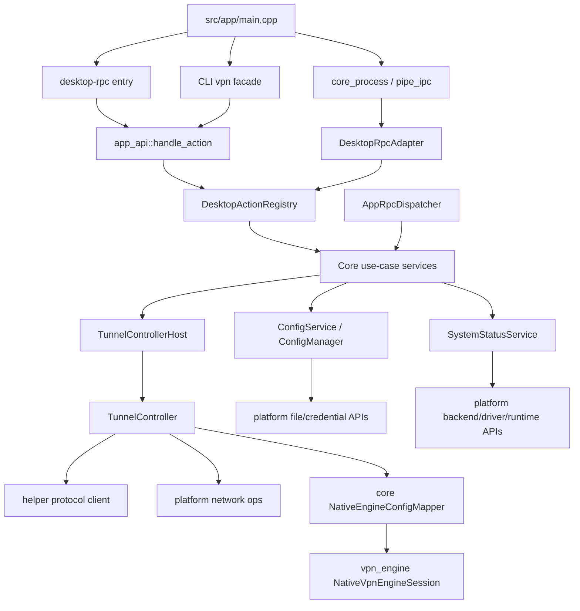

# Core Architecture Normalization Implementation Plan

> **For agentic workers:** REQUIRED SUB-SKILL: Use superpowers:subagent-driven-development (recommended) or superpowers:executing-plans to implement this plan task-by-task. Steps use checkbox (`- [ ]`) syntax for tracking.

**Goal:** Normalize `src/core` so desktop API, core RPC, config, tunnel runtime, and `vpn_engine` dependencies have one clear authority and one cross-platform architecture.

**Architecture:** Keep `core` as the business orchestration layer. Thin process and API entrypoints dispatch into shared core use-case services; those services own config persistence, route settings, helper/backend status presentation, and tunnel session orchestration. `vpn_engine` becomes lower-level engine code that accepts `VpnEngineConfig` only and never includes `core/config`.

**Tech Stack:** C++20, CMake 3.28, nlohmann/json, CTest, existing C++20 named module facade pattern, repository contract tests.

---

## Current Quantified Problems

### Problem 1: `src/core/app_api/app_api.cpp` is too heavy

**Measured state**
- `src/core/app_api/app_api.cpp` has 1073 lines.
- It has 44 `#include` directives.
- It registers 18 desktop legacy handlers in one function.
- It owns JSON helpers, runtime-context bootstrap, config reads/writes, password resolution, backend resolution, connection-attempt locking, helper connector creation, `TunnelController` singleton lifetime, status presentation, routes, service/helper/driver status, runtime status, log listing, and action dispatch.

**How it appears in behavior**
- A change to config UI, helper backend resolution, VPN connect, driver status, or log listing can require editing the same file.
- Tests such as `tests/app_api_status_contract_test.cpp` replicate mapping logic because the status presenter is hidden inside the anonymous namespace of `app_api.cpp`.
- The file directly includes `platform/common/*`, `helper/*`, `vpn_engine/*`, `core/config/*`, `core/rpc/*`, and `core/tunnel_controller/*`, so it behaves as a multi-subsystem integration unit rather than a thin app API facade.

**Target state**
- `app_api.cpp` is a thin shell under 150 lines.
- `app_api::handle_action(action, payload)` only applies outer exception handling and forwards to a registry.
- Desktop action groups live in focused files:
  - `src/core/app_api/desktop_action_registry.hpp`
  - `src/core/app_api/desktop_action_registry.cpp`
  - `src/core/app_api/desktop_json.hpp`
  - `src/core/app_api/desktop_json.cpp`
  - `src/core/app_api/desktop_runtime_context.hpp`
  - `src/core/app_api/desktop_runtime_context.cpp`
  - `src/core/app_api/desktop_status_presenter.hpp`
  - `src/core/app_api/desktop_status_presenter.cpp`
  - `src/core/app_api/desktop_tunnel_host.hpp`
  - `src/core/app_api/desktop_tunnel_host.cpp`
  - `src/core/app_api/desktop_vpn_actions.hpp`
  - `src/core/app_api/desktop_vpn_actions.cpp`
  - `src/core/app_api/desktop_config_actions.hpp`
  - `src/core/app_api/desktop_config_actions.cpp`
  - `src/core/app_api/desktop_route_actions.hpp`
  - `src/core/app_api/desktop_route_actions.cpp`
  - `src/core/app_api/desktop_system_actions.hpp`
  - `src/core/app_api/desktop_system_actions.cpp`
  - `src/core/app_api/desktop_log_actions.hpp`
  - `src/core/app_api/desktop_log_actions.cpp`

### Problem 2: Parts of `core/rpc` are not authoritative implementations

**Measured state**
- `src/core/rpc/config_actions.cpp` contains 4 explicit stub comments and returns empty/ack-only data.
- `src/core/rpc/service_actions.cpp` contains helper/service/driver handlers that return `"unknown"` or `"not_implemented"`.
- `src/core/rpc/route_actions.hpp` owns `std::vector<UserRoute> user_routes_`, and `src/core/rpc/route_actions.cpp` mutates that in-memory vector instead of persisted config routes.
- `src/core/rpc/vpn_actions.cpp` is real enough to call `TunnelController`, but it is not the path used by `core_process_main`, which currently wraps incoming JSON through `app_api::handle_action`.

**How it appears in behavior**
- The same action family can produce different behavior depending on entrypoint:
  - Desktop `config.getSettings` reads real config through `ConfigManager`.
  - Native RPC `config.get` returns an empty object.
  - Desktop `routes.add` persists via `config_api::route_add`.
  - Native RPC `route.add` writes only to `RouteActions::user_routes_`.
  - Desktop `helper.status` resolves backend through `platform::resolve_backend`.
  - Native RPC `service.helper_status` returns `"unknown"`.
- Tests under `tests/core_api/` currently verify the stub behavior instead of the real product behavior.

**Target state**
- `core/rpc` and desktop app API both call the same core use-case services.
- No production action handler returns fake success, empty config, in-memory route state, `"unknown"` status, or `"not_implemented"` for an action that is exposed as public product behavior.
- `core_process_main` has one clearly selected dispatch path:
  - Desktop-compatible envelope routes through `DesktopRpcAdapter`.
  - Core native envelope routes through `AppRpcDispatcher`.
  - Both adapters land on shared services for config/routes/service/runtime/tunnel actions.

### Problem 3: `config` has new and old compilation units coexisting

**Measured state**
- `src/core/config/config_original.cpp` has 1228 lines.
- Split files also exist and are compiled:
  - `src/core/config/config_persistence.cpp` has 157 lines.
  - `src/core/config/config_set_value.cpp` has 244 lines.
  - `src/core/config/config_routes.cpp` has 54 lines.
  - `src/core/config/config_key.cpp` has 60 lines.
  - `src/core/config/config_show.cpp` has 51 lines.
  - `src/core/config/config_wizard_common.cpp` has 107 lines.
  - `src/core/config/config_manager.cpp` has 94 lines.
  - `src/core/config/config_api.cpp` has 344 lines.
- `CMakeLists.txt` compiles both `config_original.cpp` and the split files.
- `config_original.cpp` and the split files define the same public functions under `ecnuvpn::config`, including `load`, `save`, `import_from`, `reset`, `set_value`, route operations, and key operations.

**How it appears in behavior**
- There is no single source of truth for config persistence or CLI config behavior.
- A developer changing password import, route defaults, key status, or reset behavior must know whether the real path is in `config_original.cpp`, split files, `ConfigManager`, or `config_api`.
- The current build graph is at risk of duplicate-definition failures and inconsistent behavior if one path changes without the other.

**Target state**
- `Config` data model stays in `src/core/config/config.hpp`.
- `ConfigManager` is the only persistence owner.
- `config_api` is the only non-interactive mutation API used by desktop and RPC action handlers.
- CLI-facing `ecnuvpn::config::*` functions are thin wrappers around `ConfigManager` and `config_api`.
- `config_original.cpp` is removed from production compilation and then deleted after equivalent split files are verified.
- CMake has no reference to `src/core/config/config_original.cpp`.

### Problem 4: `vpn_engine/native_engine.hpp` depends upward on `core/config`

**Measured state**
- `src/vpn_engine/native_engine.hpp` includes `core/config/config.hpp`.
- `vpn_engine::validate_native_config(const Config&)` and `vpn_engine::make_native_config(const Config&, const std::string&)` use the core `Config` type.
- `src/core/tunnel_controller/core_session_runner.cpp` calls `vpn_engine::make_native_config(cfg, password)`.
- Tests such as `tests/native_engine_contract_test.cpp` include both `core/config/config.hpp` and `vpn_engine/native_engine.hpp`.

**How it appears in behavior**
- `vpn_engine` cannot be treated as a lower-level reusable engine library because it imports the higher-level app configuration model.
- The dependency direction conflicts with the intended layering: `core` should adapt app config into engine config, then call `vpn_engine`.
- C++20 module boundaries become harder because `vpn_engine` headers pull in `core/config` and nlohmann serialization from a higher layer.

**Target state**
- `vpn_engine/native_engine.hpp` only exposes engine-level types and functions.
- `vpn_engine` validates `VpnEngineConfig`, not `ecnuvpn::Config`.
- Core owns the adapter from `Config` to `VpnEngineConfig`:
  - `src/core/tunnel_controller/native_engine_config_mapper.hpp`
  - `src/core/tunnel_controller/native_engine_config_mapper.cpp`
- Repository contract tests reject `#include "core/..."` under `src/vpn_engine`.

---

## Target Logical Architecture



**Dependency rule**
- Allowed: `app -> core -> platform/helper/vpn_engine/common/utils`.
- Allowed: `core/app_api` and `core/rpc` depend on `core/use_cases`.
- Allowed: `core/tunnel_controller` depends on helper client interfaces, platform network ops, and `vpn_engine`.
- Forbidden: `vpn_engine -> core`.
- Forbidden: public RPC action handlers that implement a different behavior from desktop handlers for the same product action.
- Forbidden: production fake handlers for public actions.

---

## File Structure After Completion

### App API
- `src/core/app_api/app_api.hpp`: public `handle_action` declaration and app API state query.
- `src/core/app_api/app_api.cpp`: thin exception boundary and registry dispatch.
- `src/core/app_api/desktop_action_registry.hpp/.cpp`: registration and dispatch for desktop-compatible actions.
- `src/core/app_api/desktop_json.hpp/.cpp`: `ok`, `error`, `json_safe_text`, and payload helpers.
- `src/core/app_api/desktop_runtime_context.hpp/.cpp`: desktop payload runtime context application.
- `src/core/app_api/desktop_status_presenter.hpp/.cpp`: maps `TunnelStatusSnapshot`, config, runtime, service, driver, and virtual network status into desktop JSON.
- `src/core/app_api/desktop_tunnel_host.hpp/.cpp`: owns helper connector, helper client, network ops, and `TunnelController` lifetime for desktop/CLI flows.
- `src/core/app_api/desktop_vpn_actions.hpp/.cpp`: desktop `vpn.connect`, `vpn.disconnect`, `status.get`.
- `src/core/app_api/desktop_config_actions.hpp/.cpp`: desktop `config.getAuth`, `config.saveAuth`, `config.getSettings`, `config.saveSettings`, `config.getKey`.
- `src/core/app_api/desktop_route_actions.hpp/.cpp`: desktop `routes.list`, `routes.add`, `routes.remove`, `routes.reset`.
- `src/core/app_api/desktop_system_actions.hpp/.cpp`: desktop `service.status`, `helper.status`, `runtime.status`, `drivers.status`, `drivers.install`.
- `src/core/app_api/desktop_log_actions.hpp/.cpp`: desktop `logs.list`.

### Core Use Cases
- `src/core/use_cases/config_use_cases.hpp/.cpp`: authoritative config/auth/settings/routes/key operations.
- `src/core/use_cases/system_status_use_cases.hpp/.cpp`: authoritative helper/service/runtime/driver status operations.
- `src/core/use_cases/tunnel_use_cases.hpp/.cpp`: connect/disconnect/status operations shared by app API and RPC.

### Config
- `src/core/config/config.hpp`: `Config` data model and minimal public CLI declarations.
- `src/core/config/config_manager.hpp/.cpp`: only config persistence implementation.
- `src/core/config/config_api.hpp/.cpp`: non-interactive mutation API.
- `src/core/config/config_persistence.cpp`: CLI compatibility wrappers around `ConfigManager`.
- `src/core/config/config_set_value.cpp`: CLI `config set` wrapper around `config_api`.
- `src/core/config/config_routes.cpp`: CLI route wrappers around `config_api`.
- `src/core/config/config_key.cpp`: CLI key wrappers around `config_api` and `crypto`.
- `src/core/config/config_show.cpp`: CLI presentation only.
- `src/core/config/config_original.cpp`: deleted.

### VPN Engine Boundary
- `src/vpn_engine/native_engine.hpp`: no `core/*` include; accepts `VpnEngineConfig`.
- `src/vpn_engine/native_engine.cpp`: validates `VpnEngineConfig`.
- `src/core/tunnel_controller/native_engine_config_mapper.hpp/.cpp`: converts `ecnuvpn::Config + password` to `VpnEngineConfig` and applies native-engine validation policy.
- `src/core/tunnel_controller/core_session_runner.cpp`: calls the mapper before constructing `NativeVpnEngineSession`.

---

## Phase 0: Add Architecture Measurement Gates

**Files:**
- Create: `tests/core_architecture_contract_test.cpp`
- Modify: `CMakeLists.txt`

- [ ] Add a read-only contract test target `core_architecture_contract_test`.

The test should use `ECNUVPN_SOURCE_DIR` and verify source-level architecture rules after each phase. Start with gates that pass on the first phase and add stricter gates in later phases when implementation catches up.

Required initial checks:
- `src/core/app_api/app_api.cpp` exists.
- `src/core/rpc/app_rpc_dispatcher.cpp` exists.
- `src/core/config/config_manager.cpp` exists.
- `src/vpn_engine/native_engine.hpp` exists.

Command:

```powershell
cmake --build build --target core_architecture_contract_test --config Debug
ctest --test-dir build -C Debug --output-on-failure -R "^core_architecture_contract_test$"
```

Expected after Phase 0:
- The new test target builds.
- The test passes without changing production behavior.

- [ ] Commit Phase 0.

Commit message:

```text
test: add core architecture contract baseline
```

---

## Phase 1: Split `app_api.cpp` Into Focused Desktop API Units

**Files:**
- Modify: `src/core/app_api/app_api.cpp`
- Create: files listed in the App API section above
- Modify: `CMakeLists.txt`
- Modify: `tests/app_api_status_contract_test.cpp`
- Modify: `tests/contract_manifest_test.cpp`
- Modify: `tests/core_architecture_contract_test.cpp`

- [ ] Add tests for extracted status presenter behavior.

Move replicated status expectations out of `tests/app_api_status_contract_test.cpp` and exercise `desktop_status_presenter.hpp` directly. The test should construct a `TunnelStatusSnapshot`, a `Config`, and verify the desktop JSON fields:
- `connected`
- `phase`
- `server`
- `interface`
- `network_ready`
- `auto_reconnect`
- `last_error`
- virtual-network fields added by `core/network/virtual_network_status`

- [ ] Extract JSON helpers.

Move local helper functions from `app_api.cpp` into `desktop_json.hpp/.cpp`. `app_api.cpp` should include `desktop_json.hpp` only for outer error handling if still needed.

- [ ] Extract runtime-context application.

Move payload-to-runtime bootstrap logic into `desktop_runtime_context.hpp/.cpp`. Desktop action handlers must call a named function instead of anonymous-namespace code.

- [ ] Extract `TunnelController` host.

Move the singleton holder, helper connector creation, endpoint override handling, `ensure_tunnel_controller`, `get_tunnel_controller_if_exists`, and `reset_tunnel_controller` into `desktop_tunnel_host.hpp/.cpp`.

Acceptance details:
- `desktop_tunnel_host` may depend on `helper/common/helper_connector.hpp`, `platform/common/helper_delegating_network_ops.hpp`, and `core/tunnel_controller/tunnel_controller.hpp`.
- `desktop_vpn_actions.cpp` must not own helper connector lifetime directly.

- [ ] Extract desktop action groups.

Move each legacy handler group into the files named in the App API section. The registration function should look conceptually like this:

```cpp
void register_desktop_vpn_actions(DesktopActionRegistry& registry,
                                  DesktopTunnelHost& tunnel_host);
void register_desktop_config_actions(DesktopActionRegistry& registry,
                                     ConfigUseCases& config);
void register_desktop_route_actions(DesktopActionRegistry& registry,
                                    ConfigUseCases& config);
void register_desktop_system_actions(DesktopActionRegistry& registry,
                                     SystemStatusUseCases& system);
void register_desktop_log_actions(DesktopActionRegistry& registry);
```

- [ ] Reduce `app_api.cpp`.

Keep `app_api.cpp` to:
- registry singleton creation,
- `handle_action`,
- `is_tunnel_controller_active`,
- outer exception-to-JSON conversion.

Final gate for this phase:
- `app_api.cpp` has at most 150 lines.
- `app_api.cpp` has at most 8 `#include` directives.
- `app_api.cpp` contains no `register_legacy_handler(` calls.

- [ ] Run focused tests.

```powershell
cmake --build build --target app_api_status_contract_test app_api_rpc_dispatcher_test core_architecture_contract_test --config Debug
ctest --test-dir build -C Debug --output-on-failure -R "^(app_api_status_contract_test|app_api_rpc_dispatcher_test|core_architecture_contract_test)$"
```

- [ ] Commit Phase 1.

Commit message:

```text
refactor: split desktop app api handlers
```

---

## Phase 2: Make Desktop API And Core RPC Share Authoritative Use Cases

**Files:**
- Create: `src/core/use_cases/config_use_cases.hpp`
- Create: `src/core/use_cases/config_use_cases.cpp`
- Create: `src/core/use_cases/system_status_use_cases.hpp`
- Create: `src/core/use_cases/system_status_use_cases.cpp`
- Create: `src/core/use_cases/tunnel_use_cases.hpp`
- Create: `src/core/use_cases/tunnel_use_cases.cpp`
- Modify: `src/core/app_api/desktop_config_actions.cpp`
- Modify: `src/core/app_api/desktop_route_actions.cpp`
- Modify: `src/core/app_api/desktop_system_actions.cpp`
- Modify: `src/core/app_api/desktop_vpn_actions.cpp`
- Modify: `src/core/rpc/config_actions.cpp`
- Modify: `src/core/rpc/route_actions.cpp`
- Modify: `src/core/rpc/route_actions.hpp`
- Modify: `src/core/rpc/service_actions.cpp`
- Modify: `src/core/rpc/vpn_actions.cpp`
- Modify: `src/core/rpc/core_api_setup.cpp`
- Modify: `CMakeLists.txt`
- Modify: tests under `tests/core_api/`
- Modify: `tests/core_architecture_contract_test.cpp`

- [ ] Define `ConfigUseCases`.

It must provide one authoritative API for:
- get auth settings,
- save auth settings,
- get general settings,
- save general settings,
- key status,
- list routes,
- add route,
- remove route,
- reset routes.

It must use `ConfigManager` and `config_api`, not direct JSON mutation in action handlers.

- [ ] Define `SystemStatusUseCases`.

It must provide one authoritative API for:
- service status,
- helper status,
- runtime status,
- driver status,
- driver install request.

It may call `platform::resolve_backend`, `platform::driver_status`, `platform::runtime_status`, and existing platform service APIs. It must return explicit failure codes for operations that are not supported on the current platform rather than fake success.

- [ ] Define `TunnelUseCases`.

It must wrap:
- connect,
- disconnect,
- status,
- set auto reconnect.

Desktop action code may still use `DesktopTunnelHost`, but the behavioral surface should be shared with `VpnActions`.

- [ ] Update `core/rpc/config_actions`.

Replace all empty/ack-only responses with calls into `ConfigUseCases`. Native RPC aliases must map to the same canonical config behavior documented in `contracts/system.contract.json`.

- [ ] Update `core/rpc/route_actions`.

Remove `user_routes_` from `RouteActions`. `route.list`, `route.add`, `route.remove`, `route.enable`, `route.disable`, and `routes.*` handlers must either map to persisted config routes or return a specific unsupported error when the action has no persisted model.

Decision for this repository:
- `routes.list`, `routes.add`, `routes.remove`, and `routes.reset` are persisted config routes.
- `route.enable` and `route.disable` return `unsupported_action` until persisted route enablement exists in the config model.

- [ ] Update `core/rpc/service_actions`.

Remove fake `"unknown"` status and `"not_implemented"` placeholders. Exposed actions should call `SystemStatusUseCases` and return real status or an explicit platform unsupported error.

- [ ] Update tests under `tests/core_api/`.

Rewrite expected values so they verify real behavior:
- `config_actions_test` uses a temporary config directory and checks persisted config.
- `route_actions_test` verifies persisted route changes.
- `service_actions_test` verifies explicit status fields and explicit unsupported errors.
- `vpn_actions_test` continues to verify `TunnelController` dispatch.

- [ ] Strengthen architecture contract test.

Add source scans that fail if production files under `src/core/rpc` contain:
- `Stub`
- `not_implemented`
- `not yet implemented`
- `user_routes_`

- [ ] Run focused tests.

```powershell
cmake --build build --target config_actions_test route_actions_test service_actions_test vpn_actions_test app_api_rpc_dispatcher_test core_architecture_contract_test --config Debug
ctest --test-dir build -C Debug --output-on-failure -R "^(config_actions_test|route_actions_test|service_actions_test|vpn_actions_test|app_api_rpc_dispatcher_test|core_architecture_contract_test)$"
```

- [ ] Commit Phase 2.

Commit message:

```text
refactor: share core action use cases
```

---

## Phase 3: Collapse Config To One Persistence And Mutation Authority

**Files:**
- Modify: `src/core/config/config.hpp`
- Modify: `src/core/config/config_manager.hpp`
- Modify: `src/core/config/config_manager.cpp`
- Modify: `src/core/config/config_api.hpp`
- Modify: `src/core/config/config_api.cpp`
- Modify: `src/core/config/config_persistence.cpp`
- Modify: `src/core/config/config_set_value.cpp`
- Modify: `src/core/config/config_routes.cpp`
- Modify: `src/core/config/config_key.cpp`
- Modify: `src/core/config/config_show.cpp`
- Modify: `src/core/config/config_wizard_common.cpp`
- Delete: `src/core/config/config_original.cpp`
- Modify: `CMakeLists.txt`
- Modify: `tests/config_actions_test` equivalents under `tests/core_api/`
- Modify: `tests/config_module_smoke_test.cpp`
- Modify: `tests/core_architecture_contract_test.cpp`

- [ ] Add duplicate-definition prevention test.

Add a contract check that:
- `src/core/config/config_original.cpp` does not exist.
- `CMakeLists.txt` does not contain `src/core/config/config_original.cpp`.

- [ ] Make `ConfigManager` the persistence owner.

Keep direct file read/write in `ConfigManager`. Ensure `config::load()` and `config::save()` in `config_persistence.cpp` delegate to `ConfigManager` and do not duplicate serialization code.

- [ ] Convert CLI config mutation to wrappers.

`config_set_value.cpp`, `config_routes.cpp`, and `config_key.cpp` should call `config_api` and `ConfigManager`. They may own CLI prompts and CLI presentation, but they must not own independent persistence or validation rules that conflict with `config_api`.

- [ ] Preserve wizard behavior without `config_original.cpp`.

Keep first-run wizard helpers in `config_wizard_common.cpp` or split them into focused files if the file exceeds 250 lines after extraction. The wizard must ultimately write through `ConfigManager`.

- [ ] Remove `config_original.cpp`.

Remove the file from CMake first, run focused tests, then delete the file. This order makes it easy to identify missing behavior before deletion.

- [ ] Run focused tests.

```powershell
cmake --build build --target config_actions_test config_module_smoke_test core_architecture_contract_test --config Debug
ctest --test-dir build -C Debug --output-on-failure -R "^(config_actions_test|config_module_smoke_test|core_architecture_contract_test)$"
```

- [ ] Commit Phase 3.

Commit message:

```text
refactor: collapse config persistence authority
```

---

## Phase 4: Remove `vpn_engine -> core/config` Reverse Dependency

**Files:**
- Modify: `src/vpn_engine/native_engine.hpp`
- Modify: `src/vpn_engine/native_engine.cpp`
- Create: `src/core/tunnel_controller/native_engine_config_mapper.hpp`
- Create: `src/core/tunnel_controller/native_engine_config_mapper.cpp`
- Modify: `src/core/tunnel_controller/core_session_runner.hpp`
- Modify: `src/core/tunnel_controller/core_session_runner.cpp`
- Modify: `src/core/native_orchestration/app_api_native_orchestration.hpp`
- Modify: `src/core/native_orchestration/app_api_native_orchestration.cpp`
- Modify: `tests/native_engine_contract_test.cpp`
- Create: `tests/native_engine_config_mapper_test.cpp`
- Modify: `tests/core_session_runner_test.cpp`
- Modify: `tests/tunnel_controller_integration_test.cpp`
- Modify: `tests/core_architecture_contract_test.cpp`
- Modify: `CMakeLists.txt`

- [ ] Add `native_engine_config_mapper` tests first.

The tests should verify:
- empty server returns `config_invalid`,
- empty username returns `config_invalid`,
- legacy `extra_args` returns `unsupported_extra_args`,
- password is copied into `VpnEngineConfig`,
- `disable_dtls` is forced to true for native CSTP mode,
- routes, MTU, useragent, and Windows tunnel settings map from `Config` to `VpnEngineConfig`.

- [ ] Move config-specific validation into core.

Create:

```cpp
namespace exv::core {
ecnuvpn::vpn_engine::ValidationResult validate_native_app_config(
    const ecnuvpn::Config& cfg);
ecnuvpn::vpn_engine::ValidationResult make_native_engine_config(
    const ecnuvpn::Config& cfg,
    const std::string& plaintext_password,
    ecnuvpn::vpn_engine::VpnEngineConfig* out);
}
```

The mapper owns all knowledge of `ecnuvpn::Config`.

- [ ] Change `vpn_engine` API to engine-level config.

Replace `vpn_engine::validate_native_config(const Config&)` with validation on `VpnEngineConfig`.

`vpn_engine/native_engine.hpp` must not include `core/config/config.hpp`.

- [ ] Update `CoreSessionRunner`.

`CoreSessionRunner::start(const Config&, const std::string&)` may keep the core-facing signature for now, but its implementation must call the mapper and then pass `VpnEngineConfig` to `NativeVpnEngineSession`.

- [ ] Update native engine tests.

`tests/native_engine_contract_test.cpp` should use `VpnEngineConfig` for engine tests. Config-to-engine mapping assertions move to `tests/native_engine_config_mapper_test.cpp`.

- [ ] Strengthen architecture contract test.

Add a recursive source scan:
- files under `src/vpn_engine` must not include `core/`;
- files under `src/vpn_engine` must not mention `ecnuvpn::Config`;
- `src/vpn_engine/native_engine.hpp` must not contain `core/config/config.hpp`.

- [ ] Run focused tests.

```powershell
cmake --build build --target native_engine_contract_test native_engine_config_mapper_test core_session_runner_test tunnel_controller_integration_test core_architecture_contract_test --config Debug
ctest --test-dir build -C Debug --output-on-failure -R "^(native_engine_contract_test|native_engine_config_mapper_test|core_session_runner_test|tunnel_controller_integration_test|core_architecture_contract_test)$"
```

- [ ] Commit Phase 4.

Commit message:

```text
refactor: decouple vpn engine from core config
```

---

## Phase 5: Align Core Process Dispatch With The Shared Action Model

**Files:**
- Modify: `src/core/core_process.cpp`
- Modify: `src/core/rpc/core_api_setup.hpp`
- Modify: `src/core/rpc/core_api_setup.cpp`
- Modify: `src/core/rpc/desktop_rpc_adapter.hpp`
- Modify: `src/core/rpc/desktop_rpc_adapter.cpp`
- Modify: `tests/core_process_test.cpp`
- Modify: `tests/app_api_rpc_dispatcher_test.cpp`
- Modify: `tests/core_architecture_contract_test.cpp`

- [ ] Document the two request envelopes in code comments.

`core_process.cpp` should explicitly distinguish:
- desktop envelope: `id/action/payload -> ok/data/code/message`;
- core native envelope: `action/payload_json/request_id -> success/payload_json/error_code/error_message`.

- [ ] Route each envelope to the intended adapter.

Desktop-compatible requests continue through `DesktopRpcAdapter`.
Native core requests use `AppRpcDispatcher` created by `core_api_setup`.
Both adapters use the same use-case services from Phase 2.

- [ ] Update tests.

`core_process_test` must include cases for:
- desktop envelope `vpn.status` or `status.get`,
- native core envelope `vpn.status`,
- unknown desktop action,
- unknown native action,
- request id propagation.

- [ ] Run focused tests.

```powershell
cmake --build build --target core_process_test app_api_rpc_dispatcher_test core_architecture_contract_test --config Debug
ctest --test-dir build -C Debug --output-on-failure -R "^(core_process_test|app_api_rpc_dispatcher_test|core_architecture_contract_test)$"
```

- [ ] Commit Phase 5.

Commit message:

```text
refactor: clarify core process dispatch paths
```

---

## Phase 6: Final Contract Gates And Full Verification

**Files:**
- Modify: `tests/core_architecture_contract_test.cpp`
- Modify: `tests/contract_manifest_test.cpp`
- Modify: `contracts/system.contract.json` only if action ownership metadata needs clearer canonical targets
- Modify: generated contract files only through `scripts/generate_contracts.py`

- [ ] Add final architecture gates.

Final gates:
- `src/core/app_api/app_api.cpp` has at most 150 lines.
- `src/core/app_api/app_api.cpp` has at most 8 includes.
- `src/core/app_api/app_api.cpp` contains no `register_legacy_handler(`.
- `src/core/rpc` contains no `Stub`, `not_implemented`, `not yet implemented`, or `user_routes_`.
- `src/core/config/config_original.cpp` does not exist.
- `CMakeLists.txt` does not reference `config_original.cpp`.
- `src/vpn_engine` contains no `#include "core/`.
- `src/vpn_engine` contains no `ecnuvpn::Config`.

- [ ] Regenerate contracts if manifest ownership metadata changed.

```powershell
python scripts/generate_contracts.py
git diff -- src/contracts/generated webui/desktop/shared contracts
```

Expected:
- Either no generated diff, or generated diffs are only the result of intentional manifest changes.

- [ ] Run focused regression.

```powershell
cmake --build build --config Debug
ctest --test-dir build -C Debug --output-on-failure -R "^(core_architecture_contract_test|contract_manifest_test|app_api_status_contract_test|app_api_rpc_dispatcher_test|core_process_test|config_actions_test|route_actions_test|service_actions_test|vpn_actions_test|config_module_smoke_test|native_engine_contract_test|native_engine_config_mapper_test|core_session_runner_test|tunnel_controller_integration_test)$"
```

- [ ] Run repository checks.

```powershell
git diff --check
```

- [ ] Commit Phase 6.

Commit message:

```text
test: enforce core architecture boundaries
```

---

## Completion Criteria

The work is complete when all of these are true:

- `app_api.cpp` is a thin API boundary, not a multi-subsystem implementation file.
- Desktop API and core RPC share use-case services for config, routes, service/helper status, and tunnel operations.
- Public RPC action handlers return real data or explicit unsupported errors, not fake success.
- `ConfigManager` is the only config persistence owner.
- `config_original.cpp` is gone from source and build files.
- `vpn_engine` has no dependency on `core/config`.
- `core` owns app-config-to-engine-config mapping.
- Focused tests and final architecture contract tests pass.

---

## Suggested Subagent Workstreams

- Agent A: Phase 1 app API split and status presenter tests.
- Agent B: Phase 2 shared use cases and RPC action replacement.
- Agent C: Phase 3 config authority collapse.
- Agent D: Phase 4 vpn_engine boundary correction.
- Agent E: Phase 5 core process dispatch and Phase 6 architecture gates.

Subagents must work one phase at a time. Each phase should be reviewed before the next phase starts because later phases depend on file boundaries created earlier.
