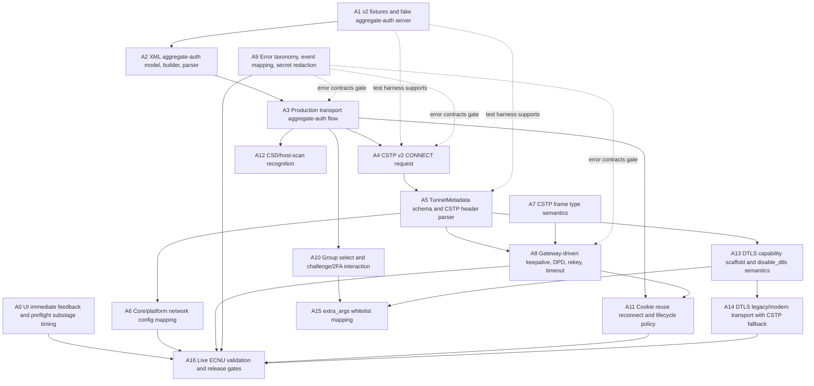

# Native AnyConnect V2 DAG Implementation Plan

> **For agentic workers:** REQUIRED SUB-SKILL: Use superpowers:subagent-driven-development (recommended) or superpowers:executing-plans to implement this plan task-by-task. Steps use checkbox (`- [ ]`) syntax for tracking.

**Goal:** Complete the native engine so ECNU connects through the real AnyConnect XML aggregate-auth and CSTP protocol flow, with OpenConnect used only as a behavioral reference.

**Architecture:** Split the work into three descending-priority layers: authentication control plane, CSTP tunnel and network metadata plane, then compatibility and operational hardening. Keep `src/vpn_engine/protocol` as the wire-protocol owner, `src/core/tunnel_controller` as orchestration, and `src/platform/*` as privileged network application. The implementation remains clean-room: do not translate `reference/openconnect-upstream` source code, state machines, parser structure, comments, or constant tables.

**Tech Stack:** C++17/C++20, CMake, native engine protocol tests, fake AnyConnect server fixtures, Vue 3/Pinia WebUI, Windows Wintun/IP Helper, macOS utun/scutil, Linux platform stubs, OpenConnect upstream behavior references.

---

## Scope Anchor

Primary requirement source:

- `docs/architecture/native-anyconnect-protocol-requirements.md`

Current mismatch points:

- `src/vpn_engine/protocol/production_transport.cpp` still hardcodes `GET /+CSCOE+/logon.html`, `POST /+CSCOE+/logon.html`, `CONNECT /CSCOT/`, and fallback User-Agent behavior.
- `src/vpn_engine/protocol/auth.cpp` parses HTML forms and expects `webvpn_session=`.
- `src/vpn_engine/protocol/cstp.cpp` parses only IPv4 address, netmask, MTU, split include, and bypass route headers.
- `src/vpn_engine/session_state.hpp` lacks DNS, IPv6, split exclude, banner, timer, and lifecycle fields.
- `src/core/app_api/desktop_vpn_actions.cpp` preflight timing is too coarse to explain the fixed 2.0-2.2 second delay.
- `webui/src/stores/vpn.ts` sets `loading` and `connectInFlight` only after password resolution.

OpenConnect behavior reference points:

- `reference/openconnect-upstream/auth.c` and `xml.c`: XML aggregate-auth request and response behavior.
- `reference/openconnect-upstream/cstp.c`: `CONNECT /CSCOSSLC/tunnel`, CSTP headers, server config parsing, CSTP frame behavior.
- `reference/openconnect-upstream/mainloop.c`: keepalive, DPD, reconnect timing behavior.
- `reference/openconnect-upstream/dtls.c` and TLS backend DTLS files: DTLS setup and CSTP fallback behavior.
- `reference/openconnect-upstream/tun.c` and `script.c`: platform tunnel application boundaries.

## Priority Layout

### P0: Authentication Control Plane and CSTP Connect

Purpose: make the ECNU gateway accept the native client long enough to establish CSTP.

Includes:

- XML `<config-auth client="vpn" type="init">` POST to `/`.
- XML auth-reply parsing and construction.
- `<opaque>` echo.
- `<session-token>` or `<session-id>` extraction.
- `webvpn=<token>` cookie mapping.
- `CONNECT /CSCOSSLC/tunnel`.
- Required AnyConnect headers, including `X-Transcend-Version: 1`, `X-Aggregate-Auth: 1`, `Accept-Encoding: identity`, and configured User-Agent.
- Immediate UI feedback and preflight substage timing.

Exit criterion:

- Native transport never sends `/+CSCOE+/logon.html`, `webvpn_session=`, or `/CSCOT/` on the v2 path.
- Mock aggregate-auth flow reaches successful CSTP response parsing.
- Live ECNU attempt reaches CSTP CONNECT response or a specific auth/challenge/CSD error, not a generic TLS EOF during the first protocol read.

### P1: CSTP Data Plane and Network Metadata Application

Purpose: turn the CSTP tunnel into a stable OS network session.

Includes:

- Full CSTP response metadata parsing.
- `TunnelMetadata` and JSON schema extension.
- Platform `TunnelConfig` mapping for DNS, IPv6, split include, split exclude, MTU, domains, and banner.
- STF frame type coverage for data, DPD, keepalive, disconnect, compressed, and terminate.
- Keepalive, DPD, rekey, and timeout behavior based on gateway response headers.
- Error taxonomy for server disconnect, auth expiry, idle timeout, session timeout, and transport interruption.

Exit criterion:

- CSTP metadata appears in `session_state_to_json`.
- Windows and macOS platform network ops apply gateway DNS/routes from metadata.
- DPD/keepalive events are driven by gateway header values.
- Server disconnect and transport EOF are distinguishable in logs and user-facing errors.

### P2: Compatibility, Performance, and Operations

Purpose: close the gap with previously exposed OpenConnect-era settings and long-running behavior.

Includes:

- DTLS legacy and modern negotiation with mandatory CSTP-only fallback.
- `disable_dtls` behavior.
- CSD/host-scan recognition and explicit unsupported/skip outcomes.
- Group selection and challenge/2FA UI round trips.
- Cookie reuse reconnect and lifecycle expiry semantics.
- `extra_args` whitelist mapping.
- Live validation scripts and redacted capture workflow.

Exit criterion:

- `disable_dtls=true` skips all DTLS setup.
- DTLS failure logs `dtls_unavailable` and leaves CSTP running.
- Group/challenge/CSD cases produce structured UI-visible events.
- Unsupported OpenConnect arguments are reported explicitly.

## DAG



Critical path:

`A1 -> A2 -> A3 -> A4 -> A5 -> A6 -> A16`

Fastest useful live-connect milestone:

`A0 + A1 + A2 + A3 + A4 + minimal A9`

## Parallel Execution Lanes

| Lane | Owns | Nodes | Can start | Must not touch |
|------|------|-------|-----------|----------------|
| UI/observability | `webui/src/stores/vpn.ts`, `src/core/app_api/desktop_vpn_actions.cpp`, preflight tests | A0 | Immediately | Protocol parser files |
| Test harness | fixtures, fake server, protocol test registration | A1 | Immediately | Production implementation except narrow test seams |
| Auth protocol | XML auth model and `ProductionProtocolTransport::authenticate` | A2, A3, A10, A12 | After A1 fixture shape is agreed | CSTP metadata parser while A5 owns it |
| CSTP protocol | CONNECT request, CSTP headers, frames, liveness | A4, A5, A7, A8 | A4 after A3 cookie shape; A5/A7 after A1 | WebUI and platform network ops |
| Core/platform network | `TunnelMetadata` mapping, `TunnelConfig`, Windows/macOS/Linux apply | A6 | After A5 field names are merged | XML auth transport |
| Runtime policy | reconnect, cookie reuse, lifecycle, error/event contracts, `extra_args` | A9, A11, A15 | A9 immediately after error names are agreed; A11 after A3/A8 | Low-level TLS stream |
| DTLS | UDP/DTLS abstraction, disable flag, fallback | A13, A14 | A13 after A5 metadata shape; A14 after A13 | Auth parser |
| Live validation | manual scripts, redacted evidence, release gate docs | A16 | After each phase exit gate | Source code unless fixing validation scripts |

Shared-file locks:

- `src/vpn_engine/protocol/production_transport.cpp`: one active owner at a time. A3 and A4 must serialize or split helper functions first.
- `src/vpn_engine/session_state.hpp` and `src/vpn_engine/session_state.cpp`: A5 owns schema changes; A6 and A8 wait for merged field names.
- `src/vpn_engine/protocol/session.hpp` and `src/vpn_engine/protocol/session.cpp`: A8 and A11 must sequence timer/reconnect changes.
- `src/core/tunnel_controller/tunnel_controller_connect.cpp`: A6 and A11 must sequence if reconnect re-applies metadata.
- `contracts/system.contract.json` and generated TypeScript/C++ contracts: A9 and A10 must coordinate if new UI challenge events or fields are added.

## File Structure Target

Create:

- `src/vpn_engine/protocol/aggregate_auth.hpp`: clean-room aggregate-auth request/response model.
- `src/vpn_engine/protocol/aggregate_auth.cpp`: XML construction, bounded XML parsing, error mapping helpers.
- `tests/native_aggregate_auth_test.cpp`: XML unit tests for init, auth-reply, success, error, opaque echo, group, challenge.
- `tests/fixtures/native_anyconnect_v2/auth_init_response.xml`: init response fixture.
- `tests/fixtures/native_anyconnect_v2/auth_success_response.xml`: success response fixture with `<session-token>`.
- `tests/fixtures/native_anyconnect_v2/auth_challenge_response.xml`: challenge/2FA fixture.
- `tests/fixtures/native_anyconnect_v2/cstp_connect_success.http`: v2 CSTP response fixture with DNS, routes, timers, and DTLS headers.
- `docs/handoffs/native-anyconnect-v2-live-validation-template.md`: redacted live-validation evidence template.

Modify:

- `CMakeLists.txt`: register new tests and source files.
- `src/vpn_engine/protocol/production_transport.hpp`: store aggregate-auth session state needed by reconnect, challenge, and cookie reuse.
- `src/vpn_engine/protocol/production_transport.cpp`: replace v1 HTML auth and v1 CSTP request path with v2 protocol flow.
- `src/vpn_engine/protocol/auth.hpp` and `src/vpn_engine/protocol/auth.cpp`: keep legacy helpers only if tests still cover them; move v2 XML model to `aggregate_auth.*`.
- `src/vpn_engine/protocol/cstp.hpp` and `src/vpn_engine/protocol/cstp.cpp`: parse full CSTP metadata and frame types.
- `src/vpn_engine/protocol/session.hpp` and `src/vpn_engine/protocol/session.cpp`: consume timer metadata and classify liveness/reconnect failures.
- `src/vpn_engine/session_state.hpp` and `src/vpn_engine/session_state.cpp`: extend `TunnelMetadata` and JSON output.
- `src/vpn_engine/engine.hpp`: expose config knobs and events that are engine-wide, especially `disable_dtls`, useragent, challenge events, and optional metadata fields.
- `src/vpn_engine/native_engine.cpp`: propagate metadata-derived liveness settings and event fields.
- `src/core/tunnel_controller/native_engine_config_mapper.cpp`: stop forcing `disable_dtls=true` after A13, map supported `extra_args` after A15.
- `src/core/tunnel_controller/tunnel_controller_connect.cpp`: map full metadata to `TunnelConfig` and re-apply changed metadata on reconnect.
- `src/core/tunnel_controller/core_session_runner.cpp`: preserve native failure classification and surface new auth/challenge events.
- `src/core/tunnel_controller/engine_event_bridge.cpp`: translate native protocol events into tunnel events.
- `src/feedback/error_contract.cpp` and related tests: add stable error names.
- `src/platform/common/tunnel_config.hpp`: add DNS and route fields already represented by platform ops if missing, plus split-exclude/tunnel-all-DNS semantics.
- `src/platform/win32/platform_network_ops_win32.cpp`: apply DNS/routes based on expanded config.
- `src/platform/darwin/platform_network_ops_darwin.cpp`: apply DNS/routes based on expanded config.
- `src/platform/linux/platform_network_ops_linux.cpp`: keep behavior explicit even where platform support is stubbed.
- `webui/src/stores/vpn.ts`: immediate feedback and challenge prompt flow.
- `webui/src/components/PasswordPromptDialog.vue`: reuse prompt component for challenge/2FA if required by A10.

## Execution Plan

### Task A0: UI Immediate Feedback and Preflight Timing

**Files:**

- Modify: `webui/src/stores/vpn.ts`
- Modify: `src/core/app_api/desktop_vpn_actions.cpp`
- Modify: `tests/app_api_status_contract_test.cpp`
- Modify: relevant WebUI store tests if present

**Dependencies:** none.

**Steps:**

- [ ] Move `loading.value = true`, `connectInFlight.value = true`, `clearError()`, and `startConnectionProgress(...)` to the start of `connect()` and `connectElevated()`, before awaiting `resolveConnectPassword()`.
- [ ] If `resolveConnectPassword()` returns `null`, call `stopConnectionProgress()`, clear `connectInFlight`, clear `loading`, and return `false`.
- [ ] Add `StageTimer` marks inside `preflight_connect`: `config_validated`, `backend_resolve_started`, `backend_resolved`, `runtime_status_checked`, `platform_checks_checked`.
- [ ] Log backend mode, runtime availability, and platform-check result without password, token, cookie, or endpoint secrets.
- [ ] Add a contract test that verifies `preflight_connect` contains separate timing marks for backend, runtime, and platform checks.

**Verification:**

```powershell
pnpm --dir webui typecheck
cmake --build build-windows\cpp --target app_api_status_contract_test
build-windows\cpp\app_api_status_contract_test.exe
```

Expected:

- TypeScript typecheck exits `0`.
- `app_api_status_contract_test.exe` exits `0`.
- Manual click shows connecting state before the password prompt finishes or before preflight returns.

**Commit:**

```powershell
git add webui/src/stores/vpn.ts src/core/app_api/desktop_vpn_actions.cpp tests/app_api_status_contract_test.cpp
git commit -m "connect: show native connection feedback before preflight"
```

### Task A1: V2 Fixtures and Fake Aggregate-Auth Server

**Files:**

- Create: `tests/fixtures/native_anyconnect_v2/auth_init_response.xml`
- Create: `tests/fixtures/native_anyconnect_v2/auth_success_response.xml`
- Create: `tests/fixtures/native_anyconnect_v2/auth_challenge_response.xml`
- Create: `tests/fixtures/native_anyconnect_v2/cstp_connect_success.http`
- Modify: `tests/support/fake_anyconnect_server.hpp`
- Modify: `tests/support/fake_anyconnect_server.cpp`
- Modify: `tests/native_fake_anyconnect_server_test.cpp`

**Dependencies:** none.

**Steps:**

- [ ] Add fixture files with redacted deterministic values: username `student@example.invalid`, token `V2_SESSION_TOKEN`, opaque value `OPAQUE_ONE`, internal IPv4 `10.255.0.10`, DNS `10.10.10.10`, split include `198.51.100.0/24`, split exclude `203.0.113.0/24`, keepalive `20`, DPD `30`, rekey `3600`.
- [ ] Extend `FakeAnyConnectServer` with a v2 mode that expects `POST /` XML init, `POST /` XML auth-reply, then `CONNECT /CSCOSSLC/tunnel`.
- [ ] Make the fake server reject v1 paths with a stable error body so tests catch accidental fallback to `/+CSCOE+/logon.html` or `/CSCOT/`.
- [ ] Add tests for the fake v2 auth and CSTP sequence.

**Verification:**

```powershell
cmake --build build-windows\cpp --target native_fake_anyconnect_server_test
build-windows\cpp\native_fake_anyconnect_server_test.exe
```

Expected:

- Fake server v2 flow accepts only aggregate-auth and `/CSCOSSLC/tunnel`.
- Test exits `0`.

**Commit:**

```powershell
git add tests/fixtures/native_anyconnect_v2 tests/support/fake_anyconnect_server.hpp tests/support/fake_anyconnect_server.cpp tests/native_fake_anyconnect_server_test.cpp
git commit -m "test: add native AnyConnect v2 fixtures"
```

### Task A2: XML Aggregate-Auth Model, Builder, and Parser

**Files:**

- Create: `src/vpn_engine/protocol/aggregate_auth.hpp`
- Create: `src/vpn_engine/protocol/aggregate_auth.cpp`
- Create: `tests/native_aggregate_auth_test.cpp`
- Modify: `CMakeLists.txt`

**Dependencies:** A1 fixture names and XML shapes.

**Steps:**

- [ ] Define a small clean-room model: request type (`init`, `auth-reply`), response type (`auth-request`, `success`, `error`, `challenge`, `group-select`, `host-scan`), form fields, opaque values, selected group, session token, session id, and sanitized error.
- [ ] Build init XML with `<config-auth client="vpn" type="init">`, `<version who="vpn">`, `<device-id>`, `<group-access>`, and a minimal capability set required by ECNU. Keep the XML deterministic for tests.
- [ ] Build auth-reply XML from parsed fields, username, password, selected group, challenge value, and raw opaque echoes.
- [ ] Parse XML responses with bounded input size. Reject HTML with `auth_protocol_mismatch`.
- [ ] Preserve opaque XML text exactly enough for a byte-stable echo in subsequent request tests.
- [ ] Map `<session-token>` or `<session-id>` to a session token value. Cookie formatting remains in transport, not parser.
- [ ] Register `native_aggregate_auth_test` in CMake.

**Verification:**

```powershell
cmake --build build-windows\cpp --target native_aggregate_auth_test
build-windows\cpp\native_aggregate_auth_test.exe
```

Expected:

- Init XML contains `client="vpn"` and `type="init"`.
- Auth reply echoes opaque.
- Success response returns token `V2_SESSION_TOKEN`.
- HTML response maps to `auth_protocol_mismatch`.
- Test exits `0`.

**Commit:**

```powershell
git add src/vpn_engine/protocol/aggregate_auth.hpp src/vpn_engine/protocol/aggregate_auth.cpp tests/native_aggregate_auth_test.cpp CMakeLists.txt
git commit -m "native: add aggregate-auth XML model"
```

### Task A3: Production Transport Aggregate-Auth Flow

**Files:**

- Modify: `src/vpn_engine/protocol/production_transport.hpp`
- Modify: `src/vpn_engine/protocol/production_transport.cpp`
- Modify: `tests/native_production_transport_test.cpp`
- Modify: `tests/native_auth_parser_test.cpp` if legacy parser coverage needs separation

**Dependencies:** A2.

**Steps:**

- [ ] Replace the v1 login GET/POST path in `ProductionProtocolTransport::authenticate` with aggregate-auth `POST /` init and `POST /` auth-reply.
- [ ] Send headers: configured User-Agent, `Content-Type: application/xml; charset=utf-8`, `Accept-Encoding: identity`, `X-Transcend-Version: 1`, `X-Aggregate-Auth: 1`, `Connection: keep-alive`.
- [ ] Convert parser success token to `AuthResult.cookie = "webvpn=" + token`.
- [ ] Keep the password and token redaction path active for write/read errors.
- [ ] Update production transport tests to assert no request contains `/+CSCOE+/logon.html`, `webvpn_session=`, or form-urlencoded credentials.
- [ ] Keep explicit unsupported outcomes for SAML/browser auth and host-scan until A10/A12 implements them.

**Verification:**

```powershell
cmake --build build-windows\cpp --target native_production_transport_test native_aggregate_auth_test
build-windows\cpp\native_aggregate_auth_test.exe
build-windows\cpp\native_production_transport_test.exe
```

Expected:

- Authentication writes two XML `POST /` requests for a simple password flow.
- Returned cookie is `webvpn=V2_SESSION_TOKEN`.
- No password, token, or cookie appears in error messages.
- Tests exit `0`.

**Commit:**

```powershell
git add src/vpn_engine/protocol/production_transport.hpp src/vpn_engine/protocol/production_transport.cpp tests/native_production_transport_test.cpp tests/native_auth_parser_test.cpp
git commit -m "native: switch production auth to aggregate-auth"
```

### Task A4: CSTP V2 CONNECT Request

**Files:**

- Modify: `src/vpn_engine/protocol/production_transport.cpp`
- Modify: `tests/native_production_transport_test.cpp`

**Dependencies:** A3.

**Steps:**

- [ ] Change CSTP request path from `/CSCOT/` to `/CSCOSSLC/tunnel`.
- [ ] Send `Cookie: webvpn=<token>` from `AuthResult.cookie`.
- [ ] Use configured User-Agent in CONNECT.
- [ ] Send `X-CSTP-Version: 1`, `X-CSTP-Hostname`, `X-CSTP-Address-Type: IPv6,IPv4`, `X-CSTP-Base-MTU`, `X-CSTP-MTU`, `X-CSTP-Accept-Encoding`, `X-Transcend-Version: 1`, and `X-Aggregate-Auth: 1`.
- [ ] Include DTLS request headers only after A13 enables DTLS. Before A13, do not advertise DTLS.
- [ ] Update tests to fail if CONNECT contains `/CSCOT/`, `ECNU-VPN Native`, or `webvpn_session`.

**Verification:**

```powershell
cmake --build build-windows\cpp --target native_production_transport_test
build-windows\cpp\native_production_transport_test.exe
```

Expected:

- CONNECT request is `CONNECT /CSCOSSLC/tunnel HTTP/1.1`.
- Required v2 headers are present.
- Test exits `0`.

**Commit:**

```powershell
git add src/vpn_engine/protocol/production_transport.cpp tests/native_production_transport_test.cpp
git commit -m "native: send AnyConnect CSTP tunnel CONNECT"
```

### Task A5: TunnelMetadata Schema and CSTP Header Parser

**Files:**

- Modify: `src/vpn_engine/session_state.hpp`
- Modify: `src/vpn_engine/session_state.cpp`
- Modify: `src/vpn_engine/protocol/cstp.hpp`
- Modify: `src/vpn_engine/protocol/cstp.cpp`
- Modify: `tests/native_cstp_frame_test.cpp`
- Modify: `tests/native_session_state_test.cpp`
- Modify: `tests/native_production_transport_test.cpp`

**Dependencies:** A1 and A4.

**Steps:**

- [ ] Extend `TunnelMetadata` with IPv6 address/prefix, DNS servers, NBNS servers, default domain, search domains, split include routes, split exclude routes, tunnel-all-DNS flag, banner, keepalive seconds, DPD seconds, rekey seconds, rekey method, lease duration, idle timeout, session timeout, disconnected timeout, DTLS port, DTLS session id, DTLS cipher metadata, and negotiated content encoding.
- [ ] Keep existing field names `routes` and `server_bypass_ips` for backward compatibility. Populate `routes` from split include until all callers migrate to `split_include_routes`.
- [ ] Extend `tunnel_metadata_to_json` with new fields while preserving existing JSON keys.
- [ ] Parse every header listed in `docs/architecture/native-anyconnect-protocol-requirements.md` section R-CSTP-2.
- [ ] URL-decode `X-CSTP-Banner` before storing.
- [ ] Treat missing optional headers as defaults and missing mandatory IPv4 address/netmask/MTU as the existing stable error behavior unless live ECNU proves a looser requirement.
- [ ] Add tests for repeated `X-CSTP-DNS`, split include/exclude, IPv6, banner decoding, timers, and DTLS headers.

**Verification:**

```powershell
cmake --build build-windows\cpp --target native_cstp_frame_test native_session_state_test native_production_transport_test
build-windows\cpp\native_cstp_frame_test.exe
build-windows\cpp\native_session_state_test.exe
build-windows\cpp\native_production_transport_test.exe
```

Expected:

- Full metadata fixture is parsed into `TunnelMetadata`.
- JSON includes new metadata fields.
- Existing route and bypass tests still pass.

**Commit:**

```powershell
git add src/vpn_engine/session_state.hpp src/vpn_engine/session_state.cpp src/vpn_engine/protocol/cstp.hpp src/vpn_engine/protocol/cstp.cpp tests/native_cstp_frame_test.cpp tests/native_session_state_test.cpp tests/native_production_transport_test.cpp
git commit -m "native: parse full CSTP tunnel metadata"
```

### Task A6: Core and Platform Network Config Mapping

**Files:**

- Modify: `src/platform/common/tunnel_config.hpp`
- Modify: `src/core/tunnel_controller/tunnel_controller_connect.cpp`
- Modify: `src/core/tunnel_controller/tunnel_controller_impl.hpp`
- Modify: `src/platform/win32/platform_network_ops_win32.cpp`
- Modify: `src/platform/darwin/platform_network_ops_darwin.cpp`
- Modify: `src/platform/linux/platform_network_ops_linux.cpp`
- Modify: `tests/tunnel_controller_integration_test.cpp`
- Modify: `tests/win32_platform_network_ops_test.cpp`
- Modify: `tests/darwin_platform_network_ops_test.cpp`

**Dependencies:** A5.

**Steps:**

- [ ] Map `TunnelMetadata` DNS fields into `exv::platform::TunnelConfig::dns`.
- [ ] Map split include routes into `TunnelConfig::routes`.
- [ ] Map split exclude routes into explicit exclude route fields or a new exclude collection if one exclude route is insufficient.
- [ ] Use `TunnelMetadata::internal_ip4_netmask` to compute the interface prefix instead of always appending `/24`.
- [ ] Preserve manual configured routes from profile settings by merging them after gateway split include routes with deterministic de-duplication.
- [ ] Apply `tunnel_all_dns` by documenting and implementing the selected platform behavior: Windows and macOS set DNS on the VPN adapter/interface; Linux reports unsupported until Linux network ops is implemented.
- [ ] On native reconnect, re-run network config if fresh CSTP metadata differs from the active applied metadata.

**Verification:**

```powershell
cmake --build build-windows\cpp --target tunnel_controller_integration_test win32_platform_network_ops_test
build-windows\cpp\tunnel_controller_integration_test.exe
build-windows\cpp\win32_platform_network_ops_test.exe
```

On macOS:

```bash
cmake --build build/macos/cpp --target darwin_platform_network_ops_test tunnel_controller_integration_test
build/macos/cpp/darwin_platform_network_ops_test
build/macos/cpp/tunnel_controller_integration_test
```

Expected:

- Gateway DNS/routes appear in platform apply requests.
- Split exclude behavior is deterministic and covered by tests.
- Reconnect with changed metadata re-applies network config.

**Commit:**

```powershell
git add src/platform/common/tunnel_config.hpp src/core/tunnel_controller/tunnel_controller_connect.cpp src/core/tunnel_controller/tunnel_controller_impl.hpp src/platform/win32/platform_network_ops_win32.cpp src/platform/darwin/platform_network_ops_darwin.cpp src/platform/linux/platform_network_ops_linux.cpp tests/tunnel_controller_integration_test.cpp tests/win32_platform_network_ops_test.cpp tests/darwin_platform_network_ops_test.cpp
git commit -m "native: apply CSTP DNS and route metadata"
```

### Task A7: CSTP Frame Type Semantics

**Files:**

- Modify: `src/vpn_engine/protocol/cstp.hpp`
- Modify: `src/vpn_engine/protocol/cstp.cpp`
- Modify: `src/vpn_engine/protocol/session.hpp`
- Modify: `src/vpn_engine/protocol/session.cpp`
- Modify: `tests/native_cstp_frame_test.cpp`
- Modify: `tests/native_protocol_session_test.cpp`

**Dependencies:** A1.

**Steps:**

- [ ] Add frame types for compressed and terminate while preserving existing data, DPD request, DPD response, keepalive, and disconnect.
- [ ] Decode terminate as a server-requested tunnel end with a specific result code.
- [ ] Decode compressed as `cstp_compressed_unsupported` while content encoding remains identity; after compression support is added, this node can be extended.
- [ ] Ensure inbound DPD request always sends DPD response.
- [ ] Ensure disconnect and terminate do not appear as generic EOF.

**Verification:**

```powershell
cmake --build build-windows\cpp --target native_cstp_frame_test native_protocol_session_test
build-windows\cpp\native_cstp_frame_test.exe
build-windows\cpp\native_protocol_session_test.exe
```

Expected:

- Frame codec tests cover DATA, DPD_OUT, DPD_RESP, DISCONNECT, KEEPALIVE, COMPRESSED, and TERMINATE.
- Session tests classify disconnect/terminate without generic `transport_closed`.

**Commit:**

```powershell
git add src/vpn_engine/protocol/cstp.hpp src/vpn_engine/protocol/cstp.cpp src/vpn_engine/protocol/session.hpp src/vpn_engine/protocol/session.cpp tests/native_cstp_frame_test.cpp tests/native_protocol_session_test.cpp
git commit -m "native: classify CSTP control frames"
```

### Task A8: Gateway-Driven Keepalive, DPD, Rekey, and Timeout

**Files:**

- Modify: `src/vpn_engine/protocol/session.hpp`
- Modify: `src/vpn_engine/protocol/session.cpp`
- Modify: `src/vpn_engine/native_engine.cpp`
- Modify: `tests/native_protocol_session_test.cpp`
- Modify: `tests/native_engine_contract_test.cpp`

**Dependencies:** A5 and A7.

**Steps:**

- [ ] Convert CSTP metadata seconds into `ProtocolSessionOptions` liveness settings after `connect_cstp`.
- [ ] Replace fixed disabled default timers with metadata-derived timers. Keep zero as disabled.
- [ ] Emit `dpd.request`, `dpd.responded`, `dpd.dead`, `keepalive.sent`, and `rekey.due` events.
- [ ] For `X-CSTP-Rekey-Method: new-tunnel`, trigger reconnect through the existing reconnect path.
- [ ] For unsupported `ssl` rekey, emit `rekey_unsupported` and reconnect with new tunnel instead of silently continuing.
- [ ] Map idle/session timeout headers to explicit failure codes.

**Verification:**

```powershell
cmake --build build-windows\cpp --target native_protocol_session_test native_engine_contract_test
build-windows\cpp\native_protocol_session_test.exe
build-windows\cpp\native_engine_contract_test.exe
```

Expected:

- Liveness timers are inactive when metadata value is zero.
- DPD dead produces a reconnectable transport-domain error.
- Rekey event is visible and deterministic.

**Commit:**

```powershell
git add src/vpn_engine/protocol/session.hpp src/vpn_engine/protocol/session.cpp src/vpn_engine/native_engine.cpp tests/native_protocol_session_test.cpp tests/native_engine_contract_test.cpp
git commit -m "native: drive liveness from CSTP headers"
```

### Task A9: Error Taxonomy, Event Mapping, and Secret Redaction

**Files:**

- Modify: `src/vpn_engine/native_error_contract.hpp`
- Modify: `src/feedback/error_contract.cpp`
- Modify: `src/core/tunnel_controller/core_error_mapper.cpp`
- Modify: `src/core/tunnel_controller/engine_event_bridge.cpp`
- Modify: `tests/core_error_mapper_test.cpp`
- Modify: `tests/feedback_test.cpp`
- Modify: `tests/security/no_secret_in_logs_test.cpp`
- Modify: `tests/native_auth_session_json_test.cpp`

**Dependencies:** Can start after A1, but final mapping waits for A3/A4/A8 error names.

**Steps:**

- [ ] Add stable codes: `auth_protocol_mismatch`, `auth_rejected`, `auth_challenge_required`, `auth_group_required`, `csd_required_unsupported`, `dtls_unavailable`, `tunnel_disconnected`, `session_timeout`, `idle_timeout`, `rekey_unsupported`, `cstp_compressed_unsupported`.
- [ ] Keep `transport_closed` only for actual underlying stream interruption.
- [ ] Map auth challenge/group-required events as interaction states, not fatal errors.
- [ ] Ensure `webvpn=`, session token values, opaque values, SAML values, passwords, and challenge responses are redacted in logs and persisted session JSON.
- [ ] Add security tests with seeded secret values.

**Verification:**

```powershell
cmake --build build-windows\cpp --target core_error_mapper_test feedback_test no_secret_in_logs_test native_auth_session_json_test
build-windows\cpp\core_error_mapper_test.exe
build-windows\cpp\feedback_test.exe
build-windows\cpp\no_secret_in_logs_test.exe
build-windows\cpp\native_auth_session_json_test.exe
```

Expected:

- New errors map to stable user-facing messages.
- Secret tests do not find token, cookie, password, or challenge text.

**Commit:**

```powershell
git add src/vpn_engine/native_error_contract.hpp src/feedback/error_contract.cpp src/core/tunnel_controller/core_error_mapper.cpp src/core/tunnel_controller/engine_event_bridge.cpp tests/core_error_mapper_test.cpp tests/feedback_test.cpp tests/security/no_secret_in_logs_test.cpp tests/native_auth_session_json_test.cpp
git commit -m "native: add AnyConnect v2 error taxonomy"
```

### Task A10: Group Select and Challenge/2FA Interaction

**Files:**

- Modify: `src/vpn_engine/protocol/aggregate_auth.hpp`
- Modify: `src/vpn_engine/protocol/aggregate_auth.cpp`
- Modify: `src/vpn_engine/native_engine.cpp`
- Modify: `src/core/tunnel_controller/engine_event_bridge.cpp`
- Modify: `contracts/system.contract.json`
- Modify: generated contract snapshots after running contract generation
- Modify: `webui/src/stores/vpn.ts`
- Modify: `webui/src/components/PasswordPromptDialog.vue`
- Modify: `tests/native_aggregate_auth_test.cpp`
- Modify: `tests/engine_event_bridge_test.cpp`
- Modify: WebUI contract tests

**Dependencies:** A3 and A9 interaction codes.

**Steps:**

- [ ] Represent group choices and challenge prompt fields in aggregate-auth response model.
- [ ] Emit native events for `auth.group_required` and `auth.challenge_required` with labels/options but without secrets.
- [ ] Add an app/core RPC path or existing prompt path extension to send the user response back to the waiting native session.
- [ ] Reuse password prompt UI for challenge input where the server requests a password-like value.
- [ ] Add a group selector UI only if a fixture requires multiple visible group choices. If ECNU always has one configured group, auto-select the configured group and still test the parser.
- [ ] Generate contracts with `python scripts/generate_contracts.py`.

**Verification:**

```powershell
python scripts/generate_contracts.py
cmake --build build-windows\cpp --target native_aggregate_auth_test engine_event_bridge_test contract_manifest_test
build-windows\cpp\native_aggregate_auth_test.exe
build-windows\cpp\engine_event_bridge_test.exe
build-windows\cpp\contract_manifest_test.exe
pnpm --dir webui typecheck
```

Expected:

- Challenge and group fixtures produce UI-visible interaction events.
- Contract snapshots are regenerated and tests pass.

**Commit:**

```powershell
git add src/vpn_engine/protocol/aggregate_auth.hpp src/vpn_engine/protocol/aggregate_auth.cpp src/vpn_engine/native_engine.cpp src/core/tunnel_controller/engine_event_bridge.cpp contracts/system.contract.json contracts/generated/system_contract_snapshot.json src/contracts/generated/system_contract.hpp webui/desktop/shared/generated/system-contract.ts webui/host/shared/generated/system-contract.ts webui/src/stores/vpn.ts webui/src/components/PasswordPromptDialog.vue tests/native_aggregate_auth_test.cpp tests/engine_event_bridge_test.cpp
git commit -m "native: support AnyConnect auth challenges"
```

### Task A11: Cookie Reuse Reconnect and Lifecycle Policy

**Files:**

- Modify: `src/vpn_engine/protocol/production_transport.hpp`
- Modify: `src/vpn_engine/protocol/production_transport.cpp`
- Modify: `src/vpn_engine/protocol/session.hpp`
- Modify: `src/vpn_engine/protocol/session.cpp`
- Modify: `src/core/tunnel_controller/tunnel_controller_reconnect.cpp`
- Modify: `tests/native_production_transport_test.cpp`
- Modify: `tests/native_protocol_session_test.cpp`
- Modify: `tests/reconnect_policy_test.cpp`

**Dependencies:** A3 and A8.

**Steps:**

- [ ] Store successful `webvpn=` cookie in transport state for the current session only.
- [ ] On reconnect, attempt CSTP with the cached cookie before re-running full aggregate-auth.
- [ ] If server rejects cached cookie with auth-expired status, clear cookie and run full auth once.
- [ ] Stop automatic cookie reuse when session timeout metadata has elapsed.
- [ ] Re-apply network config after reconnect when metadata changes.

**Verification:**

```powershell
cmake --build build-windows\cpp --target native_production_transport_test native_protocol_session_test reconnect_policy_test
build-windows\cpp\native_production_transport_test.exe
build-windows\cpp\native_protocol_session_test.exe
build-windows\cpp\reconnect_policy_test.exe
```

Expected:

- First reconnect can skip password auth when cookie is accepted.
- Auth-expired response triggers one full auth retry.
- Session timeout disables cookie reuse.

**Commit:**

```powershell
git add src/vpn_engine/protocol/production_transport.hpp src/vpn_engine/protocol/production_transport.cpp src/vpn_engine/protocol/session.hpp src/vpn_engine/protocol/session.cpp src/core/tunnel_controller/tunnel_controller_reconnect.cpp tests/native_production_transport_test.cpp tests/native_protocol_session_test.cpp tests/reconnect_policy_test.cpp
git commit -m "native: reuse AnyConnect session cookie on reconnect"
```

### Task A12: CSD and Host-Scan Recognition

**Files:**

- Modify: `src/vpn_engine/protocol/aggregate_auth.hpp`
- Modify: `src/vpn_engine/protocol/aggregate_auth.cpp`
- Modify: `src/vpn_engine/native_engine.cpp`
- Modify: `src/feedback/error_contract.cpp`
- Modify: `tests/native_aggregate_auth_test.cpp`
- Modify: `tests/feedback_test.cpp`

**Dependencies:** A3 and A9.

**Steps:**

- [ ] Parse `<host-scan>` ticket, token, base URI, and wait URI into a host-scan response model.
- [ ] If no supported CSD wrapper is configured, fail fast with `csd_required_unsupported`.
- [ ] If a future supported wrapper is configured through A15, pass only redacted metadata and never execute arbitrary downloaded code by default.
- [ ] Log whether host-scan was detected, skipped, or unsupported.

**Verification:**

```powershell
cmake --build build-windows\cpp --target native_aggregate_auth_test feedback_test no_secret_in_logs_test
build-windows\cpp\native_aggregate_auth_test.exe
build-windows\cpp\feedback_test.exe
build-windows\cpp\no_secret_in_logs_test.exe
```

Expected:

- Host-scan fixture maps to `csd_required_unsupported`.
- Host-scan token values are redacted.

**Commit:**

```powershell
git add src/vpn_engine/protocol/aggregate_auth.hpp src/vpn_engine/protocol/aggregate_auth.cpp src/vpn_engine/native_engine.cpp src/feedback/error_contract.cpp tests/native_aggregate_auth_test.cpp tests/feedback_test.cpp tests/security/no_secret_in_logs_test.cpp
git commit -m "native: recognize AnyConnect host-scan requirements"
```

### Task A13: DTLS Capability Scaffold and disable_dtls Semantics

**Files:**

- Create: `src/vpn_engine/protocol/dtls_transport.hpp`
- Create: `src/vpn_engine/protocol/dtls_transport.cpp`
- Modify: `src/vpn_engine/engine.hpp`
- Modify: `src/core/tunnel_controller/native_engine_config_mapper.cpp`
- Modify: `src/vpn_engine/protocol/production_transport.cpp`
- Modify: `tests/native_engine_config_mapper_test.cpp`
- Modify: `tests/native_production_transport_test.cpp`

**Dependencies:** A5.

**Steps:**

- [ ] Add a DTLS capability model that can represent disabled, unavailable, pending, established, and failed states.
- [ ] Stop forcing `engine_cfg.disable_dtls = true` in native config mapping. Preserve user setting.
- [ ] If `disable_dtls=true`, do not add any DTLS request headers.
- [ ] If `disable_dtls=false`, advertise only capabilities implemented by A14. Before A14, log `dtls_unavailable` and continue CSTP-only without sending misleading headers.
- [ ] Add tests for both values of `disable_dtls`.

**Verification:**

```powershell
cmake --build build-windows\cpp --target native_engine_config_mapper_test native_production_transport_test
build-windows\cpp\native_engine_config_mapper_test.exe
build-windows\cpp\native_production_transport_test.exe
```

Expected:

- Native config mapper preserves `disable_dtls`.
- CSTP request has no DTLS headers when disabled.
- DTLS unavailable is non-fatal when enabled but not implemented.

**Commit:**

```powershell
git add src/vpn_engine/protocol/dtls_transport.hpp src/vpn_engine/protocol/dtls_transport.cpp src/vpn_engine/engine.hpp src/core/tunnel_controller/native_engine_config_mapper.cpp src/vpn_engine/protocol/production_transport.cpp tests/native_engine_config_mapper_test.cpp tests/native_production_transport_test.cpp
git commit -m "native: honor disable_dtls in protocol config"
```

### Task A14: DTLS Legacy/Modern Transport With CSTP Fallback

**Files:**

- Modify: `src/vpn_engine/protocol/dtls_transport.hpp`
- Modify: `src/vpn_engine/protocol/dtls_transport.cpp`
- Modify: `src/vpn_engine/protocol/production_transport.hpp`
- Modify: `src/vpn_engine/protocol/production_transport.cpp`
- Modify: platform TLS/UDP support files as needed
- Create: `tests/native_dtls_transport_test.cpp`
- Modify: `tests/native_production_transport_test.cpp`
- Modify: `CMakeLists.txt`

**Dependencies:** A13.

**Steps:**

- [ ] Implement a UDP transport abstraction that can be mocked in tests.
- [ ] Parse DTLS metadata from CSTP headers: session ID, port, cipher suites, MTU, and PSK/secret fields.
- [ ] Implement legacy DTLS only if the required crypto primitives are available in the existing crypto backend.
- [ ] Implement modern DTLS 1.2/PSK only if the existing TLS backend can expose the needed exporter/PSK hooks cleanly.
- [ ] On any DTLS setup or handshake failure, emit `dtls_unavailable` and keep using CSTP.
- [ ] Route packets over DTLS only after the DTLS state is established; otherwise use CSTP.

**Verification:**

```powershell
cmake --build build-windows\cpp --target native_dtls_transport_test native_production_transport_test
build-windows\cpp\native_dtls_transport_test.exe
build-windows\cpp\native_production_transport_test.exe
```

Expected:

- DTLS success path uses UDP data transport in mock tests.
- DTLS failure path leaves CSTP packet send/receive working.
- No secret appears in logs.

**Commit:**

```powershell
git add src/vpn_engine/protocol/dtls_transport.hpp src/vpn_engine/protocol/dtls_transport.cpp src/vpn_engine/protocol/production_transport.hpp src/vpn_engine/protocol/production_transport.cpp tests/native_dtls_transport_test.cpp tests/native_production_transport_test.cpp CMakeLists.txt
git commit -m "native: add DTLS with CSTP fallback"
```

### Task A15: extra_args Whitelist Mapping

**Files:**

- Modify: `src/core/tunnel_controller/native_engine_config_mapper.cpp`
- Modify: `src/vpn_engine/engine.hpp`
- Modify: `src/feedback/error_contract.cpp`
- Modify: `webui/src/pages/SettingsPage.vue`
- Modify: `tests/native_engine_config_mapper_test.cpp`
- Modify: `tests/feedback_test.cpp`

**Dependencies:** A10 and A13.

**Steps:**

- [ ] Define a native whitelist: `--no-dtls`, `--useragent=<value>`, `--authgroup=<value>`, and `--csd-wrapper=<path>`.
- [ ] Map `--no-dtls` to `disable_dtls=true`.
- [ ] Map `--useragent` to the existing useragent config after validation.
- [ ] Map `--authgroup` to aggregate-auth group selection.
- [ ] Accept `--csd-wrapper` only as a path value for future controlled host-scan handling; do not execute arbitrary server-downloaded code by default.
- [ ] Reject unsupported arguments with `unsupported_extra_args` listing only argument names, not secret values.
- [ ] Update settings copy so native users understand unsupported OpenConnect CLI flags are not silently applied.

**Verification:**

```powershell
cmake --build build-windows\cpp --target native_engine_config_mapper_test feedback_test
build-windows\cpp\native_engine_config_mapper_test.exe
build-windows\cpp\feedback_test.exe
pnpm --dir webui typecheck
```

Expected:

- Whitelisted flags map to native config.
- Unsupported flags produce explicit recoverable feedback.
- WebUI typecheck exits `0`.

**Commit:**

```powershell
git add src/core/tunnel_controller/native_engine_config_mapper.cpp src/vpn_engine/engine.hpp src/feedback/error_contract.cpp webui/src/pages/SettingsPage.vue tests/native_engine_config_mapper_test.cpp tests/feedback_test.cpp
git commit -m "native: map supported OpenConnect compatibility flags"
```

### Task A16: Live ECNU Validation and Release Gates

**Files:**

- Create: `docs/handoffs/native-anyconnect-v2-live-validation-template.md`
- Modify: `tests/manual/windows-real-vpn-checklist.md`
- Modify: `tests/manual/macos-real-vpn-checklist.md`
- Modify: `docs/architecture/native-anyconnect-protocol-requirements.md` only to append validation evidence links after each successful phase

**Dependencies:** A0, A6, A8, A9, A11, and A14 for final release. A partial live gate can run after A4.

**Steps:**

- [ ] Add a redaction checklist: password, `webvpn=`, `<session-token>`, opaque values, SAML values, challenge values, cookies, and packet payloads must be removed from captured evidence.
- [ ] Add a phase-specific live checklist: P0 auth/CSTP, P1 DNS/routes/liveness, P2 DTLS/challenge/CSD/reconnect.
- [ ] Add required log snippets: preflight substage timings, auth protocol stage, CSTP CONNECT status, metadata summary, platform apply summary, liveness summary.
- [ ] Run live ECNU validation only on a machine with valid credentials and admin rights.
- [ ] Attach evidence in a dated handoff document, not in source comments.

**Verification:**

```powershell
git diff --check
rg -n "webvpn=|session-token|password|opaque|SAML|challenge" docs/handoffs tests/manual docs/architecture/native-anyconnect-protocol-requirements.md
```

Expected:

- `git diff --check` exits `0`.
- Any `rg` hits are template labels or redaction instructions, not real secret values.

**Commit:**

```powershell
git add docs/handoffs/native-anyconnect-v2-live-validation-template.md tests/manual/windows-real-vpn-checklist.md tests/manual/macos-real-vpn-checklist.md docs/architecture/native-anyconnect-protocol-requirements.md
git commit -m "docs: add native AnyConnect live validation gates"
```

## Phase Gates

### Gate P0: ECNU Handshake Alignment

Required nodes:

- A0
- A1
- A2
- A3
- A4
- A9 error names needed by A3/A4

Verification:

```powershell
cmake --build build-windows\cpp --target native_aggregate_auth_test native_production_transport_test native_fake_anyconnect_server_test app_api_status_contract_test
build-windows\cpp\native_aggregate_auth_test.exe
build-windows\cpp\native_production_transport_test.exe
build-windows\cpp\native_fake_anyconnect_server_test.exe
build-windows\cpp\app_api_status_contract_test.exe
pnpm --dir webui typecheck
```

Live outcome:

- ECNU no longer closes TLS because the client used `/+CSCOE+/logon.html` or `/CSCOT/`.
- If live auth still fails, the failure is one of `auth_rejected`, `auth_challenge_required`, `auth_group_required`, `csd_required_unsupported`, or `auth_protocol_mismatch`.

### Gate P1: Stable CSTP Session

Required nodes:

- A5
- A6
- A7
- A8
- A11 if reconnect is part of the release candidate

Verification:

```powershell
cmake --build build-windows\cpp --target native_cstp_frame_test native_session_state_test native_protocol_session_test tunnel_controller_integration_test
build-windows\cpp\native_cstp_frame_test.exe
build-windows\cpp\native_session_state_test.exe
build-windows\cpp\native_protocol_session_test.exe
build-windows\cpp\tunnel_controller_integration_test.exe
```

Live outcome:

- Gateway DNS and routes are applied.
- Packet loop starts.
- DPD/keepalive events appear if the gateway provides those headers.
- Server disconnect is not reported as a generic TLS read closure.

### Gate P2: Feature Parity and Compatibility

Required nodes:

- A10
- A12
- A13
- A14
- A15
- A16

Verification:

```powershell
cmake --build build-windows\cpp --target native_dtls_transport_test native_engine_config_mapper_test feedback_test no_secret_in_logs_test
build-windows\cpp\native_dtls_transport_test.exe
build-windows\cpp\native_engine_config_mapper_test.exe
build-windows\cpp\feedback_test.exe
build-windows\cpp\no_secret_in_logs_test.exe
pnpm --dir webui typecheck
```

Live outcome:

- `disable_dtls=true` produces CSTP-only without DTLS headers.
- DTLS failure leaves CSTP connected.
- Supported compatibility flags map to native behavior.
- Unsupported flags are visible to the user and logs.

## Recommended Dispatch Order

Round 1 can run in parallel:

- Worker 1: A0.
- Worker 2: A1.
- Worker 3: A2 after Worker 2 publishes fixture names. If A1 is not done, Worker 3 can start with local fixture strings and reconcile before merge.

Round 2 after A2:

- Worker 1: A3.
- Worker 2: A9 initial taxonomy.
- Worker 3: A4 waits for A3 cookie shape, then owns `production_transport.cpp`.

Round 3 after A4:

- Worker 1: A5.
- Worker 2: A7.
- Worker 3: A16 P0 live template and manual checklist.

Round 4 after A5:

- Worker 1: A6.
- Worker 2: A8.
- Worker 3: A13.

Round 5 after P1:

- Worker 1: A10.
- Worker 2: A11.
- Worker 3: A12.
- Worker 4: A14 after A13.
- Worker 5: A15 after A10 and A13.

Merge discipline:

- Merge in DAG order, not worker completion order.
- Do not merge two branches that both changed `production_transport.cpp` without manually reviewing request sequencing and redaction.
- Run the phase gate after each round, even if individual task tests passed.

## Risk Register

| Risk | Impact | Mitigation |
|------|--------|------------|
| ECNU requires challenge/group/CSD before simple password success | P0 live connect still fails | A3 returns structured `auth_challenge_required`, `auth_group_required`, or `csd_required_unsupported` instead of generic EOF |
| XML parser accepts malformed or oversized server response | Crash or memory abuse | A2 uses bounded input size and explicit parse failures |
| Token/cookie leaks through new logs or JSON | Security regression | A9 runs secret fixtures through log, error, and JSON tests |
| Platform DNS/routes behave differently across Windows/macOS/Linux | Partial connectivity | A6 tests mapping separately from OS live application; Linux stubs report unsupported explicitly |
| Reconnect reuses expired cookie | Reconnect loop | A11 clears cookie after auth-expired response and respects session timeout |
| DTLS delays usable CSTP | Connection regression | A13/A14 require CSTP-only fallback and make DTLS non-fatal |
| Parallel workers conflict in shared files | Rework and subtle regressions | Shared-file locks and DAG merge order above |

## Final Verification Before Release Candidate

Run on Windows:

```powershell
ctest --preset windows-release
pnpm --dir webui typecheck
git diff --check
```

Run on macOS:

```bash
ctest --preset macos-release
git diff --check
```

Run live validation only with explicit operator credentials and admin rights:

```powershell
powershell.exe -NoProfile -NoLogo -ExecutionPolicy Bypass -File scripts\build-windows.ps1 desktop
```

Manual live checks:

- Click Connect and confirm UI enters connecting state immediately.
- Confirm preflight timing logs have backend, runtime, and platform substages.
- Confirm auth starts with `POST /` XML aggregate-auth.
- Confirm CSTP uses `CONNECT /CSCOSSLC/tunnel`.
- Confirm `Cookie` header uses `webvpn=<redacted>`.
- Confirm DNS/routes apply from CSTP metadata.
- Confirm disconnect cleans routes and DNS.
- Confirm logs and handoff evidence contain no secret values.
