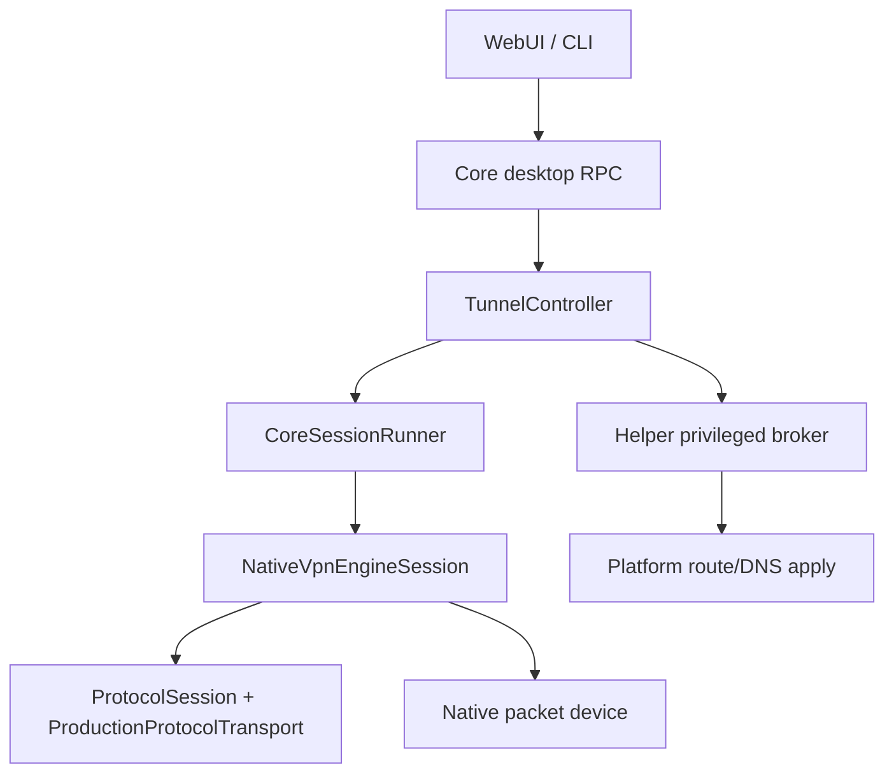
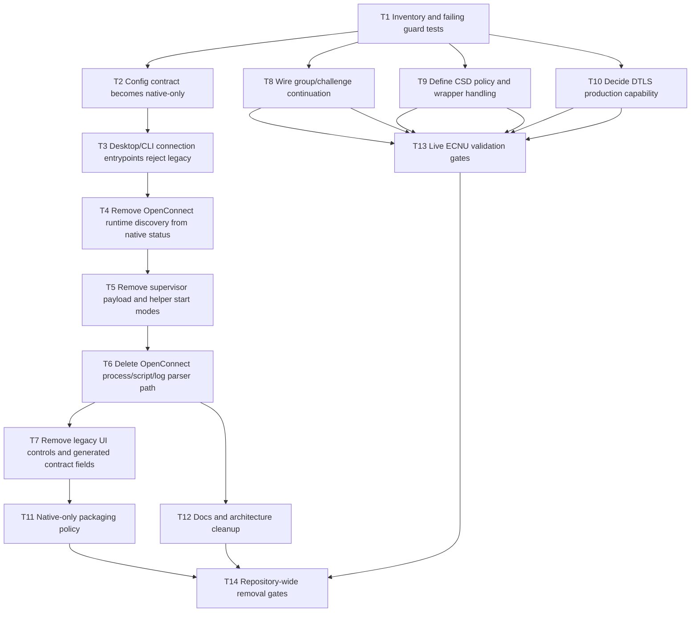

# Native-Only Cutover and Legacy Removal Implementation Plan

> **For agentic workers:** REQUIRED SUB-SKILL: Use superpowers:subagent-driven-development (recommended) or superpowers:executing-plans to implement this plan task-by-task. Steps use checkbox (`- [ ]`) syntax for tracking.

**Goal:** Make the native AnyConnect engine the only supported VPN connection path, remove legacy OpenConnect/supervisor execution chains, and close every audited gap that blocks real ECNU connectivity.

**Architecture:** Collapse connection ownership into `TunnelController` and `NativeVpnEngineSession`; keep helper responsibilities limited to privileged packet-device and network-configuration operations. Remove user-facing and production legacy OpenConnect/supervisor paths instead of keeping fallback behavior. Native protocol gaps are closed in the protocol layer first, then wired through core events and WebUI.

**Tech Stack:** C++17/C++20, CMake, native protocol tests, fake AnyConnect fixtures, Vue 3/Pinia WebUI, Windows Wintun/IP Helper, macOS utun/scutil, platform runtime status, packaging policy tests, manual ECNU live-validation handoffs.

---

## Scope

This plan covers two related but separate workstreams:

1. **Native-only cutover:** remove production code paths that launch or depend on OpenConnect, `legacy_openconnect`, `__vpn-supervisor`, supervisor payloads, OpenConnect log scraping, and OpenConnect runtime discovery for the connection path.
2. **Real-connect closure:** finish the audited native AnyConnect gaps that still prevent reliable real-world connectivity: group/challenge continuation, CSD handling policy, DTLS production decision, native-only config semantics, docs, packaging, and live validation gates.

This plan intentionally does not remove clean-room behavior references under `reference/openconnect-upstream/`; those remain read-only reference material and must not be shipped or called.

## Current Evidence

- Native production transport already sends aggregate-auth XML and CSTP `/CSCOSSLC/tunnel`: `src/vpn_engine/protocol/production_transport.cpp`.
- Native startup is `TunnelController -> CoreSessionRunner -> NativeVpnEngineSession`: `src/core/app_api/desktop_vpn_actions.cpp`, `src/core/tunnel_controller/core_session_runner.cpp`, `src/vpn_engine/native_engine.cpp`.
- Legacy/supervisor remnants remain in user-facing config, docs, runtime discovery, platform process launchers, helper payload types, old auth-session orchestration, OpenConnect log parsing, tests, and packaging checks.
- The audited native gaps are: no complete UI continuation path for group/challenge, CSD is recognized but unsupported, DTLS is a mockable boundary not production crypto, SAML/browser auth is unsupported, Linux native transport is unavailable, and live ECNU evidence is still pending.

## Non-Goals

- Do not translate OpenConnect source, comments, parser structure, state machines, or constants.
- Do not keep a hidden fallback to OpenConnect after removing the user-facing legacy option.
- Do not implement arbitrary OpenConnect CLI argument passthrough.
- Do not commit raw live logs, raw packet captures, cookies, SAML data, challenge responses, or packet payloads.

## Target Architecture



No node in the target graph launches OpenConnect, parses OpenConnect logs, or starts `__vpn-supervisor`.

## Removal Inventory

Production code candidates for removal or conversion:

- `src/platform/*/openconnect_process.cpp`
- `src/platform/common/openconnect_process.hpp`
- `src/platform/common/runtime_discovery.*` OpenConnect-specific discovery functions
- `src/platform/common/runtime_status.cpp` legacy runtime status block
- `src/core/vpn/openconnect_tunnel_script.*`
- `src/vpn_engine/openconnect/openconnect_log.*`
- `src/core/vpn/vpn_legacy_adapter.*`
- `src/platform/common/vpn_supervisor_process.*` if no non-legacy caller remains
- helper/supervisor payload fields and modes that only exist to launch VPN supervisors
- `src/core/native_orchestration/app_api_native_orchestration.*` legacy auth-first helper start path if no supported caller remains
- UI settings and generated contracts for `legacy_openconnect`, `openconnect_runtime`, and OpenConnect runtime diagnostics
- packaging scripts that stage OpenConnect runtime artifacts

Some files may stay if they also support non-VPN helper lifecycle responsibilities; this plan requires each retained file to have an explicit native-only reason and a test proving it is not a connection fallback.

## Task Graph



## Task 1: Inventory and Failing Guard Tests

**Files:**

- Modify: `tests/native_packaging_policy_test.cpp`
- Modify: `tests/runtime_status_native_test.cpp`
- Modify: `tests/app_api_native_orchestration_test.cpp`
- Modify: `tests/tunnel_script_contract_test.cpp`
- Create: `tests/native_only_cutover_contract_test.cpp`
- Modify: `CMakeLists.txt`

- [ ] **Step 1: Add a native-only source scanner test**

Add `tests/native_only_cutover_contract_test.cpp` with a scanner that fails on production references to removed connection surfaces outside allowlisted docs/tests/reference paths.

```cpp
#include <filesystem>
#include <fstream>
#include <iostream>
#include <string>
#include <vector>

namespace fs = std::filesystem;

bool contains(const std::string& haystack, const std::string& needle) {
    return haystack.find(needle) != std::string::npos;
}

bool allowed_path(const fs::path& p) {
    const std::string s = p.generic_string();
    return contains(s, "/docs/archive/") ||
           contains(s, "/reference/") ||
           contains(s, "/tests/") ||
           contains(s, "/docs/superpowers/plans/") ||
           contains(s, "/docs/superpowers/checklists/");
}

int main() {
    const std::vector<std::string> banned = {
        "__vpn-supervisor",
        "legacy_openconnect",
        "openconnect_process",
        "spawn_openconnect_process",
        "configure_from_openconnect_log",
        "webvpn_session="
    };
    bool ok = true;
    for (const auto& entry : fs::recursive_directory_iterator(fs::current_path())) {
        if (!entry.is_regular_file()) continue;
        const auto path = entry.path();
        const std::string ext = path.extension().string();
        if (ext != ".cpp" && ext != ".hpp" && ext != ".ts" && ext != ".vue" &&
            ext != ".json" && ext != ".md" && ext != ".yml") continue;
        if (allowed_path(path)) continue;
        std::ifstream in(path);
        std::string text((std::istreambuf_iterator<char>(in)),
                         std::istreambuf_iterator<char>());
        for (const auto& needle : banned) {
            if (contains(text, needle)) {
                std::cerr << "native-only banned token " << needle
                          << " in " << path.generic_string() << "\n";
                ok = false;
            }
        }
    }
    return ok ? 0 : 1;
}
```

- [ ] **Step 2: Register the test target**

In `CMakeLists.txt`, add the target beside the other standalone policy tests:

```cmake
add_executable(native_only_cutover_contract_test
    tests/native_only_cutover_contract_test.cpp)
add_test(NAME native_only_cutover_contract_test
         COMMAND native_only_cutover_contract_test)
```

- [ ] **Step 3: Run and confirm the guard fails before removal**

Run:

```powershell
cmake --build build-windows\cpp --target native_only_cutover_contract_test
.\build-windows\cpp\native_only_cutover_contract_test.exe
```

Expected before removal: non-zero exit with banned-token locations.

- [ ] **Step 4: Commit the failing guard**

```powershell
git add CMakeLists.txt tests/native_only_cutover_contract_test.cpp
git commit -m "test: add native-only cutover guard"
```

## Task 2: Config Contract Becomes Native-Only

**Files:**

- Modify: `src/core/config/config.hpp`
- Modify: `src/core/config/config_api.cpp`
- Modify: `src/core/config/config_persistence.cpp`
- Modify: `src/core/config/config_platform_view.hpp`
- Modify: `src/core/config/config_show.cpp`
- Modify: `src/core/config/config_set_value.cpp`
- Modify: `src/core/use_cases/config_use_cases.cpp`
- Modify: `src/core/app_api/desktop_status_presenter.cpp`
- Modify: `webui/src/stores/config.ts`
- Modify: `webui/src/pages/SettingsPage.vue`
- Modify: config and app API tests that mention `legacy_openconnect` or `openconnect_runtime`

- [ ] **Step 1: Add tests that legacy config values normalize to native-only**

Update config tests so loading an older persisted config with:

```json
{
  "vpn_engine": "legacy_openconnect",
  "openconnect_runtime": "bundled"
}
```

produces:

```cpp
expect(cfg.vpn_engine == "native");
expect(!serialized.contains("openconnect_runtime"));
```

- [ ] **Step 2: Remove `openconnect_runtime` from `Config`**

Change `Config` to keep native-only fields:

```cpp
struct Config {
  std::string server;
  std::string username;
  std::string password;
  std::string useragent;
  int mtu = 1290;
  bool auto_reconnect = true;
  bool remember_password = false;
  bool disable_dtls = platform::config_defaults().disable_dtls;
  std::vector<std::string> routes;
  std::vector<std::string> extra_args;
  std::string log_file;
  std::string windows_tunnel_driver = "auto";
  std::string windows_tap_interface;
  std::string vpn_engine = "native";
};
```

- [ ] **Step 3: Make `vpn_engine` read-only native in API setters**

If a caller sets `vpn_engine`, accept only `"native"` and return `config_invalid` or a clear message for any other value:

```cpp
if (key == "vpn_engine") {
    if (value != "native") {
        return "vpn_engine is native-only; legacy OpenConnect has been removed";
    }
    cfg.vpn_engine = "native";
    return "";
}
```

- [ ] **Step 4: Remove `openconnect_runtime` from UI and status models**

Delete the runtime selector and any status field that exists only for OpenConnect. Keep native runtime status as:

```ts
export interface RuntimeStatus {
  engine: 'native'
  mode: 'native'
  available: boolean
  source: 'native'
  version: string
  path: ''
}
```

- [ ] **Step 5: Run tests**

```powershell
cmake --build build-windows\cpp --target runtime_status_native_test app_api_status_contract_test
.\build-windows\cpp\runtime_status_native_test.exe
.\build-windows\cpp\app_api_status_contract_test.exe
cd webui
pnpm exec vue-tsc -b
cd ..
```

Expected: all pass; no generated type expects `legacy_openconnect` or `openconnect_runtime`.

- [ ] **Step 6: Commit**

```powershell
git add src/core/config src/core/use_cases src/core/app_api webui/src tests
git commit -m "config: make VPN engine native-only"
```

## Task 3: Desktop and CLI Entrypoints Reject Legacy Instead of Falling Back

**Files:**

- Modify: `src/core/app_api/desktop_vpn_actions.cpp`
- Modify: `src/core/vpn/vpn.cpp`
- Modify: `src/core/rpc/vpn_actions.cpp`
- Delete: `src/core/vpn/vpn_legacy_adapter.cpp`
- Delete: `src/core/vpn/vpn_legacy_adapter.hpp`
- Modify: `CMakeLists.txt`
- Modify: `tests/app_api_native_orchestration_test.cpp`
- Modify: `tests/core_api/vpn_actions_test.cpp`
- Modify: `tests/connection_attempt_test.cpp`

- [ ] **Step 1: Add tests proving every start path is native-owned**

Add assertions that `vpn.connect`, CLI `vpn::start`, and core RPC connect initialize or call `TunnelController` and never build helper `native_start_mode=password` requests.

Expected status JSON after connect request should include:

```json
{
  "engine": "native",
  "phase": "authenticating"
}
```

- [ ] **Step 2: Delete legacy adapter files and includes**

Remove `vpn_legacy_adapter.*` from source and CMake. Replace includes with direct native start wiring or delete unused call sites.

- [ ] **Step 3: Harden `preflight_connect`**

At the start of `preflight_connect`, reject any non-native engine that survived migration:

```cpp
if (cfg.vpn_engine != "native") {
  return error("VPN engine is native-only.", "legacy_engine_removed");
}
```

- [ ] **Step 4: Remove `orchestrate_native_auth_first` from active startup**

Delete calls and tests that send helper start payloads for native auth-first startup. Keep only the native user-mode auth helper if it is used by the new continuation flow; otherwise remove it in Task 8.

- [ ] **Step 5: Run tests**

```powershell
cmake --build build-windows\cpp --target app_api_native_orchestration_test connection_attempt_test vpn_actions_test
.\build-windows\cpp\app_api_native_orchestration_test.exe
.\build-windows\cpp\connection_attempt_test.exe
.\build-windows\cpp\vpn_actions_test.exe
```

Expected: all pass; no test expects `legacy_openconnect` startup.

- [ ] **Step 6: Commit**

```powershell
git add src/core/app_api src/core/vpn src/core/rpc CMakeLists.txt tests
git commit -m "core: remove legacy VPN start adapter"
```

## Task 4: Runtime Status No Longer Discovers OpenConnect

**Files:**

- Modify: `src/platform/common/runtime_status.cpp`
- Modify: `src/platform/common/runtime_status.hpp`
- Modify: `src/platform/common/runtime_discovery.cpp`
- Modify: `src/platform/common/runtime_discovery.hpp`
- Modify: `tests/runtime_status_native_test.cpp`
- Modify: `tests/platform_status_models_test.cpp`
- Modify: `webui/src/stores/config.ts`
- Modify: `webui/src/pages/SettingsPage.vue`

- [ ] **Step 1: Change runtime status test expectation**

Native runtime status should be:

```json
{
  "engine": "native",
  "mode": "native",
  "available": true,
  "source": "native",
  "path": ""
}
```

and must not contain `legacy_openconnect`, `openconnect`, `bundled_path`, or `system_path`.

- [ ] **Step 2: Remove OpenConnect path/version discovery from runtime status**

Keep runtime status focused on native dependencies:

```cpp
nlohmann::json runtime_status_json(const ConfigView& cfg) {
  (void)cfg;
  nlohmann::json native{{"engine", "native"},
                        {"mode", "native"},
                        {"available", true},
                        {"source", "native"},
                        {"path", ""},
                        {"version", ECNUVPN_VERSION},
                        {"bundled_runtime_dir", platform::get_bundled_runtime_dir()}};
#ifdef _WIN32
  native["wintun_path"] = platform::get_bundled_wintun_path();
  native["tap_installer_path"] = platform::get_bundled_tap_installer_path();
#endif
  return native;
}
```

- [ ] **Step 3: Remove unused discovery helpers**

Delete declarations and definitions for:

```cpp
std::string get_bundled_openconnect_path();
std::string get_openconnect_path(const std::string&);
bool check_openconnect(const std::string&);
```

Only after all compile errors are resolved.

- [ ] **Step 4: Run tests**

```powershell
cmake --build build-windows\cpp --target runtime_status_native_test platform_status_models_test
.\build-windows\cpp\runtime_status_native_test.exe
.\build-windows\cpp\platform_status_models_test.exe
```

Expected: runtime status is native-only.

- [ ] **Step 5: Commit**

```powershell
git add src/platform/common webui/src tests
git commit -m "runtime: remove OpenConnect discovery from native status"
```

## Task 5: Remove Supervisor Payload and Helper VPN Supervisor Modes

**Files:**

- Modify or delete: `src/platform/common/vpn_supervisor_process.hpp`
- Modify or delete: `src/platform/common/vpn_supervisor_process.cpp`
- Modify: helper session/start handling files that reference supervisor payloads
- Modify: `tests/vpn_supervisor_payload_test.cpp`
- Modify: `tests/native_helper_session_test.cpp`
- Modify: `tests/helper_contract_test.cpp`
- Modify: `CMakeLists.txt`

- [ ] **Step 1: Add tests that helper cannot launch VPN protocol supervisors**

Helper start requests with fields below must fail:

```json
{
  "action": "start",
  "native_start_mode": "password"
}
```

Expected error:

```json
{
  "ok": false,
  "code": "supervisor_removed"
}
```

- [ ] **Step 2: Remove supervisor payload encoding**

Delete payload fields that exist only for VPN supervisor startup:

```cpp
enum class SupervisorStartMode { password, auth_session };
struct SupervisorStartPayload { ... };
```

If a generic helper process launcher is still needed for one-shot helper startup, rename it away from VPN supervisor terminology and keep it protocol-free.

- [ ] **Step 3: Remove helper-owned VPN session launch**

In helper start handlers, replace supervisor launch behavior with a deterministic failure:

```cpp
return helper_error("supervisor_removed",
                    "VPN supervisor startup has been removed; use TunnelController.");
```

- [ ] **Step 4: Preserve helper cleanup for leased network resources**

Keep cleanup paths that remove routes, DNS, adapters, and packet leases when `TunnelController` disconnects or crashes. The helper may clean privileged resources; it must not own protocol lifecycle.

- [ ] **Step 5: Run tests**

```powershell
cmake --build build-windows\cpp --target native_helper_session_test helper_contract_test
.\build-windows\cpp\native_helper_session_test.exe
.\build-windows\cpp\helper_contract_test.exe
```

Expected: helper can prepare/apply/cleanup network resources, but cannot start a VPN supervisor.

- [ ] **Step 6: Commit**

```powershell
git add src/platform/common src/helper* tests CMakeLists.txt
git commit -m "helper: remove VPN supervisor startup path"
```

## Task 6: Delete OpenConnect Process, Script, and Log Parser Path

**Files:**

- Delete: `src/platform/win32/openconnect_process.cpp`
- Delete: `src/platform/darwin/openconnect_process.cpp`
- Delete: `src/platform/linux/openconnect_process.cpp`
- Delete: `src/platform/common/openconnect_process.hpp`
- Delete: `src/core/vpn/openconnect_tunnel_script.cpp`
- Delete: `src/core/vpn/openconnect_tunnel_script.hpp`
- Delete: `src/vpn_engine/openconnect/openconnect_log.cpp`
- Delete: `src/vpn_engine/openconnect/openconnect_log.hpp`
- Modify: `CMakeLists.txt`
- Delete or rewrite: `tests/openconnect_log_test.cpp`
- Delete or rewrite: `tests/tunnel_script_contract_test.cpp`

- [ ] **Step 1: Add a compile-time guard before deletion**

Extend `native_only_cutover_contract_test` to fail on:

```text
spawn_openconnect_process
openconnect_tunnel_script
openconnect_log
configure_from_openconnect_log
```

- [ ] **Step 2: Remove source files and CMake targets**

Delete files and remove their source list entries. Build after each group:

```powershell
cmake --build build-windows\cpp --target contract_manifest_test
```

Expected: missing-file errors are resolved by source-list cleanup, not by adding stubs.

- [ ] **Step 3: Replace log-scraping tests with native metadata tests**

Where tests previously asserted OpenConnect log parsing, replace them with assertions against:

```cpp
ecnuvpn::vpn_engine::session_state_to_json(record)
```

and `TunnelMetadata` route/DNS fields.

- [ ] **Step 4: Run tests**

```powershell
cmake --build build-windows\cpp --target native_session_state_test tunnel_controller_integration_test native_only_cutover_contract_test
.\build-windows\cpp\native_session_state_test.exe
.\build-windows\cpp\tunnel_controller_integration_test.exe
.\build-windows\cpp\native_only_cutover_contract_test.exe
```

Expected: all pass; no production path references OpenConnect log scraping.

- [ ] **Step 5: Commit**

```powershell
git add -A src/platform src/core/vpn src/vpn_engine/openconnect tests CMakeLists.txt
git commit -m "native: delete OpenConnect process and log paths"
```

## Task 7: Remove Legacy UI Controls and Generated Contract Fields

**Files:**

- Modify: `contracts/system.contract.json`
- Regenerate: `contracts/generated/system_contract_snapshot.json`
- Regenerate: `src/contracts/generated/system_contract.hpp`
- Regenerate: `webui/desktop/shared/generated/system-contract.ts`
- Regenerate: `webui/host/shared/generated/system-contract.ts`
- Modify: `webui/src/pages/SettingsPage.vue`
- Modify: `webui/src/stores/config.ts`
- Modify: `webui/src/stores/vpn.ts`
- Modify: `tests/app_api_status_contract_test.cpp`
- Modify: `tests/contract_manifest_test.cpp`

- [ ] **Step 1: Remove legacy engine choices from contract**

Delete values and fields for:

```json
"legacy_openconnect"
"openconnect_runtime"
"legacy_openconnect_runtime"
```

Keep `unsupported_extra_args` because native still rejects unsupported compatibility flags.

- [ ] **Step 2: Regenerate contracts**

```powershell
python scripts\generate_contracts.py
python scripts\generate_contracts.py --check
```

Expected: generated files are updated and check passes.

- [ ] **Step 3: Simplify settings UI**

Keep native extra args help text, but remove the engine selector and OpenConnect runtime selector. The settings form should treat engine as fixed native:

```ts
settingsForm.value.vpn_engine = 'native'
```

- [ ] **Step 4: Run frontend and contract tests**

```powershell
cd webui
pnpm exec vue-tsc -b
cd ..
cmake --build build-windows\cpp --target contract_manifest_test app_api_status_contract_test
.\build-windows\cpp\contract_manifest_test.exe
.\build-windows\cpp\app_api_status_contract_test.exe
```

Expected: no UI type references to `legacy_openconnect`.

- [ ] **Step 5: Commit**

```powershell
git add contracts src/contracts webui tests
git commit -m "ui: remove legacy OpenConnect settings"
```

## Task 8: Wire Group and Challenge Continuation End to End

**Files:**

- Modify: `src/vpn_engine/protocol/session.hpp`
- Modify: `src/vpn_engine/protocol/production_transport.cpp`
- Modify: `src/vpn_engine/native_engine.hpp`
- Modify: `src/vpn_engine/native_engine.cpp`
- Modify: `src/core/tunnel_controller/core_session_runner.hpp`
- Modify: `src/core/tunnel_controller/core_session_runner.cpp`
- Modify: `src/core/tunnel_controller/tunnel_controller_facade.cpp`
- Modify: `webui/src/stores/vpn.ts`
- Create or modify: `webui/src/components/AuthContinuationDialog.vue`
- Modify: `webui/src/App.vue`
- Modify: `tests/native_production_transport_test.cpp`
- Modify: `tests/native_engine_contract_test.cpp`
- Modify: `tests/tunnel_controller_integration_test.cpp`

- [ ] **Step 1: Add tests for synchronous continuation hook**

In `native_production_transport_test`, assert that a challenge response calls the handler:

```cpp
opts.auth_interaction_handler = [](const AuthInteractionRequest& request) {
    AuthInteractionResponse response;
    response.ok = request.kind == "challenge";
    response.value = "123456";
    return response;
};
```

Expected: auth succeeds and final XML includes `secondary_password`.

- [ ] **Step 2: Add core runner continuation API**

Expose a pending interaction state and a response method:

```cpp
struct PendingAuthInteraction {
  std::string id;
  std::string kind;
  std::string label;
  std::string input_type;
  std::string options;
};

bool CoreSessionRunner::provide_auth_interaction_response(
    const std::string& id,
    const std::string& value);
```

- [ ] **Step 3: Bridge protocol hook to controller event**

The protocol hook should block on a condition variable with a bounded timeout while WebUI responds. Timeout returns `auth_challenge_required` or `auth_group_required` without leaking entered values.

- [ ] **Step 4: Add WebUI dialog**

Create `AuthContinuationDialog.vue` with select input for group and password/token input for challenge. The component sends only the selected value to the native continuation action and does not persist it in config.

- [ ] **Step 5: Run tests**

```powershell
cmake --build build-windows\cpp --target native_production_transport_test native_engine_contract_test tunnel_controller_integration_test
.\build-windows\cpp\native_production_transport_test.exe
.\build-windows\cpp\native_engine_contract_test.exe
.\build-windows\cpp\tunnel_controller_integration_test.exe
cd webui
pnpm exec vue-tsc -b
cd ..
```

Expected: group/challenge can complete without restarting the connection.

- [ ] **Step 6: Commit**

```powershell
git add src/vpn_engine src/core/tunnel_controller webui/src tests
git commit -m "native: wire auth continuation prompts"
```

## Task 9: Define CSD Policy and Wrapper Handling

**Files:**

- Modify: `src/vpn_engine/protocol/aggregate_auth.hpp`
- Modify: `src/vpn_engine/protocol/aggregate_auth.cpp`
- Modify: `src/vpn_engine/protocol/production_transport.cpp`
- Modify: `src/core/tunnel_controller/native_engine_config_mapper.cpp`
- Modify: `webui/src/pages/SettingsPage.vue`
- Modify: `tests/native_aggregate_auth_test.cpp`
- Modify: `tests/native_production_transport_test.cpp`
- Modify: `tests/security/no_secret_in_logs_test.cpp`

- [ ] **Step 1: Decide native CSD policy in code**

Use one of two explicit outcomes:

```cpp
// Outcome A
return sanitized_auth_error("csd_required_unsupported",
                            "AnyConnect host-scan is required", ...);

// Outcome B
return invalid("csd_wrapper_not_implemented",
               "Configured CSD wrapper support is not implemented.");
```

The default must not execute downloaded code or arbitrary wrapper commands.

- [ ] **Step 2: Validate `--csd-wrapper` as reserved or remove it**

If wrapper execution is not implemented in this cutover, reject the flag:

```cpp
return invalid("unsupported_extra_args",
               "Unsupported native extra_args: --csd-wrapper");
```

If wrapper execution is implemented in a separate phase, it must be an allowlisted local path with redacted environment and no gateway-downloaded script execution.

- [ ] **Step 3: Add redaction tests**

Seed host-scan ticket, token, base URI, wait URI, and wrapper arguments. Assert logs and errors do not contain token-like values.

- [ ] **Step 4: Run tests**

```powershell
cmake --build build-windows\cpp --target native_aggregate_auth_test native_production_transport_test no_secret_in_logs_test native_engine_config_mapper_test
.\build-windows\cpp\native_aggregate_auth_test.exe
.\build-windows\cpp\native_production_transport_test.exe
.\build-windows\cpp\no_secret_in_logs_test.exe
.\build-windows\cpp\native_engine_config_mapper_test.exe
```

Expected: CSD behavior is explicit and safe.

- [ ] **Step 5: Commit**

```powershell
git add src/vpn_engine/protocol src/core/tunnel_controller webui/src tests
git commit -m "native: define CSD host-scan policy"
```

## Task 10: Decide DTLS Production Capability

**Files:**

- Modify: `src/vpn_engine/protocol/dtls_transport.hpp`
- Modify: `src/vpn_engine/protocol/dtls_transport.cpp`
- Modify: `src/vpn_engine/native_engine.cpp`
- Modify: `docs/architecture/native-anyconnect-protocol-requirements.md`
- Modify: `tests/native_dtls_transport_test.cpp`
- Modify: `tests/native_engine_contract_test.cpp`

- [ ] **Step 1: Keep CSTP-only as supported production baseline**

Until TLS exporter/PSK and UDP DTLS backend are available, keep DTLS unavailable and non-fatal:

```cpp
capability.state = DtlsCapabilityState::unavailable;
capability.code = "dtls_unavailable";
capability.fatal = false;
```

- [ ] **Step 2: Remove any UI implication that DTLS is supported**

Settings text should say native runs CSTP-only unless a future DTLS backend is added.

- [ ] **Step 3: Add negative production tests**

Assert `disable_dtls=false` does not send `X-DTLS-*` request headers and emits `dtls.unavailable` only after CSTP metadata advertises DTLS.

- [ ] **Step 4: Run tests**

```powershell
cmake --build build-windows\cpp --target native_dtls_transport_test native_engine_contract_test native_production_transport_test
.\build-windows\cpp\native_dtls_transport_test.exe
.\build-windows\cpp\native_engine_contract_test.exe
.\build-windows\cpp\native_production_transport_test.exe
```

Expected: CSTP-only is the declared production behavior; DTLS is not silently claimed.

- [ ] **Step 5: Commit**

```powershell
git add src/vpn_engine docs/architecture tests webui/src
git commit -m "native: declare CSTP-only DTLS fallback baseline"
```

## Task 11: Native-Only Packaging Policy

**Files:**

- Modify: packaging scripts that stage OpenConnect runtime files
- Modify: `tests/native_packaging_policy_test.cpp`
- Modify: docs that describe runtime assets

- [ ] **Step 1: Update packaging scanner**

Fail if packaged runtime directories contain:

```text
openconnect
openconnect.exe
libopenconnect
libgnutls
vpnc-script
```

Allow only archived docs and clean-room references.

- [ ] **Step 2: Remove OpenConnect staging scripts from production packaging**

Remove calls to:

```text
scripts/stage-openconnect-runtime-win.ps1
scripts/stage-openconnect-runtime-mac.sh
```

If scripts are retained for archival use, move them under `docs/archive` or a non-production `tools/archive` location and exclude them from packaging.

- [ ] **Step 3: Run tests**

```powershell
cmake --build build-windows\cpp --target native_packaging_policy_test native_only_cutover_contract_test
.\build-windows\cpp\native_packaging_policy_test.exe
.\build-windows\cpp\native_only_cutover_contract_test.exe
```

Expected: package policy rejects OpenConnect artifacts.

- [ ] **Step 4: Commit**

```powershell
git add scripts tests docs package* CMakeLists.txt
git commit -m "packaging: remove OpenConnect runtime artifacts"
```

## Task 12: Docs and Architecture Cleanup

**Files:**

- Modify: `docs/ARCHITECTURE_TARGET.md`
- Modify: `docs/architecture/00-constitution.md`
- Modify: `docs/architecture/10-requirements.md`
- Modify: `docs/architecture/new_start_point.md`
- Modify: `docs/architecture/native-anyconnect-protocol-requirements.md`
- Modify: `docs/code_guide.md`
- Modify: `docs/architecture/guardrail_allowlist.yml`
- Move stale docs to `docs/archive/2026-06/`

- [ ] **Step 1: Update target architecture**

Replace supervisor deprecation language with native-only target language:

```markdown
The VPN supervisor and OpenConnect runtime have been removed from the production connection architecture. Native AnyConnect over CSTP is the only supported engine.
```

- [ ] **Step 2: Move old OpenConnect startup diagrams to archive**

Any document that describes current production startup as OpenConnect or supervisor-owned must either be updated or moved to `docs/archive/2026-06/`.

- [ ] **Step 3: Keep clean-room reference language**

Where docs mention OpenConnect as a behavioral reference, make it explicit:

```markdown
OpenConnect may be used only as an external behavioral reference. The product must not ship, launch, link, or parse OpenConnect runtime components.
```

- [ ] **Step 4: Run doc scans**

```powershell
rg -n "legacy_openconnect|__vpn-supervisor|spawn_openconnect|openconnect runtime|OpenConnect runtime" docs src webui tests
```

Expected: hits are only archived docs, clean-room reference notes, this plan, or the checklist.

- [ ] **Step 5: Commit**

```powershell
git add docs
git commit -m "docs: update native-only architecture"
```

## Task 13: Live ECNU Validation Gates

**Files:**

- Modify: `docs/handoffs/native-anyconnect-v2-live-validation-template.md`
- Modify: `tests/manual/windows-real-vpn-checklist.md`
- Modify: `tests/manual/macos-real-vpn-checklist.md`
- Create dated handoff only after a real run: `docs/handoffs/YYYY-MM-DD-native-only-live-validation.md`

- [ ] **Step 1: Add native-only preconditions**

Manual checklist must require:

```text
No OpenConnect process is running.
No __vpn-supervisor process is running.
Runtime status reports engine=native and source=native.
```

- [ ] **Step 2: Add phase gates**

Use these decisions:

```text
P0: XML auth + CSTP CONNECT reaches success or structured auth/CSD/SAML error.
P1: DNS/routes/liveness work on Windows and macOS.
P2: challenge/group/CSD/DTLS fallback/reconnect behavior is verified.
P3: native-only guard shows no OpenConnect/supervisor process or package artifact.
```

- [ ] **Step 3: Run live validation only with valid credentials/admin rights**

Record redacted evidence in the dated handoff. Do not commit raw logs or captures.

- [ ] **Step 4: Commit docs only after redaction review**

```powershell
git add docs/handoffs tests/manual
git commit -m "docs: record native-only live validation"
```

## Task 14: Repository-Wide Removal Gates

**Files:**

- Modify: `CMakeLists.txt`
- Modify: `package.json` or packaging manifests if present
- Modify: all tests needed by failures from the commands below

- [ ] **Step 1: Run full native smoke tests**

```powershell
cmake --build build-windows\cpp --target native_protocol_session_test native_production_transport_test native_engine_contract_test native_dtls_transport_test native_engine_config_mapper_test tunnel_controller_integration_test native_only_cutover_contract_test native_packaging_policy_test
.\build-windows\cpp\native_protocol_session_test.exe
.\build-windows\cpp\native_production_transport_test.exe
.\build-windows\cpp\native_engine_contract_test.exe
.\build-windows\cpp\native_dtls_transport_test.exe
.\build-windows\cpp\native_engine_config_mapper_test.exe
.\build-windows\cpp\tunnel_controller_integration_test.exe
.\build-windows\cpp\native_only_cutover_contract_test.exe
.\build-windows\cpp\native_packaging_policy_test.exe
```

Expected: all pass.

- [ ] **Step 2: Run generated contract and frontend checks**

```powershell
python scripts\generate_contracts.py --check
cd webui
pnpm exec vue-tsc -b
cd ..
```

Expected: generated contracts are current and WebUI types pass.

- [ ] **Step 3: Run banned-token scans**

```powershell
rg -n "legacy_openconnect|__vpn-supervisor|spawn_openconnect_process|openconnect_process|configure_from_openconnect_log|openconnect_runtime|webvpn_session=" src webui contracts scripts package.json
```

Expected: no hits in production paths.

- [ ] **Step 4: Run whitespace check**

```powershell
git diff --check
```

Expected: exit code `0`.

- [ ] **Step 5: Commit final gate updates**

```powershell
git add -A
git commit -m "native: enforce native-only cutover gates"
```

## Acceptance Criteria

- `vpn_engine` is effectively native-only; `legacy_openconnect` cannot be selected through UI, config API, desktop RPC, or CLI.
- No production source launches OpenConnect or `__vpn-supervisor`.
- No production package includes OpenConnect binaries, OpenConnect dylibs, GnuTLS OpenConnect dependencies, or vpnc scripts.
- Runtime status for native does not probe OpenConnect.
- Native group/challenge flows can complete without restarting the session.
- CSD/host-scan behavior is explicit, safe, and redacted.
- DTLS behavior is honestly declared as CSTP-only fallback unless a real production backend is added.
- Live ECNU validation uses the redacted handoff template and records native-only process/package evidence.

## Execution Notes

- Prefer one task per branch or one subagent per task.
- Do not bundle Task 8 protocol interaction work with legacy deletion tasks.
- Delete code only after a failing guard or contract test exists.
- If a removal reveals an actual native dependency on a legacy utility, rename and move the utility under a native-specific module before deleting the legacy wrapper.
- If Linux remains unsupported for native production transport, keep the explicit `native_transport_unavailable` behavior and document it; do not fall back to OpenConnect.
