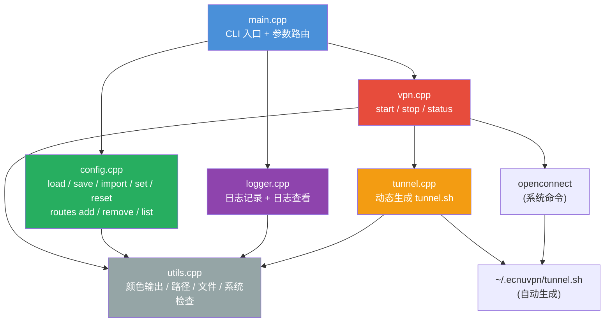
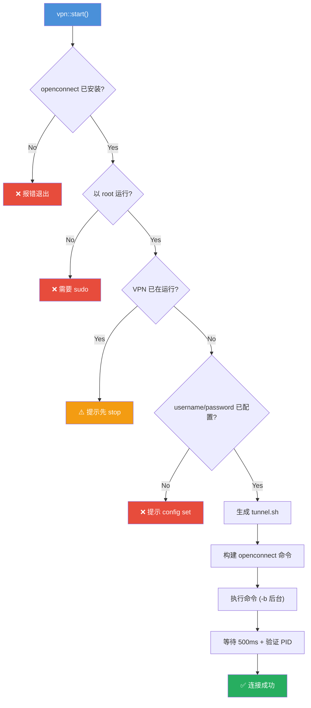

# ECNU-VPN C++ 重构 — 完整分析与用法指南

## 1. 项目总览

将 4 个 bash 脚本重构为 **1 个 C++ 编译的二进制文件** `ecnuvpn`，核心仍是包装 [openconnect](file://~/Development/Projects/cpp/ECNU-VPN/src/utils.hpp#40-42)，通过自动生成的 [tunnel.sh](file://~/Development/Projects/cpp/ECNU-VPN/bash/tunnel.sh) 实现分流路由。

### 文件统计

| 类别 | 文件数 | 总代码行 |
|------|--------|---------|
| C++ 源码 | 11 (.hpp + .cpp) | ~1,050 行 |
| CMake 构建 | 1 | 30 行 |
| 原始 Bash 脚本 | 4 | ~130 行 |
| 依赖 (nlohmann/json) | 1 header-only | — |

### Bash → C++ 映射

| 原始脚本 | 新 C++ 模块 | 新命令 |
|----------|------------|--------|
| [initvpn.sh](file://~/Development/Projects/cpp/ECNU-VPN/bash/initvpn.sh) | [vpn.cpp](file://~/Development/Projects/cpp/ECNU-VPN/src/vpn.cpp) [start()](file://~/Development/Projects/cpp/ECNU-VPN/src/vpn.hpp#8-10) | `sudo ecnuvpn` |
| [stopvpn.sh](file://~/Development/Projects/cpp/ECNU-VPN/bash/stopvpn.sh) | [vpn.cpp](file://~/Development/Projects/cpp/ECNU-VPN/src/vpn.cpp) [stop()](file://~/Development/Projects/cpp/ECNU-VPN/src/vpn.hpp#11-13) | `sudo ecnuvpn stop` |
| [tunnel.sh](file://~/Development/Projects/cpp/ECNU-VPN/bash/tunnel.sh) | [tunnel.cpp](file://~/Development/Projects/cpp/ECNU-VPN/src/tunnel.cpp) [generate()](file://~/Development/Projects/cpp/ECNU-VPN/src/tunnel.hpp#9-11) | 启动时自动生成 |
| [debug-env.sh](file://~/Development/Projects/cpp/ECNU-VPN/bash/debug-env.sh) | [logger.cpp](file://~/Development/Projects/cpp/ECNU-VPN/src/logger.cpp) | `ecnuvpn logs` |
| *(新增)* | [config.cpp](file://~/Development/Projects/cpp/ECNU-VPN/src/config.cpp) | `ecnuvpn config` |

---

## 2. 项目架构



---

## 3. 源码模块详解

### 3.1 main.cpp — CLI 入口

[main.cpp](file://~/Development/Projects/cpp/ECNU-VPN/src/main.cpp) (222 行)

参数路由逻辑：无参数调用 `vpn::start()`，其余通过字符串匹配分发到对应模块。[handle_config()](file://~/Development/Projects/cpp/ECNU-VPN/src/main.cpp#78-165) 函数处理 [config](file://~/Development/Projects/cpp/ECNU-VPN/src/main.cpp#78-165) 子命令的二级路由。

关键函数：
- [main](file://~/Development/Projects/cpp/ECNU-VPN/src/main.cpp#L166-L221) — 顶层命令路由
- [handle_config](file://~/Development/Projects/cpp/ECNU-VPN/src/main.cpp#L78-L164) — config 子命令路由
- [print_help](file://~/Development/Projects/cpp/ECNU-VPN/src/main.cpp#L12-L71) — 彩色帮助页面

---

### 3.2 vpn.cpp — VPN 控制核心

[vpn.cpp](file://~/Development/Projects/cpp/ECNU-VPN/src/vpn.cpp) (274 行)

**[start()](file://~/Development/Projects/cpp/ECNU-VPN/src/vpn.hpp#8-10) 流程：**



**[stop()](file://~/Development/Projects/cpp/ECNU-VPN/src/vpn.hpp#11-13) 流程：** PID 文件 → `pgrep` fallback → `SIGTERM` → 等待 1.5s → `SIGKILL` → 清理

**[status()](file://~/Development/Projects/cpp/ECNU-VPN/src/vpn.hpp#14-16) 流程：** 读 PID 文件 → `pgrep` fallback → 显示运行状态 + utun 接口信息

---

### 3.3 config.cpp — 配置管理

[config.cpp](file://~/Development/Projects/cpp/ECNU-VPN/src/config.cpp) (232 行)

| 函数 | 功能 |
|------|------|
| [load()](file://~/Development/Projects/cpp/ECNU-VPN/src/config.hpp#30-32) | 从 JSON 加载配置，不存在时创建默认 |
| [save()](file://~/Development/Projects/cpp/ECNU-VPN/src/config.hpp#33-35) | 序列化 + 写入 JSON |
| [show()](file://~/Development/Projects/cpp/ECNU-VPN/src/config.cpp#60-105) | 格式化打印，密码脱敏 (如 `EC**********lx`) |
| [import_from()](file://~/Development/Projects/cpp/ECNU-VPN/src/config.hpp#39-41) | 从外部 JSON 合并导入（只覆盖存在的字段） |
| [set_value()](file://~/Development/Projects/cpp/ECNU-VPN/src/config.hpp#42-44) | 按 key 设置单个值 |
| [reset()](file://~/Development/Projects/cpp/ECNU-VPN/src/config.hpp#45-47) | 恢复默认配置 |
| [add_route()](file://~/Development/Projects/cpp/ECNU-VPN/src/config.hpp#48-50) | 添加路由（去重检查） |
| [remove_route()](file://~/Development/Projects/cpp/ECNU-VPN/src/config.hpp#50-51) | 删除路由 |
| [list_routes()](file://~/Development/Projects/cpp/ECNU-VPN/src/config.cpp#215-229) | 列出所有路由 |

配置结构体 ([config.hpp](file://~/Development/Projects/cpp/ECNU-VPN/src/config.hpp)) 使用 [NLOHMANN_DEFINE_TYPE_INTRUSIVE_WITH_DEFAULT](file://~/Development/Projects/cpp/ECNU-VPN/src/config.hpp#22-27) 宏实现自动 JSON 序列化/反序列化。

---

### 3.4 tunnel.cpp — 隧道脚本生成

[tunnel.cpp](file://~/Development/Projects/cpp/ECNU-VPN/src/tunnel.cpp) (75 行)

每次 VPN 启动时，根据 `config.routes` 动态生成 `~/.ecnuvpn/tunnel.sh` 并 `chmod +x`。脚本逻辑与原始 [bash/tunnel.sh](file://~/Development/Projects/cpp/ECNU-VPN/bash/tunnel.sh) 一致：
1. 检查 `$reason == "connect"`
2. 用 `ifconfig` 激活 utun 接口
3. 循环 `route add` 每条路由

---

### 3.5 utils.cpp — 工具函数

[utils.cpp](file://~/Development/Projects/cpp/ECNU-VPN/src/utils.cpp) (135 行)

- **彩色输出**：[print_success](file://~/Development/Projects/cpp/ECNU-VPN/src/utils.hpp#19-21) / [print_error](file://~/Development/Projects/cpp/ECNU-VPN/src/utils.cpp#23-26) / [print_info](file://~/Development/Projects/cpp/ECNU-VPN/src/utils.hpp#22-23) / [print_warning](file://~/Development/Projects/cpp/ECNU-VPN/src/utils.hpp#23-24) / [print_header](file://~/Development/Projects/cpp/ECNU-VPN/src/utils.hpp#24-25)
- **路径管理**：[expand_home()](file://~/Development/Projects/cpp/ECNU-VPN/src/utils.cpp#49-62), `get_config_dir/path/pid_path/log_path/tunnel_path()`
- **文件 I/O**：[file_exists()](file://~/Development/Projects/cpp/ECNU-VPN/src/utils.hpp#34-36), [ensure_dir()](file://~/Development/Projects/cpp/ECNU-VPN/src/utils.cpp#90-97), [read_file()](file://~/Development/Projects/cpp/ECNU-VPN/src/utils.cpp#98-105), [write_file()](file://~/Development/Projects/cpp/ECNU-VPN/src/utils.cpp#106-112)
- **系统检查**：[check_openconnect()](file://~/Development/Projects/cpp/ECNU-VPN/src/utils.hpp#40-42), [check_root()](file://~/Development/Projects/cpp/ECNU-VPN/src/utils.cpp#119-122), [run_command()](file://~/Development/Projects/cpp/ECNU-VPN/src/utils.cpp#123-126), [run_command_output()](file://~/Development/Projects/cpp/ECNU-VPN/src/utils.cpp#127-137)

---

### 3.6 logger.cpp — 日志系统

[logger.cpp](file://~/Development/Projects/cpp/ECNU-VPN/src/logger.cpp) (87 行)

- 带时间戳写入 `~/.ecnuvpn/ecnuvpn.log`
- [show_logs()](file://~/Development/Projects/cpp/ECNU-VPN/src/logger.hpp#16-18) 读取文件最后 N 行，按 `[ERROR]`/`[WARN]` 着色显示

---

## 4. 运行时文件

所有运行时文件位于 `~/.ecnuvpn/` 目录：

| 文件 | 用途 |
|------|------|
| [config.json](file://~/.ecnuvpn/config.json) | 配置（凭据、路由、参数） |
| [tunnel.sh](file://~/Development/Projects/cpp/ECNU-VPN/bash/tunnel.sh) | 自动生成的隧道脚本 |
| `ecnuvpn.pid` | openconnect 进程 PID |
| `ecnuvpn.log` | 运行日志 |

当前配置文件内容：

```json
{
    "server": "https://vpn-ct.ecnu.edu.cn",
    "username": "20XXXXXXXXX",
    "password": "<your-password>",
    "mtu": 1290,
    "useragent": "AnyConnect Darwin_x86_64 4.10.05095",
    "routes": [
        "49.52.4.0/25", "59.78.176.0/20", "59.78.199.0/21",
        "58.198.176.128/25", "219.228.60.69", "219.228.63.0/21",
        "202.120.80.0/20", "222.66.117.0/24"
    ]
}
```

---

## 5. 完整 CLI 用法

### 5.1 VPN 连接管理

```bash
# 启动 VPN（需要 sudo，需要先配置 username 和 password）
sudo ecnuvpn

# 停止 VPN
sudo ecnuvpn stop       # 或 sudo ecnuvpn -s

# 查看状态（显示 PID + utun 网络接口）
ecnuvpn status          # 或 ecnuvpn -t
```

### 5.2 配置管理

```bash
# 查看当前配置（密码脱敏显示）
ecnuvpn config          # 或 ecnuvpn config show / ecnuvpn -c

# 设置单个配置项
ecnuvpn config set server https://vpn-ct.ecnu.edu.cn
ecnuvpn config set username 20XXXXXXXXX
ecnuvpn config set password your_password
ecnuvpn config set mtu 1290

# 从 JSON 文件导入（合并，只覆盖文件中存在的字段）
ecnuvpn config import ~/my_vpn_config.json

# 重置为默认配置（清除 username/password）
ecnuvpn config reset
```

> [!TIP]
> `config set` 支持的 key：`server`, `username`, `password`, `mtu`, `useragent`, `log_file`

### 5.3 路由管理

```bash
# 列出所有路由
ecnuvpn config routes list

# 添加路由（自动去重）
ecnuvpn config routes add 10.0.0.0/8

# 删除路由
ecnuvpn config routes remove 10.0.0.0/8
```

### 5.4 日志与信息

```bash
# 查看最近日志（默认 50 行，按级别着色）
ecnuvpn logs            # 或 ecnuvpn -l

# 帮助
ecnuvpn help            # 或 ecnuvpn -h / ecnuvpn --help

# 版本
ecnuvpn version         # 或 ecnuvpn -v / ecnuvpn --version
```

---

## 6. 构建方法

```bash
cd ~/Development/Projects/cpp/ECNU-VPN
mkdir -p build && cd build
cmake .. -DCMAKE_BUILD_TYPE=Release
make -j$(sysctl -n hw.ncpu)
```

编译产物：[build/ecnuvpn](file://~/Development/Projects/cpp/ECNU-VPN/build/ecnuvpn) (约 234 KB)

安装到系统路径（已通过 `cminst` 完成）：
```bash
# 当前已安装到
/usr/local/bin/ecnuvpn
```

---

## 7. 与原始 Bash 脚本对比

| 能力 | Bash 脚本 | C++ ecnuvpn |
|------|----------|-------------|
| 启动 VPN | `bash initvpn.sh` | `sudo ecnuvpn` |
| 停止 VPN | `bash stopvpn.sh` | `sudo ecnuvpn stop` |
| 凭据存储 | 硬编码在脚本中 | `~/.ecnuvpn/config.json` |
| 路由管理 | 硬编码在 tunnel.sh | `ecnuvpn config routes add/remove` |
| 连接前检查 | ❌ | ✅ openconnect + sudo + 重复连接检测 |
| 状态查询 | ❌ | ✅ `ecnuvpn status` |
| 日志系统 | 仅 debug-env.sh 转储 | ✅ 带时间戳的持久日志 |
| 彩色输出 | ❌ | ✅ ANSI 彩色 + emoji |
| PID 管理 | `pgrep` 每次搜索 | ✅ PID 文件 + `pgrep` fallback |
| 配置导入 | ❌ | ✅ JSON 导入/导出 |
| 安装 | 无 | CMake install 或 cminst |

---

## 8. 已验证测试项

| # | 测试项 | 结果 |
|---|--------|------|
| 1 | CMake 配置 + 编译 | ✅ 零警告 |
| 2 | `ecnuvpn --help` | ✅ 完整帮助页 |
| 3 | `ecnuvpn --version` | ✅ `ecnuvpn version 1.0.0` |
| 4 | `config reset` + `config show` | ✅ 默认值正确，密码 [(not set)](file://~/Development/Projects/cpp/ECNU-VPN/src/logger.hpp#8-10) |
| 5 | `config set username/password` | ✅ 持久化到 JSON |
| 6 | `config routes add/list/remove` | ✅ 去重 + 增删正确 |
| 7 | `config import <json>` | ✅ 合并导入 + 密码脱敏 |
| 8 | `ecnuvpn status` | ✅ 正确显示 NOT RUNNING |
| 9 | `ecnuvpn logs` | ✅ 最近日志着色显示 |
| 10 | 安装到 `/usr/local/bin` | ✅ 通过 `cminst` 完成 |

> [!NOTE]
> VPN 的实际连接/断开测试需要在可达 `vpn-ct.ecnu.edu.cn` 的网络环境下进行。
